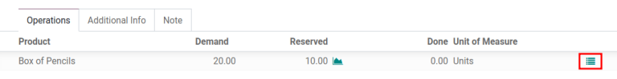

=======================
Packages and packagings
=======================

In Odoo, there are a variety of ways to specify the amount of products being bought, stocked, and
sold. *Packages* and *packagings* are all available to streamline inventory flows, allowing for a
variety of configurations for products as they enter and leave the warehouse.

.. _inventory/management/packages:

Packages
========

Packages are a physical container that holds one or several products from a picking, typically used
for outgoing deliveries or internal transfers. Packages can be a reusable or disposable (shipping)
box, and are **not** specific to a product.

Reusable boxes temporarily hold products during a picking to be brought to either a packing or
shipping area. Disposable boxes are the actual shipping containers (e.g. cardboard boxes, envelopes,
shipping bags, etc). These are used to ship the products out to customers.

Multiple items in a sales order (SO) can be separated into different packages to accommodate the
products. For example, an :abbr:`SO (Sales Order)` that has 20 boxes of pencils and 4 boxes of
erasers can be separated into two separate packages, each containing 10 boxes of pencils and 2 boxes
of erasers.

.. note::
   Products do *not* have to be divided equally. Products can be divided into as many packages that
   are needed to accommodate the :abbr:`SO (Sales Order)`.

In Odoo, the quantity of products in each package needs to be recorded, so there is a full history
for each product, including which package each item is shipped out in.

To use this method, ensure the :guilabel:`Packages` option is enabled, by navigating to
:menuselection:`Inventory app --> Configuration --> Settings --> Operations`. Click the
:guilabel:`Packages` check box, and then :guilabel:`Save` to activate the feature.

On a delivery order, assign which package to use by clicking on the :guilabel:`≣ (Detailed
Operations)` icon to the right of each product in the :guilabel:`Operations` tab.

Clicking the :guilabel:`≣ (Detailed Operations)` icon of a product reveals a pop-up window. In this
window, the :guilabel:`Product` name, :guilabel:`Demand`, and :guilabel:`Quantity Done` are clearly
displayed above the customizable product line.

Here, the warehouse location the product is coming from can be modified, in addition to the
:guilabel:`Source Package` and :guilabel:`Destination Package`, which represents what package(s) the
product(s) will be packaged into.

Click :guilabel:`Add a line` to include each additional package used. Enter the desired amount in
the :guilabel:`Done` field to specify the amount of products that will go into the
:guilabel:`Destination Package`.

Multiple packages in a single delivery
--------------------------------------

Although a :abbr:`DO (Delivery Order)` is typically associated with a single package, orders can be
split by clicking the :guilabel:`≣ (Detailed Operations)` icon next to the products on an :abbr:`SO
(Sales Order)` line. This opens the :guilabel:`Detailed Operations` window with an editable table to
specify which products are intended for which package.

.. example::
   To package 10 boxes of pencils with 2 boxes of erasers from the same :abbr:`SO (Sales Order)`,
   begin by navigating to the :abbr:`DO (Delivery Order)`. Then, select the :guilabel:`≣ (four
   horizontal lines)` icon to the right of the product, `Box of Pencils`. Clicking the icon opens
   the :guilabel:`Detailed Operations` window that is used to detail how products, like the 20 `Box
   of Pencils`, are packaged.

   Type in `10` under the :guilabel:`Done` field to package 10 products into the
   :guilabel:`Destination Package`. To specify the destination package, type the name of an existing
   package (such as `PACK0000006`) under the field, :guilabel:`Destination Package`. If the package
   does not exist, Odoo displays the :guilabel:`Create` button to create a new package. Click
   :guilabel:`Add a line` to assign the remaining products in another package, `PACK0000007`.

   .. image:: usage/add-destination-package.png
      :align: center
      :alt: Detailed operations pop-up where the amount of product going in a pack can be specified.

   Select :guilabel:`Detailed Operations` on the product line for `Box of Erasers` and similarly set
   2 :guilabel:`Done` products to `PACK0000006` and `PACK0000007` each.

   .. image:: usage/put-in-pack-button.png
      :align: center
      :alt: Put in pack button to match the done amount matches the demand.

Once all the products for each line have been entered, click :guilabel:`Confirm` to return to the
:abbr:`DO (Delivery Order)`.

The :guilabel:`Done` quantity on the :abbr:`DO (Delivery Order)` updates as products are selected
for each package. When the :guilabel:`Done` amount matches the :guilabel:`Demand` amount, click the
:guilabel:`Validate` button to complete the delivery order.

.. tip::
   The :guilabel:`Put In Pack` button is intended to quickly package all products in the :abbr:`DO
   (Delivery Order)` into one new package. The option to rename the package, or modify its contents,
   is available in the :guilabel:`Detailed Operations` pop-up.

Clicking on the :guilabel:`Packages` smart button in the upper-right corner of the delivery order
reveals a separate page, showing all the packages used in that :abbr:`DO (Delivery Order)`.

Packagings
==========

*Packaging* is product specific, and refers to a disposable container that holds several units of a
specific product. Unlike packages, packagings cannot be reusable, and each specific packaging must
be defined on the individual product form.

For example, different packages for cans of soda can be configured as a 6-pack, a 12-pack, or a case
of 36. Each flavor of soda would need a `6`, `12`, and `36` can packaging configured on the
individual product since packagings are product specific, not generic.

Set up packagings
-----------------

To use packagings, ensure the :guilabel:`Product Packagings` feature is enabled. To do that,
navigate to :menuselection:`Inventory app --> Configuration --> Settings`. Then, under the
:guilabel:`Products` heading, check the box next to :guilabel:`Product Packagings`, and click
:guilabel:`Save`.

In Odoo, product packagings are used on sales/purchase orders and inventory transfers.

Next, to create packagings, navigate to :menuselection:`Inventory app --> Products --> Products` and
click on the desired product, then click :guilabel:`Edit` on the product page.

Under the :guilabel:`Inventory` tab, scroll down to the :guilabel:`Packaging` section, and click
:guilabel:`Add a line`. Then, a pop-up window appears, in which the following information for each
packaging should be entered:

- :guilabel:`Packaging`: name of packaging that appears on sales/purchase orders as a packaging
  option for the product
- :guilabel:`Contained quantity`: amount of product in the packaging
- :guilabel:`Barcode`: identifier used with the :ref:`Barcode app <barcode/operations/intro>` to
  trace the packaging of a product during stock moves or pickings. Leave blank if not in use
- :guilabel:`Company`: indicates the packaging is only available at the selected company. Leave
  blank to make the packaging available across all companies.

.. example::
   Create a packaging type for 6 cans of the product, `Grape Soda`, by naming the
   :guilabel:`Packaging` to `6-pack` and setting the :guilabel:`Contained quantity` to `6` in the
   pop-up window that appears after clicking on :guilabel:`Add a line`.

   .. image:: usage/create-product-packages.png
      :align: center
      :alt: Create 6-pack case for product.

When all the necessary information has been entered, either click :guilabel:`Save & Close` to save
the packaging and return to the product detail form, or :guilabel:`Save & New` to save the packaging
and create another one in a fresh pop-up window.

.. example::
   View all product packagings in the :guilabel:`Inventory` tab of the product form.

   .. image:: usage/display-product-packaging.png
      :align: center
      :alt: Show packaging and contained quantities, specified on the product page form in the
            Inventory tab.

View all packagings
-------------------

To view all packagings that have been created, go to :menuselection:`Inventory app --> Configuration
--> Product Packagings`. Doing so reveals the :guilabel:`Product Packagings` page with a complete
list of all packagings that have been created for all products. Create new packagings by clicking
:guilabel:`Create`.

.. example::
   Two soda products, `Grape Soda` and `Diet Coke`, have three types of packaging configured. On the
   :guilabel:`Product Packagings` page, each product can sold as a `6-Pack` that contains 6
   products, `12-Pack` of 12 products, or a `Case` of 32 products.

   .. image:: usage/packagings.png
      :align: center
      :alt: List of different packagings for products.

Apply packagings
----------------

When creating a sales order in the :menuselection:`Sales` app, specify the packagings that should be
used for the product(s). The chosen packaging is displayed on the :abbr:`SO (Sales Order)` under the
:guilabel:`Package` field.

.. example::
   18 cans of the product, `Grape Soda`, is packed using three 6-pack packagings.

   .. image:: usage/packagings-sales-order.png
      :align: center
      :alt: Assign packagings on the Sales Order Line.

.. tip::
   Packaging can be used in conjunction with Odoo :ref:`Barcode <inventory/barcode/software>`. When
   receiving products from suppliers, scanning the packaging barcode automatically adds the number
   of units in the packaging to the internal count of the product.
