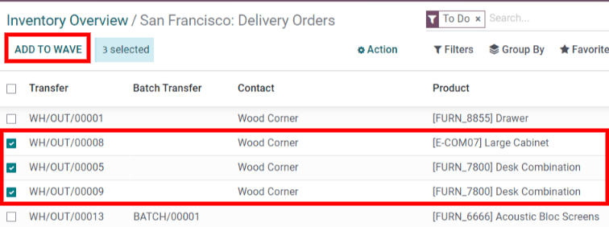

======================
Process wave transfers
======================

While a batch transfer is a group of several pickings, a **wave transfer** only contains some parts
of different pickings. Both methods are used to pick orders in a warehouse, and depending on the
situation, one method may be a better fit than the other.

To handle orders of a specific product category, or fetch products that are at the same location,
wave transfers are the ideal method.

In Odoo, wave transfers are actually batch transfers with an extra step: transfers are split before
being grouped in a batch.

Configuration
=============

Before a wave transfer can be created, the :guilabel:`Batch Transfers` and :guilabel:`Wave
Transfers` options must be activated.

First, go to :menuselection:`Inventory --> Configuration --> Settings`. In the
:guilabel:`Operations` section, enable :guilabel:`Batch Transfers` and :guilabel:`Wave Transfers`.
Then, click :guilabel:`Save` to apply the settings.

.. image:: wave_transfers/wave-transfers-setting.png
   :align: center
   :alt: View of Odoo Inventory app settings to enable the wave transfers option.

Add products to a wave
======================

Now that the settings are activated, start a wave transfer by adding products to a wave.

Wave transfers can only contain product lines from transfers of the same operation type. To view
all the transfers and product lines in a specific operation, first go to the :guilabel:`Inventory`
dashboard and locate the desired operation type's card. Then, open the options menu (the three dots
icon in the corner of the operation type's card) and click :guilabel:`Operations`.

.. image:: wave_transfers/list-of-operations.png
   :align: center
   :alt: How to get an operation type's list of operations.

On the operations page, select the product lines you want to add in a new or existing wave. Then,
click :guilabel:`Add to Wave`.

.. tip::
   Use the :guilabel:`Filters` in the search bar to group lines with the same product, location,
   carrier, etc...

After that, a pop-up box appears.

To add the selected lines to an existing wave transfer, select the :guilabel:`an existing wave
transfer` option and select the existing wave transfer from the drop-down menu.

To create a new wave transfer, select the :guilabel:`a new wave transfer` option. If creating a new
wave transfer, an employee can also be set in the optional :guilabel:`Responsible` field. Once the
desired options are selected, click :guilabel:`Confirm` to add the product lines to a wave.

View wave transfers
===================

To view all wave transfers and their statuses, go to :menuselection:`Inventory --> Operations -->
Wave Transfers`. Wave transfers can also be viewed in the :guilabel:`Barcode` app by going to
:menuselection:`Barcode --> Batch Transfers`.
