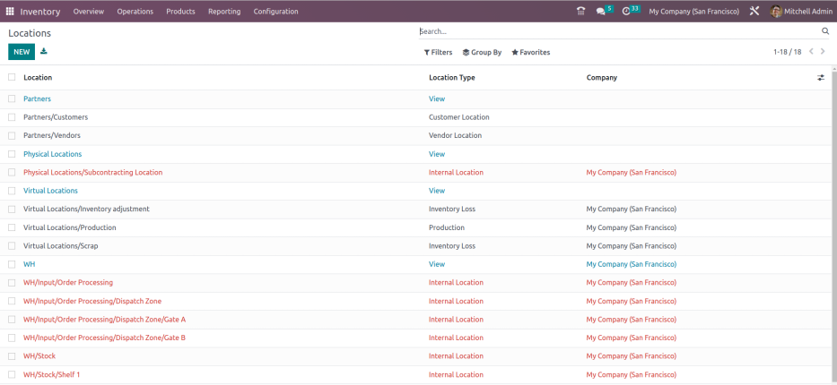

:show-content:
:hide-page-toc:

====================
Inventory management
====================

In the Odoo *Inventory* app, :doc:`warehouses <inventory_management/warehouses>` handle the broader
organization and distribution of stock across different physical sites, while :doc:`locations
<inventory_management/use_locations>` provide a more detailed breakdown within each warehouse for
efficient item management.

This document serves as an introduction to the terminology and concepts necessary to master
*Inventory*. For specific instructions and examples of how things work, refer to individual
documentation pages.

.. seealso::
   `Odoo Tutorials: Warehouses & Locations <https://www.youtube.com/watch?v=zMvudZVLuUo>`_

Warehouses
==========

:doc:`Warehouses <inventory_management/warehouses>` represent a physical place, with a physical
address, where a company's items are stored.

Configure :doc:`routes <inventory_management/use_routes>` in a warehouse to control how products
move to customers, from vendors, within the warehouse, or :doc:`between warehouses
<inventory_management/resupply_warehouses>`.

Locations
=========

:doc:`Locations <inventory_management/use_locations>` refer to specific areas within a warehouse,
such as shelves, floors, or aisles. These are sub-divisions within a warehouse, and are unique to
that warehouse. Users can create and manage numerous locations within a single warehouse to organize
inventory more precisely.

.. seealso::
   - :doc:`inventory_management/use_locations`
   - :doc:`inventory_management/count_products`
   - :doc:`inventory_management/cycle_counts`
   - :doc:`inventory_management/scrap_inventory`

.. _inventory/warehouses_storage/location-type:

Location types
--------------

*Location types* in Odoo help categorize and manage where products are, and what actions need to be
taken with them. By default, on the :menuselection:`Inventory app --> Configuration --> Locations`
page, only internal locations are displayed.

To view the seven location types in Odoo, select any location, and in the :guilabel:`Location Type`
field, there are:

- :guilabel:`Vendor Location`: defines an area where products purchased from vendors originate.
  Items here are **not** in stock.

- :guilabel:`View`: used to organize and structure the warehouse hierarchy. For example, the view
  location `WH` (short for warehouse) groups all internal locations, such as `Stock`, receiving
  docks, quality checkpoints, and packing areas to show they all belong to the same warehouse.

  .. important::
     View locations should **not** contain products, but it is possible to move them there.

- :guilabel:`Internal Location`: storage locations within the warehouse. Items stored in these
  locations are accounted for in :doc:`inventory valuation
  <inventory_valuation/using_inventory_valuation>`.

- :guilabel:`Customer Location`: where sold products are tracked; items here are no longer in stock.

- :guilabel:`Inventory Loss`: counterpart location to consume missing items or create stock,
  accounting for discrepancies.

  In Odoo, examples of inventory loss locations are *Inventory Adjustment*, used to account for
  discrepancies during an inventory count, and *Scrap*, which is where damaged goods are sent to
  account for inventory losses.

   .. example::
      `Virtual Locations/Inventory Adjustment` is a location with the :guilabel:`Inventory Loss`
      type. The database shows `65` units in `WH/Stock`, but an inventory check reveals `60`. To
      correct the quantity, five units are moved from `WH/Stock` to `Virtual Locations/Inventory
      Adjustment`.

      .. image:: inventory_management/inventory_management/inventory-loss.png
         :align: center
         :alt: Product ends up in Virtual Locations/Inventory Adjustment.

- :guilabel:`Production`: where raw materials are consumed, and :doc:`manufactured products
  <../../manufacturing>` are created.

- :guilabel:`Transit Location`: used for inter-company or inter-warehouse operations to track
  products shipped between different addresses, such as :ref:`Physical Locations/Inter-warehouse
  transit <inventory/warehouses_storage/interwarehouse-transit>`.

.. note::
   In Odoo, location types are color-coded:
     - **Red**: internal locations
     - **Blue**: view locations
     - **Black**: external locations (including inventory loss, vendor, and customer locations).

View locations in Odoo
----------------------

Odoo databases include pre-configured view locations to organize the hierarchy of locations. These
provide helpful context, and distinguish between internal and external locations.

- *Physical locations* serve as an umbrella for external locations, without changing a product's
  inventory value. (Inventory valuation changes occur when products move from internal to external
  locations).

.. _inventory/warehouses_storage/interwarehouse-transit:

  .. example::
     When moving products in warehouses `WH` and `WH2`, the items are not in either warehouse, but
     still belong to the company. While in transit, they are placed in the `Inter-warehouse transit`
     location, a :guilabel:`Transit Location` type.

     This location is under the view location, `Physical Locations`, indicating that
     `Inter-warehouse transit` is outside of a warehouse, but still part of the company. Doing so
     does not affect the inventory valuation of the products.

- *Partner locations* group customer and vendor locations (external locations) together. Transfers
  to these locations affect inventory valuation.
- *Virtual locations* are locations that do **not** exist physically, but it is where items that are
  not in inventory can be placed. These can be items that are no longer in inventory due to loss, or
  other factors.

.. toctree::
   :titlesonly:

   inventory_management/warehouses
   inventory_management/use_locations
   inventory_management/count_products
   inventory_management/cycle_counts
   inventory_management/scrap_inventory
   inventory_management/resupply_warehouses
   inventory_management/warehouse_replenishment_transfer
   inventory_management/use_routes

