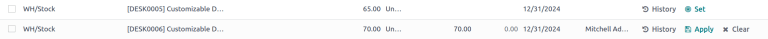
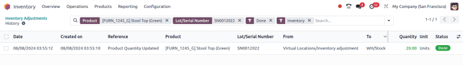

=====================
Inventory adjustments
=====================

In any warehouse management system, the recorded inventory counts in the database might not always
match the actual inventory counts in the warehouse. The discrepancy between the two counts can be
due to damages, human errors, theft, or other factors. As such, inventory adjustments must be made
to reconcile the differences, and ensure that the recorded counts in the database match the actual
counts in the warehouse.

.. _inventory/inventory-adjustments-page:

Inventory Adjustments page
==========================

To view the *Inventory Adjustments* page, navigate to :menuselection:`Inventory app --> Operations
--> Physical Inventory`.

.. image:: count_products/inventory-adjustments-page.png
   :alt: In stock products listed on the Inventory adjustments page.

In the :guilabel:`Inventory Adjustments` table, all products that are currently in stock are listed,
with each product line containing the following information:

- :guilabel:`Location`: the specific location in the warehouse where a product is stored. This field
  needs to be enabled my going to :menuselection:`Inventory app --> Configuration --> Settings` and
  ticking the :guilabel:`Storage Locations` checkbox.
- :guilabel:`Product`: the product whose quantity is listed on the inventory adjustment line.
- :guilabel:`Lot/Serial Number`: the tracking identifier assigned to the specific product listed. It
  can contain letters, numbers, or a combination of both.
- :guilabel:`UoM`: the *unit of measure* in which the product is measured. Unless otherwise
  specified (i.e., in :guilabel:`Pounds` or :guilabel:`Ounces`), the default :abbr:`UoM (Unit of
  Measure)` is :guilabel:`Units`.
- :guilabel:`Counted Quantity`: the real quantity counted during an inventory count. This field is
  left blank by default but can be changed, depending on if it matches the :guilabel:`On Hand
  Quantity` or not.
- :guilabel:`Difference`: the difference between the :guilabel:`On Hand Quantity` and
  :guilabel:`Counted Quantity`, once an inventory adjustment is made. The difference is
  automatically calculated after every inventory adjustment.

.. note::
   If a specific product has a quantity of more than `1.00` in stock, and more than one serial
   number (or lot number) is assigned, each uniquely-identified product is displayed on its own
   product line with its own lot/serial number, under the :guilabel:`Lot/Serial Number` column.

The fields below are optional and can be made visible by clicking the :icon:`oi-settings-adjust`
:guilabel:`(settings)` icon in the top right of the :guilabel:`Inventory Adjustments` page.

- :guilabel:`Inventory Frequency (Days)`: the frequency, in days, for inventory counts. The default
  value of this field is set to `0`.
- :guilabel:`Favorite`: adds a clickable star icon next to each product. Adding a favorite will
  bring the line item to the top of the dashboard.
- :guilabel:`Product Category`: the category assigned internally to a specific product. Unless
  otherwise specified (i.e., as :guilabel:`Consumable` or :guilabel:`Rental`), the default *Product
  Category* is set to :guilabel:`All`.
- :guilabel:`Expiration Date`: the date a product will expire, if it is a perishable good. Only
  products that are tracked using lots and serial numbers can be assigned expiration information.
- :guilabel:`Last Count Date`: the date on which the last inventory count occurred.
- :guilabel:`Available Quantity`: the quantity of a specific product that is currently available,
  based on any outstanding/uncompleted sales orders, purchase orders, or manufacturing orders that
  might change the available quantity once fulfilled.
- :guilabel:`On Hand Quantity`: the quantity of the product currently recorded in the database.
- :guilabel:`Accounting Date`: the date on which the adjustments will be accounted for in the Odoo
  **Accounting** app.
- :guilabel:`Scheduled Date`: the date at which a count should be made. If not otherwise specified,
  this date defaults to the 31st of December of the current year.
- :guilabel:`User`: the person assigned to the count in the database. This can either be the person
  physically counting the inventory, or applying the count in the database.
- :guilabel:`Company`: the company whose database these inventory adjustments are being made on. The
  company is listed in the top-right corner of the database, next to the user currently logged in.

.. tip::
   Some columns are hidden by default. To reveal these columns, click the
   :icon:`oi-settings-adjust` :guilabel:`(settings)` icon to the far right of the form's top row,
   and select any desired column to reveal by clicking the checkbox next to that option.

.. seealso::
   - :doc:`Product type <../../product_management/configure/type>`
   - :doc:`Tracking with lots, serial numbers, and expiration dates
     <../../product_management/product_tracking>`

Create an inventory adjustment
------------------------------

To create a new inventory adjustment from the :ref:`Inventory Adjustments
<inventory/inventory-adjustments-page>` page, click :guilabel:`New`. Doing so creates a new, blank
inventory adjustment line at the bottom of the page.

On this blank inventory adjustment line, define the :guilabel:`Location` where the product is
stored. This is necessary to ensure the accuracy of the inventory adjustment, as the same product
can be stored in multiple locations.

Next, click the drop-down menu under the :guilabel:`Product` column, and select a product. If the
selected product is tracked using either lots or serial numbers, the desired lot or serial number
can also be chosen from the drop-down menu under the :guilabel:`Lot/Serial Number` column.

Next, set the value in the :guilabel:`Counted Quantity` column to the quantity counted for that
product during the inventory adjustment process.

To the right of the :guilabel:`Counted Quantity` column, the :guilabel:`Scheduled Date` and
:guilabel:`User` can also be changed via their respective drop-down menus. Changing the
:guilabel:`Scheduled Date` changes the date that the inventory adjustment should be processed on,
and selecting a responsible :guilabel:`User` assigns a user to the specific inventory adjustment
(for traceability purposes).

Once all changes have been made to the new inventory adjustment line, click away from the line.
Doing so saves the adjustment, and moves the line to the top of the page.

If the :guilabel:`Counted Quantity` is greater than the :guilabel:`On Hand Quantity`, the value in
the :guilabel:`Difference` column is **green**. If the :guilabel:`Counted Quantity` is less than the
:guilabel:`On Hand Quantity`, the value in the :guilabel:`Difference` column is **red**. If the
quantities match, and haven't been changed at all, no value appears in the :guilabel:`Difference`
column.

.. image:: count_products/difference-column.png
   :alt: Difference column on inventory adjustments page.

At this stage, the count (:dfn:`inventory adjustment`) is recorded, but not yet applied. This means
that the quantity on hand before the adjustment has not yet been updated to match the new, real
counted quantity.

There are two ways to apply the new inventory adjustment. The first way is to click the
:icon:`fa-save` :guilabel:`Apply` button on the line at the far right of the page. The second way is
to click the checkbox on the far left of the line. Doing so reveals new button options at the top of
the page, one of which is an :guilabel:`Apply` button. Clicking this button instead causes an
:guilabel:`Inventory Adjustment` pop-up window to appear.

.. image:: count_products/apply-inventory-adjustment.png
   :alt: Apply all option applies the inventory adjustment once a reason is specified.

From this pop-up menu, a reference or reason can be assigned to the inventory adjustment. By
default, the :guilabel:`Inventory Reason` field is pre-populated with the date the adjustment is
being made on, but can be changed to reflect whatever reference or reason is desired.

Once ready, click :guilabel:`Apply` to apply the inventory adjustment.

.. note::
   Applying an inventory adjustment simultaneously creates a :doc:`stock move line (SML)
   <../reporting/moves_history>` in the *Moves History* report for traceability.

.. tip::
   Sometimes products end up in unexpected or incorrect locations. To quickly move a product to a
   different storage location, check the box next to the product, and click the :guilabel:`Relocate`
   button at the top of the :ref:`Inventory Adjustments <inventory/inventory-adjustments-page>`
   page.

Count products
==============

Counting products (or stock-taking) is a recurring warehouse process to verify the physical quantity
of items against internal inventory records. The values recorded on file versus what is actually
counted in real life sometimes do not match, so inventory adjustments can be made on the *Inventory
Adjustments* dashboard.

Once a count is complete, go to :menuselection:`Inventory app --> Operations --> Physical Inventory`
to verify and update product :guilabel:`Count Quantities`, as it is necessary to do so.

.. tip::
   To print a PDF of a count sheet, first select the desired product checkboxes, and then click the
   :icon:`fa-print` :guilabel:`Print` button that appears at the top of the dashboard. Then, select
   the :guilabel:`Count sheet` option in the sub-menu, which will download a PDF detailing the
   selected products.

On each product line, identify whether the value in the :guilabel:`On Hand Quantity` column recorded
in the database matches the newly-counted value. If the recorded value and the counted value do
match, select the product using the checkbox, click the :guilabel:`Actions` button, then
:guilabel:`Set to quantity on hand`.

Doing so copies the value from the :guilabel:`On Hand Quantity` column over to the
:guilabel:`Counted Quantity` column, and sets the value of the :guilabel:`Difference` column to
`0.00`. Subsequently, once applied, an inventory move with `0.00` :guilabel:`Quantity Done` is
recorded in the product's inventory adjustment history.

If the newly-counted value for a given product does **not** match the value in the :guilabel:`On
Hand Quantity` recorded in the database, instead of clicking the :guilabel:`Set` button, record the
real value in the field in the :guilabel:`Counted Quantity` column.

To do so, click the field in the :guilabel:`Counted Quantity` column on the specific inventory
adjustment line for the product whose count is being changed. This automatically assigns a
:guilabel:`Counted Quantity` of `0.00`.

To change this value, type in a new value that matches the real, newly-counted value. Then, click
away from the line. Doing so saves the adjustment, and automatically adjusts the value in the
:guilabel:`Difference` column.

Subsequently, once applied, a move with the difference between the :guilabel:`On Hand Quantity` and
the :guilabel:`Counted Quantity` is recorded in the product's inventory adjustment history.

The :guilabel:`Actions` menu appears when one or more products' checkboxes are selected. The
:guilabel:`Actions` menu includes the option to :guilabel:`Set to quantity on hand`, which sets the
selected products' :guilabel:`Counted Quantity` to the :guilabel:`On Hand Quantity`, and
:guilabel:`Set to 0`, which sets the selected products' :guilabel:`Counted Quantity` to zero.

.. image:: count_products/inventory-adjustment-actions.png
   :alt: Inventory Adjustments Actions menu.

.. important::
   Sometimes a count occurs, but cannot be applied in the database right away. In the time between
   the actual count and applying the inventory adjustment, product moves can occur. In that case,
   the on-hand quantity in the database can change and no longer be consistent with the counted
   quantity. As an extra precaution, Odoo asks for confirmation before applying the inventory
   adjustment.

Plan inventory counts
---------------------

To plan inventory counts, such as a full count of everything currently in stock, first navigate to
:menuselection:`Inventory app --> Operations --> Physical Inventory`.

Then, select the desired products to be counted by clicking the checkbox on the far left of each
product line.

.. tip::
   To request a count of **all** products currently in stock, click the checkbox at the very top of
   the table, in the header row next to the :guilabel:`Location` label. This selects **all** product
   lines.

Once all desired products have been selected, click the :guilabel:`Request a Count` button at the
top of the page. Doing so opens the :guilabel:`Request a Count` pop-up window, where the following
information can be filled:

- :guilabel:`Inventory Date`: the planned date of the count.
- :guilabel:`User`: the user responsible for the count.
- :guilabel:`Accounting Date`: the date at which the inventory adjustment will be accounted.
- :guilabel:`Count`: to leave the on-hand quantity of each product line blank, select
  :guilabel:`Leave Empty`. To pre-fill the on-hand quantity of each product line with the current
  value recorded in the database, select :guilabel:`Set Current Value`.

Finally, once ready, click :guilabel:`Confirm` to request the count.

.. image:: count_products/count-popup.png
   :alt: Request a count popup on inventory adjustments page.

.. important::
   In the Odoo **Barcode** app, users can only view inventory counts that are assigned to **them**,
   and are scheduled for **today** or **earlier**.

.. seealso::
   :doc:`cycle_counts`
