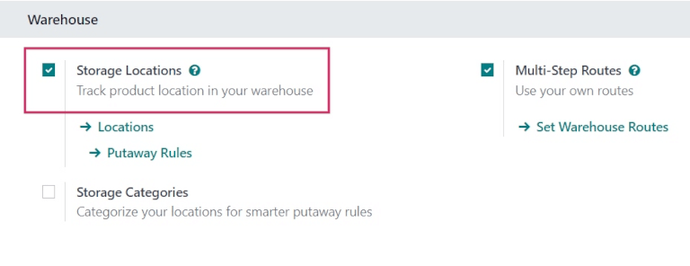
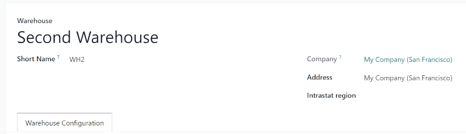
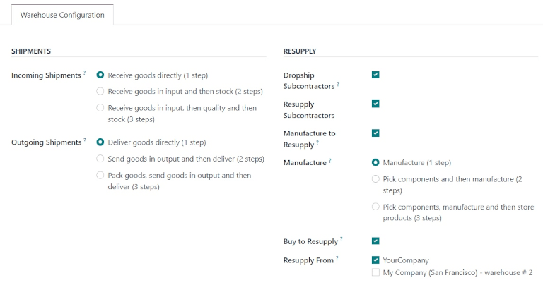
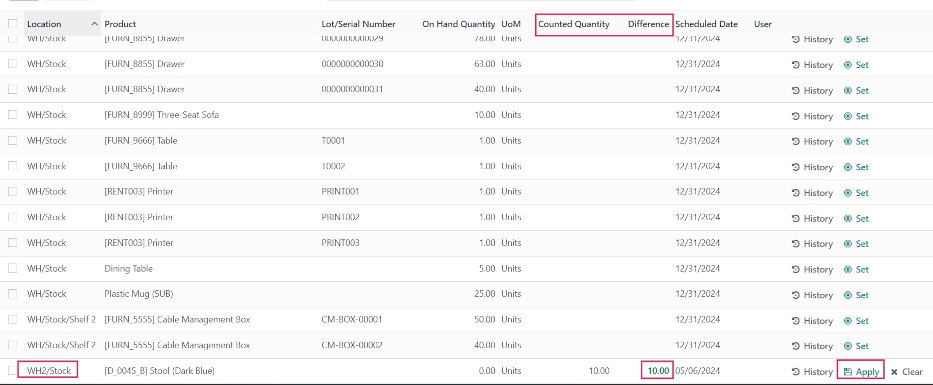

=========================
Create a second warehouse
=========================

In Odoo *Inventory*, a *warehouse* is a physical building or space where items are stored. By
default, each Odoo database has one warehouse already pre-configured, with the address set as the
company's address.

However, it is possible to set up multiple additional warehouses, and transfer stored items between
them.

Configuration
=============

To create a second warehouse, the *Storage Locations* feature must be enabled. To enable this
feature, navigate to :menuselection:`Inventory app --> Configuration --> Settings`. Under the
:guilabel:`Warehouse` section, tick the checkbox next to :guilabel:`Storage Locations`, and
:guilabel:`Save` changes.

.. note::
   Creating a second warehouse without first enabling the *Storage Locations* feature triggers a
   :guilabel:`Warning` pop-up window. It indicates creating a second warehouse automatically
   activates the *Storage Locations* setting.

Create new warehouse
====================

To create a new warehouse, navigate to :menuselection:`Inventory app --> Configuration -->
Warehouses`, and click :guilabel:`New`. Doing so opens a blank warehouse creation form.

Fill out the following fields as necessary:

- :guilabel:`Warehouse`: the full name of the warehouse.
- :guilabel:`Short Name`: the abbreviated code used to identify the warehouse, i.e. `WH2` (the short
  name for the default warehouse in Odoo is `WH`).
- :guilabel:`Company`: the company that owns the warehouse. This can be set as the company that owns
  the Odoo database or the company of a customer or vendor.
- :guilabel:`Address`: the address where the warehouse is located. By default, this is set to the
  company's address in the database.

Under the :guilabel:`Warehouse Configuration` tab, configure the warehouse's main workflow in the
:guilabel:`Shipments` section, and set available replenishment methods in the :guilabel:`Resupply`
section.

.. important::
   The :guilabel:`Shipments` and :guilabel:`Resupply` sections only appear if the
   :guilabel:`Multi-Step Routes` checkbox is enabled in :menuselection:`Inventory app -->
   Configuration --> Settings`, under the :guilabel:`Warehouse` heading. For more information about
   routes and how they work in Odoo, see :ref:`Using Routes and Pull/Push Rules <use-routes>`.

In the :guilabel:`Shipments` section, choose between one, two, or three-step processes for both
incoming and outgoing shipments.

In the :guilabel:`Resupply` section, edit the following settings:

- :guilabel:`Dropship Subcontractors`: enable this feature to coordinate with vendors, and have
  components dropshipped directly to subcontractors for manufacturing.
- :guilabel:`Resupply Subcontractors`: allow subcontractors to be resupplied with goods from this
  warehouse.
- :guilabel:`Manufacture to Resupply`: when products are manufactured, they can be delivered to this
  warehouse.
- :guilabel:`Manufacture`: the route that should be followed when manufacturing goods inside the
  warehouse. Choose from one, two, and three-step production.
- :guilabel:`Buy to Resupply`: when products are purchased, they can be delivered to this warehouse.
- :guilabel:`Resupply From`: Check the box next to the other warehouses from which this warehouse
  can replenish products. If the current warehouse does not have the stock, it can also pull
  products from these selected warehouses in the database. Automatic resupply routes will be created
  accordingly.

Once ready, click :guilabel:`Save` to save the new warehouse's settings.

Add inventory to a new warehouse
================================

If a new warehouse is created to represent a real-world storage location with existing stock, update
the warehouse's stock using an inventory adjustment.

.. seealso::
   :doc:`count_products`

To perform an inventory adjustment, navigate to :menuselection:`Inventory app --> Operations -->
Physical Inventory`, and click :guilabel:`New`. Doing so adds a new line at the bottom of the list
of inventory adjustments.

Configure the line by filling out the following fields as necessary:

- :guilabel:`Location`: the location where the product is currently stored in the new warehouse.
  This can be set as the overall warehouse, or a location within the warehouse.
- :guilabel:`Product`: the product being added to inventory.
- :guilabel:`Lot/Serial Number`: the lot that the product belongs to or the serial number used to
  identify it, if the product is tracked.
- :guilabel:`On Hand Quantity`: the total quantity of the product stored in the location for which
  inventory is being adjusted. For a new warehouse or location where a count or a prior inventory
  adjustment has not taken place, this should be set to `0.00`.
- :guilabel:`UoM`: the unit of measure (UoM) used for counting the product.
- :guilabel:`Counted Quantity`: the amount of the product being added to inventory.
- :guilabel:`Difference`: the difference between the on-hand and counted quantities. This
  automatically updates to reflect the value entered in the :guilabel:`Counted Quantity` column.
- :guilabel:`Scheduled Date`: the date selected for the next inventory count for this product.
- :guilabel:`User`: the user who recorded the inventory adjustment in the database.

Once each line for the products being added to the new warehouse is configured, click
:guilabel:`Apply` on each line to apply the new inventory counts.

The values in the :guilabel:`On Hand Quantity` column update to reflect those in the
:guilabel:`Counted Quantity` column, and the products added appear in the new warehouse's stock.

.. note::
   If products tracked using a lot number or serial number are added without specifying the tracking
   number, a :guilabel:`Tracked Products in Inventory Adjustment` pop-up window appears upon
   clicking :guilabel:`Apply` on that product's line.

   The pop-up indicates tracked products were added, but the lots/serial numbers were not defined.
   To apply the adjustment without the numbers, click :guilabel:`Apply`. To add the numbers before
   applying, click :guilabel:`Discard`, and add the numbers. Then, once ready, click
   :guilabel:`Apply` again.

   .. image:: create_a_second_warehouse/create-a-second-warehouse-popup-window.png
      :align: center
      :alt: Tracked Products in Inventory Adjustment pop-up window.

.. seealso::
   :doc:`warehouses_locations`
