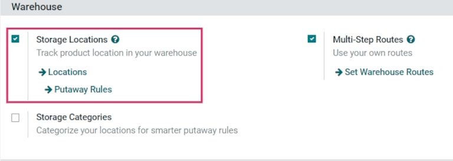
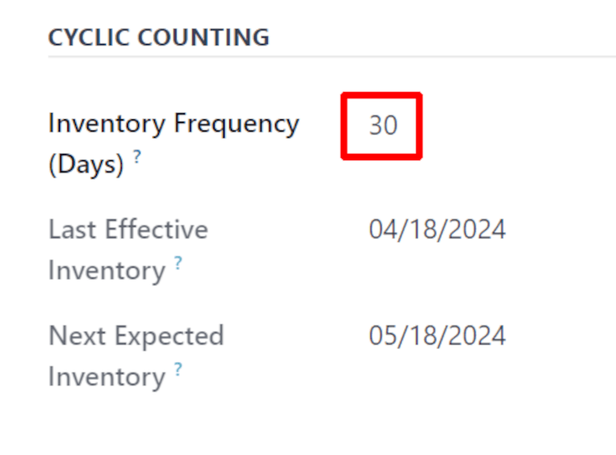
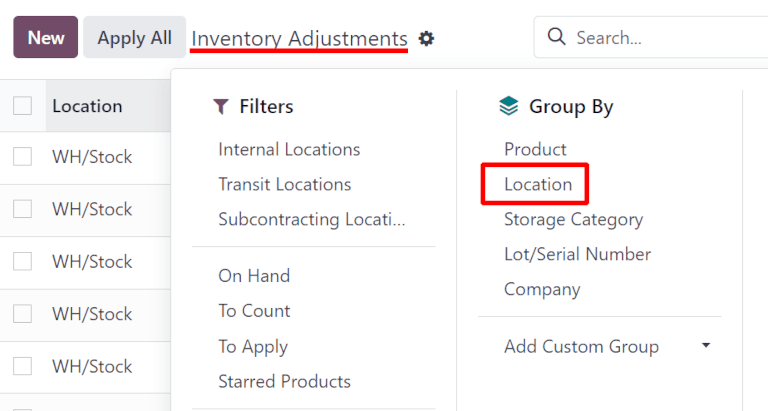
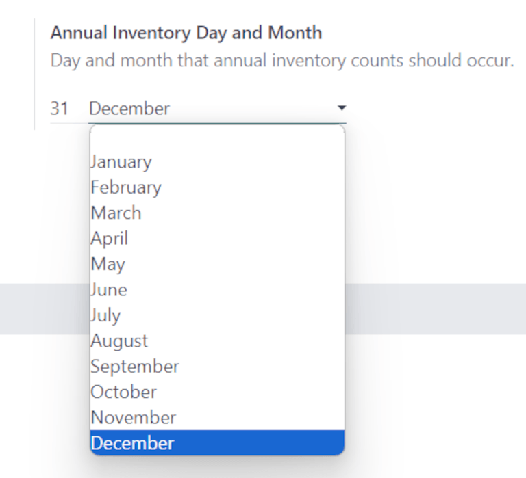

============
Cycle counts
============

For most companies, warehouse stock only needs to be counted once a year. This is why, by default,
after making an *inventory adjustment* in Odoo, the scheduled date for the next inventory count is
set for the 31st of December of the current year.

However, for some businesses, it's crucial to have an accurate inventory count at all times. These
companies use *cycle counts* to keep critical stock levels accurate. Cycle counting is a method by
which companies count their inventory more often in certain *locations*, to ensure that their
physical inventory counts match their inventory records.

Configuration
=============

In Odoo, cycle counts are performed by location. Therefore, the *Storage Locations* feature needs to
be enabled before performing a cycle count.

To enable this feature, navigate to :menuselection:`Inventory app --> Configuration --> Settings`,
and scroll down to the :guilabel:`Warehouse` section. Then, tick the checkbox next to
:guilabel:`Storage Locations`, and click :guilabel:`Save`.

Change inventory count frequency by location
============================================

Once the *Storage Locations* feature is enabled, and there are multiple locations created in the
warehouse, the inventory count frequency can be changed for specific locations.

To view and edit locations, navigate to :menuselection:`Inventory app --> Configuration -->
Locations`. This reveals a :guilabel:`Locations` page containing every location currently created
and listed in the warehouse.

From this page, click into a location to reveal the settings and configuration page for that
location.

Under the :guilabel:`Cyclic Counting` section, locate the :guilabel:`Inventory Frequency (Days)`
field, which should be set to `0` by default (if this location has not been edited previously). In
this field, change the value to any number of days desired for the frequency of counts.

.. example::
   A location that needs an inventory count every 30 days should have the :guilabel:`Inventory
   Frequency (Days)` value set to `30`.

Now, once an inventory adjustment is applied to this location, the next scheduled count date is
automatically set, based on the value entered into the :guilabel:`Inventory Frequency (Days)` field.

Count inventory by location
===========================

To perform a cycle count for a specific location in the warehouse, navigate to
:menuselection:`Inventory app --> Operations --> Physical Inventory`. This reveals an
:guilabel:`Inventory Adjustments` page containing all products currently in-stock, with each product
listed on its own line.

From this page, the :guilabel:`Filters` and :guilabel:`Group By` options (accessible by clicking the
:guilabel:`⬇️ (down arrow)` icon, to the right of the :guilabel:`Search...` bar), can be used to
select specific locations and perform inventory counts.

To select a specific location, and view all products within that location, click the :guilabel:`⬇️
(down arrow)` icon, to the right of the :guilabel:`Search...` bar. Then, in the :guilabel:`Group By`
column, click :guilabel:`Add Custom Group` to reveal a new drop-down menu.

Click :guilabel:`Location` from the drop-down menu. Doing so sorts products into their storage
locations on the :guilabel:`Inventory Adjustments` page, and a cycle count can be performed for all
products in that location.

.. tip::
   In large warehouses with multiple locations and a high volume of products, it might be easier to
   search for the specific location desired. To do this, from the :guilabel:`Inventory Adjustments`
   page, click the :guilabel:`⬇️ (down arrow)` icon to the right of the :guilabel:`Search...` bar.

   Then, in the :guilabel:`Filters` column, click :guilabel:`Add Custom Filter` to open an
   :guilabel:`Add Custom Filter` pop-up window.

   In the first field, click the value and select :guilabel:`Location` from the list of options.
   Select :guilabel:`contains` in the second field. In the third field, type in the name of the
   location being searched for.

   Click :guilabel:`Add` for that location to appear on the page.

   .. image:: cycle_counts/cycle-counts-add-custom-filter.png
      :align: center
      :alt: Add Custom Filter pop-up window with location values entered.

Change full inventory count frequency
=====================================

While cycle counts are typically performed per location, the scheduled date for full inventory
counts of all in-stock products in the warehouse can also be manually changed, to push the date up
sooner than the date listed.

To modify the default scheduled date, go to :menuselection:`Inventory app --> Configuration -->
Settings`. Then, in the :guilabel:`Operations` section, locate the :guilabel:`Annual Inventory Day
and Month` setting field, which includes a drop-down field that is set to `31` :guilabel:`December`,
by default.

To change the day, click the `31`, and change it to a day within the range `1-31`, depending on the
desired month of the year.

Then, to change the month, click :guilabel:`December` to reveal the drop-down menu, and select the
desired month.

Once all necessary changes have been made, click :guilabel:`Save`.

.. seealso::
   - :doc:`count_products`
   - :doc:`use_locations`
