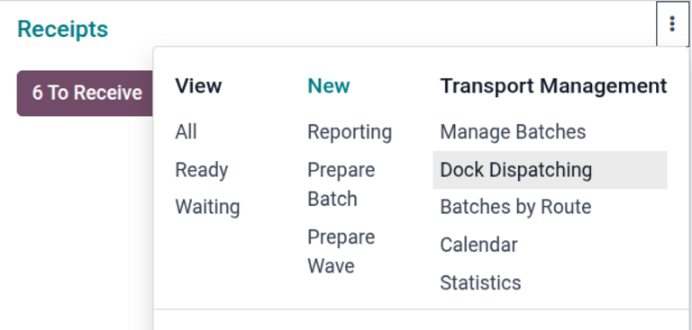

===============
Operation types
===============

Odoo **Inventory** tracks stock by warehouse and location, and then records what happens to products
(receiving, putaway and internal transfers, and picking and delivery) as structured stock moves.
These movements are called *operations*. Operations can also help keep what the system shows current
using counts and adjustments.

Each operation belongs to a specific *operation type*.

Operation types
===============

To add or edit operation types, navigate to :menuselection:`Inventory app --> Configuration -->
Operations Types`. A list of operation types displays.

Open an existing operation type, or click :guilabel:`New` to create a new operation type. Next,
complete the fields of the operation type form.

.. _inventory/operation_type/general-tab:

General tab
-----------

Use the *General* tab to specify basic settings for the operation type.

The following fields are available in the *General* tab:

- :guilabel:`Type of Operation`: Specify the type of operation.
- :guilabel:`Sequence Prefix`: Specify a short prefix Odoo will use to name transfers.
- :guilabel:`Barcode`: Define the barcode to be used when transferring products between locations.
- :guilabel:`Company`: Specify the company that can use this operation type.
- :guilabel:`Returns Type`: Define which operation can create returns for this operation type.
- :guilabel:`Create Backorder`: Define when back orders for unfulfilled products can be created upon
  validation for this operation type. Select :guilabel:`Ask` if Odoo should ask whether to create a
  back order. Select :guilabel:`Always` to always generate a back order. Select :guilabel:`Never` to
  specify that the remaining products should be canceled.
- :guilabel:`Analytic Costs`: Select this checkbox to ensure analytic entries are created in a
  project when stock moves are validated. It tracks the total cost of products included in stock
  moves (deliveries and receipts) that have been validated for the project. This ensures that the
  product's cost is tracked during the stock move.
- :guilabel:`Card Color`: Select a color to use for the operation type card on the
  :menuselection:`Overview` page.

Lots/serial numbers
~~~~~~~~~~~~~~~~~~~

This section only appears if :guilabel:`Lots & Serial Numbers` is enabled in
:menuselection:`Inventory app --> Configuration --> Settings`.

The following fields are available:

- :guilabel:`Create New`: Select this checkbox to specify that lots and serial numbers can be
  created from this operation type.
- :guilabel:`Use Existing ones`: If this checkbox is selected, the lot or serial number can be
  selected when creating transfers for this operation type.

.. seealso::
   - :doc:`../../product_management/product_tracking/lots`
   - :doc:`../../product_management/product_tracking/serial_numbers`

Locations
~~~~~~~~~

This section only appears if :guilabel:`Storage Locations` is enabled in :menuselection:`Inventory
app --> Configuration --> Settings`.

Specify the following locations for the operation type:

- :guilabel:`Source Location`: Select a default source location when operations of this type are
  created.
- :guilabel:`Destination Location`: Select a default destination location when operations of this
  type are created.

.. seealso::
   :doc:`use_locations`

Packages
~~~~~~~~

This section only appears if :guilabel:`Packages` is enabled in :menuselection:`Inventory app -->
Configuration --> Settings`.

If :guilabel:`Set Package Type` is selected, a package or package type can be selected when the
:guilabel:`Put in Pack` button is clicked on an operation's order form.

Batch & wave transfers
~~~~~~~~~~~~~~~~~~~~~~

This section appears only if :guilabel:`Batch, Wave & Cluster Transfers` is enabled in
:menuselection:`Inventory app --> Configuration --> Settings`.

Select the :guilabel:`Dispatch Management` checkbox to show dispatch-management-related details on
the batch or wave form and the *Inventory Overview* page. Then, select a location or vehicle.

Select the :guilabel:`Automatic Batches` checkbox to specify that pickings should be automatically
batched as they are confirmed when possible.

.. seealso::
   - :doc:`../../shipping_receiving/picking_methods/wave`
   - :doc:`../../shipping_receiving/picking_methods/batch`
   - :doc:`../../shipping_receiving/picking_methods/cluster`

.. _inventory/operation_type/hardware-tab:

Hardware tab
------------

Use the *Hardware* tab to specify settings for connected devices and how they should interact with
operations of this operation type.

In the *Print on validation* or *Print when done* section, specify what should be printed
automatically when an operation is validated.

In the *Print on "Put in Pack"* section, specify what should be printed when the :guilabel:`Put in
Pack` button is clicked on an operation form. :guilabel:`Packages` must be enabled in
:menuselection:`Inventory --> Configuration --> Settings` for this option to show.

In the *Scales* section, specify a scale to use in conjunction with operations of this operation
type in the :guilabel:`Connect Scale` field.

For manufacturing operation types, in the *Print when "Create new lot/SN"* section, select what
should be printed when a lot or serial number is generated on an operation.

.. seealso::
   - :doc:`../../../../general/iot/devices/printer`
   - :doc:`../../../../general/iot/devices/scale`

.. _inventory/operation_type/barcode-tab:

Barcode App tab
---------------

Use the *Barcode App* tab to specify how this operation type integrates with the **Barcode** app.
Specify when barcodes must be scanned or how often, whether to group products, or when to validate
an operation.

To display reserved lots or serial numbers on an operation in the **Barcode** app, select the
:guilabel:`Show reserved lots/SN` checkbox.

To show the packages that must be moved during a **Barcode** operation, select :guilabel:`Move
Entire Packages`.

.. seealso::
   :doc:`../../../barcode`
