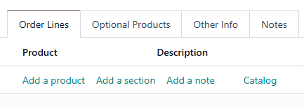
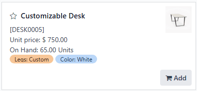
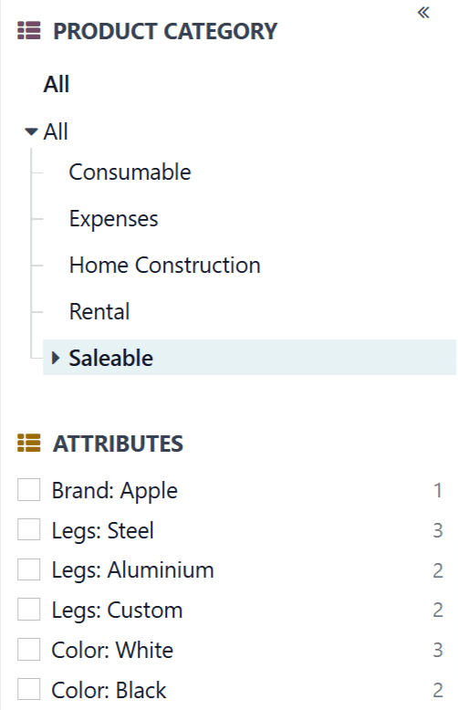
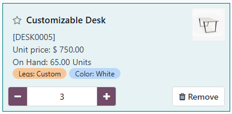

===============
Product catalog
===============

.. |SO| replace:: :abbr:`SO (sales order)`
.. |SOs| replace:: :abbr:`SOs (sales orders)`
.. |BoM| replace:: :abbr:`BoM (bill of materials)`
.. |RfQ| replace:: :abbr:`RfQ (request for quotation)`

The product *catalog* is a feature integrated with any Odoo app that allows users to add products or
components to an order. This includes the **Inventory**, **Manufacturing**, **Sales**, **Purchase**,
and **Repairs** apps, among others.

The product catalog can be accessed from the first tab of a quotation, request for quotation (RfQ),
order, or bill of materials (BoM) form, and opens in a new page when selected. The catalog displays
products and components in a user-friendly, POS-style format, from which they can be selected and
added to forms.

The product catalog simplifies the creation of new sales orders (SOs), purchase orders (POs),
manufacturing orders (MOs), bill of materials (BoMs), and more, by providing a visual interface
through which products and components can be quickly selected.

Use product catalog
===================

To use the product catalog, begin by creating or opening a quotation, |RfQ|, order, or |BoM| to
which products or components can be added. For example, create a new sales quotation by navigating
to :menuselection:`Sales app`, and clicking :guilabel:`New`.

On the form (quotation, |RfQ|, order, |BoM|), make sure the first tab on the bottom is selected.
Depending on the form being configured, this tab may be titled *Order Lines*, *Components*,
*Products*, or *Parts*.

On the first blank line of the tab, click the :guilabel:`Catalog` link to open the catalog in a new
page.

The product catalog displays a card for each product added to Odoo. Each card displays a few key
details about the corresponding product:

- Product photo
- Product title
- Price or cost of the product, depending on whether it is bought, sold, or used as a
  component
- Reference code (e.g. *DESK0005*)
- On-hand quantity
- Variant attributes (e.g. *Color: White*)

Products can be filtered using the search bar at the top of the page, or the sidebar on the left
side of the page.

To filter by product type, click the :icon:`fa-caret-down` :guilabel:`(down arrow)` button on the
right side of the search bar to open the search menu. In the :guilabel:`Filters` section, select the
:guilabel:`Services` filter to only show service products, or the :guilabel:`Products` filter to
only show physical products.

When creating or configuring a quotation or |SO|, specifically, an :guilabel:`In the Order` filter
appears in the :guilabel:`Filters` section of the search bar. Select this filter to only show
products that have already been added to the form.

In the sidebar on the left side of the page, select an option in the :icon:`fa-th-list`
:guilabel:`PRODUCT CATEGORY` section to filter by product category, or an option in the
:icon:`fa-th-list` :guilabel:`ATTRIBUTES` section to filter by variant attribute.

To add a product, click on the product's card, or click the :icon:`fa-shopping-cart` :guilabel:`Add`
button in the bottom-right corner of the card. Doing so adds one unit of the product, which is
displayed in a field in the bottom-left corner of the card.

Once a product has been added, clicking the product card continues to add units of the product in
increments of one.

To adjust the quantity of the product added, click the :icon:`fa-minus` :guilabel:`(minus)` button
to reduce the quantity by one, or the :icon:`fa-plus` :guilabel:`(plus)` button to increase it by
one.

Alternatively, a specific quantity can be entered by selecting the field between the
:icon:`fa-minus` :guilabel:`(minus)` and :icon:`fa-plus` :guilabel:`(plus)` buttons, and typing in
the desired quantity.

To remove a product from the order or |BoM| entirely, either click the :icon:`fa-trash`
:guilabel:`Remove` button in the bottom-right corner of the product card, or click the
:icon:`fa-minus` :guilabel:`(minus)` button until the quantity has been reduced to zero.

Once the desired quantity of each product has been added, return to the form by clicking the
:guilabel:`Back to [X]` button at the top of the screen. This button differs depending on the type
of form being configured (quotation, |BoM|, etc.).

.. important::
   Products appear in the product catalog, and can be added to orders, even if there
   are zero units of the product on hand. As a result, it is important to confirm the quantity of a
   product being added to an order is actually available, or inventory inconsistencies may arise.
