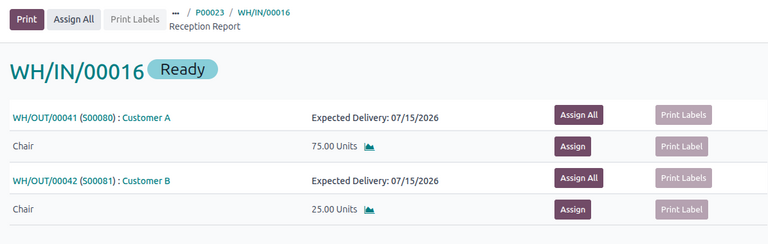
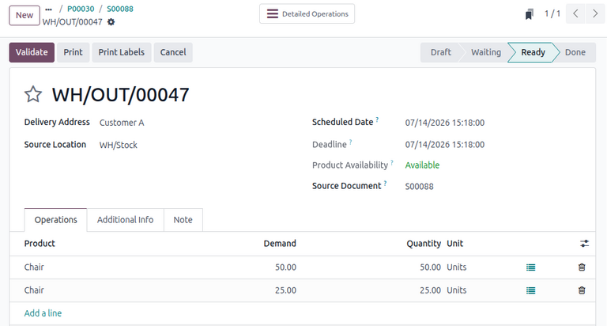
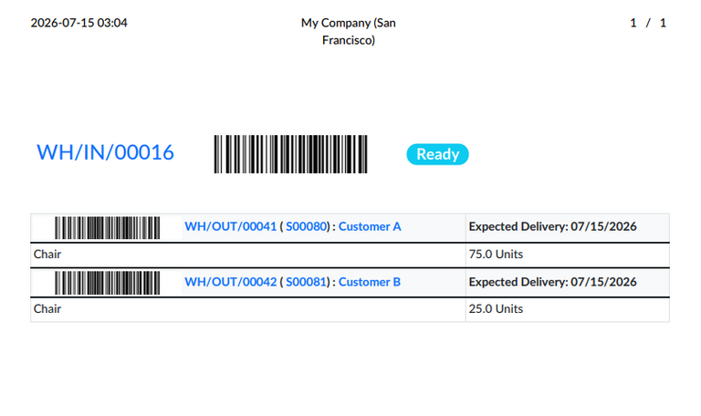
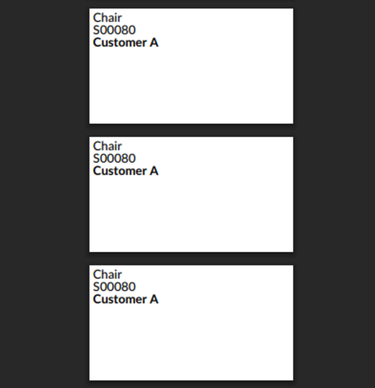

================
Reception report
================

.. |SO| replace:: :abbr:`SO (sales order)`
.. |SOs| replace:: :abbr:`SOs (sales orders)`
.. |RfQ| replace:: :abbr:`RfQ (request for quotation)`
.. |PO| replace:: :abbr:`PO (purchase order)`
.. |POs| replace:: :abbr:`POs (purchase orders)`

In Odoo **Inventory**, users can use reception reports to allocate incoming stock from purchase
orders (POs) to one or more sales orders (SOs). This allows users to directly assign units of the
replenished stock to fulfill higher-priority orders or retain more control over their inventory
reservations.

.. _inventory/reception_report/configuration:

Configuration
=============

To use reception reports, enable the *Reception Report* feature by navigating to
:menuselection:`Inventory app --> Configuration --> Settings`. Under the *Operations* section,
select the checkbox next to :guilabel:`Reception Report`, then click :guilabel:`Save`.

.. _inventory/reception-report/workflow:

Workflow
========

Reception reports are used to manage the allocation of replenished stock. This means that users must
first confirm customer demand, then replenish the necessary stock through a |PO|. Only after
confirming this replenishment order can users access the reception report and reserve units from the
|PO| to fulfill specific customer orders.

.. important::
   |SOs| with products that can be fulfilled with existing on-hand stock do **not** appear in
   reception reports.

The following process outlines all necessary steps for allocating stock using reception reports:

#. :ref:`Confirm SOs <inventory/reception-report/workflow/confirm-so>` for one or more customers.
#. Create and :ref:`confirm a PO <inventory/reception-report/workflow/confirm-po>` for the demanded
   products.
#. Open receipt and :ref:`access the reception report
   <inventory/reception-report/workflow/reception-report>` to allocate products.
#. :ref:`Validate receipt <inventory/reception-report/workflow/validate-receipt>` on the |PO|.
#. :ref:`Validate delivery <inventory/reception-report/workflow/validate-delivery>` on the |SO|.

.. _inventory/reception-report/workflow/confirm-so:

Create and confirm |SOs|
------------------------

When using reception reports, a user begins by creating sales quotations for one or more customers'
requested :guilabel:`Product` and :guilabel:`Quantity`. Confirm the quotations, turning them into
|SOs|. This generates a delivery order for each |SO|, accessible via the :icon:`fa-truck`
:guilabel:`Delivery` smart button.

.. important::
   To ensure Odoo can properly create allocations, confirm that the selected product has the
   following configurations:

   - :guilabel:`Purchase` checkbox is selected
   - :guilabel:`Product Type` is set to :guilabel:`Goods`
   - :guilabel:`Track Inventory` option is selected

.. _inventory/reception-report/workflow/confirm-po:

Create and confirm |PO|
-----------------------

The user then creates a new |RfQ| to replenish the demanded stock by navigating to the *Purchase*
app and clicking :guilabel:`New`. On the form, add the products in demand on the customers' |SOs| by
clicking :guilabel:`Add a product` in the *Products* tab and specifying the required
:guilabel:`Quantity`.

After adding the products, click :guilabel:`Confirm Order` to turn the |RfQ| into a |PO|.

.. _inventory/reception-report/workflow/reception-report:

Reception report
----------------

After confirming the |PO|, open the reception report to allocate the products' units to the desired
|SOs|. To do so, click the :icon:`fa-truck` :guilabel:`Receipt` smart button at the top of the |PO|
to open the receipt for the incoming stock of the product.

.. tip::
   Alternatively, navigate to the **Inventory** app and click :guilabel:`(#) To Process` in the
   :guilabel:`Receipts` card. Then, select the appropriate receipt.

On the receipt, an :icon:`fa-list` :guilabel:`Allocations` smart button appears at the top, which
opens the *Reception Report* page.

The *Reception Report* page displays a list of products to which the units on this |PO| can be
allocated, grouped by the |SOs| on which they appear. A link to each |SO| is included, along with
its :guilabel:`Expected Delivery`, and an option to :ref:`assign
<inventory/reception-report/workflow/reception-report/allocate>` all units of its products. Under
each |SO| is a list of its products, including each product's name, quantity, and the option to
assign the specified units individually.

.. note::
   |SOs| in the reception report are listed in order by the recency of their associated delivery
   (i.e., the |SO| with the oldest delivery order appears first). In other words, |SOs| are ordered
   by how recently they were confirmed, with the oldest confirmed |SO| appearing first.

.. _inventory/reception-report/workflow/reception-report/allocate:

Allocate units
~~~~~~~~~~~~~~

To allocate units for a product in an |SO|, click :guilabel:`Assign` in the product's corresponding
row. To undo allocation, click :guilabel:`Unassign`.

Alternatively, to allocate all available units for all products in an |SO|, click :guilabel:`Assign
All` in the corresponding row of the |SO|. To assign all available units across all |SOs|, click
:guilabel:`Assign All` at the top.

The quantity of reservable units for each product is automatically calculated in order, starting
from the oldest |SO|. This allows users to allocate as many units as available on the |PO| to
fulfill the quantity specified on the |SO|.

.. example::
   For example, |SO| A demands five *Chairs* and |SO| B demands five *Chairs*. A |PO| for eight
   units is created. On the reception report, |SO| A is listed first with five reservable units. The
   remaining three available units from this |PO| can be assigned to |SO| B, which will create a
   backorder due to insufficient supply.

|SOs| with allocated units are automatically linked to the |PO|. Users can access this |PO| directly
from the |SO| via the :icon:`fa-credit-card` :guilabel:`Purchase` smart button. Similarly, the
linked |SO| can also be accessed from the |PO| via the :icon:`fa-dollar` :guilabel:`Sale` smart
button.

.. _inventory/reception-report/workflow/validate-receipt:

Validate receipt
----------------

After allocating the desired units, receive the incoming stock. To do so, navigate to the |PO| and
click :guilabel:`Receive Products` or the :icon:`fa-truck` :guilabel:`Receipt` to open the receipt.
Then, click :guilabel:`Validate` to receive the products into stock.

.. _inventory/reception-report/workflow/validate-delivery:

Validate delivery
-----------------

After receiving the incoming stock, fulfill the delivery order for the customer's |SO|. To do so,
navigate to the |SO|, then click :icon:`fa-truck` :guilabel:`Delivery` to open the delivery order.
Note that the *Operations* tab is populated with a new line showing the allocated
:guilabel:`Product` and its allocated :guilabel:`Quantity`.

Finally, click :guilabel:`Validate` to confirm that the products have been delivered to the
customer.

.. example::
   The following example demonstrates how a reception report is used to allocate stock for a
   customer |SO| of higher priority.

   Two |SOs| are created for separate customers. Customer A orders 75 units of a *Chair*. Customer B
   also orders 75 units of the same product but needs them as soon as possible.

   No stock exists for the *Chair*, so the user creates and confirms a |PO| to replenish the product
   from Vendor A. This vendor can only provide 100 units of the *Chair* this week. So, the user
   creates and confirms another |PO| to replenish the remaining 50 units from Vendor B, which will
   be available next week.

   After confirming the |POs|, the user opens the reception reports for each vendor's receipt.
   Vendor A's report lists the |SO| for Customer A with 75 reservable units, then Customer B's |SO|
   with 25 reservable units. Vendor B's report lists the |SO| for Customer A with 50 reservable
   units.

   Because the user wants to prioritize Customer B's order, they want to ensure Customer B receives
   75 units from Vendor A, which can guarantee faster delivery. To do so, they first open Vendor B's
   reception report and assign 50 units to Customer A's |SO|. Odoo then recalculates Vendor A's
   reception report, updating Customer A's previous quantity of 75 units to 25 units and Customer
   B's quantity to 75 units.

   The user can now assign all 75 units from Vendor A to fulfill Customer B's delivery.

.. _inventory/reception-report/print-labels:

Print labels
============

Users can print labels for allocated products to ensure that they are correctly designated to the
appropriate customer.

After allocating the desired units, click :guilabel:`Print` at the top to download a PDF of the
reception report for the allocated units. The report includes a scannable barcode at the top for the
receipt order. Additional barcodes are also included for any delivery orders with allocated units.

If products are allocated, users can also click :guilabel:`Print Labels` to print an individual
label for each unit of the allocated products. Each label displays the name of the product, its
associated |SO| number, and its customer.

