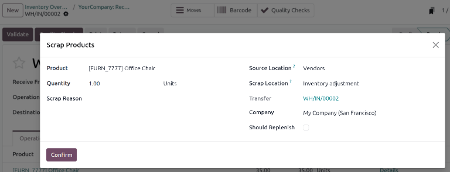
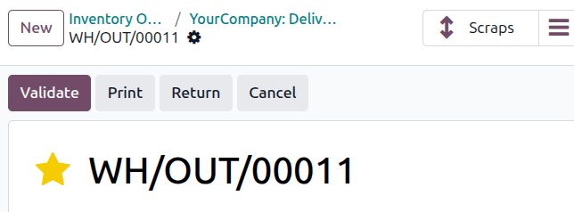
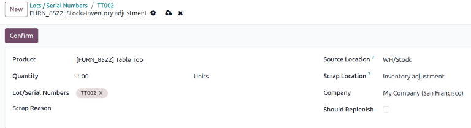
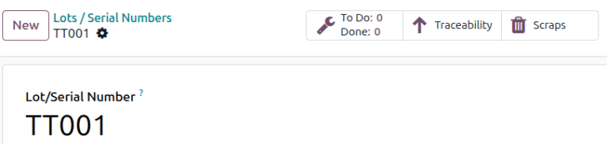

===============
Scrap inventory
===============

.. |SP| replace:: :abbr:`SP (Scrap Order)`
.. |SPs| replace:: :abbr:`SPs (Scrap Orders)`

Sometimes, products in a company's warehouse stock might be found to be damaged or defective, past
the point of being reparable. If it is not possible to repair the product, or return the product to
a vendor, it can be scrapped.

Odoo **Inventory** allows users to scrap inventory, designating goods or materials that are no
longer usable or sellable for disposal (or recycling).

Scrapping inventory in a database helps stock counts remain accurate, by removing scrapped products
from physical inventory, and placing it in a virtual scrap location (*Inventory adjustment*).

.. note::
   *Virtual locations* in Odoo are **not** real, physical spaces in a warehouse. Rather, they are
   designated locations in a database that provide tracking of items that shouldn't be counted in a
   physical inventory.

   For more information about virtual locations, see the documentation about the different types of
   :ref:`location types <inventory/warehouses_storage/location-type>`.

Scrap from stock
================

To create a new scrap order (SP) for an in-stock product, navigate to :menuselection:`Inventory app
--> Operations --> Scrap`, and click :guilabel:`New`. This opens a new |SP| form.

Click the drop-down menu in the :guilabel:`Product` field, and select the product that should be
scrapped from inventory. In the :guilabel:`Quantity` field, change the value to the quantity of the
product that should be scrapped (by default, this value is set to `1.00`).

.. image:: scrap_inventory/scrap-inventory-new-scrap-order.png
   :alt: Filled out new scrap order form with product details.

If the product is tracked by lot or serial number, specify the tracking number in the
:guilabel:`Lot/Serial Numbers` field.

The :guilabel:`Source Location` defaults to the location where the product is currently stored. The
:guilabel:`Scrap Location` defaults to the designated scrap location (:guilabel:`Inventory
adjustment`). Either of these locations can be changed by selecting a different location from their
respective drop-down menus.

.. note::
   The location fields only display when :guilabel:`Storage Locations` is enabled in
   :menuselection:`Inventory app --> Configuration --> Settings`.

The :guilabel:`Company` field displays the company whose warehouse this product belongs to. If a
replenishment rule is set up for the product being scrapped, and if the product should be
replenished, tick the checkbox for :guilabel:`Should Replenish`.

Once ready, click :guilabel:`Confirm` to complete the new |SP|.

.. tip::
   To view the all-time total quantities of scrapped items, navigate to :menuselection:`Inventory
   app --> Reporting --> Moves History`. This report is only available to users with :doc:`admin
   access <../../../../general/users/access_rights>`.

   On the :guilabel:`Moves History` page, click in the :guilabel:`Search` field, then select
   :menuselection:`Filters --> Scrapped`.

   A list of all scrapped products, and their quantities, is displayed.

   .. image:: scrap_inventory/moves-history-scrapped.png
      :alt: List of all scrapped products in Moves History report.

Scrap from an existing operation
================================

Scrap orders (SPs) can *also* be created from existing operations, such as receipts, delivery
orders, and internal transfers, before they are entered into, or removed from, stock for an
operation.

To scrap a product during an operation, navigate to the :menuselection:`Inventory app`. From the
:guilabel:`Inventory Overview`, click the :guilabel:`# To Process` button on an operation's task
card (for example, click :guilabel:`5 to Receive` on the :guilabel:`Receipts` card).

.. image:: scrap_inventory/inventory-overview.png
   :alt: # To Receive button on Receipts task card on Inventory Overview page.

Then, select an operation to process from the resulting list of existing orders. Doing so opens that
operation's form.

Click the :icon:`fa-cog` :guilabel:`(cog)` icon, and select :guilabel:`Scrap` from the resulting
drop-down menu. This opens a :guilabel:`Scrap Products` pop-up window.

From this pop-up window, click the drop-down menu in the :guilabel:`Product` field, and select the
product from the operation that should be scrapped. Adjust the value in the :guilabel:`Quantity`
field.

If the :guilabel:`Product` selected is tracked using a lot or serial number, a
:guilabel:`Lot/Serial` field appears. Specify the tracking number in that field.

The :guilabel:`Source Location` and :guilabel:`Scrap Location` can be changed, if needed. If a
replenishment rule is set up for the product being scrapped, and if the product should be
replenished, tick the checkbox for :guilabel:`Should Replenish`.

Once ready, click :guilabel:`Confirm`. A :icon:`fa-arrows-v` :guilabel:`Scraps` smart button appears
at the top of the operation form. Click this smart button to view the details of all scrap orders
created from this specific operation.

Scrap from a lot or serial number
=================================

Scrap orders (SPs) can also be created from lots or serial numbers.

To scrap a product with a lot or serial number, open :menuselection:`Inventory app --> Products -->
Lots/Serial Numbers`. Open a lot or serial number from the list. On the :guilabel:`Lot/Serial
Number` form, click the :icon:`fa-cog` :guilabel:`(cog)` icon, then select :guilabel:`Scrap`. This
opens a form to scrap the product.

In the form, verify that the correct :guilabel:`Product` is selected. Specify the
:guilabel:`Quantity` of products that should be scrapped. Verify that the :guilabel:`Lot/Serial
Numbers` value is correct. Specify a :guilabel:`Scrap Reason`. If a replenishment rule is set up for
the product being scrapped, and if the product should be replenished, select the :guilabel:`Should
Replenish` check box.

The :guilabel:`Source Location` defaults to the location where the product is currently stored. The
:guilabel:`Scrap Location` defaults to the designated scrap location (:guilabel:`Inventory
adjustment`). Either of these locations can be changed by selecting a different location from their
respective drop-down menus.

.. note::
   The location fields only display when :guilabel:`Storage Locations` is enabled in
   :menuselection:`Inventory app --> Configuration --> Settings`.

Once ready, click :guilabel:`Confirm`.

After the scrap is created, follow the breadcrumbs back to the :guilabel:`Lot/Serial Number` form. A
:icon:`fa-trash` :guilabel:`Scraps` smart button appears at the top of the :guilabel:`Lot/Serial
Number` form.

Revert a scrap
==============

Revert a scrap from the :guilabel:`Moves History` report.

.. note::
   This report is only available to users with :doc:`admin access
   <../../../../general/users/access_rights>`.

Open :menuselection:`Inventory app --> Reporting --> Moves History`.

Select the check box next to the scrap operation to revert. Click the :icon:`fa-cog`
:guilabel:`Actions` menu, then select :guilabel:`Revert`.
