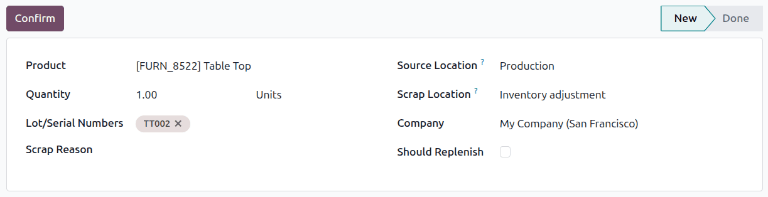
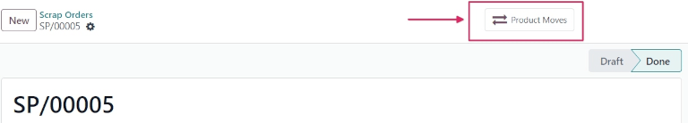
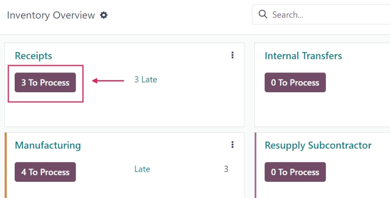
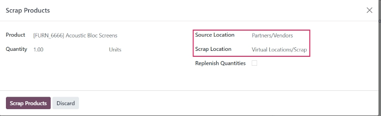
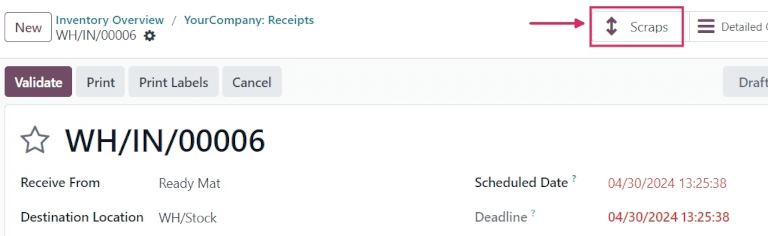

===============
Scrap inventory
===============

.. |SP| replace:: :abbr:`SP (Scrap Order)`
.. |SPs| replace:: :abbr:`SPs (Scrap Orders)`

Sometimes, products in a company's warehouse stock might be found to be damaged or defective, past
the point of being reparable. If it is not possible to repair the product, or return the product to
a vendor, it can be scrapped.

Odoo *Inventory* allows users to scrap inventory, designating goods or materials that are no longer
usable or sellable for disposal (or recycling).

Scrapping inventory in a database helps stock counts remain accurate, by removing scrapped products
from physical inventory, and placing it in a virtual scrap location (*Virtual Locations/Scrap*).

.. note::
   *Virtual locations* in Odoo are **not** real, physical spaces in a warehouse. Rather, they are
   designated locations in a database that provide tracking of items that shouldn't be counted in a
   physical inventory.

   For more information about virtual locations, see the documentation about the different types of
   :ref:`location types <inventory/warehouses_storage/location-type>`.

Scrap from stock
================

To create a new scrap order (SP) for an in-stock product, navigate to :menuselection:`Inventory app
--> Operations --> Scrap`, and click :guilabel:`New`. This opens a new |SP| form.

Click the drop-down menu in the :guilabel:`Product` field, and select the product that should be
scrapped from inventory. In the :guilabel:`Quantity` field, change the value to the quantity of the
product that should be scrapped (by default, this value is set to `1.00`).

The :guilabel:`Source Location` defaults to the location where the product is currently stored. The
:guilabel:`Scrap Location` defaults to the designated scrap location (:guilabel:`Virtual
Locations/Scrap`). Either of these locations can be changed by selecting a different location from
their respective drop-down menus.

If the scrapping is tied to a specific existing operation, specify the operation in the
:guilabel:`Source Document` field.

The :guilabel:`Company` field displays the company whose warehouse this product belongs to. If a
replenishment rule is set up for the product being scrapped, and if the product should be
replenished, tick the checkbox for :guilabel:`Replenish Quantities`.

Once ready, click :guilabel:`Validate` to complete the new |SP|. Once validated, a
:guilabel:`Product Moves` smart button appears at the top of the form. Click the smart button to
view the details of the scrap operation.

.. tip::
   To view the all-time total quantities of scrapped items, navigate to :menuselection:`Inventory
   app --> Configuration --> Locations`. Click the :guilabel:`x (remove)` button on the
   :guilabel:`Internal` filter in the :guilabel:`Search...` bar, to display virtual locations.

   Select the :guilabel:`Virtual Locations/Scrap` location. From the :guilabel:`Scrap` location's
   form, click the :guilabel:`Current Stock` smart button, at the top of the form.

   A list of all scrapped products, and their quantities, is displayed.

   .. image:: scrap_inventory/scrap-inventory-current-stock.png
      :align: center
      :alt: Current Stock list of all scrapped products in virtual scrap location.

Scrap from an existing operation
================================

Scrap orders (SPs) can *also* be created from existing operations, such as receipts, delivery
orders, and internal transfers, before they are entered into, or removed from, stock for an
operation.

To scrap a product during an operation, navigate to the :menuselection:`Inventory app`. From the
:guilabel:`Inventory Overview`, click the :guilabel:`# To Process` button on an operation's task
card (i.e. the :guilabel:`Receipts` task card).

Then, select an operation to process from the resulting list of existing orders. Doing so opens that
operation's form.

Click the :icon:`fa-cog` :guilabel:`(cog)` icon, and select :guilabel:`Scrap` from the resulting
drop-down menu. This opens a :guilabel:`Scrap Products` pop-up window.

From this pop-up window, click the drop-down menu in the :guilabel:`Product` field, and select the
products from the operation that should be scrapped. Adjust the value in the :guilabel:`Quantity`
field, if necessary.

If the :guilabel:`Product` selected is tracked using a lot or serial number, a
:guilabel:`Lot/Serial` field appears. Specify the tracking number in that field.

The :guilabel:`Source Location` and :guilabel:`Scrap Location` can be changed, if needed. If a
replenishment rule is set up for the product being scrapped, and if the product should be
replenished, tick the checkbox for :guilabel:`Replenish Quantities`.

Once ready, click :guilabel:`Scrap Products`. A :guilabel:`Scraps` smart button appears at the top
of the operation form. Click this smart button to view the details of all scrap orders created from
this specific operation.

