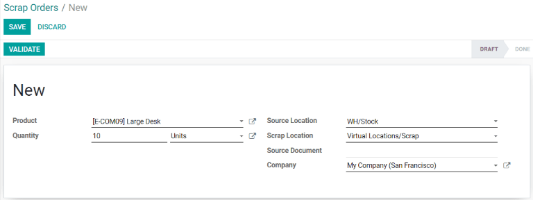
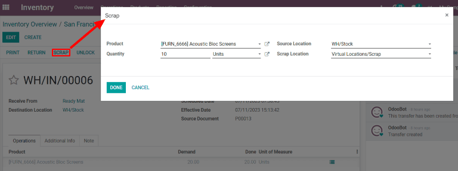

===============
Scrap inventory
===============

In some cases, a product in inventory may be damaged or found to be defective. If it is not possible
to repair or return the product, Odoo *Inventory* allows users to scrap it, ensuring that usable
inventory counts remain accurate.

.. tip::
   Scrap orders can be viewed by navigating to :menuselection:`Inventory --> Operations --> Scrap`.
   Each scrap order shows the date and time the order was created, along with the product and
   quantity that was scrapped.

   To view the total quantity of each item scrapped, navigate to :menuselection:`Inventory -->
   Configuration --> Locations`. Remove the :guilabel:`Internal` filter from the
   :guilabel:`Search...` bar to display virtual locations. Finally, select the :guilabel:`Virtual
   Locations/Scrap` location.

By default, scrapping a product removes it from physical inventory, and places it in a virtual
location titled *Virtual Locations/Scrap*. A virtual location is **not** a physical space, but
rather a designation in Odoo that is used to track items that are no longer in physical inventory.

.. admonition:: Learn more

   For more information about virtual locations, see the documentation about the different types of
   :ref:`locations <inventory/warehouses_storage/difference-warehouse-location>`.

Scrap from stock
================

To scrap a product located in inventory, begin by navigating to :menuselection:`Inventory -->
Operations --> Scrap`. On the :guilabel:`Scrap Orders` page, click :guilabel:`Create` to configure a
new scrap order.

On the scrap order, select the product being scrapped from the :guilabel:`Product` drop-down menu,
then enter the quantity in the :guilabel:`Quantity` field. The :guilabel:`Source Location` defaults
to the location where the product is stored, and the :guilabel:`Scrap Location` defaults to
:guilabel:`Virtual Locations/Scrap`, but either of these can be changed by selecting a different
location from their respective drop-down menus.

Finally, click :guilabel:`Validate` to scrap the product. The on-hand inventory count for the
scrapped product updates to subtract the scrapped quantity.

Scrap from a receipt, transfer, or delivery
===========================================

It is also possible to scrap products during the receipt, transfer, and delivery operations. This
can be necessary if any products are found to be defective when receiving them into inventory,
transferring them from one location to another, or preparing them for delivery.

To scrap a product during the receipt, transfer, or delivery operations, begin by navigating to the
:menuselection:`Inventory` app. On the :guilabel:`Overview` page, select the :guilabel:`# TO
PROCESS` button on the :guilabel:`Receipts`, :guilabel:`Internal Transfers`, or :guilabel:`Delivery
Orders` card, depending on the type of operation the product is being scrapped from.

.. note::
   For the :guilabel:`Internal Transfers` card to appear on the :menuselection:`Overview` page of
   the :menuselection:`Inventory` app, the :guilabel:`Storage Locations` setting must be enabled. To
   do so, navigate to :menuselection:`Configuration --> Settings`, then enable the checkbox next to
   :guilabel:`Storage Locations` under the :guilabel:`Warehouse` heading.

Alternatively, a list of all delivery orders, receipts, and transfers can be viewed by navigating to
:menuselection:`Inventory --> Operations --> Transfers`.

Next, open a delivery order, receipt, or transfer from the corresponding page by clicking on it. A
:guilabel:`Scrap` button appears at the top of the page. Click it to open the :guilabel:`Scrap`
pop-up window.

.. important::
   The :guilabel:`Scrap` button will only appear on a receipt that has been validated. This is
   because Odoo only allows products to be scrapped once they have been entered into inventory.

On the :guilabel:`Scrap` pop-up window, select the product being scrapped from the
:guilabel:`Product` drop-down menu. Then, enter the quantity in the :guilabel:`Quantity` field.

The :guilabel:`Source Location` defaults to the location where the product is stored, and the
:guilabel:`Scrap Location` defaults to :guilabel:`Virtual Locations/Scrap`, but either of these can
be changed by selecting a different location from their respective drop-down menus.

Finally, click :guilabel:`Done` to scrap the product. After doing so, the :guilabel:`Scrap` pop-up
window disappears and a :guilabel:`Scraps` smart button appears in the top right of the page. Click
it to view all of the scrap orders created from that operation.

.. image:: scrap_inventory/scraps-smart-button.png
   :align: center
   :alt: The Scraps smart button.
