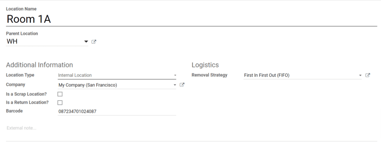

=========
Locations
=========

A *location* is a specific space within a warehouse. This can be a shelf, room, aisle, etc. There
are three types of locations in Odoo:

- *Physical locations* are spaces within a warehouse owned by the user's company. These can be a an
  area where items are stored like an aisle or shelf, or an area where operations take place, like
  loading and unloading bays.
- *Partner locations* are the same as physical locations except that they exist within the warehouse
  of a customer or vendor.
- *Virtual locations* are locations that do not exist physically, but where items that are not in
  inventory can be placed. These can be items that have not yet entered inventory, like products
  that are on the way to a warehouse, or items that are no longer in inventory due to loss or other
  factors.

.. important::
   In order to use locations, the :guilabel:`Storage Locations` setting must be enabled. To do so,
   navigate to :menuselection:`Inventory --> Configuration --> Settings`, scroll down to the
   :guilabel:`Warehouse` heading, and enable the :guilabel:`Storage Locations` checkbox.

Create a new location inside a warehouse
========================================

Starting from the :menuselection:`Inventory` app, select :menuselection:`Configuration --> Locations
--> Create`. The new location form can then be configured as follows:

- :guilabel:`Location Name`: the name that will be used to reference the location
- :guilabel:`Parent Location`: the location or warehouse that the new location exists within
- :guilabel:`Location Type`: choose the category that the location belongs to
- :guilabel:`Company`: the company that owns the warehouse that the location is inside of
- :guilabel:`Is a Scrap Location?`: check this box to allow for scrapped/damaged goods to be stored
  in this location
- :guilabel:`Is a Return Location?`: check this box to allow products to be returned to this
  location
- :guilabel:`Barcode`: the barcode number assigned to the location
- :guilabel:`Removal Strategy`: the :doc:`strategy <../removal_strategies>` for how items
  should be taken from inventory

.. _inventory/location-hierarchy:

Create location hierarchies
===========================

The *Parent Location* setting on the new location form allows for a location to exist within a
warehouse or another location. Every location can serve as a parent location, and every parent
location can have multiple locations within it, allowing for the creation of a virtually infinite
hierarchical structure.

.. example::
   Location hierarchy could be organized so that a shelf is located within an aisle, which is
   located within a room, which is located within the overall warehouse.

To create the location hierarchy in the example above, set the warehouse as the parent of the room,
the room as the parent of the aisle, and the aisle as the parent of the shelf. This can be adapted
to a hierarchy of any magnitude.
