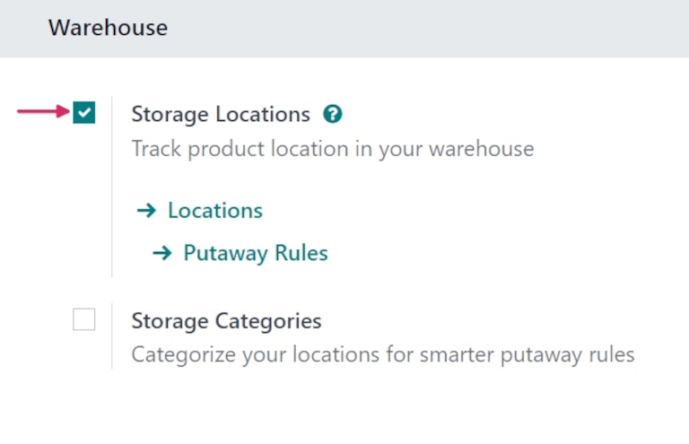
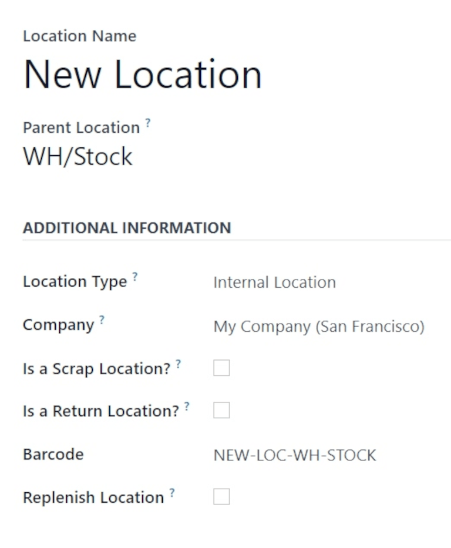

=========
Locations
=========

In Odoo *Inventory*, a *location* is a specific space within a warehouse. This can be a shelf, room,
aisle, rack, bin, etc.

There are also external and virtual locations. For example, customer locations, and locations
specifically designated as "virtual", instead of real, physical locations.

Locations allow for the storage of products in designated areas of the warehouse, to help track
inventory accurately.

Configuration
=============

To specify storage locations, the *Storage Locations* setting must be enabled. To do so, navigate to
:menuselection:`Inventory app --> Configuration --> Settings`, and scroll down to the
:guilabel:`Warehouse` section. Tick the checkbox next to :guilabel:`Storage Locations` to enable the
feature, and click :guilabel:`Save`.

Once the :guilabel:`Storage Locations` feature is enabled, two additional internal link options
appear below it: :guilabel:`Locations` and :guilabel:`Putaway Rules`. Click :guilabel:`Locations` to
open a list of all existing locations in the warehouse.

Create a new location inside a warehouse
========================================

To create a new location inside a warehouse, navigate to :menuselection:`Inventory app -->
Configuration --> Locations`. Doing so opens a list of all existing locations. Click :guilabel:`New`
to open a new location creation form.

In the :guilabel:`Location Name` field, assign a name for the new location. In the :guilabel:`Parent
Location` field, assign the location that this new location exists in.

.. example::
   A new location `Gate 1` is created. Its parent location is `Dispatch Zone`. In the
   :guilabel:`Parent Location` for `Gate 1`, select `Dispatch Zone`.

In the :guilabel:`Additional Information` section, fill out the necessary details for the new
location.

In the :guilabel:`Location Type` field, select which type of location this is. There are seven
different types of locations to choose from:

- :guilabel:`Vendor Location`: virtual location representing the source location for products coming
  from vendors.
- :guilabel:`View`: virtual location used to create a hierarchical structure for a warehouse;
  aggregates its child locations. **Should not directly contain products**.
- :guilabel:`Internal Location`: physical location inside a warehouse.
- :guilabel:`Customer Location`: virtual location representing the destination location for products
  sent to customers.
- :guilabel:`Inventory Loss`: virtual location serving as a counterpart for inventory operations.
  Used to correct stock levels of physical inventory.
- :guilabel:`Production`: virtual counterpart location for production operations. This location
  consumes components and produces finished products.
- :guilabel:`Transit Location`: counterpart location that should be used in inter-company or
  inter-warehouse operations.

Configure the remaining fields in the :guilabel:`Additional Information` section as follows:

- :guilabel:`Company`: the company whose warehouse the location is inside of. Leave this field blank
  if this location is shared between companies.
- :guilabel:`Is a Scrap Location?`: tick this checkbox to allow for scrapped/damaged goods to be
  stored in this location.
- :guilabel:`Is a Return Location?`: tick this checkbox to allow products to be returned to this
  location.
- :guilabel:`Barcode`: the barcode assigned to the location.
- :guilabel:`Replenish Location`: tick this checkbox to get all quantities to replenish at this
  location.

In the :guilabel:`Cyclic Counting` section, change the value in the :guilabel:`Inventory Frequency
(Days)` field from the default `0`, if necessary.

.. image:: use_locations/use-locations-cyclic-counting.png
   :align: center
   :alt: Cyclic Counting section of new location creation form.

When different than `0`, the inventory count dates for products stored at this location are
automatically set at the defined frequency.

In the :guilabel:`Logistics` section, in the :guilabel:`Removal Strategy` field, click the drop-down
menu and select the :doc:`removal strategy <../removal_strategies>` for how items should be removed
from this location.

.. _inventory/location-hierarchy:

Create location hierarchies
===========================

The *Parent Location* setting on the new location form allows for a location to exist within a
warehouse, or below another location.

Every location can serve as a parent location, and every parent location can have multiple locations
within it, allowing for the creation of a hierarchical structure.

.. example::
   Location hierarchy could be organized so that a small refrigerator is located on a specific
   shelf, which is located in the warehouse.

   .. image:: use_locations/use-locations-hierarchy.png
      :align: center
      :alt: Location hierarchy of small refrigerator, on a shelf in a warehouse.

   To create the location hierarchy in the example above (`WH/Stock/Shelf 2/Small Refrigerator`),
   set the warehouse stock as the parent of the shelf, and the shelf as the parent of the small
   refrigerator. This can be adapted to a hierarchy of any magnitude.

.. seealso::
   :doc:`warehouses_locations`
