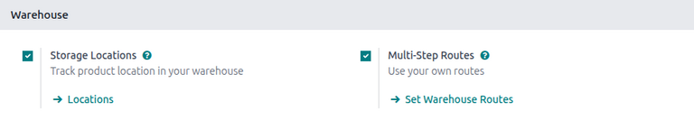
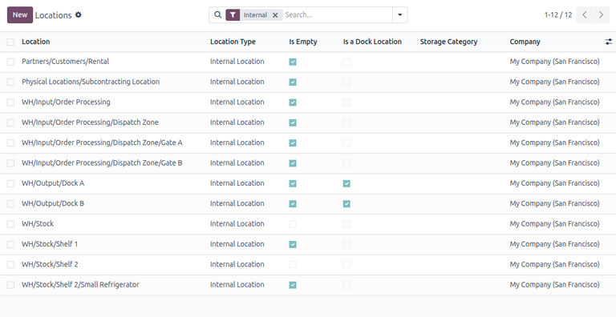
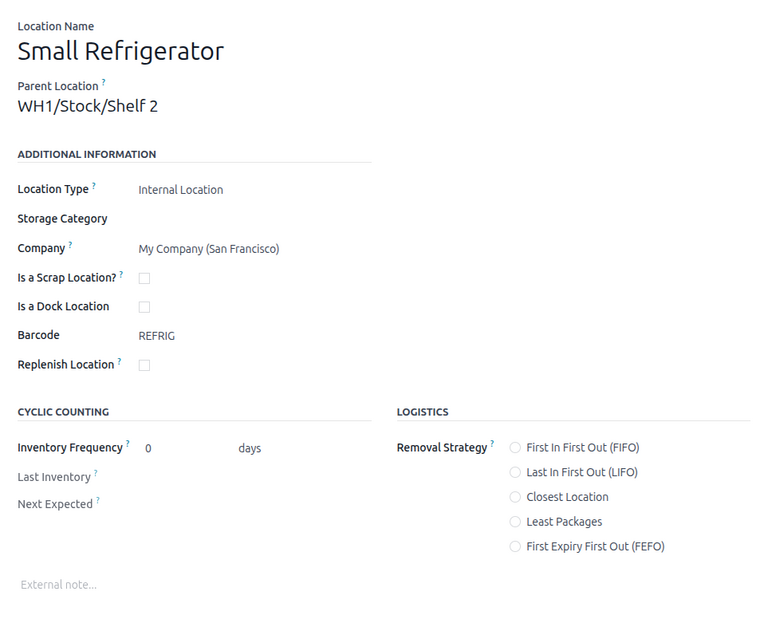
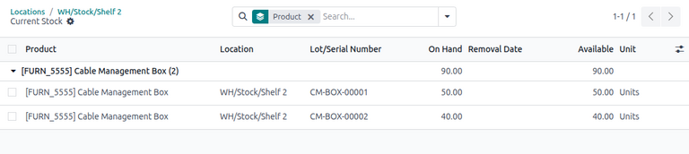

=========
Locations
=========

A *location* is a specific space within a warehouse (e.g., a shelf, room, aisle, etc.). Each
location is categorized by a :ref:`location type <inventory/warehouses_storage/location-type>`,
which determines the behavior of stock moves and valuation.

Users can create custom locations, track products at specific locations, and manage putaway rules.

.. _use_locations/configuration:

Configuration
=============

To create specific storage locations, enable the *Storage Locations* feature by going to
:menuselection:`Inventory app --> Configuration --> Settings`. In the :guilabel:`Warehouse` section,
select the :guilabel:`Storage Locations` checkbox. Then, click :guilabel:`Save`.

.. note::
   Typically, the :guilabel:`Storage Locations` feature is used with :doc:`Multi-Step Routes
   <../../shipping_receiving/daily_operations/use_routes>`, which controls how products move between
   locations.

.. _inventory/use_locations/create-new-locations:

Create new location
===================

After enabling *Storage Locations*, go to :menuselection:`Inventory app --> Configuration -->
Locations` to open a list of locations.

On this page, click :guilabel:`New` to open a new location form.

To start, enter the following details:

- :guilabel:`Location Name`: A recognizable name for the location.
- :guilabel:`Parent Location`: The new location's parent location, if applicable.

  .. example::
     In location `WH/Stock/Zone A/Refrigerator 1`, `Refrigerator 1` is the location name, and `Zone
     A` is the parent location. Both the location and the parent location are organized
     hierarchically within `WH/Stock`.

Additional Information section
------------------------------

In addition to the required fields above, configure the following location fields to ensure the
location serves its intended purpose in the database:

- :guilabel:`Location Type`: From the drop-down menu, select :guilabel:`Vendor`,
  :guilabel:`Virtual`, :guilabel:`Internal`, :guilabel:`Customer`, :guilabel:`Inventory Loss`,
  :guilabel:`Production`, or :guilabel:`Transit` to categorize the location. For details on each
  location type, refer to the :ref:`Location Types section
  <inventory/warehouses_storage/location-type>`.
- :guilabel:`Storage Category`: Select the storage category. The :doc:`Storage Categories
  <../../shipping_receiving/daily_operations/storage_category>` feature **must** be enabled.
- :guilabel:`Company`: The company of the location.
- :guilabel:`Is a Scrap Location?`: Select this checkbox to allow :doc:`scrapped goods
  <scrap_inventory>` to be stored in this location.
- :guilabel:`Is a Dock Location`: If the **Fleet** app is installed, and if using :doc:`batch
  transfers <../../shipping_receiving/picking_methods/batch>`, select this checkbox to allow batches
  to be loaded at this location.
- :guilabel:`Barcode`: Enter the barcode to :ref:`identify actions <barcode/setup/location>` at this
  location when scanned. The **Barcode** app **must** be installed.
- :guilabel:`Replenish Location`: Select this checkbox to set the location as a destination for
  receiving products from *Buy*, *Manufacture*, or other :doc:`configured routes
  <../../shipping_receiving/daily_operations/use_routes>`.

Cyclic Counting section
-----------------------

To schedule regular inventory counts at this location, set the :guilabel:`Inventory Frequency` field
to the desired interval between inventory counts, in days. By default, it is set to `0` (no
scheduled counts).

The :guilabel:`Last Inventory` field displays the date of the last inventory count at this location.

After specifying an :guilabel:`Inventory Frequency`, the :guilabel:`Next Expected` field
automatically displays the date of the next inventory count.

.. example::
   With inventory counts scheduled to occur every `30` days, the :guilabel:`Last Inventory` count
   occurred on September 24, and the :guilabel:`Next Expected` is October 24.

   .. image:: use_locations/scheduled-count.png
      :alt: Show Cyclic Count section of the locations form.

.. seealso::
   :doc:`Cycle Counts <cycle_counts>`

Logistics section
-----------------

Optionally, in the :guilabel:`Logistics` section, select a :doc:`removal strategy
<../../shipping_receiving/removal_strategies>` to specify the order and priority for picking
products from inventory. The options are:

- :guilabel:`First In First Out (FIFO)`
- :guilabel:`Last In First Out (LIFO)`
- :guilabel:`Closest Location`
- :guilabel:`Least Packages`
- :guilabel:`First Expiry First Out (FEFO)`

.. note::
   The :guilabel:`Least Packages` option is only selectable if the :doc:`Packages feature
   <../../product_management/configure/package>` is enabled.

.. seealso::
   See the :doc:`../../shipping_receiving/removal_strategies` documentation for details about each
   option listed in this field.

Manage additional options at location
=====================================

Users can also access lists of products, current stock, and putaway rules by location. To do so,
open the location's form by navigating to :menuselection:`Inventory app --> Configuration -->
Locations` and selecting the desired location.

In the location form, access each of these options by selecting its corresponding smart button.

.. _inventory/use_locations/current-stock:

View current stock
------------------

To view the current stock at the location, click the :icon:`fa-cubes` :guilabel:`Current Stock`
smart button. This opens a list of all products at the location, including their :guilabel:`On Hand`
quantities.

By default, current stock information is grouped by product. Additional :doc:`filters and grouping
<../../../../essentials/search>` options can be applied via the search bar.

.. _inventory/use_locations/products:

View products
-------------

To view all products at the location, click the :icon:`fa-th-list` :guilabel:`Products` smart
button. By default, this opens a list of all available products or products with outstanding demand.
Additional filters and grouping options can be applied via the search bar.

.. _inventory/use_locations/putaway:

View putaway rules
------------------

To view all putaway rules of the location, click the :icon:`fa-random` :guilabel:`Putaway Rules`
smart button. This opens the :doc:`Putaway Rules
<../../shipping_receiving/daily_operations/putaway>` page, where users can view, edit, or create
additional rules.
