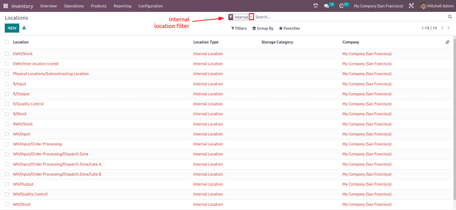
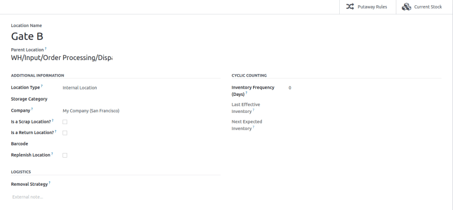

=========
Locations
=========

A *location* is a specific space within a warehouse. This can be a shelf, room, aisle, etc.

Configuration
=============

To create specific storage locations, enable the *Storage Locations* feature by going to
:menuselection:`Inventory app --> Configuration --> Settings`. In the :guilabel:`Warehouses`
section, tick the :guilabel:`Storage Locations` checkbox. Then, click :guilabel:`Save`.

.. note::
   Typically, the :guilabel:`Storage Locations` feature is used with :doc:`Multi-Step Routes
   <../../shipping_receiving/daily_operations/use_routes>`, which controls how products move between
   locations.

.. image:: use_locations/enable-location.png
   :align: center
   :alt: Show Storage Locations feature.

Create new location
===================

After enabling *Storage Locations*, go to :menuselection:`Inventory app --> Configuration -->
Locations`.

On this page, click :guilabel:`New`. The new location form can then be configured as follows:

- :guilabel:`Location Name`: recognizable name of the location.
- :guilabel:`Parent Location`: the location within which the new location exists. After the location
  is created, it is listed on the :guilabel:`Locations` page using a *location hierarchy*, to
  describe how a specific location fits within larger areas of the warehouse.

  .. example::
    In `WH/Stock/Zone A/Refrigerator 1`, "Refrigerator 1" is the location name, "Zone A" is the
    parent location, and everything before it is the path showing where this spot is within the
    warehouse.

Additional Information section
------------------------------

In addition to the required fields above, configure the following location fields to ensure the
location serves its intended purpose in the database:

- :guilabel:`Location Type`: from the drop-down menu, choose :guilabel:`Vendor Location`,
  :guilabel:`View`, :guilabel:`Internal Location`, :guilabel:`Customer Location`,
  :guilabel:`Inventory Loss`, :guilabel:`Production`, or :guilabel:`Transit Location` to categorize
  the location. For details on each location type, refer to the :ref:`Location Types section
  <inventory/warehouses_storage/location-type>`.
- :guilabel:`Storage Category`: only available with the :doc:`Storage Categories
  <../../shipping_receiving/daily_operations/storage_category>` feature enabled in
  :menuselection:`Inventory app --> Configuration --> Settings`.
- :guilabel:`Company`: the company the location belongs to.
- :guilabel:`Is a Scrap Location?`: tick this checkbox to allow for scrapped/damaged goods to be
  stored in this location.
- :guilabel:`Is a Return Location?`: tick this checkbox to allow products to be returned to this
  location.
- :guilabel:`Barcode`: used with the *Barcode* app, enter the barcode to :ref:`identify actions
  <barcode/setup/location>` at this location when scanned.
- :guilabel:`Replenish Location`: used for :doc:`configuring routes
  <../../shipping_receiving/daily_operations/use_routes>`, tick this checkbox to set the location as
  a destination for receiving products from *Buy*, *Manufacture*, or other procurement routes,
  ensuring products are correctly supplied to the warehouse.

Cyclic Counting section
-----------------------

To schedule regular inventory counts at this location, set the :guilabel:`Inventory Frequency
(Days)` field to the desired interval. By default, it is set to `0` (no scheduled counts).

For example, setting this field to `30`, schedules a count every thirty days. For more specifics on
setting up and using this feature, refer to the :doc:`Cycle Counts documentation <cycle_counts>`.

The :guilabel:`Last Effective Inventory` field displays the date the last inventory count at this
location occurred. When scheduled inventory counts are enabled, the :guilabel:`Next Expected
Inventory` field displays the date of the next inventory count.

.. example::
   With inventory counts scheduled to occur every `30` days, and the :guilabel:`Last Effective
   Inventory` count occurring on July 16, the :guilabel:`Next Expected Inventory` is August 15.

   .. image:: use_locations/scheduled-count.png
      :align: center
      :alt: Show Cyclic Count section of the locations form.

Logistics section
-----------------

In the :guilabel:`Logistics` section of the locations form, optionally select a :guilabel:`Removal
Strategy` to determine the order and priority of how products are picked from inventory. The options
are: :guilabel:`First In First Out (FIFO)`, :guilabel:`Last In First Out (LIFO)`, :guilabel:`Closest
Location`, and :guilabel:`First Expiry First Out (FEFO)`.

.. seealso::
   :doc:`../../shipping_receiving/removal_strategies`

Current stock at location
=========================

To view the current stock at a single location, go to :menuselection:`Inventory app -->
Configuration --> Locations`, and select the desired location.

Next, click the :guilabel:`Current Stock` smart button to get a list of all products at the
location.

.. example::
   A list of current stock at `Shelf 1` consists of `266` cabinets and `39` desks.

   .. image:: use_locations/current-stock.png
      :align: center
      :alt: Show stock at Shelf 1.
