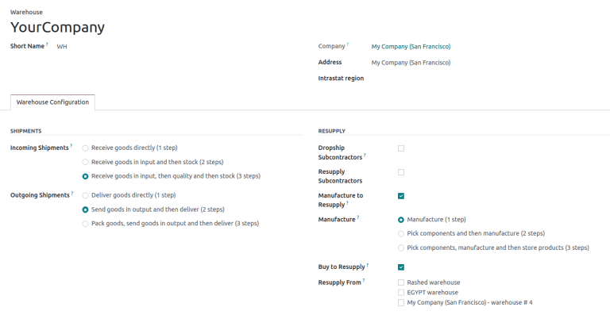

==========
Warehouses
==========

In the Odoo *Inventory* app, a *warehouse* is a physical space with an address for storing items,
such as a storage facility, distribution center, or physical store.

Each database has a pre-configured warehouse with the company's address. Users can set up multiple
warehouses, and :doc:`create stock moves <use_routes>` between them.

Configuration
=============

To create or manage warehouses, go to :menuselection:`Inventory app --> Configuration -->
Warehouses`.

Then, select an existing warehouse, or create a new one by clicking :guilabel:`New`. Doing so opens
the warehouse form, which contains the following fields:

- :guilabel:`Warehouse` (*required field*): the full name of the warehouse.
- :guilabel:`Short Name` (*required field*): the abbreviated code for the warehouse (maximum five
  characters). The short name for the default warehouse in Odoo is `WH`.

  .. important::
     The :guilabel:`Short Name` appears on warehouse documents, so it is recommended to use an
     memorable one, like "WH[first letters of location]" (e.g. `WHA`, `WHB`, etc.).

- :guilabel:`Address` (*required field*): the address of the warehouse. To change the warehouse
  address when creating two or more warehouses, hover over the field, and click the
  :icon:`fa-arrow-right` :guilabel:`(right arrow)`.
- :guilabel:`Company` (*required field*): the company that owns the warehouse; this can be set as
  the company that owns the Odoo database, or the company of a customer or vendor.
- :guilabel:`Intrastat region`: :doc:`region name
  <../../../../finance/accounting/reporting/intrastat>` required for companies in the European
  Union.

.. important::
   The options below are available **only** when the *Multi-Step Routes* feature is enabled in
   :menuselection:`Inventory app --> Configuration --> Settings`.

- :guilabel:`Incoming Shipments`: select the option to receive products from the warehouse in
  :doc:`one <../../shipping_receiving/daily_operations/receipts_delivery_one_step>`, :doc:`two
  <../../shipping_receiving/daily_operations/receipts_delivery_two_steps>`, or :doc:`three
  <../../shipping_receiving/daily_operations/receipts_three_steps>` steps.

- :guilabel:`Outgoing Shipments`: select the option to deliver products from the warehouse in
  :doc:`one <../../shipping_receiving/daily_operations/receipts_delivery_one_step>`, :doc:`two
  <../../shipping_receiving/daily_operations/receipts_delivery_two_steps>`, or :doc:`three
  <../../shipping_receiving/daily_operations/delivery_three_steps>` steps.

- :guilabel:`Dropship Subcontractors`: available with the *Subcontracting* feature enabled in
  :menuselection:`Manufacturing app --> Configuration --> Settings`. Tick this checkbox to purchase
  components from vendors, and dropship them to subcontractors.
- :guilabel:`Resupply Subcontractors`: available with the *Subcontracting* feature, tick this
  checkbox to supply subcontractors with raw materials stored in *this* specific warehouse.
- :guilabel:`Manufacture to Resupply`: tick this checkbox to allow for items to be manufactured in
  this warehouse.
- :guilabel:`Manufacture`: choose whether to manufacture products in :doc:`one
  <../../../manufacturing/basic_setup/one_step_manufacturing>`, :doc:`two
  <../../../manufacturing/basic_setup/two_step_manufacturing>`, or :doc:`three steps
  <../../../manufacturing/basic_setup/three_step_manufacturing>`.
- :guilabel:`Buy to Resupply`: tick this checkbox to allow for purchased products to be delivered to
  the warehouse.
- :guilabel:`Resupply From`: available with multiple warehouses in the database, select warehouses
  to pull stock *from* to fulfill orders.

.. seealso::
   :doc:`Use inventory adjustments to add stock to new warehouses <count_products>`

