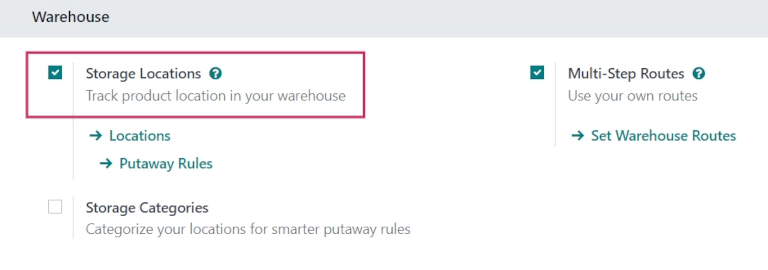
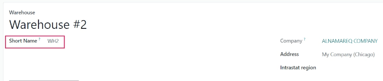
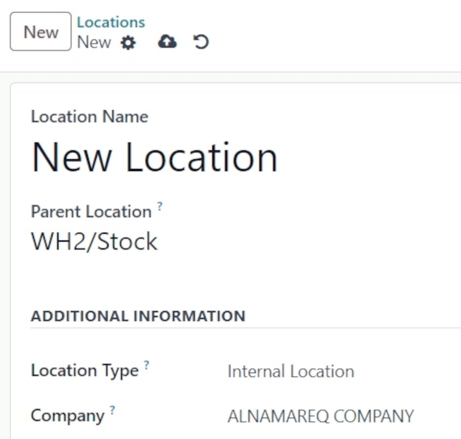

===============================
Manage warehouses and locations
===============================

Terminology
===========

Warehouse
---------

In Odoo *Inventory*, a *warehouse* is a physical building or space where items are stored. By
default, each Odoo database has one warehouse already pre-configured, with the address set as the
company's address.

Multiple warehouses can be set up in Odoo, and stock moves can be created between warehouses.

.. _inventory/warehouses_storage/difference-warehouse-location:

Location
--------

In Odoo *Inventory*, a *location* is a specific space within a warehouse. This can be a shelf, room,
aisle, rack, bin, etc. Locations allow for the storage of products in designated areas of the
warehouse, to help track inventory accurately.

A location is only part of *one* warehouse, and can **not** be linked to multiple warehouses. As
many locations can be configured as needed under one warehouse.

There are three types of locations in Odoo *Inventory*:

- **Physical Locations**: internal locations within a single warehouse owned by the company. This
  can include shipping and loading docks, aisles, shelves, storage areas, and more.
- **Partner Locations**: external locations, such as designated spaces in a customer or vendor's
  warehouse. They are similar to physical locations, but they are **not** owned by the user's
  company.
- **Virtual Locations**: this type of location does not exist as a physical space, but products can
  be "stored" here when they are not physically in an inventory yet. *Inventory Loss* and
  *Procurements* are examples of virtual locations, for products that are lost or in transit to the
  warehouse.

Every location within a warehouse can serve as a parent location, and every parent location can have
multiple locations within it, allowing for the creation of a hierarchical structure. This allows for
more detailed levels of analysis of the stock operations and the organization of the warehouses.

Configuration
=============

For companies with one warehouse, no additional settings are required to activate before editing the
warehouse.

For companies with multiple warehouses, and to create locations within a warehouse, the *Storage
Locations* feature must be enabled.

To do so, navigate to :menuselection:`Inventory app --> Configuration --> Settings`, and scroll down
to the :guilabel:`Warehouse` section. Tick the :guilabel:`Storage Locations` checkbox to enable the
feature, and click :guilabel:`Save`.

.. tip::
   To manage warehouse *routes*, such as two-and-three-step receipts and deliveries, enable the
   *Multi-Step Routes* feature from the *Inventory* app settings, as well. For more on routes, see
   :doc:`use_routes`.

Create a new warehouse
======================

To create a new warehouse, navigate to :menuselection:`Inventory app --> Configuration -->
Warehouses`, and click :guilabel:`New`. Doing so opens a blank warehouse creation form.

Begin by assigning a :guilabel:`Warehouse Name`, and a :guilabel:`Short Name`. The :guilabel:`Short
Name` field is limited to a **five** character maximum.

.. important::
   The :guilabel:`Short Name` appears on transfer orders and other warehouse documents. Odoo
   recommends using an understandable one like `WH/[first letters of location]`.

   For example, a warehouse named `Warehouse #2` might have the :guilabel:`Short Name` `WH2` (the
   short name for the default warehouse in Odoo is `WH`).

Once the warehouse is created, navigate back to the :menuselection:`Inventory` dashboard. New
operations for the newly created warehouse are automatically generated there.

For more on creating new warehouses, see :doc:`create_a_second_warehouse`.

.. image:: warehouses_locations/warehouses-locations-new-wh-operations.png
   :align: center
   :alt: Inventory app dashboard displaying new transfers for the new warehouse.

.. note::
   Creating a second warehouse without first enabling the *Storage Locations* feature triggers a
   :guilabel:`Warning` pop-up window. It indicates creating a second warehouse automatically
   activates the *Storage Locations* setting.

Create a new location
=====================

To create a new location inside a warehouse, navigate to :menuselection:`Inventory app -->
Configuration --> Locations`. Doing so opens a list of all existing locations. Click :guilabel:`New`
to open a new location creation form.

In the :guilabel:`Location Name` field, assign a name for the new location. In the :guilabel:`Parent
Location` field, assign the location that this new location exists in.

For more on locations, see :doc:`use_locations`.

