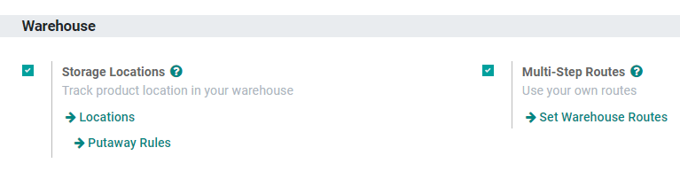
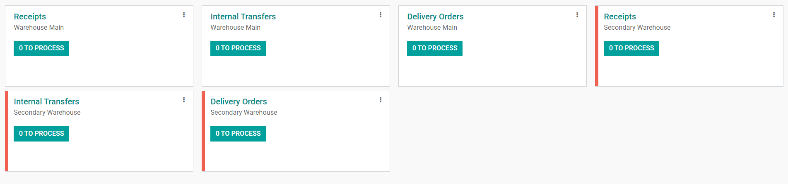

===============================
Manage Warehouses and Locations
===============================

Terminology
===========

Warehouse
---------

In Odoo, a *warehouse* is the actual building/place in which a company's items are stocked. Multiple
warehouses can be set up in Odoo and the user can create moves between warehouses.

.. _inventory/warehouses_storage/difference-warehouse-location:

Location
--------

A **Location** is a specific space within the warehouse. It can be a sublocation of the warehouse
(a shelf, a floor, an aisle, and so on). Therefore, a location is part of one warehouse only and it
is not possible to link one location to multiple warehouses. In Odoo, as many locations can be
configured as needed under one warehouse.

There are three types of locations:

- The **Physical Locations** are internal locations that are part of the warehouses that the
  company owns. They can be the loading and unloading areas of the warehouse, a shelf, a department,
  etc.

- The **Partner Locations** are spaces within a customer and/or vendor's warehouse. They work the
  same way as physical locations, with the only difference being that they are not owned by the
  user's company.

- The **Virtual Locations** are places that do not exist, but in which products can be placed when
  they are not physically in an inventory yet (or anymore). They come in handy when recording lost
  products (**Inventory Loss**), or accounting for products that are on their way to the warehouse
  (**Procurements**).

In Odoo, locations are structured hierarchically. Locations can be structured as a tree, dependent
on a parent-child relationship. This gives more detailed levels of analysis of the stock operations
and the organization of the warehouses.

Configuration
=============

To activate locations, go to :menuselection:`Configuration --> Settings` and enable
:guilabel:`Storage Locations`. Then, click :guilabel:`Save`.

.. important::
   To manage several routes within the warehouses, also enable :guilabel:`Multi-Step Routes` and
   check :doc:`/applications/inventory_and_mrp/inventory/warehouses_storage/inventory_management/use_routes`.

Create a new warehouse
======================

To create a warehouse, go to :menuselection:`Configuration --> Warehouse Management --> Warehouses`
and click on :guilabel:`Create`.

Then, fill out a :guilabel:`Warehouse Name` and a :guilabel:`Short Name`. The short name is five
characters maximum.

.. image:: warehouses_locations/create-new-warehouse.png
   :align: center
   :alt: Short name field of a warehouse on Odoo Inventory.

.. important::
   The :guilabel:`Short Name` appears on transfer orders and other warehouse documents. Odoo
   recommends using an understandable one like "WH/[first letters of location]".

Now, go back to the :guilabel:`Inventory` dashboard. There, new operations related to the newly
created warehouse have been automatically generated.

.. note::
   Adding a second warehouse will automatically activate the :guilabel:`Locations` setting.

Create a new location
=====================

To create a location, go to :menuselection:`Configuration --> Warehouse Management --> Locations`
and click on :guilabel:`Create`.

Then, fill out a :guilabel:`Location Name` and a :guilabel:`Parent Location` and click
:guilabel:`Save`.

.. image:: warehouses_locations/create-new-location.png
   :align: center
   :alt: Create a new warehouse location in Odoo Inventory.
