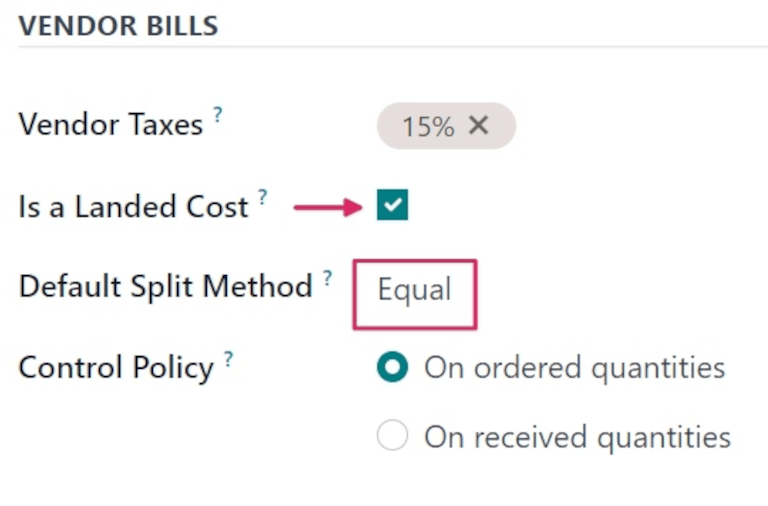
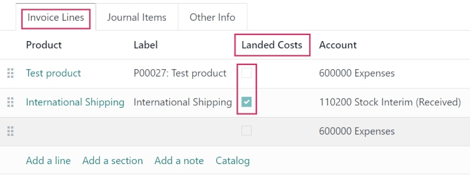
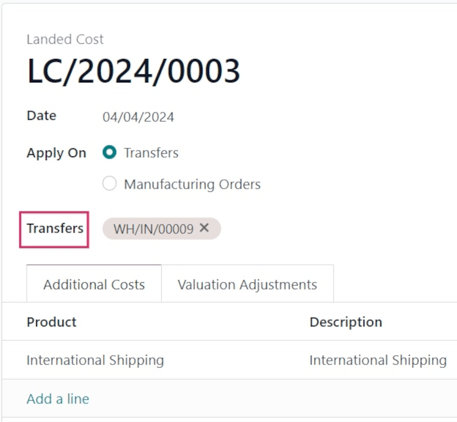

============
Landed costs
============

.. _inventory/reporting/landed_costs:

.. |RfQ| replace:: :abbr:`RfQ (Request for Quotation)`
.. |PO| replace:: :abbr:`PO (Purchase Order)`
.. |FIFO| replace:: :abbr:`FIFO (First In First Out)`
.. |AVCO| replace:: :abbr:`AVCO (Average Costing)`

When shipping products to customers, the landed cost is the total price of a product or shipment,
including all expenses associated with shipping the product.

In Odoo, the *Landed Costs* feature is used to take additional costs into account when calculating
the valuation of a product. This includes the cost of shipment, insurance, customs duties, taxes,
and other fees.

Configuration
=============

To add landed costs to products, the *Landed Costs* feature must first be enabled. To enable this
feature, navigate to :menuselection:`Inventory app --> Configuration --> Settings`, and scroll to
the :guilabel:`Valuation` section.

Tick the checkbox next to the :guilabel:`Landed Costs` option, and click :guilabel:`Save` to save
changes.

Once the page refreshes, a new :guilabel:`Default Journal` field appears below the :guilabel:`Landed
Costs` feature in the :guilabel:`Valuation` section.

Click the :guilabel:`Default Journal` drop-down menu to reveal a list of accounting journals. Select
a journal for which all accounting entries related to landed costs should be recorded.

.. image:: integrating_landed_costs/integrating-landed-costs-enabled-setting.png
   :align: center
   :alt: Landed Costs feature and resulting Default Journal field in the Inventory settings.

Create landed cost product
==========================

For charges that are consistently added as landed costs, a landed cost product can be created in
Odoo. This way, a landed cost product can be quickly added to a vendor bill as an invoice line,
instead of having to be manually entered every time a new vendor bill is created.

To do this, create a new product by going to :menuselection:`Inventory app --> Products -->
Products`, and clicking :guilabel:`New`.

Assign a name to the landed cost product in the :guilabel:`Product Name` field (i.e. `International
Shipping`). In the :guilabel:`Product Type` field, click the drop-down menu, and select
:guilabel:`Service` as the :guilabel:`Product Type`.

.. important::
   Landed cost products **must** have their :guilabel:`Product Type` set to :guilabel:`Service`.

Click the :guilabel:`Purchase` tab, and tick the checkbox next to :guilabel:`Is a Landed Cost` in
the :guilabel:`Vendor Bills` section. Once ticked, a new :guilabel:`Default Split Method` field
appears below it, prompting a selection. Clicking that drop-down menu reveals the following options:

- :guilabel:`Equal`: splits the cost equally across each product included in the receipt, regardless
  of the quantity of each.
- :guilabel:`By Quantity`: splits the cost across each unit of all products in the receipt.
- :guilabel:`By Current Cost`: splits the cost according to the cost of each product unit, so a
  product with a higher cost receives a greater share of the landed cost.
- :guilabel:`By Weight`: splits the cost, according to the weight of the products in the receipt.
- :guilabel:`By Volume`: splits the cost, according to the volume of the products in the receipt.

When creating new vendor bills, this product can be added as an invoice line as a landed cost.

.. important::
   To apply a landed cost on a vendor bill, the products included in the original |PO| **must**
   belong to a *Product Category* with its *Force Removal Strategy* set to |FIFO|. The *Costing
   Method* can be set to either |AVCO| or |FIFO|, and the valuation method can be :doc:`manual
   <using_inventory_valuation>` or :doc:`automatic <inventory_valuation_config>`.

Create purchase order
=====================

Navigate to :menuselection:`Purchase app --> New` to create a new request for quotation (RfQ). In
the :guilabel:`Vendor` field, add a vendor to order products from. Then, click :guilabel:`Add a
product`, under the :guilabel:`Products` tab, to add products to the |RfQ|.

Once ready, click :guilabel:`Confirm Order` to confirm the order. Then, click :guilabel:`Receive
Products` once the products have been received, followed by :guilabel:`Validate`.

Create vendor bill
------------------

Once the vendor fulfills the |PO| and sends a bill, a vendor bill can be created from the |PO| in
Odoo.

Navigate to the :menuselection:`Purchase app`, and click into the |PO| for which a vendor bill
should be created. Then, click :guilabel:`Create Bill`. This opens a new :guilabel:`Vendor Bill` in
the :guilabel:`Draft` stage.

In the :guilabel:`Bill Date` field, click the line to open a calendar popover menu, and select the
date on which this draft bill should be billed.

Then, under the :guilabel:`Invoice Lines` tab, click :guilabel:`Add a line`, and click the drop-down
menu in the :guilabel:`Product` column to select the previously-created landed cost product. Click
the :icon:`fa-cloud-upload` :guilabel:`(cloud with arrow)` icon to manually save and update the
draft bill.

In the :guilabel:`Landed Costs` column, the product ordered from the vendor does **not** have its
checkbox ticked, while the landed cost product's checkbox **is** ticked. This differentiates landed
costs from all other costs displayed on the bill.

Additionally, at the top of the form, a :guilabel:`Create Landed Costs` button appears.

.. image:: integrating_landed_costs/integrating-landed-costs-create-button.png
   :align: center
   :alt: Create Landed Costs button on vendor bill.

Add landed cost
===============

Once a landed cost is added to the vendor bill, click :guilabel:`Create Landed Costs` at the top of
the vendor bill.

Doing so automatically creates a landed cost record, with a set landed cost pre-filled in the
product line in the :guilabel:`Additional Costs` tab.

From the :guilabel:`Landed Cost` form, click the :guilabel:`Transfers` drop-down menu, and select
which transfer the landed cost belongs to.

.. tip::
   In addition to creating landed costs directly from a vendor bill, landed cost records can *also*
   be created by navigating to :menuselection:`Inventory app --> Operations --> Landed Costs`, and
   clicking :guilabel:`New`.

After setting the picking from the :guilabel:`Transfers` drop-down menu, click :guilabel:`Compute`
(at the bottom of the form, under the :guilabel:`Total:` cost).

Click the :guilabel:`Valuation Adjustments` tab to see the impact of the landed costs. The
:guilabel:`Original Value` column lists the original price of the |PO|, the :guilabel:`Additional
Landed Cost` column displays the landed cost, and the :guilabel:`New Value` displays the sum of the
two, for the total cost of the |PO|.

Once ready, click :guilabel:`Validate` to post the landed cost entry to the accounting journal.

This causes a :guilabel:`Valuation` smart button to appear at the top of the form. Click the
:guilabel:`Valuation` smart button to open a :guilabel:`Stock Valuation` page, with the product's
updated valuation listed.

.. note::
   For a :guilabel:`Valuation` smart button to appear upon validation, the product's
   :guilabel:`Product Type` **must** be set to :guilabel:`Storable`.

To view the valuation of *every* product, including landed costs, navigate to
:menuselection:`Inventory app --> Reporting --> Valuation`.

.. note::
   Each journal entry created for a landed cost on a vendor bill can be viewed in the *Accounting*
   app.

   To locate these journal entries, navigate to :menuselection:`Accounting app --> Accounting -->
   Journal Entries`, and locate the correct entry, by number (i.e. `PBNK1/2024/XXXXX`).

   Click into the journal entry to view the :guilabel:`Journal Items`, and other information about
   the entry.

   .. image:: integrating_landed_costs/integrating-landed-costs-journal-entry.png
      :align: center
      :alt: Journal Entry form for landed cost created from vendor bill.
