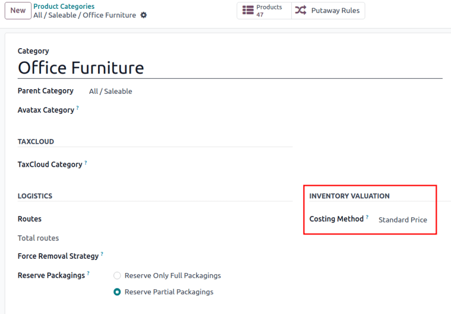
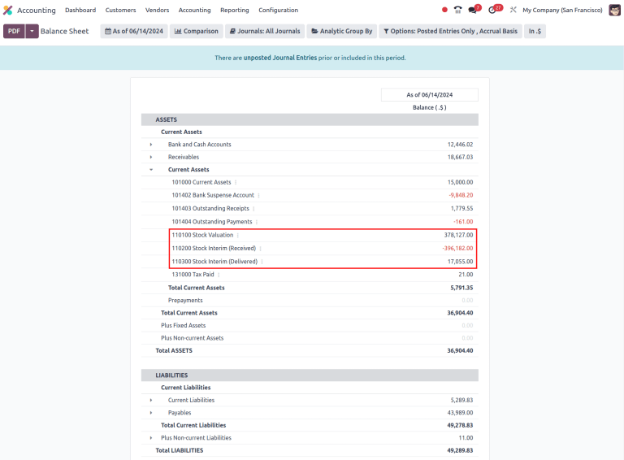

=============================
Automatic inventory valuation
=============================

.. |right arrow| replace:: :icon:`fa-arrow-right` :guilabel:`(right arrow)`

All of a company's stock on-hand contributes to the valuation of its inventory. That value should
be reflected in the company's accounting records to accurately show the value of the company and
all of its assets.

By default, Odoo uses a periodic inventory valuation (also known as manual inventory valuation).
This method implies that the accounting team manually posts journal entries, based on the physical
inventory of the company, and warehouse employees take the time to count the stock. In Odoo, each
product category reflects this, with the :guilabel:`Costing Method` set to :guilabel:`Standard
Price`, and the :guilabel:`Inventory Valuation` (not visible by default) set to :guilabel:`Manual`.

Alternatively, perpetual (automatic) inventory valuation creates real-time *journal entries* in the
*Accounting* app whenever stock enters or leaves the company's warehouse.

This document is focused on the proper setup of automatic inventory valuation, which is an
integrated valuation method that ensures journal entries in the *Accounting* app match stock
valuation updates in the *Inventory* app. For an introduction of inventory valuation in Odoo, refer
to the :doc:`using_inventory_valuation` documentation.

.. warning::
   Switching from manual to automatic inventory valuation may cause discrepancies between stock
   valuation and accounting journals.

   One `successful strategy <https://www.odoo.com/r/Kvfg>`_ for switching to automated valuation:

   #. Clear existing stock (possibly with an :doc:`inventory adjustment
      <../inventory_management/count_products>`)
   #. Change the inventory valuation method to *Automatic*
   #. Return the existing stock, with the original monetary value (using an inventory adjustment)

   Once the existing stock is recovered, the Odoo *Accounting* app automatically generates the
   journal entries to corresponding stock valuation records.

Configuration
=============

To properly set up automatic inventory valuation, follow these steps in Odoo:

#. :ref:`Install Accounting app and enable specific settings
   <inventory/warehouses_storage/accounting-setup>`
#. :ref:`Set Automatic inventory valuation on product categories
   <inventory/warehouses_storage/valuation-on-product-category>`
#. :ref:`Set costing method <inventory/warehouses_storage/costing_methods>`

.. _inventory/warehouses_storage/accounting-setup:

Accounting setup
----------------

To use automatic inventory valuation, install the *Accounting* app. Next, go to
:menuselection:`Accounting app --> Configuration --> Settings`, and in the :guilabel:`Stock
Valuation` section, tick the :guilabel:`Automatic Accounting` checkbox. Then, click
:guilabel:`Save`.

.. note::
   Enabling :guilabel:`Automatic Accounting` shows the previously invisible *Inventory Valuation*
   field on a product category.

.. image:: inventory_valuation_config/auto-accounting.png
   :align: center
   :alt: Automatic Accounting feature in Stock Valuation section of Settings page.

Refer to the :ref:`Expense <inventory/warehouses_storage/expense-account>` and :ref:`Stock
input/output <inventory/warehouses_storage/stock-account>` sections of documentation for details on
configuring the accounting journals shown.

.. _inventory/warehouses_storage/valuation-on-product-category:

Product category setup
----------------------

After :ref:`enabling inventory valuation <inventory/warehouses_storage/accounting-setup>`, the next
step is to set the product category to use automatic inventory valuation.

Go to :menuselection:`Inventory app --> Configuration --> Product Categories`, and select the
desired product category. In the :guilabel:`Inventory Valuation` section, set the
:guilabel:`Inventory Valuation` field to :guilabel:`Automated`. Repeat this step for every product
category intending to use automatic inventory valuation.

.. note::
   After enabling automatic accounting, each new stock move layer (SVL), that is created during
   inventory valuation updates, generates a journal entry.

.. image:: inventory_valuation_config/automated-inventory-valuation.png
   :align: center
   :alt: Inventory Valuation field on the product category, with its various stock accounts.

.. _inventory/warehouses_storage/costing_methods:

Costing method
==============

After :ref:`enabling inventory valuation <inventory/warehouses_storage/accounting-setup>`, the
*costing method* for calculating and recording inventory costs is defined on the product category in
Odoo.

Go to :menuselection:`Inventory app --> Configuration --> Product Categories` and select the desired
product category. In the :guilabel:`Inventory Valuation` section, select the appropriate
:guilabel:`Costing Method`:

- :guilabel:`Standard Price`: the default costing method in Odoo. The cost of the product is
  manually defined on the product form, and this cost is used to compute the valuation. Even if the
  purchase price on a purchase order differs, the valuation will still use the cost defined on the
  product form.
- :guilabel:`Average Cost (AVCO)`: calculates the valuation of a product based on the average cost
  of that product, divided by the total number of available stock on-hand. With this costing method,
  inventory valuation is *dynamic*, and constantly adjusts based on the purchase price of products.

  .. note::
     When choosing :guilabel:`Average Cost (AVCO)` as the :guilabel:`Costing Method`, changing the
     numerical value in the :guilabel:`Cost` field for products in the respective product category
     creates a new record in the *Inventory Valuation* report to adjust the value of the product.
     The :guilabel:`Cost` amount will then automatically update based on the average purchase price
     both of inventory on hand and the costs accumulated from validated purchase orders.

- :guilabel:`First In First Out (FIFO)`: tracks the costs of incoming and outgoing items in
  real-time and uses the real price of the products to change the valuation. The oldest purchase
  price is used as the cost for the next good sold until an entire lot of that product is sold. When
  the next inventory lot moves up in the queue, an updated product cost is used based on the
  valuation of that specific lot. This method is arguably the most accurate inventory valuation
  method for a variety of reasons, however, it is highly sensitive to input data and human error.

.. warning::
   Changing the costing method greatly impacts inventory valuation. It is highly recommended to
   consult an accountant first before making any adjustments here.

.. seealso::
   :doc:`using_inventory_valuation`

When the :guilabel:`Costing Method` is changed, products already in stock that were using the
:guilabel:`Standard` costing method **do not** change value; rather, the existing units keep their
value, and any product moves from then on affect the average cost, and the cost of the product will
change. If the value in the :guilabel:`Cost` field on a product form is changed manually, Odoo
generates a corresponding record in the *Inventory Valuation* report.

.. note::
   It is possible to use different valuation settings for different product categories.

.. _inventory/warehouses_storage/accounting-types:

Types of accounting
===================

With automated inventory valuation set up, the generated journal entries depend on the chosen
accounting mode: *Continental* or *Anglo-Saxon*.

.. tip::
   Verify the accounting mode by activating the :ref:`developer-mode`, and navigating to
   :menuselection:`Accounting app --> Configuration --> Settings`.

   Then, in the :guilabel:`Search...` bar, look for `Anglo-Saxon Accounting`, to see if the feature
   is enabled. If it is **not** enabled, *Continental* accounting mode is in use.

   .. image:: inventory_valuation_config/anglo-saxon.png
      :align: center
      :alt: Show the Anglo-Saxon accounting mode feature.

In *Anglo-Saxon* accounting, the costs of goods sold (COGS) are reported when products are sold or
delivered. This means the cost of a good is only recorded as an expense when a customer is invoiced
for a product.

So, for **manual** valuation method, set the *Expense Account* to *Stock Valuation* for the current
asset type; for **automatic** valuation method, set the *Expense Account* to an *Expenses* or a
*Cost of Revenue* type (e.g. *Cost of Production*, *Cost of Goods Sold*, etc.).

In *Continental* accounting, the cost of a good is reported as soon as a product is received into
stock. Because of this, the *Expense Account* can be set to **either** *Expenses* or a *Cost of
Revenue* type, however, it is more commonly set to an *Expenses* account.

Refer to the :ref:`Expense <inventory/warehouses_storage/expense-account>` and :ref:`Stock
input/output <inventory/warehouses_storage/stock-account>` sections for details on configuring each
account type.

.. _inventory/warehouses_storage/expense-account:

Expense account
---------------

To configure the *expense account*, which is used in both manual and automatic inventory valuation,
go to the :guilabel:`Account Properties` section of the intended product category
(:menuselection:`Inventory app --> Configuration --> Product Categories`). Then, choose an existing
account from the :guilabel:`Expense Account` drop-down menu.

To ensure the chosen account is the correct :guilabel:`Type,` click the |right arrow| icon to the
right of the account. Then, set the account type based on the information below.

.. tabs::

   .. group-tab:: Anglo-Saxon

      .. tabs::

         .. group-tab:: Automated

            In Anglo-Saxon accounting for automated inventory valuation, set the :guilabel:`Expense
            Account` to the `Expenses` account. Then, click the |right arrow| icon to the right of
            the account.

            In the pop-up window, choose :guilabel:`Expenses` or :guilabel:`Cost of Revenue` from
            the :guilabel:`Type` drop-down menu.

            .. image:: inventory_valuation_config/external-link.png
               :align: center
               :alt: Show **Expense Account** field, and external link icon.

         .. group-tab:: Manual

            To configure the :guilabel:`Expense Account`, choose :guilabel:`Stock Valuation` from
            the field's drop-down menu. Verify the account's type by clicking the |right arrow|
            icon, and then ensure the :guilabel:`Type` is :guilabel:`Current Assets`.

            .. image:: inventory_valuation_config/manual-anglo-saxon-expense.png
               :align: center
               :alt: Show the **Expense Account** field.

   .. group-tab:: Continental

      .. tabs::

         .. group-tab:: Automated

            Set the :guilabel:`Expense Account` to the :guilabel:`Expenses` or :guilabel:`Cost of
            Revenue` account type.

         .. group-tab:: Manual

            Set the :guilabel:`Expense Account` to the :guilabel:`Expenses` or :guilabel:`Cost of
            Revenue` account type.

.. _inventory/warehouses_storage/stock-account:

Stock input/output (automated only)
~~~~~~~~~~~~~~~~~~~~~~~~~~~~~~~~~~~

To configure the :guilabel:`Stock Input Account` and :guilabel:`Stock Output Account`, go to
:menuselection:`Inventory app --> Configuration --> Product Categories` and select the desired
product category.

In the :guilabel:`Inventory Valuation` field, select :guilabel:`Automated`. Doing so makes the
:guilabel:`Account Stock Properties` section appear. These accounts are defined as follows:

- :guilabel:`Stock Valuation Account`: when automated inventory valuation is enabled on a product,
  this account will hold the current value of the products.
- :guilabel:`Stock Journal`: accounting journal where entries are automatically posted when a
  product's inventory valuation changes.
- :guilabel:`Stock Input Account`: counterpart journal items for all incoming stock moves will be
  posted in this account, unless there is a specific valuation account set on the source location.
  This is the default value for all products in a given category, and can also be set directly on
  each product.
- :guilabel:`Stock Output Account`: counterpart journal items for all outgoing stock moves will be
  posted in this account, unless there is a specific valuation account set on the destination
  location. This is the default value for all products in a given category, and can also be set
  directly on each product.

.. tabs::

   .. group-tab:: Anglo-Saxon

      In Anglo-Saxon accounting, the :guilabel:`Stock Input Account` and :guilabel:`Stock Output
      Account` are set to *different* :guilabel:`Current Assets` accounts. This way, delivering
      products and invoicing the customer balance the *Stock Output* account, while receiving
      products and billing vendors balance the *Stock Input* account.

      To modify the account type, go to the click the |right arrow| icon to the right of the stock
      input/output account. In the pop-up window, choose :guilabel:`Current Assets` from the
      :guilabel:`Type` drop-down menu.

      .. figure:: inventory_valuation_config/account-type.png
         :align: center
         :alt: Display account setup page, highlighting the **Type** field.

         The *Stock Input* account is set to `Stock Interim (Received)`, a *Current Asset* account
         type.

   .. group-tab:: Continental

      In Continental accounting, the :guilabel:`Stock Input Account` and :guilabel:`Stock Output
      Account` are set to **the same** :guilabel:`Current Assets` account. That way, one account can
      be balanced when items are bought and sold.

      .. example::
         The stock input and output accounts are both set to `Stock Interim (Received)`, a
         :guilabel:`Current Assets` account type. They can also be set to the `Stock Interim
         (Delivered)`, as long as the input and output accounts are assigned to the **same**
         account.

         .. image:: inventory_valuation_config/continental-stock-account.png
            :align: center
            :alt: Show the Stock Input and Output accounts.

Inventory valuation reporting
=============================

To start, go to :menuselection:`Accounting app --> Reporting --> Balance Sheet`. Click the
:guilabel:`Current Assets` line item to unfold the drop-down menu, and look for the nested
:guilabel:`Stock Valuation`, :guilabel:`Stock Interim (Received)`, and :guilabel:`Stock Interim
(Delivered)` lines.

.. tip::
   At the top of the dashboard, click the :guilabel:`As of [date]` button to display accounting
   records up to a specified date.

.. seealso::
   - :ref:`Stock accounts and what they do <inventory/warehouses_storage/stock-account>`
   - :doc:`../../../../finance/accounting/get_started/cheat_sheet`

Access more specific information by clicking the :icon:`fa-ellipsis-v` :guilabel:`(ellipsis)` icon
to the right of the desired journal. Select :guilabel:`General Ledger` to see a list of all of the
journal entries, where each line item's :icon:`fa-ellipsis-v` :guilabel:`(ellipsis)` icon can be
clicked to reveal the :guilabel:`View Journal Entry` option to open the individualized journal
entry.

Additionally, annotations to the :guilabel:`Balance Sheet` can be added by choosing
:guilabel:`Annotate`, filling in the text box, and clicking :guilabel:`Save`.

.. image:: inventory_valuation_config/journals.png
   :align: center
   :alt: Show Stock Valuation journals in a list.
