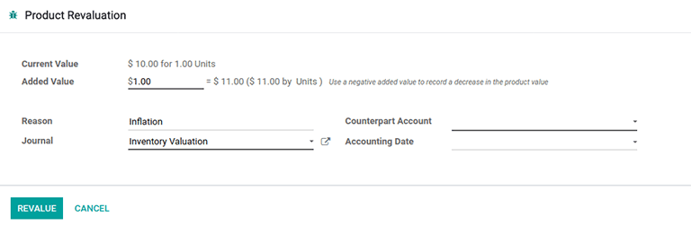

=========================
Using inventory valuation
=========================

.. _inventory/reporting/using_inventory_val:

*Inventory valuation* is a quintessential accounting procedure that calculates the value of on-hand
stock. Once determined, the inventory valuation amount is then incorporated into a company's overall
value.

In Odoo, this process can be conducted manually— by warehouse employees physically counting the
products— or automatically through the database.

Automatic inventory valuation
=============================

To use Odoo to automatically generate a trail of inventory valuation entries, first navigate to the
:menuselection:`Product Categories` list by going to :menuselection:`Inventory app --> Configuration
--> Product Categories` and select the desired product category. On the form, set the
:guilabel:`Inventory Valuation` as :guilabel:`Automated` and the :guilabel:`Costing Method` to any
of the three options.

.. seealso::
   :ref:`Set up inventory valuation <inventory/management/inventory_valuation_config>`

In order to understand how moving products in and out of stock affects the company's overall value,
consider the following product and stock moves scenario below.

Receive a product
-----------------

To track the value of incoming products, such as a simple *table*, configure the product category on
the the product itself. To get there, navigate to :menuselection:`Inventory app --> Products -->
Products` and click the desired product. On the product form, click the :guilabel:`➡️ (right arrow)`
icon beside the :guilabel:`Product Category` field, which opens an internal link to edit the product
category. Next, set the :guilabel:`Costing Method` as :guilabel:`First In First Out (FIFO)` and
:guilabel:`Inventory Valuation` as :guilabel:`Automated`.

.. tip::
   Alternatively access the :guilabel:`Product Categories` dashboard by navigating to
   :menuselection:`Inventory app --> Configuration --> Product Categories` and select the desired
   product category.

Next, assume 10 tables are purchased at a price of $10.00, each. The :abbr:`PO (Purchase Order)` for
those tables will show the subtotal of the purchase as $100, plus any additional costs or taxes.

.. image:: using_inventory_valuation/purchase-order.png
   :align: center
   :alt: Purchase order with 10 tables products valued at $10.00 each.

After selecting :guilabel:`Validate` on the :abbr:`PO (Purchase Order)`, the :guilabel:`Valuation`
smart button is enabled. Clicking on this button displays a report showing how the inventory
valuation for the table was affected by this purchase.

.. important::
   :ref:`Developer mode <developer-mode>` **must** be turned on to see the :guilabel:`Valuation`
   smart button.

.. tip::
   The :doc:`consignment </applications/inventory_and_mrp/inventory/warehouses_storage/advanced_operations_warehouse/owned_stock>`
   feature allows ownership to items in stock. Thus, products owned by other companies are not
   accounted for in the host company's inventory valuation.

.. image:: using_inventory_valuation/valuation-smart-button.png
   :align: center
   :alt: See Valuation smart button on a receipt, with Developer mode enabled.

For a comprehensive dashboard that includes the inventory valuation of all product shipments,
inventory adjustments, and warehouse operations, refer to the :ref:`stock valuation report
<inventory/management/reporting/valuation-report>`.

Deliver a product
-----------------

In the same logic, when a table is shipped to a customer and leaves the warehouse, the stock
valuation decreases. The :guilabel:`Valuation` smart button on the :abbr:`DO (Delivery Order)`,
likewise, displays the stock valuation record as it does on a :abbr:`PO (Purchase Order)`.

.. image:: using_inventory_valuation/decreased-stock-valuation.png
   :align: center
   :alt: Decreased stock valuation after a product is shipped.

.. _inventory/management/reporting/valuation-report:

Inventory valuation report
==========================

To view the current value of all products in the warehouse, first turn on :ref:`Developer mode
<developer-mode>` and navigate to :menuselection:`Inventory app --> Reporting --> Valuation`. The
:guilabel:`Stock Valuation` dashboard displays detailed records of products with the
:guilabel:`Date`, :guilabel:`Quantity`, :guilabel:`Unit Value`, and :guilabel:`Total Value` of the
inventory.

.. important::
   :ref:`Developer mode <developer-mode>` **must** be enabled to see the :guilabel:`Valuation`
   option under :guilabel:`Reporting`.

.. image:: using_inventory_valuation/inventory-valuation-products.png
   :align: center
   :alt: Inventory valuation report showing multiple products.

The :guilabel:`Valuation At Date` button, located in the top-left corner of the :guilabel:`Stock
Valuation` page, reveals a pop-up window. In this pop-up, the inventory valuation of products
available during a prior specified date can be seen and selected.

.. tip::
   View a detailed record of a product's inventory value, stock move, and on-hand stock by selecting
   the teal :guilabel:`➡️ (right arrow)` button to the right of the :guilabel:`Reference` column
   value.

Update product unit price
-------------------------

For any company: lead times, supply chain failures, and other risk factors can contribute to
invisible costs. Although Odoo attempts to accurately represent the stock value, *manual valuation*
serves as an additional tool to update the unit price of products.

.. important::
   Manual valuation is intended for products that can be purchased and received for a cost greater
   than 0, or have product categories set with :guilabel:`Costing Method` set as either
   :guilabel:`Average Cost (AVCO)` or :guilabel:`First In First Out (FIFO)`.

.. image:: using_inventory_valuation/add-manual-valuation.png
   :align: center
   :alt: Add manual valuation of stock value to a product.

Create manual valuation entries on the :guilabel:`Stock Valuation` dashboard by first navigating to
:menuselection:`Inventory app --> Reporting --> Valuation`. Next, to enable the *product
revaluation* feature, select :menuselection:`Group by --> Product` to organize all the records by
product. Click on the gray :guilabel:`▶️ (drop-down triangle)` icon to reveal stock valuation line
items below, as well as a teal :guilabel:`➕ (plus)` button on the right.

Click the teal :guilabel:`+ (plus)` button to open up the :guilabel:`Product Revaluation` form.
Here, the inventory valuation for a product can be recalculated, by increasing or decreasing the
unit price of each product.

.. note::
   The :guilabel:`▶️ (drop-down triangle)` and :guilabel:`➕ (plus)` buttons are only visible after
   grouping entries by product.

Inventory valuation journal entries
-----------------------------------

In Odoo, automatic inventory valuation records are also recorded in the :menuselection:`Accounting
app --> Accounting --> Journal Entries` dashboard. On this comprehensive list of accounting entries,
inventory valuation records are identified by checking values in the :guilabel:`Journal` column, or
looking for the :guilabel:`Reference` column value which matches the warehouse operation reference
(e.g. `WH/IN/00014` for receipts).

Clicking on an inventory valuation journal entry opens a *double-entry accounting* record. These
records are generated by Odoo to track the change of value in inventory valuation as products are
moved in and out of the warehouse.

.. example::
   To view the inventory valuation of 10 *tables*, costing $10.00 each, upon reception from the
   vendor, go to the :menuselection:`Journal Entries` page found in :menuselection:`Accounting app
   --> Accounting --> Journal Entries`. Here, click the journal line where the :guilabel:`Reference`
   column value matches the reference on the receipt, `WH/IN/00014`.

   .. image:: using_inventory_valuation/stock-valuation-product.png
      :align: center
      :alt: Stock valuation page depicting the products within a shipment.

   `Stock interim` is a holding account for money intended to pay vendors for the product. The
   `stock valuation` account stores the value of all on-hand stock.

   .. image:: using_inventory_valuation/inventory-valuation-entry.png
      :align: center
      :alt: Accounting entry for the inventory valuation of 10 tables.

.. seealso::
   `Odoo Tutorial: Inventory Valuation <https://www.odoo.com/slides/slide/2795/share>`_
