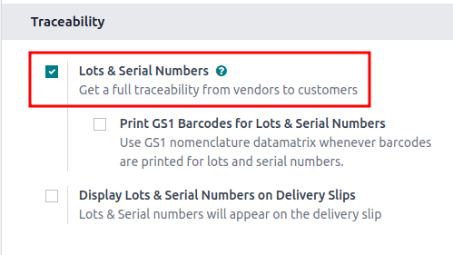

:show-content:
:hide-page-toc:

==================
Removal strategies
==================

For companies with warehouses, *removal strategies* determine **which** products are taken from the
warehouse, and **when**. For example, for perishable products, prioritizing the picking of goods
with the nearest expiration date helps minimize food spoilage.

The following columns in the table below list the removal strategies available in Odoo, and detail
how pickings are determined along with the picking order. Leverage these removal strategies to have
Odoo automatically select how products are selected for orders:

.. list-table::
   :header-rows: 1
   :stub-columns: 1

   * -
     - :doc:`FIFO <removal_strategies/fifo>`
     - :doc:`LIFO <removal_strategies/lifo>`
     - :doc:`FEFO <removal_strategies/fefo>`
     - :doc:`Closest Location <removal_strategies/closest_location>`
     - :doc:`Least Packages <removal_strategies/least_packages>`
   * - Based on
     - :ref:`Incoming date <inventory/warehouses_storage/arrival_date>`
     - :ref:`Incoming date <inventory/warehouses_storage/arrival_date>`
     - :ref:`Removal date <inventory/warehouses_storage/removal-date>`
     - :ref:`Location sequence <inventory/warehouses_storage/sequence>`
     - :ref:`Package quantity <inventory/warehouses_storage/pkg-qty>`
   * - Selection order
     - First in
     - Last in
     - :ref:`First to expire <inventory/warehouses_storage/exp-date>`
     - :ref:`Alphanumeric name of location <inventory/warehouses_storage/location-name>`
     - Quantity closest to fulfilling demand

For comprehensive examples for how to use each removal strategy, refer to each individual
documentation page.

.. _inventory/warehouses_storage/removal-config:

Configuration
=============

Removal strategies are set on either the product category or storage location.

.. image:: removal_strategies/removal/navigate-location-category.png
   :align: center
   :alt: Change the Force Removal Strategy for either the Product Categories or Locations.

Configure removal strategies on the location by going to :menuselection:`Inventory --> Configuration
--> Locations`, and selecting the desired location. On the location form, choose a removal strategy
from the :guilabel:`Removal Strategy` field's drop-down menu options.

.. important::
   To set a removal strategy on a location, the :guilabel:`Storage Locations` and
   :guilabel:`Multi-Step Routes` settings **must** be enabled in :menuselection:`Inventory -->
   Configuration --> Settings`.

   These features are **only** necessary when setting the removal strategy on a location.

Configure removal strategies on product categories by going to :menuselection:`Inventory -->
Configuration --> Product Categories` and selecting the intended product category. Next, choose a
removal strategy from the :guilabel:`Force Removal Strategy` drop-down menu options.

.. important::
   When there are different removal strategies applied on both the location and product category for
   a product, the value set on the :guilabel:`Force Removal Strategy` field set on a
   :guilabel:`Product Category` form is applied as top priority.

Required features
=================

While some removal strategies are available by default, some additional features **must** be enabled
in :menuselection:`Inventory --> Configuration --> Settings` for the removal strategy option to
appear in the drop-down menu of the :guilabel:`Force Removal Strategy` or :guilabel:`Removal
Strategy` field.

Refer to the table below for a summary of required features. Otherwise, refer to the dedicated
sections for the removal strategy for more details on requirements and usage.

.. list-table::
   :header-rows: 1
   :stub-columns: 1

   * -
     - FIFO
     - LIFO
     - FEFO
     - Closest Location
     - Least Packages
   * - Required features
     - Lots & Serial Numbers
     - Lots & Serial Numbers
     - Lots & Serial Numbers, Expiration Date
     - Storage Locations, Multi-Step Routes
     - Packages

.. _inventory/warehouses_storage/lots-setup:

Lots and serial numbers
-----------------------

Lots and serial numbers differentiate identical products and track information like arrival or
expiration dates. To enable this feature, navigate to :menuselection:`Inventory --> Configuration
--> Settings`. Under the :guilabel:`Traceability` heading, check the box beside :guilabel:`Lots &
Serial Numbers` to enable the feature.

Next, ensure the intended product is tracked by lots or serial numbers by navigating to the product
form through :menuselection:`Inventory --> Products --> Products`, and selecting the desired
product. On the product form, switch to the :guilabel:`Inventory` tab, and under the
:guilabel:`Tracking` field, select either the :guilabel:`By Unique Serial Number` or :guilabel:`By
Lots` options.

After enabling the features, assign lot or serial numbers to products using an :doc:`inventory
adjustment <inventory_management/count_products>` or during :ref:`product reception
<inventory/product_management/receipt-lots>`.

Locations and routes
--------------------

**Storage locations** and **multi-step routes** are necessary features for setting **all** types of
removal strategies on a location. However, these features are specifically required for the closest
location removal strategy since it is only applied at the location level.

To activate these features, navigate to :menuselection:`Inventory --> Configuration --> Settings`.
Under the :guilabel:`Warehouse` heading, enable the :guilabel:`Storage Location` and
:guilabel:`Multi-Step Routes` features.

.. image:: removal_strategies/removal/enable-location.png
   :align: center
   :alt: Enable the locations and route features.

.. _inventory/warehouses_storage/exp-setup:

Expiration date
---------------

Enable the **expiration date** feature to track expiration dates, best before dates, removal dates,
and alert dates on a lot or serial number by navigating to :menuselection:`Inventory -->
Configuration --> Settings`.

Under the :guilabel:`Traceability` heading, ensure the :guilabel:`Lots & Serial Numbers` feature is
selected, and then select the check box for :guilabel:`Expiration Dates` to enable the feature.

.. image:: removal_strategies/removal/enable-expiration.png
   :align: center
   :alt: Enable expiration dates feature for FEFO.

.. _inventory/warehouses_storage/pack-setup:

Packages
--------

The *packages* feature is used to group products together and is required for the least packages
removal strategy.

Navigate to :menuselection:`Inventory --> Configuration --> Settings` and select the check box for
the :guilabel:`Packages` feature.

.. image:: removal_strategies/removal/enable-pack.png
   :align: center
   :alt: Enable the packages feature.

.. seealso::
   - :ref:`Packages <inventory/management/packages>`
   - :doc:`2-step delivery <../shipping_receiving/daily_operations/receipts_delivery_two_steps>`
   - :doc:`3-step delivery <../shipping_receiving/daily_operations/delivery_three_steps>`

.. toctree::
   :titlesonly:

   removal_strategies/fifo
   removal_strategies/lifo
   removal_strategies/fefo
   removal_strategies/closest_location
   removal_strategies/least_packages
