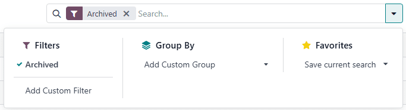
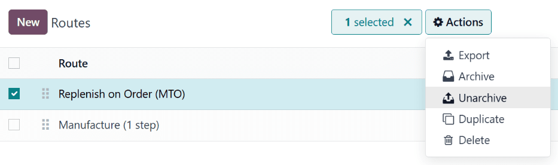
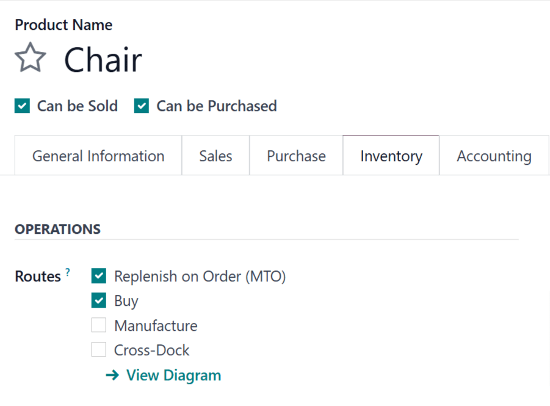
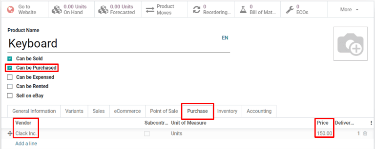

========================
Replenish on order (MTO)
========================

.. |MTO| replace:: :abbr:`MTO (make to order)`
.. |RFQ| replace:: :abbr:`RFQ (request for quotation)`
.. |BOM| replace:: :abbr:`BOM (bill of materials)`

*Replenish on order*, also known as *MTO* (make to order), is a replenishment strategy that creates
a draft order for a product every time a sales order is created for it. For products that are
purchased from a vendor, a request for quotation (RFQ) is created, while a sales order for a product
manufactured in-house triggers the creation of a manufacturing order. The creation of a |RFQ| or
manufacturing order occurs every time a sales order is created, regardless of the current stock
level of the product being ordered.

Unarchive the Replenish on Order (MTO) route
============================================

By default, Odoo sets the |MTO| route as *archived*. This is because |MTO| is a somewhat niche
workflow that is only used by certain companies. However, it is easy to unarchive the route in just
a few simple steps.

To do so, begin by navigating to :menuselection:`Inventory --> Configuration --> Routes`. On the
:guilabel:`Routes` page, click the :guilabel:`Filters` button and select the :guilabel:`Archived`
option. This shows all routes that are currently archived.

Enable the checkbox next to :guilabel:`Replenish on Order (MTO)`, then click the :guilabel:`Action`
button to reveal a drop-down menu. From the drop-down menu, select :guilabel:`Unarchive`.

Finally, remove the :guilabel:`Archived` filter from the :guilabel:`Search...` bar. The
:guilabel:`Routes` page will now show all available routes, including :guilabel:`Replenish on Order
(MTO)`, which is now selectable on the inventory tab of each product page.

.. image:: mto/unarchived-mto.png
   :align: center
   :alt: The MTO route appears on the Routes page after unarchiving it.

Configure a product to use the MTO route
========================================

With the |MTO| route unarchived, products can now be properly configured to use replenish on order.
To do so, begin by going to :menuselection:`Inventory --> Products --> Products`, then select an
existing product, or click :guilabel:`Create` to configure a new one.

On the product page, select the :guilabel:`Inventory` tab and enable the :guilabel:`Replenish on
Order (MTO)` route in the :guilabel:`Routes` section, along with one other route.

.. important::
   The :guilabel:`Replenish on Order (MTO)` route **does not** work unless another route is selected
   as well. This is because Odoo needs to know how to replenish the product when an order is placed
   for it (buy it, manufacture it, etc.).

If the product is purchased from a vendor to fulfill sales orders, enable the :guilabel:`Can be
Purchased` checkbox under the product name. Doing so makes the :guilabel:`Purchase` tab appear
alongside the other settings tabs below.

Select the :guilabel:`Purchase` tab and specify a :guilabel:`Vendor` and the :guilabel:`Price` they
sell the product for.

If the product is manufactured, make sure that it has a bill of materials (BOM) configured for it.
To do so, click the :guilabel:`Bill of Materials` smart button at the top of the screen, then click
:guilabel:`Create` on the :guilabel:`Bill of Materials` page to configure a new |BOM| for the
product.

On the blank |BOM| form, add the components used to manufacture the product on the
:guilabel:`Components` tab, along with the operations required for the manufacturing workflow on the
:guilabel:`Operations` tab.

Finally, click :guilabel:`Save` to save the |BOM|.

Fulfill a sales order using the MTO route
=========================================

After configuring a product to use the |MTO| route, a replenishment order is created for it every
time a sales order including the product is confirmed. The type of order created depends on the
second route selected in addition to |MTO|.

For example, if *Buy* was the second route selected, then a purchase order is created upon
confirmation of a sales order.

.. important::
   When the |MTO| route is enabled for a product, a replenishment order is always created upon
   confirmation of a sales order. This is the case even if there is enough stock of the product
   on-hand to fulfill the sales order, without buying or manufacturing additional units of it.

While the |MTO| route can be used in unison with a variety of other routes, the *Buy* route is used
as the example for this workflow. Begin by navigating to the :menuselection:`Sales` app, then click
:guilabel:`Create`, which opens a blank quotation form.

On the blank quotation form, add a :guilabel:`Customer`, then click :guilabel:`Add a product` under
the :guilabel:`Order Lines` tab, and enter a product that has been configured to use the *MTO* and
*Buy* routes. Click :guilabel:`Confirm` and the quotation is turned into a sales order.

A :guilabel:`Purchase` smart button now appears in the top-right corner of the sales order. Clicking
it opens the |RFQ| associated with the sales order.

Click :guilabel:`Confirm Order` to confirm the |RFQ|, and turn it into a purchase order. A green
:guilabel:`Receive Products` button now appears at the top of the purchase order. Once the products
are received, click :guilabel:`Receive Products` to register them into inventory.

Return to the sales order by clicking the :guilabel:`SO` breadcrumb, or by navigating to
:menuselection:`Sales --> Orders --> Orders`, and selecting the sales order.

Finally, click the :guilabel:`Delivery` smart button in the top-right of the order to be taken to
the delivery order. Once the products have been shipped to the customer, click :guilabel:`Validate`
to confirm the delivery.
