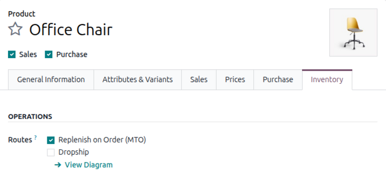

========================
Replenish on order (MTO)
========================

.. |SO| replace:: :abbr:`SO (sales order)`
.. |SOs| replace:: :abbr:`SOs (sales orders)`
.. |MO| replace:: :abbr:`MO (manufacturing order)`
.. |PO| replace:: :abbr:`PO (purchase order)`
.. |MTO| replace:: :abbr:`MTO (make to order)`
.. |RFQ| replace:: :abbr:`RfQ (request for quotation)`
.. |BOM| replace:: :abbr:`BoM (bill of materials)`

*Replenish on order*, also known as *MTO* (make to order), is a replenishment strategy that
automatically triggers a purchase order (PO) or a manufacturing order (MO) for a product only when a
sales order (SO) is confirmed.

- For :doc:`purchased products <../../../purchase/manage_deals/rfq>`, Odoo creates an |RFQ|.
- For :doc:`manufactured products
  <../../../manufacturing/basic_setup/configure_manufacturing_product>`, it creates an |MO|.

The |RFQ| or |MO| is then linked to the source |SO| and accessible through a smart button, allowing
users to directly trace the replenishment order back to the original customer demand.

.. important::
   The |RFQ| or |MO| generated by |MTO| is designed to fulfill the source |SO|. This document should
   normally be confirmed or adjusted rather than canceled. If the |RFQ| or |MO| is canceled, Odoo
   does not automatically generate a replacement. A new replenishment document may be created
   manually, but it **cannot** be linked back to the original |SO| through the smart button.
   Instead, if the demand changes, update the document instead of canceling it.

.. _inventory/mto/configuration:

Configuration
=============

.. _inventory/mto/enable-mto:

Enable the MTO route
--------------------

In order to use the |MTO| route, the :guilabel:`Replenish on Order (MTO)` setting must be enabled.
To do so, navigate to :menuselection:`Inventory app --> Configuration --> Settings`. Go to the
:guilabel:`Logistics` section at the end of the page, and select the checkbox next to
:guilabel:`Replenish on Order (MTO)`. Click :guilabel:`Save` to confirm the setting.

.. image:: mto/mto-setting.png
   :alt: Select the Replenish on Order (MTO) checkbox.

.. _inventory/mto/configure-mto-product:

Configure a product for MTO
---------------------------

With the |MTO| route enabled, products can now be configured to replenish on order. To do so, begin
by going to :menuselection:`Inventory app --> Products --> Products`. Then, select an existing
product, or click :guilabel:`New` to configure a new product.

In the product form, go to the *Inventory* tab. Under the *Operations* section, select the checkbox
next to the :guilabel:`Replenish on Order (MTO)` option in the :guilabel:`Routes` field.

After enabling the |MTO| route, additional configurations should be made depending on whether the
product is :ref:`purchased <inventory/mto/configure-mto-product/purchased>` or :ref:`manufactured
<inventory/mto/configure-mto-product/manufactured>`.

.. note::
   As of Odoo 19.0, the *Buy* and *Manufacture* routes are hidden from the :guilabel:`Routes` field
   under the *Operations* tab by default. They are automatically applied on purchased and
   manufactured products depending on their respective configurations provided below in this
   section.

   To manually enable these routes on product forms, navigate to :menuselection:`Inventory app -->
   Configuration --> Settings` and ensure that :guilabel:`Multi-Step Routes` is enabled. Then,
   navigate to :menuselection:`Configuration --> Routes` and select the desired route. On the route
   page, click the checkbox next to :guilabel:`Products` under the *Applicable On* section.

.. _inventory/mto/configure-mto-product/purchased:

For purchased products
~~~~~~~~~~~~~~~~~~~~~~

If the product is purchased from a vendor to fulfill |SOs|, ensure the :guilabel:`Purchase` checkbox
is enabled under the product name. This displays the *Purchase* tab below.

Then, click the *Purchase* tab and specify a :guilabel:`Vendor` and a :guilabel:`Unit Price` for the
product.

.. important::
   For purchased products, users **must** specify a vendor in order for Odoo to properly generate an
   |RFQ|.

.. _inventory/mto/configure-mto-product/manufactured:

For manufactured products
~~~~~~~~~~~~~~~~~~~~~~~~~

If the product is manufactured, ensure it has a :doc:`bill of materials
<../../../manufacturing/basic_setup/bill_configuration>` (BoM) configured. To do so, click the
:icon:`fa-flask` :guilabel:`Bill of Materials` smart button at the top of the form. Then, click
:guilabel:`New` on the :guilabel:`Bill of Materials` page to configure a new |BOM| for the product.

.. important::
   For manufactured products, users **must** specify a |BOM| in order for Odoo to properly generate
   an |MO|.

.. _inventory/mto/replenish-mto-product:

Replenishment workflow using MTO
================================

After configuring a product to use the |MTO| route, a replenishment order is created whenever an
|SO| including the product is confirmed. This replenishment order is either a |PO| if the product is
purchased or an |MO| if manufactured.

.. note::
   A replenishment order is **always** created upon confirming an |SO|, even if there is enough
   stock to fulfill the order.

.. _inventory/mto/replenish-mto-product/create-so:

Create a customer |SO|
----------------------

To initiate a replenishment-on-order, navigate to the **Sales** app, then click :guilabel:`New` to
open a new quotation form.

On the form, add a :guilabel:`Customer`. Then, click :guilabel:`Add a product` under the *Order
Lines* tab, and enter a product configured for |MTO|. Click :guilabel:`Confirm` to turn the
quotation into an |SO|.

.. _inventory/mto/replenish-mto-product/validate-order:

Validate replenishment order
----------------------------

Upon confirming the |SO|, two smart buttons appear at the top of the form:

- A :icon:`fa-truck` :guilabel:`Delivery` order the user eventually validates when the product is
  ready to be delivered to the customer.
- A :icon:`fa-credit-card` :guilabel:`Purchase` order if the product on the |SO| is :ref:`purchased
  <inventory/mto/replenish-mto-product/validate-order/purchased>` **or** a :icon:`fa-wrench`
  :guilabel:`Manufacturing` order if :ref:`manufactured
  <inventory/mto/replenish-mto-product/validate-order/manufactured>`.

.. _inventory/mto/replenish-mto-product/validate-order/purchased:

For purchased products
~~~~~~~~~~~~~~~~~~~~~~

If the product is purchased, a :icon:`fa-credit-card` :guilabel:`Purchase` smart button appears at
the top of the page. Click it to open the |RFQ| associated with the |SO|.

After verifying that the vendor can meet the demand by the :guilabel:`Expected Date`, click
:guilabel:`Confirm Order` to turn the |RFQ| into a confirmed |PO|.

Once the products are received, click :guilabel:`Receive` to open the receipt, and click
:guilabel:`Validate` to enter the products into inventory.

.. _inventory/mto/replenish-mto-product/validate-order/manufactured:

For manufactured products
~~~~~~~~~~~~~~~~~~~~~~~~~

If the product is manufactured, a :icon:`fa-wrench` :guilabel:`Manufacturing` smart button appears
at the top of the page. Click it to open the |MO| associated with the |SO|. By default, the |MO| is
confirmed immediately upon confirming the |SO|.

Continue by completing any work orders in the *Work Orders* tab. Then, click :guilabel:`Produce All`
to mark the |MO| as done. The product is now registered into inventory.

Fulfill customer |SO|
---------------------

Return to the |SO| via the breadcrumbs at the top, or by navigating to :menuselection:`Sales app -->
Orders --> Orders` and selecting the |SO|.

Finally, click the :icon:`fa-truck` :guilabel:`Delivery` smart button at the top of the order to
open the delivery order. Once the products have been shipped to the customer, click
:guilabel:`Validate` to confirm the delivery.

.. _inventory/mto/cancel-mto-sales-order:

Cancel an MTO sales order
=========================

When an |SO| that had created an |RFQ| or |MO| is canceled, the related delivery order is canceled
automatically. However, the |RFQ| or |MO| themselves are **not** canceled. Instead, a warning
appears in their chatter noting the |SO| cancellation. These documents remain active, so the user
can either cancel them manually or reuse the replenishment for another order.

.. seealso::
   For information on workflows that include the |MTO| route, see the following documentation:

   - :doc:`resupply_warehouses`
   - :doc:`../../../manufacturing/subcontracting/subcontracting_basic`
   - :doc:`../../../manufacturing/advanced_configuration/sub_assemblies`
