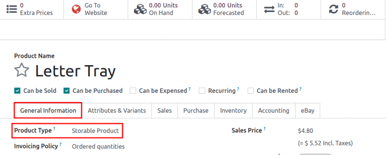
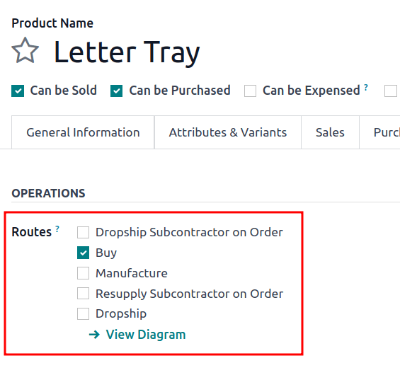
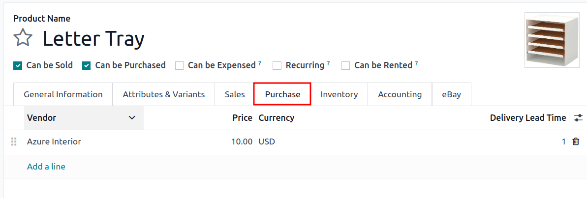
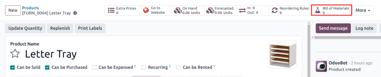
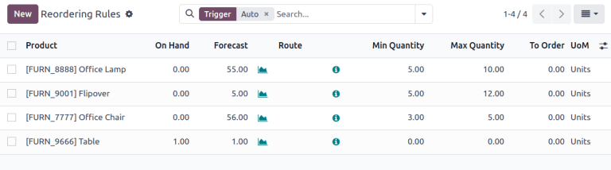
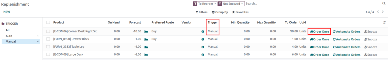
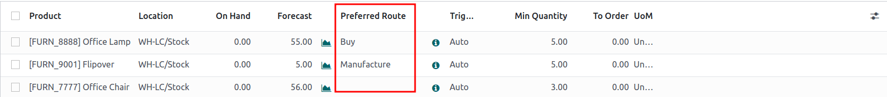
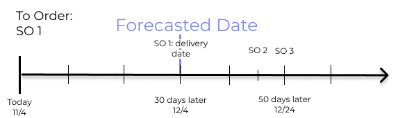
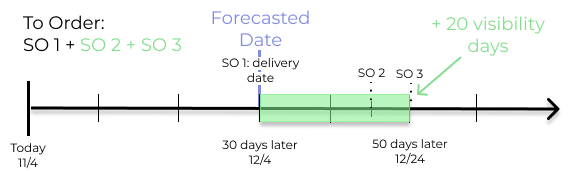
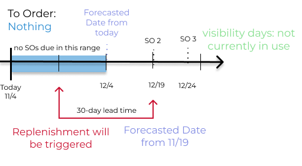

================
Reordering rules
================

.. |SO| replace:: :abbr:`SO (Sales Order)`
.. |SOs| replace:: :abbr:`SOs (Sales Orders)`

.. _inventory/management/reordering_rules:

Reordering rules are used to keep forecasted stock levels above a certain threshold without
exceeding a specified upper limit. This is accomplished by specifying a minimum quantity that stock
should not fall below and a maximum quantity that stock should not exceed.

Reordering rules can be configured for each product based on the route used to replenish it. If a
product uses the *Buy* route, then a Request for Quotation (RFQ) is created when the reordering rule
is triggered. If a product uses the *Manufacture* route, then a Manufacturing Order (MO) is created
instead. This is the case regardless of the selected replenishment route.

.. seealso::
   - `Odoo Tutorials: Automatic Reordering Rules <https://www.youtube.com/watch?v=XEJZrCjoXaU>`_
   - `Odoo Tutorials: Manual Reordering Rules <https://www.youtube.com/watch?v=deIREJ1FFj4>`_

To set up reordering rules for the first time, refer to:

- :ref:`Reordering rules setup <inventory/warehouses_storage/configure-rr>`
- :ref:`Trigger <inventory/product_management/trigger>`
- :ref:`Preferred route <inventory/warehouses_storage/route>`

For advanced features to manage batch orders and leverage Odoo's replenishment tools for timely
shipments, see:

- :ref:`Just in time logic <inventory/warehouses_storage/just-in-time>`
- :ref:`Visibility days <inventory/product_management/visibility-days>`

.. _inventory/warehouses_storage/configure-rr:

Reordering rules setup
======================

To configure automatic and manual reordering rules, complete the following:

#. :ref:`Product type configuration <inventory/warehouses_storage/set-product-type>`
#. :ref:`Create rule <inventory/warehouses_storage/rr-fields>`

.. _inventory/warehouses_storage/set-product-type:

Product type configuration
--------------------------

To use reordering rules for a product, it must first be correctly configured. Begin by navigating to
:menuselection:`Inventory app --> Products --> Products`, then select an existing product, or create
a new one by clicking :guilabel:`New`.

On the product form, under the :guilabel:`General Information` tab, set the :guilabel:`Product Type`
to :guilabel:`Storable Product`. This is necessary because Odoo only tracks stock quantities for
storable products, and this number is used to trigger reordering rules.

Next, click the :guilabel:`Inventory` tab and select one or more routes from the :guilabel:`Routes`
section. Doing so tells Odoo which route to use to replenish the product.

If the product is reordered using the :guilabel:`Buy` route, confirm that the :guilabel:`Can be
Purchased` checkbox is enabled under the product name. This makes the :guilabel:`Purchase` tab
appear. Click on the :guilabel:`Purchase` tab, and specify at least one vendor, and the price that
they sell the product for, so that Odoo knows which company the product should be purchased from.

If the product is replenished using the :guilabel:`Manufacture` route, it needs to have at least one
Bill of Materials (BoM) associated with it. This is necessary because Odoo only creates
manufacturing orders for products with a :abbr:`BoM (Bill of Materials)`.

If a :abbr:`BoM (Bill of Materials)` does not already exist for the product, select the
:guilabel:`Bill of Materials` smart button at the top of the product form, then click
:guilabel:`New` to configure a new :abbr:`BoM (Bill of Materials)`.

.. _inventory/warehouses_storage/rr-fields:

Create new reordering rules
---------------------------

To create a new reordering rule, navigate to :menuselection:`Inventory app --> Configuration -->
Reordering Rules`, then click :guilabel:`New`, and fill out the new line as follows:

- :guilabel:`Product`: the product that requires a replenishment.
- :guilabel:`Location`: the specific location where the product is stored.
- :guilabel:`Warehouse`: the warehouse where the product is stored.
- :guilabel:`On Hand`: the amount of product currently available.
- :guilabel:`Forecast`: the amount of product available after all current orders (sales,
  manufacturing, purchase, etc.) are taken into account.
- :guilabel:`Min Quantity`: the minimum amount of product that should be available. When inventory
  levels goes below this number, the replenishment is triggered.
- :guilabel:`Max Quantity`: the amount of product that should be available after replenishing the
  product.
- :guilabel:`Multiple Quantity`: if the product should be ordered in specific quantities, enter the
  number that should be ordered. For example, if the :guilabel:`Multiple Quantity` is set to `5`,
  and only 3 are needed, 5 products are replenished.
- :guilabel:`To Order`: the amount of product that is currently needed, and will be ordered, if the
  :guilabel:`Order Once` or :guilabel:`Automate Orders` button is clicked.
- :guilabel:`UoM`: the unit of measure used to acquire the product.
- :guilabel:`Company`: the company for which the product is acquired.

.. tip::
   Reordering rules can also be created from each product form. To do so, navigate to
   :menuselection:`Inventory app --> Products --> Products`, then select a product. Click on
   :menuselection:`Reordering Rules smart button --> New`, then fill out the new line, as detailed
   above.

For advanced usage of reordering rules, learn about the following reordering rule fields:

- :ref:`Preferred route <inventory/warehouses_storage/route>`
- :ref:`Vendor <inventory/warehouses_storage/set-vendor>`
- :ref:`Bill of materials <inventory/warehouses_storage/set-bom-field>`
- :ref:`Trigger <inventory/product_management/trigger>`
- :ref:`Procurement group <inventory/warehouses_storage/procurement-grp>`
- :ref:`Visibility days <inventory/product_management/visibility-days>`

.. note::
   The fields above are not available by default, and must be enabled by selecting the
   :icon:`oi-settings-adjust` :guilabel:`(settings)` icon in the far-right corner, and selecting the
   desired column from the drop-down menu.

.. _inventory/product_management/trigger:

Trigger
=======

A reordering rule's *trigger* can be set to *automatic* or *manual*. While both function the same
way, the difference between the two types of reordering rules is how the rule is launched:

- :ref:`Auto <inventory/warehouses_storage/auto-rr>`: a purchase or manufacturing is automatically
  created when the forecasted stock falls below the reordering rule's minimum.
- :ref:`Manual <inventory/warehouses_storage/manual-rr>`: receive a suggestion on the
  :doc:`Replenishment report <report>`, so the user can review the stock levels, lead times, and
  forecasted dates of arrival, before clicking the *Order Once* button.

To enable the :guilabel:`Trigger` field, go to :menuselection:`Inventory app --> Operations -->
Replenishment` or :menuselection:`Inventory app --> Configuration --> Reordering Rules`. Then, click
the :icon:`oi-settings-adjust` :guilabel:`(settings)` icon, located to the far-right of the column
titles, and tick the :guilabel:`Trigger` checkbox.

In the :guilabel:`Trigger` column, select :guilabel:`Auto` or :guilabel:`Manual`. Refer to the
sections below to learn about the different types of reordering rules.

.. _inventory/warehouses_storage/auto-rr:

Auto
----

Automatic reordering rules, enabled by setting the reordering rule's :guilabel:`Trigger` field to
:guilabel:`Auto`, generate purchase or manufacturing orders when:

#. the scheduler runs, and the *Forecasted* quantity is below the minimum
#. a sales order is confirmed, and lowers the *Forecasted* quantity of the product below the minimum

.. tip::
   The scheduler is set to run once a day, by default.

   To manually trigger a reordering rule before the scheduler runs, ensure :ref:`developer mode
   <developer-mode>` is enabled, and then select :menuselection:`Inventory app --> Operations -->
   Run Scheduler`. Then, select the green :guilabel:`Run Scheduler` button on the pop-up window that
   appears.

   Be aware that this also triggers *any other* scheduled actions.

.. example::
   The product, `Office Lamp`, has an automatic reordering rule set to trigger when the forecasted
   quantity falls below the :guilabel:`Min Quantity` of `5.00`. Since the current
   :guilabel:`Forecast` is `55.00`, the reordering rule is **not** triggered.

   .. image:: reordering_rules/auto.png
      :align: center
      :alt: Show automatic reordering rule from the Reordering Rule page.

If the :guilabel:`Buy` route is selected, then an :abbr:`RFQ (Request for Quotation)` is generated.
To view and manage :abbr:`RFQs (Requests for Quotation)`, navigate to :menuselection:`Purchase app
--> Orders --> Requests for Quotation`.

If the :guilabel:`Manufacture` route is selected, then an :abbr:`MO (Manufacturing Order)` is
generated. To view and manage :abbr:`MOs (Manufacturing Orders)`, navigate to
:menuselection:`Manufacturing app --> Operations --> Manufacturing Orders`.

When no route is selected, Odoo selects the :guilabel:`Route` specified in the :guilabel:`Inventory`
tab of the product form.

.. _inventory/warehouses_storage/manual-rr:

Manual
------

Manual reordering rules, configured by setting the reordering rule's :guilabel:`Trigger` field to
:guilabel:`Manual`, list a product on the replenishment dashboard when the forecasted quantity
falls below a specified minimum. Products on this dashboard are called *needs*, because they are
needed to fulfill upcoming sales orders, for which the forecasted quantity is not enough.

The replenishment dashboard, accessible by navigating to :menuselection:`Inventory app -->
Operations --> Replenishment`, considers sales order deadlines, forecasted stock levels, and vendor
lead times. It displays needs **only** when it is time to reorder items.

.. _inventory/warehouses_storage/route:

Preferred route
===============

Odoo allows for multiple routes to be selected as replenishment methods under the
:guilabel:`Inventory` tab on each product form. For instance, it is possible to select both
:guilabel:`Buy` and :guilabel:`Manufacture`, indicating to Odoo .

Odoo also enables users to set a preferred route for a product's reordering rule. This is the route
that the rule defaults to if multiple are selected. To select a preferred route, begin by navigating
to :menuselection:`Inventory app --> Configuration --> Reordering Rules` or
:menuselection:`Inventory app --> Operations --> Replenishment`.

Click inside of the column on the row of a reordering rule, and a drop-down menu shows all available
routes for that rule. Select one to set it as the preferred route.

.. important::
   If multiple routes are enabled for a product but no preferred route is set for its reordering
   rule, the product is reordered using the selected route that is listed first on the
   :guilabel:`Inventory` tab of the product form.

Advanced uses
-------------

Pairing :guilabel:`Preferred Route` with one of the following fields on the replenishment report
unlocks advanced configurations of reordering rules. Consider the following:

.. _inventory/warehouses_storage/set-vendor:

- :guilabel:`Vendor`: When the selected :guilabel:`Preferred Route` is :guilabel:`Buy`, setting the
  :guilabel:`Vendor` field to one of the multiple vendors on the vendor pricelist indicates to Odoo
  that is is the vendor to prioritize when making orders.

  .. tip::
     TODO: what did Charlotte mean by "filter by vendors on replenishment report?"

.. _inventory/warehouses_storage/set-bom-field:

- :guilabel:`Bill of Materials`: When the selected :guilabel:`Preferred Route` is
  :guilabel:`Manufacture`, and there are multiple bills of materials in use, specifying the desired
  :abbr:`BoM (Bill of Materials)` in the :guilabel:`Bill of Materials` column in the replenishment
  report prioritizes it when creating draft manufacturing orders when the reordering rules need to
  be triggered.

.. _inventory/warehouses_storage/procurement-grp:

- :guilabel:`Procurement Group`: A group of related purchase or manufacturing orders needed to
  fulfill a specific demand.

  .. example::

     A confirmed sales order `SO14` for a :doc:`make-to-order <mto>` item triggers the creation of:

     - manufacturing order `MO5` to create it
     - purchase orders (`PO1` & `PO2`) for the components to craft it.

     `MO5`, `PO1`, and `PO2` are part of `SO14`'s procurement group.

  Selecting a procurement group in the :guilabel:`Procurement Group` field on the replenishment
  report ensures that all linked orders are grouped under the same demand, based on the defined
  route.

  .. spoiler::
     How can you set the Procurement Group, Vendor, and Preferred Route fields on the replenishment
     report to generate a single RFQ for all five products in sales order SO35, given they share the
     same vendor, Azure Interior?

     - :guilabel:`Procurement Group`: `SO35`
     - :guilabel:`Vendor`: `Azure Interior`
     - :guilabel:`Preferred Route`: :guilabel:`Buy`

.. _inventory/warehouses_storage/just-in-time:

Just in time logic
==================

*Just in time logic* in Odoo minimizes storage costs by placing orders precisely to meet deadlines.
This is achieved using the :ref:`forecasted date <inventory/warehouses_storage/forecasted-date>`,
which determines when replenishment is necessary to avoid overstocking.

The :ref:`forecasted date <inventory/warehouses_storage/forecasted-date>` is the **earliest possible
date** to receive a product if the replenishment process starts immediately. It is calculated by
summing the lead times linked to the replenishment process, such as :ref:`vendor lead times
<inventory/management/purchase-lt>` and :ref:`purchasing delays
<inventory/management/purchase-security-lt>` for purchases, or manufacturing lead times for
production.

.. example::
   For a product with a 5-day total lead time and a sales order delivery date in 10 days, Odoo waits
   5 days to place the order, ensuring it arrives just in time for delivery.

Important considerations:

.. note::
   If this feels risky, consider adding buffer time or :doc:`adjusting lead times <lead_times>` for
   more flexibility.

.. _inventory/warehouses_storage/forecasted-date:

Forecasted date
---------------

To view the *forecasted date*, go to the replenishment report and click the :icon:`fa-info-circle`
:guilabel:`(i)` icon for the desired reordering rule. The :guilabel:`Replenishment Information`
pop-up window displays the :guilabel:`Forecasted Date` and various lead times.

The *forecasted date* is the total time needed to procure a product in Odoo. It is calculated by
summing the lead times linked to the product's replenishment process. The total of these lead times,
added to the current date, determines the when Odoo checks for demanded stock.

.. important::
   The forecasted date is the **earliest possible date** to receive the product if the replenishment
   process began right **now**.

.. example::
   A manual reordering rule is set up with no minimum or maximum quantities.

   - Vendor lead time is 4 days, the purchase security lead time is 1 day, and the days to purchase
     is 2 days
   - Today's date is November 26
   - These add up to 7 days, making the forecasted date, December 3rd

   A confirmed |SO| for 5 units has a delivery date of December 3rd (7 days from today). This demand
   will appear on the replenishment report today, in the **To Order** field.

   However, if the delivery date were later than December 3rd, it would not yet appear on the
   report. Odoo only displays quantities to replenish when they fall within the forecasted date
   window, ensuring orders are placed precisely when needed.

   .. image:: reordering_rules/replenishment-info.png
      :alt: Show forecasted date in Odoo.

The *just-in-time* ensures replenishment happens only when it's necessary for the forecasted date's
demand, helping to avoid overstocking.

For example:

- If the forecasted quantity drops below the minimum **on** the forecasted date, replenishment must
  begin immediately to avoid shortages.
- If the quantity drops below the minimum **after** the forecasted date, replenishment can wait.

The **To Order** quantity is the total demand on the forecasted date.

By timing purchase orders based on the combined lead times, Odoo optimizes stock levels, keeping
inventory minimal while ensuring future requirements are ordered at the last possible
moment—strategic procrastination without the stress!

Common confusion about forecasted quantities
--------------------------------------------

|SOs| due **after** the :guilabel:`Forecasted Date` are not accounted for in the
:guilabel:`Forecast` quantities of the reordering rule.

They are, however, accounted for on the forecasted report that is opened by clicking the
:icon:`fa-area-chart` :guilabel:`(graph)` icon on the replenishment report, as this one represents
the long-term **forecasted quantity**.

.. example::

   .. figure:: report/zero-forecast.png
      :alt: Forecast and To Order is zero.

      Continuing the above example, when the sales order's deadline is adjusted to December 4th, the
      :guilabel:`Forecast`and :guilabel:`To Order` quantities are zero.

   .. figure:: report/five-forecast.png
      :alt: alt text.

      Opening the :guilabel:`Forecasted Report` shows the :guilabel:`Forecasted` units is `5.00`.

.. _inventory/product_management/visibility-days:

Visibility days
===============

*Visibility days* extend the :ref:`forecasted date <inventory/warehouses_storage/just-in-time>` to
determine if additional quantities should be added to the planned replenishment. Odoo checks:

- If forecasted stock on the forecasted date will drop below the minimum in the reordering rule.
- **Only if** it is time to reorder, visibility days check additional future demand, by the
  specified number of days.

This feature helps consolidate orders by grouping immediate and near-future needs, reducing
transport costs and enabling supplier discounts for larger orders.

To set visibility days to incorporate orders for a specified number of days in the future, navigate
to :menuselection:`Inventory app --> Operations --> Replenishment`, or by clicking the *Reordering
Rules* smart button from the product form.

Next, enable the :guilabel:`Visibility Days` field by clicking the :guilabel:`(sliders)` icon to the
far right and choosing the feature from the drop-down menu. Then, enter the desired visibility days.

Example where visibility days is triggered
------------------------------------------

A product shipped from Asia has a combined vendor lead time of 30 days and a shipping cost of $100
(including :doc:`landed costs
<../../product_management/inventory_valuation/integrating_landed_costs>` and tariffs.

- **November 4**: Current date. The forecasted date is December 4 (30 days later).
- |SO| 1: Requires the product by Dec 4. Odoo places the order today, costing $100.
- |SO| 2: Requires the product by Dec 19. Normally, Odoo would order on Nov 19, costing an
  additional $100.
- |SO| 3: Requires the product by Dec 25. Normally, Odoo would order on Nov 25, costing another
  $100.

Ordering separately for these sales orders totals $300 in shipping costs.

Setting :guilabel:`Visibility Days` to `20.0` allows Odoo to "look ahead" 20 days from December 4
(|SO| 1's forecasted date) to December 24.

- It groups |SO| 2's order with |SO| 1, reducing shipping costs by consolidating orders.
- |SO| 3, which is due on Dec 25, is one day late and is not grouped with the other two orders.

Counterexample where visibility days is not triggered
-----------------------------------------------------

Considering the example above, if |SO| 1 does not exist, then:

- **November 4**: Current date. The forecasted date is December 4 (30 days later).
- **November 5**: The forecasted date shifts to December 5.
- |SO| 2: Requires the product by December 19. Odoo will only trigger the order on November 19,
  meaning the user won't see a replenishment notification until then.

This shows that visibility days complement just-in-time logic by optimizing it to balance
replenishment costs more effectively.

