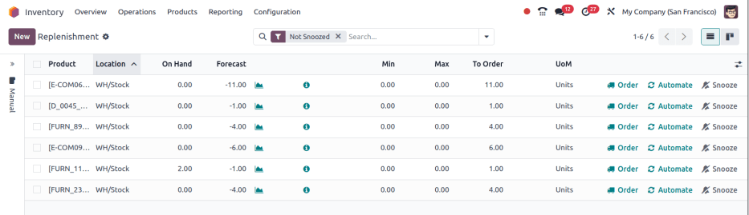
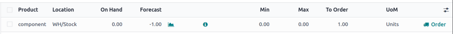
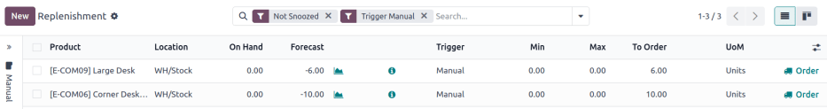

================
Reordering rules
================

.. |SO| replace:: :abbr:`SO (Sales Order)`
.. |SOs| replace:: :abbr:`SOs (Sales Orders)`
.. |RFQ| replace:: :abbr:`RFQ (Request for Quotation)`
.. |RFQs| replace:: :abbr:`RFQs (Requests for Quotations)`
.. |PO| replace:: :abbr:`PO (Purchase Order)`
.. |POs| replace:: :abbr:`POs (Purchase Orders)`
.. |MO| replace:: :abbr:`MO (Manufacturing Order)`
.. |MOs| replace:: :abbr:`MOs (Manufacturing Orders)`
.. |BoM| replace:: :abbr:`BoM (Bill of Materials)`
.. |BoMs| replace:: :abbr:`BoMs (Bills of Materials)`

*Reordering rules* are used to keep forecasted stock levels above a certain threshold without
exceeding a specified upper limit. This is accomplished by specifying a minimum quantity that stock
should not fall below and a maximum quantity that stock should not exceed.

Reordering rules can be configured for each product based on the route used to replenish it. If a
product uses the *Buy* route, then a *request for quotation* (RFQ) is created when the reordering
rule is triggered. If a product uses the *Manufacture* route, then a *manufacturing order* (MO) is
created instead. This is the case regardless of the selected replenishment route.

.. seealso::
   - `Odoo Tutorials: Automatic Reordering Rules <https://www.youtube.com/watch?v=XEJZrCjoXaU>`_
   - `Odoo Tutorials: Manual Reordering Rules <https://www.youtube.com/watch?v=deIREJ1FFj4>`_

To set up reordering rules for the first time, refer to:

- :ref:`Reordering rules setup <inventory/warehouses_storage/configure-rr>`
- :ref:`Trigger <inventory/product_management/trigger>`
- :ref:`Preferred route <inventory/warehouses_storage/route>`

To understand and optimize replenishment using advanced features, see:

- :ref:`Just-in-time logic <inventory/warehouses_storage/just-in-time>`
- :ref:`Visibility days <inventory/product_management/visibility-days>`

.. _inventory/warehouses_storage/configure-rr:

Reordering rules setup
======================

To configure automatic and manual reordering rules, complete the following:

#. :ref:`Product type configuration <inventory/warehouses_storage/set-product-type>`
#. :ref:`Create rule <inventory/warehouses_storage/rr-fields>`

.. _inventory/warehouses_storage/set-product-type:

Product type configuration
--------------------------

A product must be configured correctly to use reordering rules. Begin by navigating to
:menuselection:`Inventory app --> Products --> Products`, then select an existing product, or create
a new one by clicking :guilabel:`New`.

On the product form, under the :guilabel:`General Information` tab, set the :guilabel:`Product Type`
to :guilabel:`Storable Product`. This is necessary because Odoo only tracks stock quantities for
storable products, and quantities are needed to trigger reordering rules.

.. image:: reordering_rules/product-type.png
   :alt: Set the Product Type as Storable.

Next, click the :guilabel:`Inventory` tab and select one or more routes from the :guilabel:`Routes`
section. Doing so tells Odoo which route to use to replenish the product.

.. image:: reordering_rules/select-routes.png
   :alt: Select one or more routes on the Inventory tab.

If the product is reordered using the :guilabel:`Buy` route, confirm that the :guilabel:`Can be
Purchased` checkbox is enabled under the product name. This makes the :guilabel:`Purchase` tab
appear. Click on the :guilabel:`Purchase` tab, and specify at least one vendor, and the price that
they sell the product for, so that Odoo knows which company the product should be purchased from.

.. image:: reordering_rules/specify-vendor.png
   :alt: Specify a vendor and price on the Purchase tab.

If the product is replenished using the :guilabel:`Manufacture` route, it needs to have at least one
*bill of materials* (BoM) associated with it. This is necessary because Odoo only creates
manufacturing orders for products with a |BoM|.

If a |BoM| does not already exist for the product, select the :guilabel:`Bill of Materials` smart
button at the top of the product form, then click :guilabel:`New` to configure a new |BoM|.

.. image:: reordering_rules/bom-smart-button.png
   :alt: The Bill of Materials smart button on a product form.

.. _inventory/warehouses_storage/rr-fields:

Create new reordering rules
---------------------------

To create a new reordering rule, navigate to
:menuselection:`Inventory app --> Operations --> Replenishment`, then click :guilabel:`New`,
and fill out the following fields for the new reordering rule line item:

- :guilabel:`Product`: The product that requires replenishment.
- :guilabel:`Location`: The specific location where the product is stored.
- :guilabel:`Min Quantity`: The minimum amount of product that should be available. When inventory
  levels goes below this number, the replenishment is triggered.
- :guilabel:`Max Quantity`: The amount of product that should be available after replenishing the
  product.
- :guilabel:`Multiple Quantity`: If the product should be ordered in specific quantities, enter the
  number that should be ordered. For example, if the :guilabel:`Multiple Quantity` is set to `5`,
  and only 3 are needed, 5 products are replenished.

.. tip::
   Reordering rules can also be created from the :guilabel:`Reordering Rules` smart button on the
   product form.

.. note::
   To learn how the :guilabel:`On Hand`, :guilabel:`Forecast`, and :guilabel:`To Order` fields are
   calculated using on-hand quantities and future demand, see the :ref:`Just-in-time logic
   <inventory/warehouses_storage/just-in-time>` section.

For advanced usage of reordering rules, learn about the following reordering rule fields:

- :ref:`Trigger <inventory/product_management/trigger>`
- :ref:`Preferred route <inventory/warehouses_storage/route>`
- :ref:`Vendor <inventory/warehouses_storage/set-vendor>`
- :ref:`Bill of materials <inventory/warehouses_storage/set-bom-field>`
- :ref:`Procurement group <inventory/warehouses_storage/procurement-grp>`
- :ref:`Visibility days <inventory/product_management/visibility-days>`

.. note::
   The fields above are not available by default, and must be enabled by selecting the
   :icon:`oi-settings-adjust` :guilabel:`(adjust)` icon in the far-right corner and selecting the
   desired column from the drop-down menu.

.. _inventory/warehouses_storage/zero-zero:

0/0/1 reordering rule
---------------------

The *0/0/1* reordering rule is a specialty rule used to replenish a product that is not kept
on-hand, each time a sales order (SO) is confirmed for that product.

.. important::
   The 0/0/1 reordering rule is similar to the *Replenish on Order (MTO)* route, in that both
   workflows are used to replenish a product upon confirmation of an |SO|.

   The main difference between the two methods is that the *Replenish on Order* route automatically
   reserves the product for the |SO| that caused it to be replenished. This means the product
   **cannot** be used for a different |SO|.

   The 0/0/1 reordering rule does not have this limitation. A product replenished using the rule is
   not reserved for any specific |SO|, and can be used as needed.

   Another key difference is that replenishment orders created by the *Replenish on Order* route are
   linked to the original |SO| by a smart button at the top of the order. When using the 0/0/1
   reordering rule, a replenishment order is created, but is not linked to the original |SO|.

   See the :doc:`Replenish on Order (MTO) <mto>` documentation for a full overview of the MTO route.

To create a 0/0/1 reordering rule, navigate to :menuselection:`Inventory app --> Products -->
Products`, and select a product.

At the top of the product's page, click the :icon:`fa-refresh` :guilabel:`Reordering Rules` smart
button to open the :guilabel:`Reordering Rules` page for the product. On the resulting page, click
:guilabel:`New` to begin configuring a new reordering rule.

In the :guilabel:`Location` field of the new reordering rule, select the location in which
replenished products should be stored. By default, this location is set to :guilabel:`WH/Stock`.

In the :guilabel:`Route` field, select the route the rule should use to replenish the item. For
example, if the product should be purchased from a vendor, select the :guilabel:`Buy` route.

In the :guilabel:`Min Quantity` field and :guilabel:`Max Quantity` field, leave the values set to
`0.00`. In the :guilabel:`To Order` field, enter a value of `1.00`.

With the reordering rule configured using these values, each time an |SO| causes the forecasted
quantity of the product to fall below the :guilabel:`Min Quantity` of `0.00`, the selected
:guilabel:`Route` is used to replenish the product in one-unit increments, back up to the
:guilabel:`Max Quantity` of `0.00`.

.. example::
   A picture frame is configured with a 0/0/1 reordering rule that uses the *Buy* route. Zero units
   of the picture frame are kept on-hand at any given time.

   An |SO| is confirmed for one unit of the picture frame, which causes the forecasted quantity to
   drop to `-1.00`. This triggers the reordering rule, which automatically creates a |PO| for one
   unit of the picture frame.

   Once the product is received from the vendor, the forecasted quantity of the picture frame
   returns to `0.00`. There is now one picture frame on-hand, but it is not reserved for the |SO|
   which triggered its purchase. It can be used to fulfill that |SO|, or reserved for a different
   order.

.. _inventory/product_management/trigger:

Trigger
=======

A reordering rule's *trigger* can be set to *automatic* or *manual*. While both function the same
way, the difference between the two types of reordering rules is how the rule is launched:

- :ref:`Auto <inventory/warehouses_storage/auto-rr>`: A purchase or manufacturing order is
  automatically created when the forecasted stock falls below the reordering rule's minimum
  quantity. By default, the :guilabel:`Auto` trigger is selected.
- :ref:`Manual <inventory/warehouses_storage/manual-rr>`: The :doc:`Replenishment report <report>`
  lists products needing replenishment, showing current/forecasted stock, lead times, and arrival
  dates. Users can review forecasts before clicking *Order Once*.

To enable the :guilabel:`Trigger` field, go to :menuselection:`Inventory app --> Operations -->
Replenishment` or :menuselection:`Inventory app --> Configuration --> Reordering Rules`. Then, click
the :icon:`oi-settings-adjust` :guilabel:`(adjust)` icon, located to the far-right of the column
titles, and tick the :guilabel:`Trigger` checkbox.

In the :guilabel:`Trigger` column, select :guilabel:`Auto` or :guilabel:`Manual`. Refer to the
sections below to learn about the different types of reordering rules.

.. _inventory/warehouses_storage/auto-rr:

Auto
----

*Automatic reordering rules*, enabled by setting the reordering rule's :guilabel:`Trigger` field to
:guilabel:`Auto`, generate purchase or manufacturing orders when either:

#. The scheduler runs, and the *Forecasted* quantity is below the minimum, or
#. A sales order is confirmed, and lowers the *Forecasted* quantity of the product below the
   minimum.

If the :guilabel:`Buy` route is selected, then an |RFQ| is generated. To view and manage |RFQs|,
navigate to :menuselection:`Purchase app --> Orders --> Requests for Quotation`.

If the :guilabel:`Manufacture` route is selected, then an |MO| is generated. To view and manage
|MOs|, navigate to :menuselection:`Manufacturing app --> Operations --> Manufacturing Orders`.

When no route is selected, Odoo selects the :guilabel:`Route` specified in the :guilabel:`Inventory`
tab of the product form.

.. tip::
   The scheduler is set to run once a day, by default.

   To manually trigger a reordering rule before the scheduler runs, ensure :ref:`developer mode
   <developer-mode>` is enabled, and select :menuselection:`Inventory app --> Operations --> Run
   Scheduler`. Then, click the purple :guilabel:`Run Scheduler` button on the pop-up window that
   appears.

   Be aware that this also triggers any other scheduled actions.

.. example::
   The product, `Office Lamp`, has an automatic reordering rule set to trigger when the forecasted
   quantity falls below the :guilabel:`Min Quantity` of `5.00`. Since the current
   :guilabel:`Forecast` is `55.00`, the reordering rule is **not** triggered.

   .. image:: reordering_rules/auto.png
      :alt: Show automatic reordering rule from the Reordering Rule page.

.. _inventory/warehouses_storage/manual-rr:

Manual
------

*Manual reordering rules*, configured by setting the reordering rule's :guilabel:`Trigger` field to
:guilabel:`Manual`, list a product on the :doc:`replenishment dashboard <report>` when the
forecasted quantity falls below a specified minimum. Products on this dashboard are called *needs*,
because they are needed to fulfill upcoming sales orders, for which the forecasted quantity is not
enough.

The replenishment dashboard, accessible by navigating to :menuselection:`Inventory app -->
Operations --> Replenishment`, considers sales order deadlines, forecasted stock levels, and vendor
lead times. It displays needs **only** when it is time to reorder items, thanks to the :guilabel:`To
Reorder` filter.

When a product appears on the replenishment dashboard, clicking the :guilabel:`Order Once` button
generates the purchase or manufacturing order with the specified amounts :guilabel:`To Order`.

.. _inventory/warehouses_storage/route:

Route
=====

Odoo allows for multiple routes to be selected as replenishment methods under the
:guilabel:`Inventory` tab on each product form. For instance, it is possible to select both
:guilabel:`Buy` and :guilabel:`Manufacture`, indicating to Odoo that the product can be bought or
manufactured.

Odoo also enables users to set a preferred route for a product's reordering rule. This is the route
that the rule defaults to, if multiple are selected. To select a preferred route, begin by
navigating to :menuselection:`Inventory app --> Configuration --> Reordering Rules`.

By default, the :guilabel:`Route` column is hidden on the :guilabel:`Reordering Rules` page.

Reveal the :guilabel:`Route` column by selecting the :guilabel:`(slider)` icon to the far-right of
the column titles, and checking the :guilabel:`Route` option from the drop-down menu that appears.

Click inside of the column on the row of a reordering rule, and a drop-down menu shows all available
routes for that rule. Select one to set it as the preferred route.

.. image:: reordering_rules/select-preferred-route.png
   :alt: Select a preferred route from the drop-down.

.. important::
   If multiple routes are enabled for a product but no preferred route is set for its reordering
   rule, the product is reordered using the selected route that is listed first on the
   :guilabel:`Inventory` tab of the product form.

Advanced uses
-------------

Pairing :guilabel:`Preferred Route` with one of the following fields on the replenishment report
unlocks advanced configurations of reordering rules. Consider the following:

.. _inventory/warehouses_storage/set-vendor:

- :guilabel:`Vendor`: When the selected :guilabel:`Preferred Route` is :guilabel:`Buy`, setting the
  :guilabel:`Vendor` field to one of the multiple vendors on the vendor pricelist indicates to Odoo
  that the vendor is automatically populated on |RFQs| when a reordering rule triggers the creation
  of a purchase order.

.. _inventory/warehouses_storage/set-bom-field:

- :guilabel:`Bill of Materials`: When the :guilabel:`Preferred Route` is set to
  :guilabel:`Manufacture`, and there are multiple |BoMs| in use, specifying the desired |BoM| in the
  replenishment report, draft manufacturing orders are created with this |BoM| in use.

.. _inventory/warehouses_storage/procurement-grp:

- :guilabel:`Procurement Group`: This is a way to group related |POs| or |MOs| that are tied to
  fulfilling a specific demand, like an |SO| or a project. It helps organize and track which orders
  are linked to a particular demand.

  .. note::
     Procurement groups link replenishment methods to demand, enabling smart buttons to appear when
     using the :doc:`MTO route <mto>`.

     .. figure:: reordering_rules/po-smartbutton.png
        :alt: Showing smart button to PO.

        Sales order (demand) with a linked purchase order (replenishment method).

  In the context of reordering rules:

  - Reordering rules do not automatically assign a procurement group, which is why there are no
    smart buttons that link |SOs| to |POs|, unlike the :abbr:`MTO (Make to Order)` route.
  - To enable smart buttons for products replenished by reordering rules (not :abbr:`MTO (Make to
    Order)`), with specific quantities linked to specific demands (e.g. |SOs|), assign a procurement
    group.
  - Without a procurement group, demands for the same product can be combined into a single |RFQ|,
    even if the reordering rule is executed multiple times for those demands. This allows for more
    efficient procurement by consolidating demands into fewer orders.

  Selecting a procurement group in the :guilabel:`Procurement Group` field on the replenishment
  report ensures that all linked orders are grouped under the same demand, based on the defined
  route.

  .. exercise::
     How can you set the *Procurement Group*, *Vendor*, and *Preferred Route* fields on the
     replenishment report to generate a single |RFQ| for five different products in sales order
     SO35, given they share the same vendor, Azure Interior, and ensure other demands for these
     products are handled separately?

     .. spoiler:: View the answer

        #. Set the :guilabel:`Procurement Group` to `SO35`, in the reordering rule for all five
           products. This groups the demands for `SO35` in the same |RFQ| or |MO|.
        #. Set the :guilabel:`Vendor` to `Azure Interior` to ensure the |RFQ| is created for the
           same supplier.
        #. Set the :guilabel:`Preferred Route` to :guilabel:`Buy` to generate an |RFQ|.
        #. Click the :guilabel:`Order Once` button to generate a single |RFQ| for the five products
           tied to `SO35`.

        | After placing the order, remove `SO35` from the :guilabel:`Procurement Group` field of the
          five products' reordering rules. This ensures future demands for these products are
          managed separately and assigned to different |RFQs| (the usual behavior).

.. _inventory/warehouses_storage/just-in-time:

Just-in-time logic
==================

*Just-in-time logic* in Odoo minimizes storage costs by placing orders precisely to meet deadlines.
This is achieved using the :ref:`forecasted date <inventory/warehouses_storage/forecasted-date>`,
which determines when replenishment is necessary to avoid overstocking.

The forecasted date is the **earliest possible date** to receive a product if the replenishment
process starts immediately. It is calculated by summing the lead times linked to the replenishment
process, such as :ref:`vendor lead times <inventory/warehouses_storage/purchase-lt>` and
:ref:`purchasing delays <inventory/warehouses_storage/purchase-security-lt>` for purchases, or
:ref:`manufacturing lead times <inventory/warehouses_storage/manuf-lt>` for production. Both
automatic and manual reordering rules work this way.

.. example::
   For a product with a 5-day total lead time and a sales order delivery date in 10 days, Odoo waits
   5 days to place the order, ensuring it arrives just in time for delivery.

Important considerations:

- **If this feels risky**, consider adding buffer time or :doc:`adjusting lead times <lead_times>`
  for more flexibility.
- While lead times and just-in-time logic provide additional control, **reordering rules work
  perfectly fine without them**. Keeping delivery dates on sales orders as their *creation date*
  ensures purchases are immediately triggered when needed

.. _inventory/warehouses_storage/forecasted-date:

Forecasted date and To Order quantity
-------------------------------------

To view the *forecasted date*, go to the replenishment report and click the :icon:`fa-info-circle`
:guilabel:`(info)` icon for the desired reordering rule. The :guilabel:`Replenishment Information`
pop-up window displays the :guilabel:`Forecasted Date` and various lead times.

The *forecasted date* is the total time needed to procure a product in Odoo. It is calculated by
summing the lead times linked to the product's replenishment process. The total of these lead times,
added to the current date, determines when Odoo checks for demanded stock.

.. important::
   The forecasted date is the **earliest possible date** the customer can receive the product if the
   replenishment process began right **now**. It is calculated by adding all lead times related to
   the product to the current date.

.. example::
   A manual reordering rule is set up with no minimum or maximum quantities.

   - Vendor lead time is 4 days, the purchase security lead time is 1 day, and the days to purchase
     is 2 days.
   - Today's date is November 26.
   - These add up to 7 days, making the forecasted date, December 3rd.

   A confirmed |SO| for 5 units has a delivery date of December 3rd (7 days from today). This demand
   will appear on the replenishment report today, in the **To Order** field.

   However, if the delivery date were later than December 3rd, it would not yet appear on the
   report. Odoo only displays quantities to replenish when they fall within the forecasted date
   window, ensuring orders are placed precisely when needed.

   .. image:: reordering_rules/replenishment-info.png
      :alt: Show forecasted date in Odoo.

The *just-in-time* logic ensures replenishment happens only when it's necessary for the forecasted
date's demand, helping avoid overstocking.

For example:

- If the forecasted quantity drops below the minimum **on** the forecasted date, replenishment must
  begin immediately to avoid shortages.
- If the quantity drops below the minimum **after** the forecasted date, replenishment can wait.

The **To Order** quantity is the total demand on the forecasted date.

By timing purchase orders based on the combined lead times, Odoo optimizes stock levels, keeping
inventory minimal while ensuring future requirements are ordered at the last possible
moment—strategic procrastination without the stress!

Common confusion about forecasted quantities
--------------------------------------------

|SOs| due **after** the :guilabel:`Forecasted Date` are not accounted for in the
:guilabel:`Forecast` quantities of the reordering rule.

They are, however, accounted for on the forecasted report that is opened by clicking the
:icon:`fa-area-chart` :guilabel:`(graph)` icon on the replenishment report, as this one represents
the **long-term forecasted quantity**.

.. example::

   .. figure:: report/zero-forecast.png
      :alt: Forecast and To Order quantities is zero.

      Continuing the above example, when the sales order's deadline is adjusted to December 4th, the
      :guilabel:`Forecast` and :guilabel:`To Order` quantities are zero.

   .. figure:: report/five-forecast.png
      :alt: Show forecasted report.

      Opening the :guilabel:`Forecasted Report` shows the :guilabel:`Forecasted` units is `5.00`.

.. _inventory/product_management/visibility-days:

Visibility days
===============

*Visibility days* enable the ability to determine if additional quantities should be added to the
planned replenishment. Odoo checks if forecasted stock on the forecasted date will drop below the
minimum in the reordering rule. **Only if** it is time to reorder, visibility days check additional
future demand by the specified number of days.

This feature helps consolidate orders by grouping immediate and near-future needs, reducing
transport costs and enabling supplier discounts for larger orders.

To set visibility days to incorporate orders for a specified number of days in the future, navigate
to :menuselection:`Inventory app --> Operations --> Replenishment`, or by clicking the *Reordering
Rules* smart button from the product form.

Next, enable the :guilabel:`Visibility Days` field by clicking the :icon:`oi-settings-adjust`
:guilabel:`(adjust)` icon to the far right and choosing the feature from the drop-down menu. Then,
enter the desired visibility days.

.. important::
   The forecasted date is never pushed forward or extended; Odoo only checks the extra visibility
   days if the stock falls below the minimum threshold on the forecasted date.

Example where visibility days is triggered
------------------------------------------

A product shipped from Asia has a combined vendor lead time of 30 days and a shipping cost of $100
(including :doc:`landed costs <../../product_management/inventory_valuation/landed_costs>` and
tariffs).

- November 4: Current date. The forecasted date is December 4 (30 days later).
- |SO| 1: Requires the product by Dec 4. Odoo places the order today, costing $100.
- |SO| 2: Requires the product by Dec 19. Normally, Odoo would order on Nov 19, costing an
  additional $100.
- |SO| 3: Requires the product by Dec 25. Normally, Odoo would order on Nov 25, costing another
  $100.

Ordering separately for these sales orders totals $300 in shipping costs.

.. image:: report/forecasted-date.png
   :alt: Show forecasted date visualization.

Setting :guilabel:`Visibility Days` to `20.0` allows Odoo to "look ahead" 20 days from December 4
(|SO| 1's forecasted date) to December 24.

- It groups |SO| 2's order with |SO| 1, reducing shipping costs by consolidating orders.
- |SO| 3, which is due on Dec 25, is one day late and is not grouped with the other two orders.

.. image:: report/visibility-days.png
   :alt: Visibility days visualization.

Counterexample where visibility days is not triggered
-----------------------------------------------------

Considering the example above, if |SO| 1 does not exist, then:

- **November 4**: Current date. The forecasted date is December 4 (30 days later).
- **November 5**: The forecasted date shifts to December 5.
- |SO| 2: Requires the product by December 19. Odoo will only trigger the order on November 19,
  meaning the user will not see a replenishment notification until then.

This shows that visibility days complement just-in-time logic by optimizing it to balance
replenishment costs more effectively.

.. image:: reordering_rules/counterexample.png
   :alt: Example where the visibility days does not trigger.
