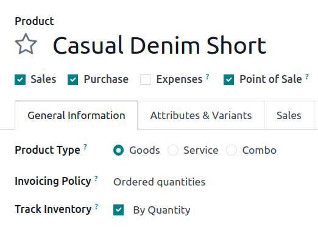

================
Reordering rules
================

.. _inventory/management/reordering_rules:
.. |SO| replace:: :abbr:`SO (sales order)`
.. |PO| replace:: :abbr:`PO (purchase order)`

*Reordering rules* are used to keep forecasted stock levels above a certain threshold without
exceeding a specified upper limit. This is accomplished by specifying a minimum quantity that stock
should not fall below and a maximum quantity that stock should not exceed.

Reordering rules can be configured for each product based on the route used to replenish it. If a
product uses the *Buy* route, then a Request for Quotation (RFQ) is created when the reordering rule
is triggered. If a product uses the *Manufacture* route, then a Manufacturing Order (MO) is created
instead. This is the case regardless of the selected replenishment route.

.. seealso::
   - `Odoo Tutorials: Automatic Reordering Rules <https://www.youtube.com/watch?v=XEJZrCjoXaU>`_
   - `Odoo Tutorials: Manual Reordering Rules <https://www.youtube.com/watch?v=deIREJ1FFj4>`_

Configure products for reordering rules
=======================================

In order to use reordering rules for a product, it must first be correctly configured. Begin by
navigating to :menuselection:`Inventory app --> Products --> Products`, then select an existing
product, or create a new one by clicking :guilabel:`New`.

On the product form, under the :guilabel:`General Information` tab, make sure the :guilabel:`Product
Type` is set to :guilabel:`Storable Product`. This is necessary because Odoo only tracks stock
quantities for storable products, and this number is used to trigger reordering rules.

Next, click on the :guilabel:`Inventory` tab and select one or more routes from the
:guilabel:`Routes` section. Doing so tells Odoo which route to use to replenish the product.

.. image:: reordering_rules/select-routes.png
   :align: center
   :alt: Select one or more routes on the Inventory tab.

If the product is reordered using the :guilabel:`Buy` route, confirm that the :guilabel:`Can be
Purchased` checkbox is enabled under the product name. This makes the :guilabel:`Purchase` tab
appear. Click on the :guilabel:`Purchase` tab, and specify at least one vendor, and the price that
they sell the product for, so that Odoo knows which company the product should be purchased from.

.. image:: reordering_rules/specify-vendor.png
   :align: center
   :alt: Specify a vendor and price on the Purchase tab.

If the product is replenished using the :guilabel:`Manufacture` route, it needs to have at least one
Bill of Materials (BoM) associated with it. This is necessary because Odoo only creates
manufacturing orders for products with a :abbr:`BoM (Bill of Materials)`.

If a :abbr:`BoM (Bill of Materials)` does not already exist for the product, select the
:guilabel:`Bill of Materials` smart button at the top of the product form, then click
:guilabel:`New` to configure a new :abbr:`BoM (Bill of Materials)`.

.. image:: reordering_rules/bom-smart-button.png
   :align: center
   :alt: The Bill of Materials smart button on a product form.

Create new reordering rules
===========================

To create a new reordering rule, navigate to :menuselection:`Inventory app --> Configuration -->
Reordering Rules`, then click :guilabel:`New`, and fill out the new line as follows:

- :guilabel:`Product`: The product that is replenished by the rule.
- :guilabel:`Location`: The location where the product is stored.
- :guilabel:`Min Quantity`: The minimum quantity that can be forecasted without the rule being
  triggered. When forecasted stock falls below this number, a replenishment order for the product is
  created.
- :guilabel:`Max Quantity`: The maximum quantity that stock is replenished up to.
- :guilabel:`Multiple Quantity`: Specify if the product should be replenished in batches of a
  certain quantity (e.g., a product could be replenished in batches of 20).
- :guilabel:`UoM`: The unit of measure used for reordering the product. This value can simply be
  `Units` or a specific unit of measurement for weight, length, etc.

.. image:: reordering_rules/reordering-rule-form.png
   :align: center
   :alt: The form for creating a new reordering rule.

.. tip::
   Reordering rules can also be created from each product form. To do so, navigate to
   :menuselection:`Inventory app --> Products --> Products`, and select a product. Then, click the
   :guilabel:`Reordering Rules` smart button, and click :guilabel:`New` to fill out the new line, as
   detailed above.

For advanced usage of reordering rules, learn about the following reordering rule fields:

- :ref:`Trigger <inventory/product_management/trigger>`
- :ref:`Visibility days <inventory/product_management/visibility-days>`
- :ref:`Route <inventory/product_management/route>`

0/0/1 reordering rule
---------------------

The *0/0/1* reordering rule is a specialty rule used to replenish a product that is not kept
on-hand, each time a sales order (SO) is confirmed for that product.

.. important::
   The 0/0/1 reordering rule is similar to the *Replenish on Order (MTO)* route, in that both
   workflows are used to replenish a product upon confirmation of an |SO|.

   The main difference between the two methods is that the *Replenish on Order* route automatically
   reserves the product for the |SO| that caused it to be replenished. This means the product
   **cannot** be used for a different |SO|.

   The 0/0/1 reordering rule does not have this limitation. A product replenished using the rule is
   not reserved for any specific |SO|, and can be used as needed.

   Another key difference is that replenishment orders created by the *Replenish on Order* route are
   linked to the original |SO| by a smart button at the top of the order. When using the 0/0/1
   reordering rule, a replenishment order is created, but is not linked to the original |SO|.

   See the :doc:`Replenish on Order (MTO) <mto>` documentation for a full overview of the MTO route.

To create a 0/0/1 reordering rule, navigate to :menuselection:`Inventory app --> Products -->
Products`, and select a product.

At the top of the product's page, click the :icon:`fa-refresh` :guilabel:`Reordering Rules` smart
button to open the :guilabel:`Reordering Rules` page for the product. On the resulting page, click
:guilabel:`New` to begin configuring a new reordering rule.

In the :guilabel:`Location` field of the new reordering rule, select the location in which
replenished products should be stored. By default, this location is set to :guilabel:`WH/Stock`.

In the :guilabel:`Route` field, select the route the rule should use to replenish the item. For
example, if the product should be purchased from a vendor, select the :guilabel:`Buy` route.

In the :guilabel:`Min Quantity` field and :guilabel:`Max Quantity` field, leave the values set to
`0.00`. In the :guilabel:`To Order` field, enter a value of `1.00`.

.. image:: reordering_rules/001-rule.png
   :align: center
   :alt: A 0/0/1 reordering rule.

With the reordering rule configured using these values, each time an |SO| causes the forecasted
quantity of the product to fall below the :guilabel:`Min Quantity` of `0.00`, the selected
:guilabel:`Route` is used to replenish the product in one-unit increments, back up to the
:guilabel:`Max Quantity` of `0.00`.

.. example::
   A picture frame is configured with a 0/0/1 reordering rule that uses the *Buy* route. Zero units
   of the picture frame are kept on-hand at any given time.

   An |SO| is confirmed for one unit of the picture frame, which causes the forecasted quantity to
   drop to `-1.00`. This triggers the reordering rule, which automatically creates a |PO| for one
   unit of the picture frame.

   Once the product is received from the vendor, the forecasted quantity of the picture frame
   returns to `0.00`. There is now one picture frame on-hand, but it is not reserved for the |SO|
   which triggered its purchase. It can be used to fulfill that |SO|, or reserved for a different
   order.

.. _inventory/product_management/trigger:

Trigger
=======

When stock falls below the reordering rule's minimum, set the reordering rule's *trigger* to
*automatic* to automatically create purchase or manufacturing orders to replenish stock.

Alternatively, setting the reordering rule's trigger to *manual* displays the product and forecasted
stock on the *replenishment dashboard*, where the procurement manager can review the stock levels,
lead times, and forecasted dates of arrival.

.. seealso::
   :doc:`../replenishment`

.. tip::
   The replenishment dashboard is accessible by going to :menuselection:`Inventory app -->
   Operations --> Replenishment`.

To enable the :guilabel:`Trigger` field, go to :menuselection:`Inventory app --> Configuration -->
Reordering Rules`. Then, click the :guilabel:`(slider)` icon, located to the far-right of the column
titles, and enable the :guilabel:`Trigger` option from the additional options drop-down menu that
appears.

.. image:: reordering_rules/enable-trigger.png
   :align: center
   :alt: Enable the Trigger field by toggling it in the additional options menu

In the :guilabel:`Trigger` column, select :guilabel:`Auto` or :guilabel:`Manual`. Refer to the
sections below to learn about the different types of reordering rules.

Auto
----

Automatic reordering rules, configured by setting the reordering rule's :guilabel:`Trigger` field to
:guilabel:`Auto`, generates purchase or manufacturing orders when:

#. the scheduler runs, and the *On Hand* quantity is below the minimum
#. a sales order is confirmed, and lowers the *Forecasted* quantity of the product below the
   minimum

.. tip::
   The scheduler is set to run once a day, by default.

   To manually trigger a reordering rule before the scheduler runs, ensure :ref:`developer mode
   <developer-mode>` is enabled, and select :menuselection:`Inventory app --> Operations --> Run
   Scheduler`. Then, click the purple :guilabel:`Run Scheduler` button on the pop-up window that
   appears.

   Be aware that this also triggers any other scheduled actions.

.. example::
   The product, `Office Lamp`, has an automatic reordering rule set to trigger when the forecasted
   quantity falls below the :guilabel:`Min Quantity` of `5.00`. Since the current
   :guilabel:`Forecast` is `55.00`, the reordering rule is **not** triggered.

   .. image:: reordering_rules/auto.png
      :align: center
      :alt: Show automatic reordering rule from the Reordering Rule page.

If the :guilabel:`Buy` route is selected, then an :abbr:`RFQ (Request for Quotation)` is generated.
To view and manage :abbr:`RFQs (Requests for Quotation)`, navigate to :menuselection:`Purchase app
--> Orders --> Requests for Quotation`.

If the :guilabel:`Manufacture` route is selected, then an :abbr:`MO (Manufacturing Order)` is
generated. To view and manage :abbr:`MOs (Manufacturing Orders)`, navigate to
:menuselection:`Manufacturing app --> Operations --> Manufacturing Orders`.

When no route is selected, Odoo selects the :guilabel:`Route` specified in the :guilabel:`Inventory`
tab of the product form.

.. _inventory/product_management/manual-rr:

Manual
------

Manual reordering rules, configured by setting the reordering rule's :guilabel:`Trigger` field to
:guilabel:`Manual`, lists a product on the replenishment dashboard when the forecasted quantity
falls below a specified minimum. Products on this dashboard are called *needs*, because they are
needed to fulfill upcoming sales orders, but the forecasted quantity is not enough.

The replenishment dashboard, accessible by navigating to :menuselection:`Inventory app -->
Operations --> Replenishment`, considers sales order deadlines, forecasted stock levels, and vendor
lead times. It displays needs **only** when it is time to reorder items.

.. note::
   If the one-day window for ordering products is too short, skip to the :ref:`visibility days
   <inventory/product_management/visibility-days>` section to make the need appear on the
   replenishment dashboard a specified number of days in advance.

When a product appears on the replenishment dashboard, clicking the :guilabel:`Order Once` button
generates the purchase or manufacturing order with the specified amounts :guilabel:`To Order`.

.. image:: reordering_rules/manual.png
   :align: center
   :alt: Click the Order Once button on the replenishment dashboard to replenish stock.

.. _inventory/product_management/visibility-days:

Visibility days
===============

.. important::
   Ensure :doc:`lead times <lead_times>` are understood before proceeding with this section.

When :ref:`manual reordering rules <inventory/product_management/manual-rr>` are assigned to a
product, *visibility days* make the product appear on the replenishment dashboard
(:menuselection:`Inventory app --> Operations --> Replenishment`) a certain number of days in
advance.

.. example::
   A product has a manual reordering rule set to trigger when the stock level falls below four
   units. The current on-hand quantity is ten units.

   The current date is February 20th, and the *delivery date* on a sales order (in the
   :guilabel:`Other Info` tab) is March 3rd — twelve days from the current date.

   The :ref:`vendor lead time <inventory/shipping_receiving/purchase-lt>` is four days, and the
   :ref:`purchase security lead time <inventory/shipping_receiving/purchase-security-lt>` is one
   day.

   When the :guilabel:`Visibility Days` field of the reordering rule is set to zero, the product
   appears on the replenishment dashboard five days before the delivery date, which, in this case,
   is February 27th.

   .. image:: reordering_rules/need-dates.png
      :align: center
      :alt: Graphic representing when the need appears on the replenishment dashboard: Feb 27th.

   To see the product on the replenishment dashboard for the current date, February 20, set
   the :guilabel:`Visibility Days` to `7.00`.

To determine the amount of visibility days needed to see a product on the replenishment dashboard,
subtract *today's date* from the *date the need appears* on the replenishment dashboard.

.. math::

   Visibility~days = Need~appears~date - Today's~date

.. example::
   Referring to the example above, today's date is February 20th, and the need for the product
   appears on February 27th.

   (February 27 - February 20 = 7 days)

   Incorrectly setting the :guilabel:`Visibility Days` fewer than seven days in this case results in
   the need **not** appearing on the replenishment dashboard.

   .. image:: reordering_rules/visibility-days.png
      :align: center
      :alt: Show the replenishment dashboard with the correct and incorrect visibility days set.

.. _inventory/product_management/route:

Route
=====

Odoo allows for multiple routes to be selected under the :guilabel:`Inventory` tab on each product
form. For instance, it is possible to select both :guilabel:`Buy` and :guilabel:`Manufacture`, thus
enabling the functionality of both routes.

Odoo also enables users to set a preferred route for a product's reordering rule. This is the route
that the rule defaults to, if multiple are selected. To select a preferred route, begin by
navigating to :menuselection:`Inventory app --> Configuration --> Reordering Rules`.

By default, the :guilabel:`Route` column is hidden on the :guilabel:`Reordering Rules` page.

Reveal the :guilabel:`Route` column by selecting the :guilabel:`(slider)` icon to the far-right of
the column titles, and checking the :guilabel:`Route` option from the drop-down menu that appears.

Click inside of the column on the row of a reordering rule, and a drop-down menu shows all available
routes for that rule. Select one to set it as the preferred route.

.. image:: reordering_rules/select-preferred-route.png
   :align: center
   :alt: Select a preferred route from the drop-down.

.. important::
   If multiple routes are enabled for a product but no preferred route is set for its reordering
   rule, the product is reordered using the selected route that is listed first on the
   :guilabel:`Inventory` tab of the product form.
