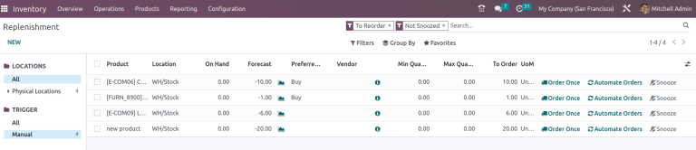
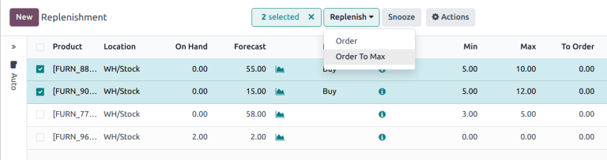
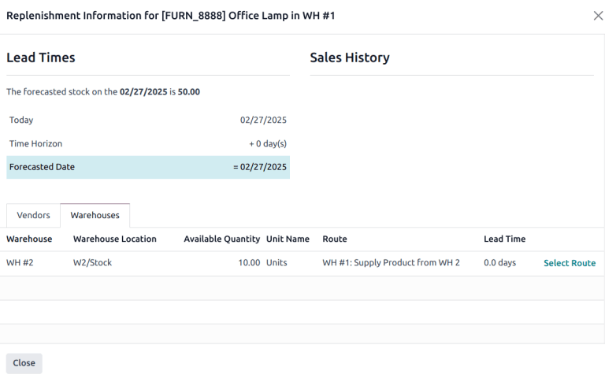

====================
Replenishment report
====================

.. |SO| replace:: :abbr:`SO (Sales Order)`
.. |SOs| replace:: :abbr:`SOs (Sales Orders)`

The *replenishment report* is an interactive dashboard that uses :doc:`manual reordering rules
<reordering_rules>`, lead times, and upcoming demands to forecast quantities of products that need
restocking.

Reordering rules used on this dashboard are normal reordering rules, but the user benefits from a
monitoring menu with extra options to manage suggestions for replenishment.

This enables users to anticipate future needs, keep less products on hand without the risk of
running out, plan and consolidate orders.

Navigate the replenishment report
=================================

To access the replenishment report, go to :menuselection:`Inventory app --> Operations -->
Replenishment.`

.. note::
   Automatic reordering rules are available on this menu as well, but are hidden by default.

The fields and features unique to the replenishment dashboard are displayed below. For definitions
of the other fields, go to the :ref:`Create reordering rules section
<inventory/warehouses_storage/rr-fields>`.

By default, the quantity in the :guilabel:`To Order` field is the quantity required to reach the set
:guilabel:`Max Quantity`. However, the :guilabel:`To Order` quantity can be adjusted by clicking on
the field and changing the value. To replenish a product manually, click :icon:`fa-truck`
:guilabel:`Order`.

Click :icon:`fa-bell-slash` :guilabel:`Snooze` to temporarily deactivate the reordering rule for
the set period, hiding the entry from the replenishment dashboard, when it is supposed to appear.

.. tip::
   Defining a :guilabel:`Vendor` allows filtering or grouping demands by the vendor. This simplifies
   the process of identifying products to order and can reduce shipment costs. Click the
   :icon:`oi-settings-adjust` :guilabel:`(adjust settings)` icon and select :guilabel:`Vendor` from
   the drop-down list to view the field on the report.

Order to max
------------

If a reordering rule does not forecast the product to arrive below the minimum, the replenishment
cannot be triggered, because it is seen as *unnecessary*. However, there can be instances where a
product needs to be replenished even if it is not deemed *necessary*, such as when an order needs to
be maximized to obtain better discounts, or to save on delivery costs.

First, select one or more products by ticking the appropriate checkbox. Then, click the
:guilabel:`Replenish` button and select :guilabel:`Order to Max`. Doing so creates a request for
quotation (RFQ) for the first possible replenishment date for each product for the maximum specified
in the reordering rule.

.. _inventory/warehouses_storage/horizon-days:

Horizon days
------------

*Horizon days* determine how many days ahead Odoo checks if the forecasted quantity will drop below
reordering rule's minimum. The feature is meant to help users plan replenishment in advance, by
increasing the :ref:`forecasted date <inventory/warehouses_storage/forecasted-date>` on the
:doc:`replenishment report <report>`.

.. example::
   Setting horizon days to `7` ensures all manual reordering rules set to trigger within the next
   seven days appear on the replenishment report, allowing users to review and decide which products
   to order in advance.

To set horizon days, go to :menuselection:`Inventory app --> Operations --> Replenishment`, and
click :icon:`fa-angle-double-right` :icon:`fa-folder` :guilabel:`Manual` in the left sidebar. In the
menu that appears, set the number of :guilabel:`Horizon` days.

Both horizon days and :ref:`visibility days <inventory/warehouses_storage/visibility-days>` allow
Odoo to anticipate future demand, but they work differently:

- **Visibility days**: only checks future demand if a replenishment would have been triggered today.
- **Horizon days**: looks ahead a specified number of days and triggers reordering rules as soon as
  the forecasted quantity falls below the minimum within that window — even if no replenishment is
  needed today.

.. example::
   - Current date: Feb 18
   - On hand quantity: 10
   - Reordering rule: Min: 5, Max 10
   - Vendor lead time: 1 day

   8 units are needed for an |SO| on Feb 23. That means, on Feb 23, there will only be 2 units in
   stock.

   **Without horizon days**

   - The demand appears on the replenishment report only on Feb 22, one day before the delivery
     date.
   - Forecasted date: Feb 19 (current date + vendor lead time)

   **With horizon days (4 or more days)**

   - Odoo considers demand up to Feb 23 as relevant today (Feb 18)
   - The need for 8 more units appears immediately in the replenishment report
   - Forecasted date: Feb 23 (current date + vendor lead time + horizon days)

   .. image:: report/horizon-days.png
      :alt: Show forecasted date brought forward.

Replenishment information
=========================

In each line of the replenishment report, clicking the :icon:`fa-info-circle` :guilabel:`(info)`
icon opens the :guilabel:`Replenishment Information` pop-up window, which displays the *lead times*
and *forecasted date*.

For detailed information on how to use this feature for replenishment, go to the :ref:`Just in time
logic <inventory/warehouses_storage/just-in-time>` section.

Select a warehouse
------------------

If a warehouse's replenishment method is :doc:`resupply from another warehouse
<resupply_warehouses>`, check for available product quantities in other warehouses by opening the
:guilabel:`Replenishment Information` pop-up window. Warehouses that can replenish the stock are
listed under the :guilabel:`Warehouses` tab, and the :guilabel:`Available Quantity` shows the
on-hand stock in each warehouse.

After selecting a sourcing warehouse, click :guilabel:`Select Route` :guilabel:`Order` button is
clicked, the reordering rule will revert to its preferred route (Buy or Manufacture).

.. seealso::
   :ref:`Temporary Reordering Rules <purchase/check-replenishment>`
