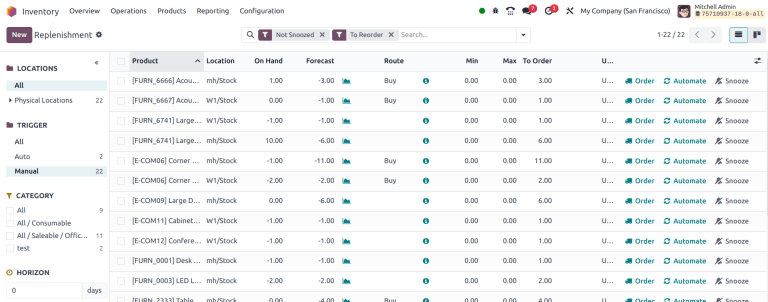

====================
Replenishment report
====================

.. |SO| replace:: :abbr:`SO (Sales Order)`
.. |SOs| replace:: :abbr:`SOs (Sales Orders)`

The *replenishment report* is an interactive dashboard that uses :doc:`manual reordering rules
<reordering_rules>`, lead times, and upcoming demands to forecast quantities of products that need
restocking.

Reordering rules used on this dashboard are normal reordering rules, but the user benefits from a
monitoring menu with extra options to manage suggestions for replenishment.

This enables users to anticipate future needs, keep less products on hand without the risk of
running out, plan and consolidate orders.

To access the replenishment report, go to :menuselection:`Inventory app --> Operations -->
Replenishment.`

The fields and features unique to the replenishment dashboard are displayed below. For definitions
of the other fields, go to the :ref:`Create reordering rules section
<inventory/warehouses_storage/rr-fields>`.

By default, the quantity in the :guilabel:`To Order` field is the quantity required to reach the set
:guilabel:`Max Quantity`. However, the :guilabel:`To Order` quantity can be adjusted by clicking on
the field and changing the value. To replenish a product manually, click :icon:`fa-truck`
:guilabel:`Order Once`.

Clicking :icon:`fa-bell-slash` :guilabel:`Snooze` temporarily deactivates the reordering rule for
the set period, hiding the entry from the replenishment dashboard, when it is supposed to appear.

.. tip::
   Defining a :guilabel:`Vendor` allows filtering or grouping demands by the vendor. This simplifies
   the process of identifying products to order and can reduce shipment costs.

.. note::
   Automatic reordering rules appear on this menu, too but are hidden by default.

Replenishment information
=========================

In each line of the replenishment report, clicking the :icon:`fa-info-circle` :guilabel:`(info)`
icon opens the :guilabel:`Replenishment Information` pop-up window, which displays the *lead times*
and *forecasted date*.

For detailed information on how to use this feature for replenishment, go to the :ref:`Just in time
logic <inventory/warehouses_storage/just-in-time>` section.

