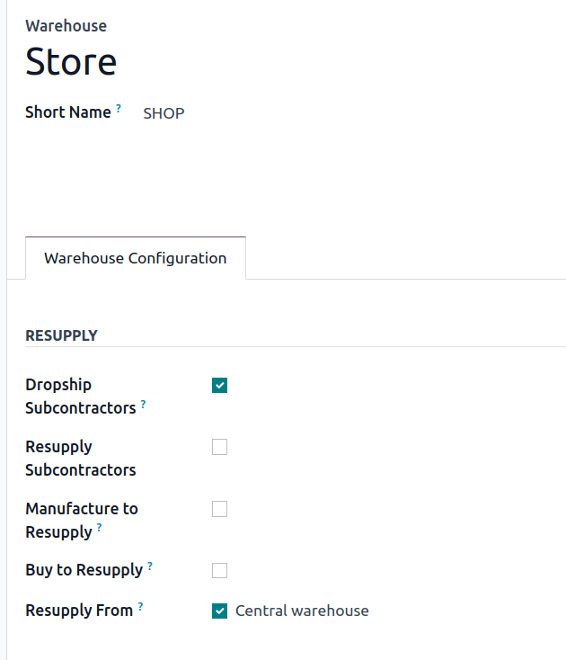

=============================
Inter-warehouse replenishment
=============================

.. |MTO| replace:: :abbr:`MTO (Make to Order)`

When a business operates multiple locations, such as warehouses, retail shops, or manufacturing
facilities, resupplying stock from a central warehouse is sometimes necessary. Odoo uses a *Route*
configuration that enables locations to replenish from a central distribution center, automatically
generating *inter-warehouse transfers*. Odoo :guilabel:`Inventory` manages these transfers to keep
stores in stock.

This guide explains how to conduct inter-warehouse transfers using two replenishment strategies:

#. :ref:`Make to order (MTO) <inventory/warehouses_storage/MTO>`
#. :ref:`Reordering rule <inventory/warehouses_storage/reordering-rule>`

.. seealso::
   :doc:`Difference between MTO and reordering rules <../replenishment>`

Configuration
=============

The initial configuration for both replenishment strategies is the same. First go to
:menuselection:`Inventory app --> Configuration --> Settings`. In the :guilabel:`Warehouse` section,
activate :guilabel:`Storage Locations`. Then, click :guilabel:`Save` to apply the setting.

.. image:: resupply_warehouses/storage-locations.png
   :align: center
   :alt: Enable Storage Locations in Inventory settings.

Warehouses
----------

Configure the settings for the central warehouse and connecting storage locations by going to
:menuselection:`Inventory app --> Configuration --> Warehouses`.

.. important::
   Each central warehouse and other locations *must* have its own warehouse. For example, each shop
   is considered a local warehouse.

Select an existing warehouse, or create a new one to be resupplied from the central warehouse, by
clicking :guilabel:`New`. Then, give the warehouse a name and a :guilabel:`Short Name`, which will
appear on that warehouse's transfers.

In the :guilabel:`Warehouse Configuration` tab, locate the :guilabel:`Resupply From` field. Check
the box next to the central warehouse's name. If the warehouse can be resupplied by more than one
warehouse, make sure to check those warehouses' boxes too. Now, Odoo knows which warehouses can
resupply this warehouse.

.. example::
   The central warehouse that will supply the shops is called `Central warehouse`. The
   :guilabel:`Resupply From` field is set to this warehouse on the shop's warehouse configuration
   page.

.. seealso::
   :doc:`../inventory_management/warehouses`

Set route on a product
----------------------

Products must also be configured properly in order for them to be transferred between warehouses.

Go to :menuselection:`Inventory app --> Products --> Products` and select the desired product.

In the :guilabel:`Inventory` tab, the new route appears as :guilabel:`X: Supply Product from Y` in
the :guilabel:`Routes` section, where 'X' is the store's warehouse that receives products, and 'Y'
is the warehouse that sends products.

Tick the :guilabel:`X: Supply Product from Y` checkbox, which is intended to be used with the |MTO|
route or a reordering rule to replenish stock by moving the product from one warehouse to another.
Proceed to the dedicated sections below to continue the process.

.. _inventory/warehouses_storage/MTO:

MTO
~~~

To replenish products using the make-to-order method, go to the product form and ensure the
:ref:`MTO route is unarchived <inventory/warehouses_storage/unarchive-mto>`, so it appears in the
:guilabel:`Routes` section of the :guilabel:`Inventory` tab.

With the resupply and |MTO| routes ticked, jump to the section titled: :ref:`Replenish from another
warehouse <inventory/warehouses_storage/resupply-workflow>`.

.. example::
   The product, sold at the warehouse, `Store`, is resupplied from the central warehouse, named
   `YourCompany`. To replenish the product using |MTO|, the following routes are selected:

   - :guilabel:`Store: Supply Product from YourCompany`
   - :guilabel:`Replenish on Order (MTO)`

   .. image:: resupply_warehouses/resupply-route.png
      :align: center
      :alt: Route setting which enables a product to resupplied from a second warehouse.

.. _inventory/warehouses_storage/reordering-rule:

Reordering rule
~~~~~~~~~~~~~~~

To replenish products using reordering rules, first ensure the :guilabel:`X: Supply Product from Y`
route is selected in the :guilabel:`Inventory` tab of the product form.

Then, create a reordering rule to automate replenishment by clicking the :guilabel:`Reordering
Rules` smart button.

Click :guilabel:`New`, and set:

- :guilabel:`Location`: the stock location of the retail store. For example, `SHOP/Stock`.
- :guilabel:`Route`: :guilabel:`X: Supply Product from Y`.
- :guilabel:`Min Quantity` and :guilabel:`Max Quantity` to trigger automatic stock transfers when
  inventory falls below the set threshold.

.. seealso::
   :doc:`reordering_rules`

.. example::
   A :ref:`0/0 reordering rule <inventory/warehouses_storage/zero-zero>` to replenish the shop's
   warehouse is created, with the :guilabel:`Location` set to `SHOP/Stock`, and the
   :guilabel:`Route` set to :guilabel:`Store: Resupply from YourCompany`.

   .. image:: resupply_warehouses/reordering-rule.png
      :align: center
      :alt: Show reordering rule configurations.

.. _inventory/warehouses_storage/resupply-workflow:

Replenish one warehouse from another
====================================

After completing the setup, trigger replenishment using one of several methods, such as:

- Navigate to the product form of the product that is resupplied from another warehouse.

  Click the :guilabel:`Replenish` button on the top-left of the product page. In the pop-up window,
  set the warehouse to the retail shop, (e.g. `Store`), and click :guilabel:`Confirm`.

  .. image:: resupply_warehouses/replenish.png
     :align: center
     :alt: Replenish pop-up window on the product form.

- Create a quotation, and in the :guilabel:`Other Info` tab, set the :guilabel:`Warehouse` to the
  retail shop (e.g. `Store`), when selling the product makes the on-hand quantity of the product go
  below the minimum set on the reordering rule.

  .. image:: resupply_warehouses/warehouse-field.png
     :align: center
     :alt: Create a quote at the store.

Once triggered, Odoo creates two transfers: One is a *delivery order* from the central, supplying
warehouse, which contains all the necessary products to the store, and the second is a *receipt* at
the shop, from the main warehouse.

While in transit, the product is located at `Physical Locations/Inter-warehouse transit`.

.. example::
   A sales order for the product at the shop is created. To replenish the product at the shop and
   ship it from there, Odoo generates a delivery order from the central warehouse's stock,
   `WH/Stock` to the shop's warehouse `SHOP/Stock`. While the products are traveling between
   warehouses, they are in `Physical Locations/Inter-warehouse transit`.

   The final delivery order is from the shop to the customer's delivery address, and is not
   pertinent to the workflow in this guide.

   .. image:: resupply_warehouses/transfers.png
      :alt: Show shipments from warehouse to store.

