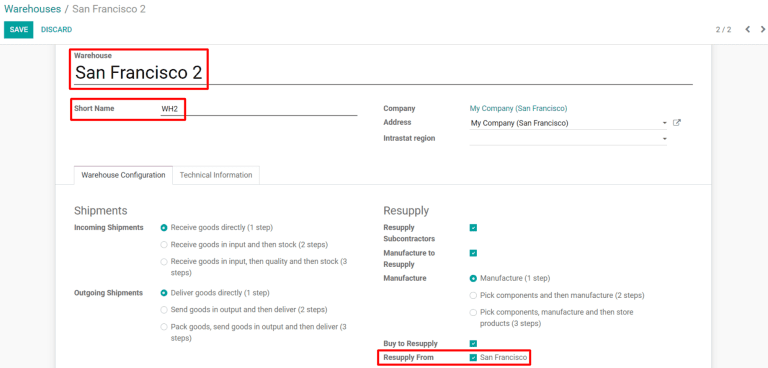
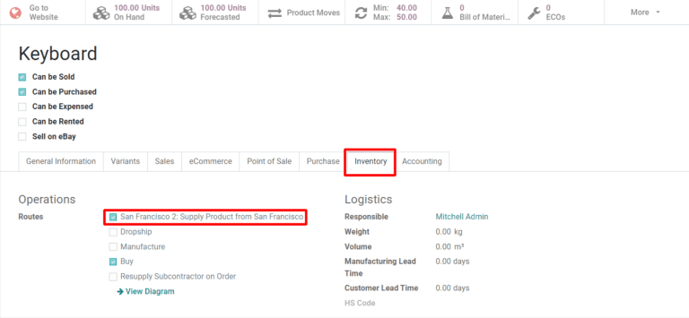
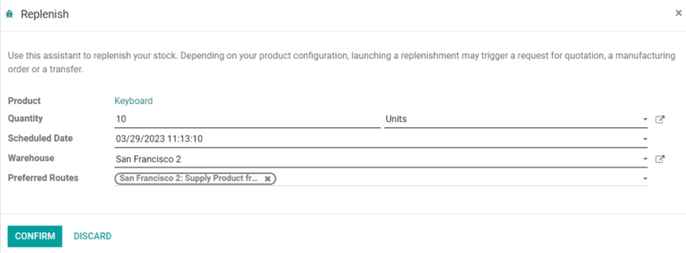
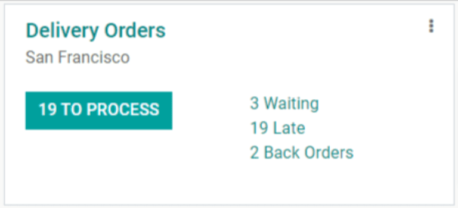
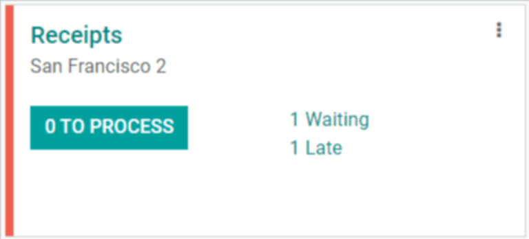
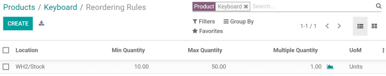

========================================================
Transfer products between warehouses using replenishment
========================================================

For companies that use multiple warehouses, it is often necessary to transfer items between them.
This is referred to as an *inter-warehouse transfer*. Odoo *Inventory* handles the administrative
process of inter-warehouse transfers to ensure that inventory counts remain accurate during and
after the transfer. This document will detail the method for conducting an inter-warehouse transfer
using replenishment.

Configure warehouses for inter-warehouse replenishment
======================================================

First, ensure the :guilabel:`Multi-Step Routes` setting is enabled by navigating to
:menuselection:`Inventory --> Configuration --> Settings`, and then check the box under the
:guilabel:`Warehouse` tab. This will provide additional configuration options when creating a second
warehouse that are needed for inter-warehouse replenishment.

By default, Odoo comes with a main warehouse already configured. If an additional warehouse has not
already been created, do so now from the :guilabel:`Inventory` module by selecting
:menuselection:`Configuration --> Warehouses --> Create`. Otherwise, select the warehouse that
products will be transferred to from the :guilabel:`Warehouses` page and then click :guilabel:`Edit`
to change its settings. Configure the warehouse as follows:

- :guilabel:`Warehouse`: choose a name that is not already being used for another warehouse (e.g.
  `Alternative Warehouse`)
- :guilabel:`Short Name`: choose a short name by which the warehouse will be identified (e.g.
  `ALT_WH`)

Click :guilabel:`Save` and the new warehouse will be created. In addition, a new :guilabel:`Resupply
From` field will appear on the warehouse's form. Click :guilabel:`Edit` and then check the box next
to the warehouse that will be used to resupply the warehouse that is currently being configured.

.. note::
   For the purposes of this demonstration, the warehouse that products are transferred from
   (outgoing) will be titled "San Francisco", and the warehouse that products are transferred to
   (incoming) will be titled "San Francisco 2".

Configure products for inter-warehouse replenishment
====================================================

Products must also be configured properly in order for them to be transferred between warehouses.
Navigate to :menuselection:`Inventory --> Products --> Products` and select an existing product or
:guilabel:`Create` a new one, if necessary.

Then, on the product form, go to the :guilabel:`Inventory` tab and enable the checkbox for
:guilabel:`X: Supply Product from Y`, with *X* being the warehouse receiving the transferred
products and *Y* being the warehouse that products are transferred from.

Replenish one warehouse from another
====================================

Starting in the :menuselection:`Inventory` module, select :menuselection:`Products --> Products` and
then choose the product that will be replenished. Click the :guilabel:`Replenish` button on the top
left of the product page and fill out the pop-up form as follows:

- :guilabel:`Quantity`: the number of units that will be sent to the warehouse being replenished
- :guilabel:`Scheduled Date`: the date that the replenishment is scheduled to take place
- :guilabel:`Warehouse`: the warehouse that will be replenished
- :guilabel:`Preferred Routes`: select `X: Supply Product from Y`, with *X* being the warehouse to
  be replenished and *Y* being the warehouse that the product will be transferred from

Click :guilabel:`Confirm` and a delivery order will be created for the outgoing warehouse along with
a receipt for the warehouse that will receive the product. Depending on the configuration settings
for the outgoing and incoming warehouses, processing delivery orders and receipts will require
between one and three steps. This document will detail how to process one-step deliveries and
receipts.

Process the delivery order
--------------------------

The first stage of a replenishment order is processing the delivery from the warehouse that the
product is being transferred from. On the :menuselection:`Inventory` dashboard, select the
:guilabel:`X to Process` button on the :guilabel:`Delivery Orders` card for the outgoing warehouse,
then the delivery order created for the replenishment. On the delivery order page, click the
:guilabel:`Check Availability` button in the top left to reserve the quantity of the product to be
transferred. Once the delivery has been dispatched, click the :guilabel:`Validate` button to
register the quantities shipped.

Process the receipt
-------------------

Once the goods arrive at the incoming warehouse, the receipt created for that warehouse must be
processed as well. Return to the :menuselection:`Inventory` dashboard and select the :guilabel:`X to
Process` button on the :guilabel:`Receipts` card for the incoming warehouse, then the receipt
created for the replenishment. On the receipt page, click the :guilabel:`Validate` button in the top
left of the page to register the quantities received.

After processing the receipt, the products transferred will now appear in the inventory of the
incoming warehouse. The stock numbers for both warehouses can be viewed by returning to the product
page and selecting the :guilabel:`X Units On Hand` button at the top of the screen.

Automate inter-warehouse replenishment
======================================

Using reordering rules, it is possible to automate the process of replenishing one warehouse from
another.

To get started, navigate to :menuselection:`Inventory --> Products --> Products`, and then
choose the product that will be replenished. From the product page, select the :guilabel:`Reordering
Rules` smart button at the top of the form, and then on the next page, click :guilabel:`Create` to
configure the form as follows:

- :guilabel:`Location`: the location that the reordering rule will replenish when triggered, in this
  case, the incoming warehouse
- :guilabel:`Min Quantity`: when the quantity on hand at the incoming warehouse falls below this
  number, the reordering rule will be triggered
- :guilabel:`Max Quantity`: when the reordering rule is triggered, the product will be replenished
  at the incoming warehouse up to this quantity
- :guilabel:`Multiple Quantity`: specify if the product should be replenished in batches of a
  certain quantity; for example, a product could be replenished in batches of 20
- :guilabel:`UoM`: the unit of measure used for reordering the product; this value can simply be
  `Units`, or a specific unit of measurement for weight, length, etc.

Finish by clicking :guilabel:`Save` and the reordering rule will be created. Now, when the scheduler
runs automatically each day, a transfer will be created for each reordering rule that has been
triggered.

.. tip::
   To manually trigger reordering rules, start from the :menuselection:`Inventory` module and select
   :menuselection:`Operation --> Run Scheduler`, then click the green :guilabel:`Run Scheduler`
   button in the pop-up that appears.

After the scheduler runs, a delivery order and receipt will be created for the outgoing and incoming
warehouses, respectively. Both the delivery order and receipt should be processed using the same
method as detailed above.
