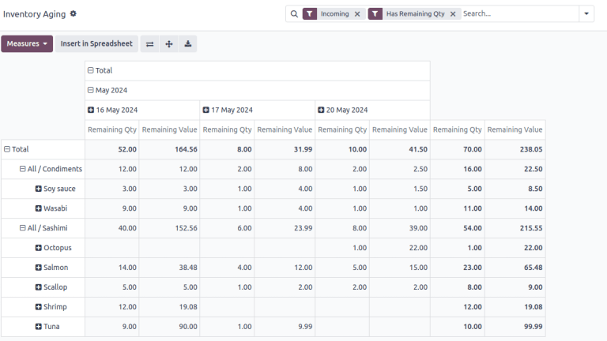

======================
Inventory aging report
======================

.. |SVLs| replace:: :abbr:`SVLs (stock valuation layers)`

The inventory aging report evaluates all items in stock, providing insights into potentially sunken
purchase costs and delays in profitability.

Create customized pivot tables to analyze product, operation types, month, or company breakdowns.
This helps identify products in stock that are at risk of passing their expiration or viability
dates, or instances of rot/decay for fast-expiring items.

.. note::
   The *Reporting* menu in *Inventory* is only accessible to users with :doc:`admin access
   <../../../../general/users/access_rights>`.

To access the inventory aging report, go to :menuselection:`Inventory app --> Reporting -->
Inventory Aging`.

.. _inventory/warehouses_storage/aging-report:

Navigate the inventory aging report
===================================

By default, the :guilabel:`Inventory Aging` report displays a pivot table, with the month in
columns, and product category in rows. The default filters, :guilabel:`Incoming` and :guilabel:`Has
Remaining Qty`, show only products from receipts, and are currently in stock.

:guilabel:`Remaining Qty` displays the number of on-hand items, and :guilabel:`Remaining Value`
displays the total cost of purchasing these items.

Clicking the :icon:`fa-plus-square` :guilabel:`(plus)` icon in each column or row reveals options to
expand the pivot table and show a detailed breakdown of the :guilabel:`Remaining Qty` and
:guilabel:`Remaining Value` by :guilabel:`Product`, :guilabel:`Product Category`, :guilabel:`Date`,
or :guilabel:`Company`. Clicking the :icon:`fa-minus-square-o` :guilabel:`(minus)` icon collapses it
back to its previous state.

   Inventory aging report, showing each **Product** in rows and each reception **Date** in columns,
   to better monitor products with fast expiration dates. Each row shows the the total on-hand
   quantity and inventory valuation of items purchased on each day.

.. note::
   Records in the :guilabel:`Inventory Aging` report are *stock valuation layers* (SVLs),
   representing product moves that impact stock valuation.

   Inventory adjustments do **not** create |SVLs|; only items purchased from vendors do.

Generate reports
================

After learning how to :ref:`navigate the inventory aging report
<inventory/warehouses_storage/aging-report>`, it can be used to create and share different reports.

A few common reports that can be created using the :guilabel:`Inventory Aging` report are detailed
below.

Rotating stock report
---------------------

To create a report to identify items that have been in stock for a while, follow these steps:

#. Navigate to :menuselection:`Inventory app --> Reporting --> Inventory Aging`.
#. On the :guilabel:`Inventory Aging` report, click the :icon:`fa-caret-down` :guilabel:`(caret
   down)` icon in the :guilabel:`Search...` bar to see a drop-down list of :guilabel:`Filters`,
   :guilabel:`Group By`, and :guilabel:`Favorite` options.
#. Choose :guilabel:`Product` under the :guilabel:`Group By` section. Doing so expands the pivot
   table to show a product in each row.
#. Click the :icon:`fa-plus-square` :guilabel:`(plus)` icon to the left of the date column. Hover
   over :guilabel:`Date` from the drop-down menu and choose :guilabel:`Year`, :guilabel:`Quarter`,
   :guilabel:`Month`, :guilabel:`Week`, or :guilabel:`Day`. Doing so expands the columns to show the
   :guilabel:`Remaining Qty` and :guilabel:`Remaining Value` by the selected time period.

   .. tip::
      For products that have a longer shelf life, choose longer time periods such as
      :guilabel:`Month` or :guilabel:`Quarter` when expanding columns by :guilabel:`Date`.

   .. image:: aging/column-expand-icon.png
      :align: center
      :alt: Pivot table, highlighting the plus icon to expand columns.

#. The report now displays the on-hand stock of items, and their total purchasing cost, for each
   time period.

   .. example::
      Inventory aging report, with the :guilabel:`Group By`: :guilabel:`Product` option selected,
      and with the :guilabel:`Date` column set to :guilabel:`Day`. It gives insight into how much
      raw fish sashimi products were purchased on each day, and how much it cost. This informs the
      business owners how much stock is at risk of rotting in stock, per day.

      .. image:: aging/inventory-aging.png
        :align: center
        :alt: Inventory aging report, showing product row items and day columns.

