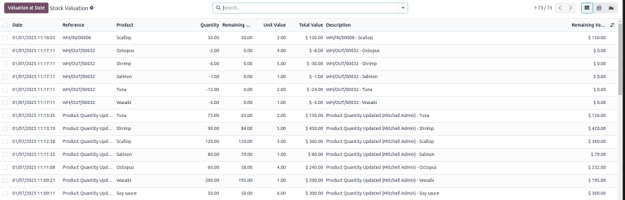
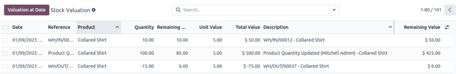
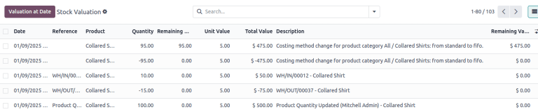
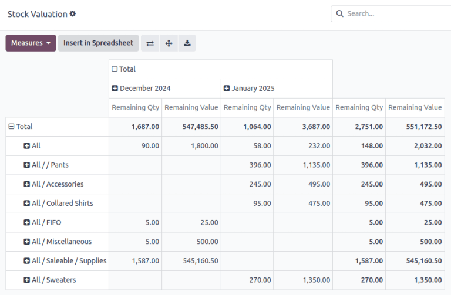

=========================
Stock valuation dashboard
=========================

.. |SVLs| replace:: :abbr:`SVLs (stock valuation layers)`

When a company has physical assets, such as inventory, they often want to know approximately how
much has been spent on these goods, or how much they are worth at the moment. This process of
assigning a monetary value to account for inventory is known as *stock valuation*.

This value is often reported for accounting purposes. For instance, an insurance company may want to
know the value of goods stored in a warehouse, in the event of a flood or fire.

:doc:`Stock valuation <../../product_management/inventory_valuation/using_inventory_valuation>`
typically utilizes one of two accounting systems:

- **Perpetual**: The inventory is constantly (perpetually) being updated, and the value is
  constantly changing.
- **Periodic**: The inventory value is checked on an occasional (periodic) basis, and the value is
  set at this occasional time.

Using :ref:`tracked inventory <inventory/product_management/tracking-inventory>` in Odoo
necessitates a *perpetual* inventory accounting system because of the need to know when and where
inventory exists, and how much of it is available or forecasted. There are a few common :ref:`stock
valuation methods <inventory/warehouses_storage/costing_methods>` used in Odoo: *standard price*,
*average cost* (AVCO), and *first in, first out* (FIFO) accounting. It is important to know that the
valuation method chosen for a product impacts the calculation of several fields in the stock
valuation reports.

Open the dashboard
==================

Odoo's *Stock Valuation* dashboard displays the financial value of all tracked inventory, according
to each product's stock valuation method. This report can provide insights into potential issues in
the supply chain, such as sunken purchase costs or delays in profitability. To access the dashboard,
go to :menuselection:`Inventory app --> Reporting --> Valuation`.

.. important::
   The :menuselection:`Reporting`` menu in **Inventory** is only accessible to users with
   :doc:`admin access <../../../../general/users/access_rights>`.

This dashboard has three different views, or inventory reports — :ref:`list view
<inventory/warehouses_storage/valuation-report>` (i.e. the default stock valuation report),
:ref:`pivot view <inventory/warehouses_storage/aging-report>` (i.e. the stock aging report), and
:ref:`graph view <inventory/warehouses_storage/graph-view>`. Each view can be customized with
different fields to break down inventory valuation by product, operation type, date, or company.

All three views can be filtered by various fields. To apply filters, click into the search bar at
the top of the report, or click the drop-down arrow next to it. For example, selecting the filter
:guilabel:`Has Remaining Qty` will show only products that are currently in stock.

.. _inventory/warehouses_storage/valuation-report:

List view: stock valuation
==========================

By default, the :guilabel:`Stock Valuation` dashboard displays in *list view*, represented by the
:icon:`oi-view-list` :guilabel:`(list)` icon. This report shows a detailed record of stock movements
and their valuations.

Configure
---------

The following columns are displayed by default:

- :guilabel:`Date`: the date and time when the :ref:`stock move <inventory/warehouses_storage/svl>`
  was created. The valuation report is sorted by this field by default, emphasizing the importance
  of time when valuing inventory. To sort the report by a different column, simply click on the
  column title.
- :guilabel:`Reference`: the reference document associated with this stock move (e.g., a warehouse
  receipt, a delivery order, or a manual inventory adjustment).
- :guilabel:`Product`: the product that is being moved and valued.
- :guilabel:`Quantity`: the number of units by which this product's stock has increased or
  decreased in this particular stock move.
- :guilabel:`Total Value`: the value of the product's stock in this particular stock move,
  calculated by multiplying the :guilabel:`Quantity` and :guilabel:`Unit Value`.

.. note::
   If a :guilabel:`Reference` document includes several goods, there will be a separate line item
   generated on the report for each good.

There are additional fields that can be added to this view to provide more insight into the stock's
valuation. To add fields, click the :icon:`oi-settings-adjust` :guilabel:`(adjust)` icon, and select
the desired fields:

- :guilabel:`Lot/Serial Number`: the uniquely identifying lot or serial number for this product.
- :guilabel:`Company`: for businesses that operate with multiple companies, this field displays the
  company by which this stock move took place.
- :guilabel:`Remaining Quantity`: the number of units remaining for this valuation of the product,
  after demand has been accounted for (even from other stock moves). This field can be especially
  helpful for :abbr:`FIFO (First In, First Out)` and :abbr:`AVCO (Average Cost)` accounting, as it
  conveys which units of stock came into a warehouse first and the value of said stock.
- :guilabel:`Unit Value`: the cost of one unit of the product for the company (**not** the price to
  consumers).
- :guilabel:`Description`: a description of the reason for this stock valuation (typically, a stock
  move has occurred). By default, this field is set as the concatenation of the
  :guilabel:`Reference` and :guilabel:`Product` fields. However, the field may also display other
  important messages for this line item, such as a note stating that the line item is an adjustment
  due to a change in the product's inventory valuation method.
- :guilabel:`Remaining Value`: the value of this product's current stock levels for this particular
  stock move, after demand has been accounted for. Along with :guilabel:`Remaining Quantity`, this
  field can be especially helpful for :abbr:`FIFO (First In, First Out)` and
  :abbr:`AVCO (Average Cost)` accounting, as they convey which stock came into a warehouse first and
  the value of said stock.

.. tip::
   Some of these settings may not appear unless first enabled in Odoo's **:doc:`Settings
   <../../../general>`** application.

.. _inventory/warehouses_storage/svl:

Stock valuation layers (SVLs)
-----------------------------

Each line item in the :guilabel:`Stock Valuation` report represents a record in Odoo's system known
as a *stock valuation layer (SVL)*. :abbr:`SVLs (stock move layers)` are generated when products
move in a way that impacts their stock valuation. Specifically, the stock moves that generate
:abbr:`SVLs (stock move layers)` are warehouse receipts, deliveries, dropshipping orders, and
dropshipping returns. These stock moves must first be validated (by clicking the
:guilabel:`Validate` button) for the :abbr:`SVL (stock move layer)` to be created.

If a product's inventory valuation method changes on the product form, new line items are generated
on the :guilabel:`Stock Valuation` report to reflect the resulting :abbr:`SVLs (stock move layers)`.
For example, if the valuation method changes from *standard price* to either :abbr:`AVCO (Average
Cost)` or :abbr:`FIFO (First In, First Out)` accounting, *revaluation entries* will be
automatically posted to reflect the change in pricing for goods that remain in stock. One entry will
be negative to "remove" the old pricing, and the second entry will be positive to record the new
pricing. These entries are connected to journal entries in Odoo's **Accounting** app.

Below is an example of what the :guilabel:`Stock Valuation` table shows when a few stock moves have
occurred for a product using standard price accounting.

Conversely, the following image depicts what the *Stock Valuation* Report table might look like
after a product has switched from standard price to :abbr:`FIFO (First In, First Out)` accounting.

.. example::
   The :guilabel:`Remaining Value` and :guilabel:`Remaining Quantity` fields are derived from what
   occurs at the :abbr:`SVL (stock move layer)` level in Odoo and, as such, are better understood
   with an example.

   Frankie's Consignment Shop buys sweaters at the cost, or :guilabel:`Unit Value`, of `5.00`
   dollars. For the first time, Frankie's purchases and receives a :guilabel:`Quantity` of `100.00`
   sweaters in one stock move, then re-sells and delivers `-10.00` sweaters in a second stock move.

   In the first stock move line item, the :guilabel:`Remaining Quantity` will change from `100.00`
   to `90.00`, once the second stock move is recorded. This change reflects that, although 100
   sweaters were originally purchased, only 90 of those sweaters remain in stock and should be
   counted in the valuation. Similarly, the :guilabel:`Remaining Value` will drop from `$500.00` to
   `$450.00`. The :guilabel:`Total Value` will remain at `$500.00`, regardless of subsequent
   transactions.

   On the other hand, the :guilabel:`Remaining Quantity` of the second stock move line item will be
   recorded and remain at `0.00` because the quantity of `-10.00` was sold. In the system, because
   the :abbr:`SVL (stock move layer)` was a sale, there is no stock left that needs to be valued
   from that transaction.

   .. image:: aging/remaining-val-quant.png
      :alt: Remaining value and quantity are calculated based on :abbr:`SVLs (stock move layers)`.

Change the valuation date
-------------------------

To see the valuation of stock moves at a specific date and time, click the :guilabel:`Valuation At
Date` button, located in the top-left corner of the :guilabel:`Stock Valuation` page. The report
will show the :guilabel:`Quantity` and :guilabel:`Total Value` of each stock move.

.. note::
   The :guilabel:`Remaining Quantity` and :guilabel:`Remaining Value` of the stock moves will *not*
   be point-in-time for any dates chosen in the past. The stock moves shown when selecting a past
   date will still display the *current on-hand quantity and value* of the products.

.. example::
   A business has 100 sofas in stock on January 1st and sells 20 of those sofas on February 1st. The
   :guilabel:`Remaining Quantity` of the :abbr:`SVL (stock move layer)` will drop from `100.00` to
   `70.00` on February 1st. If no other stock moves take place, and on February 1st, the
   :guilabel:`Valuation at Date` is selected as January 1st, the :guilabel:`Remaining Quantity`
   will still show as `70.00`.

.. _inventory/warehouses_storage/aging-report:

Pivot view: stock aging
=======================

From the :guilabel:`Stock Valuation` dashboard, access pivot view by clicking the
:icon:`oi-view-pivot` :guilabel:`(pivot)` icon. This view is essentially a *stock aging report*, and
it shows the on-hand quantity and value of inventory by purchase date, which can help monitor
products with expiration dates.

Configure
---------

By default, the pivot view shows the value of all *product categories* by *day and month*. Clicking
the :icon:`fa-plus-square` :guilabel:`(plus)` icon in each column or row will reveal a drop-down
list of options to create a more granular breakdown of the inventory valuation. The drop-down
options include: :guilabel:`Product`, :guilabel:`Lot/Serial Number`, :guilabel:`Product Category`,
:guilabel:`Date`, :guilabel:`Company`, or :guilabel:`Add Custom Group` Clicking the
:icon:`fa-minus-square-o` :guilabel:`(minus)` icon collapses the field back to an empty state.

In the table, the :guilabel:`Remaining Qty` column displays the number of on-hand items, and
:guilabel:`Remaining Value` displays the total cost of purchasing these items.

.. _inventory/warehouses_storage/graph-view:

Graph view
==========

The stock value can be depicted graphically by clicking the :icon:`fa-area-chart`
:guilabel:`(graph)` icon. By default, the graph is displayed in :icon:`fa-line-chart` line chart
view and filtered to show the cumulative total of all inventory value over time in Odoo.

At the top of the report, a :icon:`fa-bar-chart` bar chart or :icon:`fa-pie-chart` pie chart view
can be selected instead.

.. seealso::
   :doc:`Odoo reporting essentials <../../../../essentials/reporting>`
