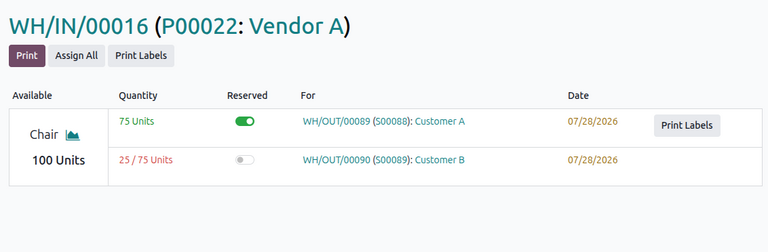
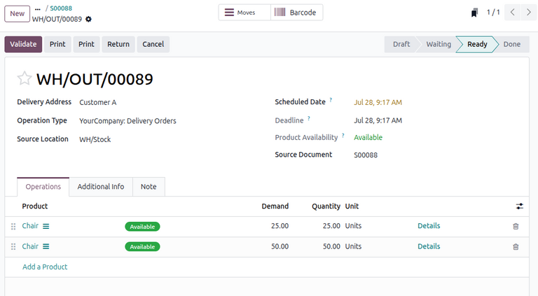
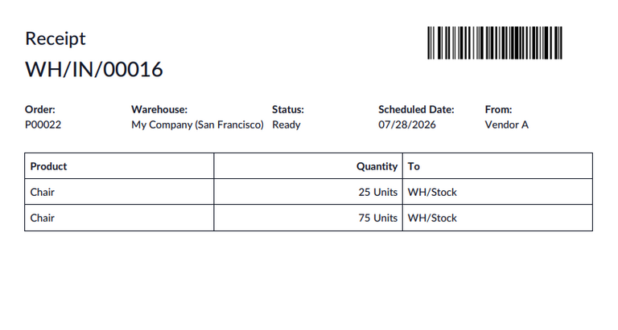
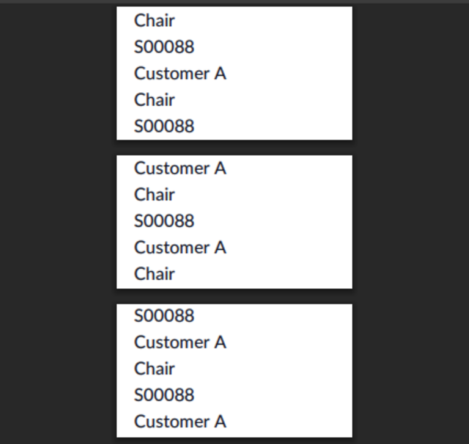

=================
Allocation report
=================

.. |SO| replace:: :abbr:`SO (sales order)`
.. |SOs| replace:: :abbr:`SOs (sales orders)`
.. |RfQ| replace:: :abbr:`RfQ (request for quotation)`
.. |PO| replace:: :abbr:`PO (purchase order)`
.. |POs| replace:: :abbr:`POs (purchase orders)`
.. |MO| replace:: :abbr:`MO (manufacturing order)`
.. |MOs| replace:: :abbr:`MOs (manufacturing orders)`

In Odoo, users can use allocation reports to manually reserve units from incoming stock (either
purchased or manufactured) for outgoing demands, such as sales orders (SOs) or components on
manufacturing orders (MOs).

Odoo normally reserves existing stock to outgoing demands automatically based on their scheduled
date. However, users may sometimes need to manually prioritize specific outgoing orders over other
competing demands, especially when existing stock for a product does not adequately fulfill those
demands.

The following documentation covers the process of using an allocation report to manually assign
incoming units of a product from a purchase order (PO) or a manufacturing order (MO) to fulfill
either an |SO| containing the purchased product or an |MO| with the product as a component.

.. _inventory/allocation_report/configuration:

Configuration
=============

By default, allocation reports are automatically enabled for incoming moves (e.g., receipts
generated from |POs|). However, for some operations, users must manually enable the feature.

To do so, navigate to :menuselection:`Inventory app --> Configuration --> Operations Types`. On the
dashboard, click the desired :guilabel:`Operation Type` (e.g., `Receipts` or `Manufacturing`), then
verify that the :guilabel:`Show Allocation` checkbox is enabled. Enabling this option automatically
displays the option to view an :ref:`allocation report
<inventory/allocation_report/workflow/report>` for the specific operation.

.. _inventory/allocation_report/workflow:

Workflow
========

The following outline summarizes all necessary steps for allocating a product using allocation
reports:

#. Verify that outgoing demand exists for the product in previously confirmed |SOs| or |MOs|. If
   not, :ref:`create them <inventory/allocation_report/workflow/confirm_demand>`.
#. If existing stock cannot fulfill the demand, create and :ref:`confirm a PO or MO
   <inventory/allocation_report/workflow/confirm_replenish>` to replenish the demanded products.
#. Open the receipt or |MO| and :ref:`use the allocation report
   <inventory/allocation_report/workflow/report>` to allocate products.
#. :ref:`Validate the incoming units <inventory/allocation_report/workflow/validate_incoming>` into
   stock.
#. :ref:`Validate the outgoing units <inventory/allocation_report/workflow/validate_outgoing>` to
   fulfill the original demand.

The process begins by ensuring that an outstanding demand for the product already exists. Confirming
a |PO|/|MO| replenishes the stock necessary to meet the demand in the originating |SO|/|MO| either
by purchasing it or by manufacturing it.

On the receipt from the |PO| or on the confirmed |MO|, users can open the allocation report, which
displays the incoming product. Next to the product is a list of all applicable outgoing transfers
(i.e., originating |SOs|/|MOs| containing the product) to which incoming units can be assigned.
Assigning these units does not move any inventory. Instead, it allows the user to flexibly choose
which demands to prioritize before actually receiving incoming units. When those units are received,
the user can fulfill the original demands.

.. note::
   If multiple products are replenished through the |PO|/|MO|, the allocation report lists all
   products with originating |SOs|/|MOs| available for reservation.

.. _inventory/allocation_report/workflow/confirm_demand:

Create and confirm demand
-------------------------

Using allocation reports for specific products requires either a previously confirmed |SO| with the
product or an |MO| where the product is used as a component. If no such record exists, create it.

.. important::
   To ensure Odoo can properly create allocations for purchased products, confirm that the selected
   products have the :guilabel:`Purchase` option selected and the :guilabel:`Product Type` set to
   :guilabel:`Goods`.

   For manufactured products, ensure that the product has a :doc:`bill of materials
   <../../../manufacturing/basic_setup/bill_configuration>` configured.

Create |SOs|
~~~~~~~~~~~~

If no confirmed |SO| exists for the product, :doc:`create it
<../../../../sales/sales/sales_quotations/create_quotations>` by opening a new sales quotation form.
In the order lines, ensure that the requested :guilabel:`Product` and its :guilabel:`Quantity` are
specified. Then, confirm the quotation by clicking :guilabel:`Confirm Order`. This turns the
quotation into a confirmed |SO| and generates a delivery order, accessible via the :icon:`fa-truck`
:guilabel:`Delivery` smart button.

Repeat this process if there are multiple customers demanding the product.

Create |MOs|
~~~~~~~~~~~~

If there is no confirmed |MO| with the product as a component, :ref:`create it
<manufacturing/basic_setup/create-mo>` by opening a new |MO| form. In the component lines, add the
requested :guilabel:`Product` and the quantity :guilabel:`To Consume`, then confirm the |MO| by
clicking :guilabel:`Confirm`.

Repeat this process if there are multiple |MOs| requiring the component.

.. _inventory/allocation_report/workflow/confirm_replenish:

Create and confirm |PO| or |MO|
-------------------------------

After confirming existing demand for the product, replenish the necessary stock either by purchasing
it through a |PO| or by manufacturing it through an |MO|.

Replenish through |PO|
~~~~~~~~~~~~~~~~~~~~~~

To create a |PO|, navigate to the **Purchase** app and click :guilabel:`New` to create a new Request
for Quotation (RfQ). On the form, add the products in demand on the customers' |SOs| by clicking
:guilabel:`Add a product` in the *Products* tab and specifying the required :guilabel:`Quantity`.

After adding the products, click :guilabel:`Confirm Order` to turn the |RfQ| into a |PO|.

Replenish through |MO|
~~~~~~~~~~~~~~~~~~~~~~

To create an |MO|, navigate to :menuselection:`Manufacturing app --> Operations --> Manufacturing
Orders`. Then, click :guilabel:`New` to open a new |MO| form. Select the :guilabel:`Product` and
enter the :guilabel:`Quantity` to replenish.

Finally, :guilabel:`Confirm` the |MO|.

.. _inventory/allocation_report/workflow/report:

Allocating using the report
---------------------------

After confirming the replenishment for the product, open the allocation report to assign the pending
incoming stock to any available originating |SOs|/|MOs| requiring the product.

For confirmed |POs|, click the :icon:`fa-truck` :guilabel:`Receipt` smart button at the top of the
|PO| to open the receipt for the incoming stock of the product.

Then, click the :icon:`fa-list` :guilabel:`Allocation` smart button at the top.

.. tip::
   Alternatively, to open the receipt, navigate to the **Inventory** app and click :guilabel:`(#) To
   Process` in the :guilabel:`Receipts` card. Then, select the appropriate receipt.

For confirmed |MOs|, the :icon:`fa-list` :guilabel:`Allocation` smart button appears directly in the
|MO|.

.. important::
   If the :guilabel:`Allocation` smart button does not appear for an |MO|, follow the
   :ref:`configuration process <inventory/allocation_report/configuration>` to enable it.

.. _inventory/allocation_report/workflow/report/dashboard:

Allocation report dashboard
~~~~~~~~~~~~~~~~~~~~~~~~~~~

The allocation report displays a list of available products on the replenishing |PO|/|MO|. Next to
each of these products is a list of originating |SOs|/|MOs| to which the products can be allocated.

Each row of this list displays the :guilabel:`Quantity` of reservable units out of the total demand
for the product. The quantity is highlighted if it cannot be reserved for the complete demand.

The toggle button in the :guilabel:`Reserved` column allows the user to :ref:`allocate
<inventory/allocation_report/workflow/report/allocate>` the specified quantity.

A link to each |SO|/|MO| is included in the :guilabel:`For` column, along with its expected delivery
:guilabel:`Date`.

.. note::
   |SOs|/|MOs| in the allocation report are listed in chronological order of their associated
   delivery or scheduled date (i.e., the |SO| with the oldest delivery order or the |MO| with the
   oldest scheduled date appears first).

.. _inventory/allocation_report/workflow/report/allocate:

Allocate units
~~~~~~~~~~~~~~

To allocate units for a product, click the toggle button in the :guilabel:`For` column in the
|SO|/|MO|'s corresponding row. Click the toggle button again to undo the reservation.

Alternatively, to allocate all available units for *all* products across all |SOs|/|MOs|, click
:guilabel:`Assign All` at the top.

The quantity of reservable units for each product is automatically calculated in order, starting
from the oldest |SO|/|MO|. This allows users to allocate as many units as available to fulfill the
quantity specified in the original demand.

.. example::
   For example, |SO| A demands five *Chairs* and |SO| B demands five *Chairs*. A |PO| for eight
   units is created. On the allocation report, |SO| A is listed first with five reservable units.
   The remaining three available units from this |PO| can be assigned to |SO| B, which creates a
   backorder due to insufficient supply.

After allocation, originating |SOs| with allocated units are automatically linked to the
replenishing |PO|/|MO|. Users can access this directly from the |SO| via the :icon:`fa-credit-card`
:guilabel:`Purchase` smart button or the :icon:`fa-wrench` :guilabel:`Manufacturing` smart button.
Similarly, the linked |SO| can also be accessed from the |PO|/|MO| via the :icon:`fa-dollar`
:guilabel:`Sale` smart button.

.. _inventory/allocation_report/workflow/validate_incoming:

Validate incoming move
----------------------

After allocating the desired units, validate the incoming stock either by receiving it into
inventory (for purchased products) or by producing it (for manufactured products).

For purchased products
~~~~~~~~~~~~~~~~~~~~~~

If the incoming stock was purchased, navigate to the replenishing |PO| and click :guilabel:`Receive
Products` or the :icon:`fa-truck` :guilabel:`Receipt` to open the receipt. Then, click
:guilabel:`Validate` to receive the products into stock.

For manufactured products
~~~~~~~~~~~~~~~~~~~~~~~~~

If the stock was confirmed to be manufactured, navigate to the replenishing |MO| and click
:guilabel:`Produce` to produce the finished product.

Finished products from completed |MOs| become directly available in stock in the case of
:doc:`one-step <../../../manufacturing/basic_setup/one_step_manufacturing>` or :doc:`two-step
<../../../manufacturing/basic_setup/two_step_manufacturing>` manufacturing. For :doc:`three-step
<../../../manufacturing/basic_setup/three_step_manufacturing>` manufacturing, however, additional
transfer moves must be made to transfer the product from the manufacturing location to inventory.

To validate the incoming transfer on the |MO|, click the :guilabel:`Transfer` smart button at the
top. Then, open the relevant order and click :guilabel:`Validate` to receive the product into stock.

.. _inventory/allocation_report/workflow/validate_outgoing:

Validate outgoing move
----------------------

After receiving the incoming stock, fulfill the outgoing demand for the originating |SO|/|MO|.

Fulfill |SO| order
~~~~~~~~~~~~~~~~~~

To fulfill the demand on an |SO|, navigate to the |SO|, then click :icon:`fa-truck`
:guilabel:`Delivery` to open the delivery order. Note that the *Operations* tab is populated with a
new line showing the allocated :guilabel:`Product` and its allocated :guilabel:`Quantity`.

Finally, click :guilabel:`Validate` to confirm that the products have been delivered to the
customer.

Fulfill |MO| order
~~~~~~~~~~~~~~~~~~

To fulfill a component demand on an |MO|, navigate to the |MO|. The replenished components in the
previous step are now marked as :guilabel:`Available` for production on this |MO|. Click
:guilabel:`Produce` to manufacture the final product.

.. example::
   The following example demonstrates how an allocation report is used to assign stock for a
   customer |SO| of higher priority.

   Two |SOs| are created for separate customers. Customer A orders 75 units of a *Chair*. Customer B
   also orders 75 units of the same product but needs them as soon as possible.

   No stock exists for the *Chair*, so the user creates and confirms a |PO| to replenish the product
   from Vendor A. This vendor can only provide 100 units of the *Chair* this week. So, the user
   creates and confirms another |PO| to replenish the remaining 50 units from Vendor B next week.

   After confirming the |POs|, the user opens the allocation reports for each vendor's receipt.
   Vendor A's report lists the |SO| for Customer A with 75 reservable units, then Customer B's |SO|
   with 25 reservable units. Vendor B's report lists the |SO| for Customer A with 50 reservable
   units.

   Because the user wants to prioritize Customer B's order, they want to ensure Customer B receives
   75 units from Vendor A, which can guarantee faster delivery. To do so, they first open Vendor B's
   allocation report and assign 50 units to Customer A's |SO|. Odoo then recalculates Vendor A's
   allocation report, updating Customer A's previous quantity of 75 units to 25 units and Customer
   B's quantity to 75 units.

   The user can now assign all 75 units from Vendor A to fulfill Customer B's delivery.

.. _inventory/allocation_report/print_labels:

Print labels
============

Users can print labels for allocated products to ensure that they are correctly designated to the
appropriate customer.

After allocating the desired units, click :guilabel:`Print` at the top to download a PDF of the
allocation report for the allocated units. The report includes a scannable barcode at the top for
the receipt or |MO|.

.. note::
   If a :ref:`document layout <accounting/invoice/sending>` has not been configured, clicking
   :guilabel:`Print` opens a pop-up window for the user to configure one.

If products are allocated to specific orders, users can also click :guilabel:`Print Labels` to print
an individual label for each unit of the allocated products. Each label displays the name of the
product, its associated |SO|/|MO| number, and its customer (for |SOs|).

