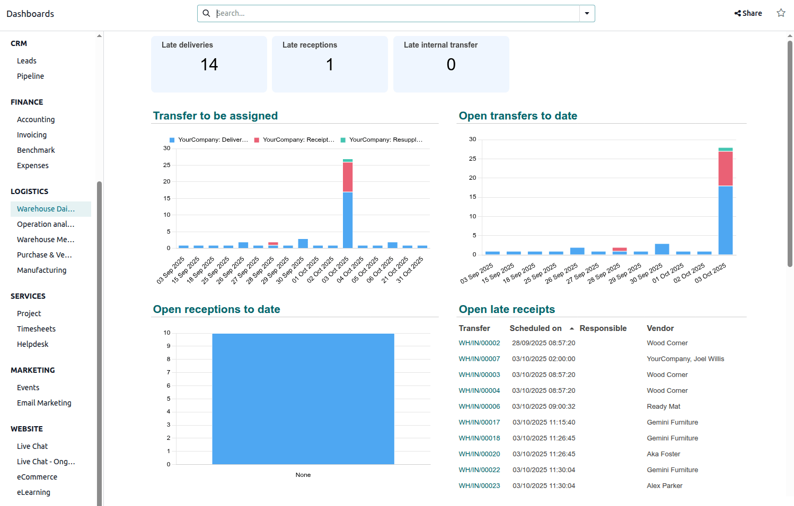
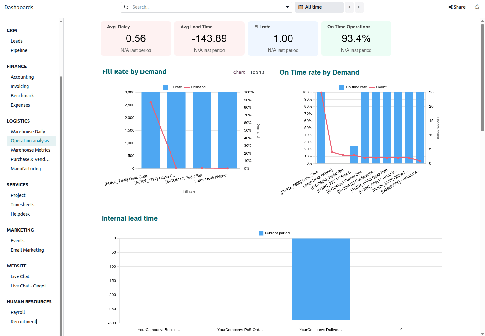
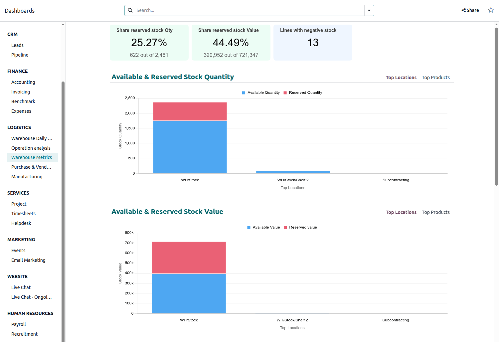

====================
Inventory dashboards
====================

The following dashboards, available via the :doc:`Odoo Dashboards
<../../../../productivity/dashboards>` app, allow you to monitor and analyze core metrics related to
warehouse operations and management, as well as stock management:

- :ref:`Warehouse Daily Operations dashboard
  <inventory/dashboards/warehouse-daily-operations-dashboard>`: monitors task completion and
  scheduled activities
- :ref:`Operation analysis dashboard
  <inventory/dashboards/operation-analysis-dashboard>`: measures efficiency KPIs
- :ref:`Warehouse Metrics dashboard <inventory/dashboards/warehouse-metrics-dashboard>`: assesses
  stock value and quantity

To access these dashboards, go to the **Dashboards** app, then, in the left panel, navigate to the
:guilabel:`Logistics` section and click the name of the relevant dashboard. The dashboard opens in
the main view.

.. note::
   The :ref:`rights to access <dashboards/access-and-sharing>` Odoo dashboards are based on user
   groups, and are managed within the **Dashboards** app. By default, the :guilabel:`Operation
   analysis` and :guilabel:`Warehouse Metrics` dashboards are only visible to, and can only be
   accessed by, users with admin access to the **Inventory** app.

.. seealso::
   - :ref:`Using Odoo dashboards <dashboards/use-dashboards>`
   - :ref:`Customizing Odoo dashboards <build_and_customize_dashboards/customize>`

.. _inventory/dashboards/warehouse-daily-operations-dashboard:

Warehouse Daily Operations dashboard
====================================

The :guilabel:`Warehouse Daily Operations dashboard` provides a real-time view of critical
outstanding tasks across receipts, deliveries, and internal transfers, allowing warehouse managers
to prioritize work and prevent bottlenecks. It immediately identifies overdue operations, as well as
transfers that have not yet been assigned to an employee. It also forecasts scheduled activity for
the next 7 days.

Navigate the dashboard
----------------------

Three cards at the top of the dashboard show the following information:

- :guilabel:`Late deliveries`: indicates the number of open deliveries with a past scheduled date
  and/or past deadline date.

  .. note::
     If delivery is configured using a multi-step route with push logic, the delivery is not
     generated until the previous operation is confirmed.

- :guilabel:`Late receptions`: indicates the number of open receipts with a past scheduled date
  and/or past deadline date.
- :guilabel:`Late internal transfers`: indicates the number of open internal transfers with a past
  scheduled date and/or past deadline date.

The following charts and tables are available:

- :guilabel:`Transfers to be assigned`: shows open transfers that have no responsible user assigned.

  .. tip::
     For a more precise analysis, filter the dashboard by operation type via the search bar.

- :guilabel:`Open transfers to date`: shows open transfers by operation, by date.

  .. tip::
     By default, the :guilabel:`Transfers to be assigned` and :guilabel:`Open transfers to date`
     charts are shown by day. To see data by :guilabel:`Weeks`, :guilabel:`Months`, or
     :guilabel:`Weeks`, hover over the chart and click the dropdown in the top-right corner.

- :guilabel:`Open receptions to date`: shows the number of open receipts per responsible user.
- :guilabel:`Open late receipts`: shows the ten oldest open receipts with a past scheduled date
  and/or deadline date, in descending order.
- :guilabel:`Open internal transfers to date`: shows the number of open internal transfers per
  responsible user.
- :guilabel:`Open late internal transfers`: shows the ten oldest open internal transfers with a past
  scheduled date and/or deadline date, in descending order.
- :guilabel:`Open deliveries to date`: shows the number of open deliveries per responsible user.
- :guilabel:`Open late deliveries`: shows the ten oldest open deliveries with a past scheduled date
  and/or deadline date, in descending order.
- :guilabel:`Receptions next 7 days`: shows the number of open receipts for the next seven days.
- :guilabel:`Deliveries next 7 days`: shows the number of open deliveries for the next seven days.

.. _inventory/dashboards/operation-analysis-dashboard:

Operation analysis dashboard
============================

The :guilabel:`Operation analysis` dashboard focuses on KPIs related to the efficiency and accuracy
of stock movements. It helps identify areas for process improvement by showing metrics like the
average time transfers are overdue, the average time between creation and validation of transfers,
and the percentage of on-time transfers. It also provides insights into delivery accuracy by
showing the percentage of products actually delivered versus ordered.

.. tip::
   - By default, this dashboard shows data for :guilabel:`All time`. To show data for a specific
     period, click :icon:`fa-calendar` :guilabel:`All time` above the dashboard and select or define
     the appropriate period.
   - For a more precise analysis, filter the dashboard by operation type via the search bar.

Navigate the dashboard
----------------------

Four cards at the top of the dashboard show the following information:

- :guilabel:`Avg Delay`: indicates the average number of days, in decimal format, that completed
  deliveries were overdue (i.e., the date the delivery status changed to :guilabel:`Done` minus the
  scheduled date for the delivery) in the selected period.

  .. note::
     Deliveries that are completed earlier than their scheduled date contribute a negative delay
     value to the calculation of the KPI.

- :guilabel:`Avg Lead Time`: indicates the average number of days, in decimal format, between the
  creation and the validation of transfers.

- :guilabel:`Fill rate`: indicates the percentage of products delivered in relation to the total
  number of products ordered.

  .. note::
     When no backorder is created, this KPI decreases.

- :guilabel:`On Time Operations`: indicates the percentage of transfers made on time for the
  selected operation (i.e., the transfer date is less than or equal to scheduled date for the
  transfer).

The following charts are available:

- :guilabel:`Fill Rate by Demand`: shows the percentage of products delivered in relation to the
  total number of products ordered.

  .. tip::
     When no backorder is created, this KPI decreases.

- :guilabel:`On Time rate by Demand`: shows the percentage of transfers made on time by product.

- :guilabel:`Internal lead time`: shows the average time between the creation and the validation of
  transfers by operation.

- :guilabel:`Moves lines count by operation`: shows the total number of completed stock move lines
  by operation type over the selected period.

- :guilabel:`Weekly Stock Moves Lines by operation`: shows the total number of completed stock move
  lines weekly, by operation type.

- :guilabel:`Transfer count by responsible and operation`: shows the number of transfers by
  employee, detailing the type of operation.

- :guilabel:`Quantity of stock adjustments by category`: shows adjusted stock quantity, by product
  category.

- :guilabel:`Qty scrapped product by category`: shows the quantity of product scrapped, by product
  category.

.. _inventory/dashboards/warehouse-metrics-dashboard:

Warehouse Metrics dashboard
===========================

The :guilabel:`Warehouse Metrics` dashboard provides a high-level view of the value and availability
of stock. It enables monitoring of stock reservation levels both in quantity and value,
identification of products with negative stock, and analysis of stock distribution and value across
the most used locations and top products. It also tracks important details like the creation date of
stock, so warehouse or purchasing managers can identify slow-moving or stagnant products and take
action, such as promoting, discounting, or returning products.

.. note::
   The value of stock depends on the valuation method used.

.. tip::
   For a more precise analysis, filter the dashboard by product via the search bar.

Navigate the dashboard
----------------------

Three cards at the top of the dashboard show the following information:

- :guilabel:`Share reserved stock Qty`: indicates the quantity of stock reserved in relation to the
  total quantity of stock on hand, both as a percentage and number.
- :guilabel:`Share reserved stock value`: indicates the value of reserved stock in relation to the
  total value of stock on hand, both as a percentage and number.
- :guilabel:`Lines with negative stock`: indicates the number of inventory lines with a negative
  stock quantity.

The following charts are available:

- :guilabel:`Available & Reserved Stock Quantity`: shows the quantity of available stock (i.e.,
  stock on hand minus reserved stock) and the quantity of reserved stock, per most-used location. At
  the top right of the chart, click :guilabel:`Top Products` to see this information for the top
  products, i.e., the products with the highest quantities.
- :guilabel:`Available & Reserved Stock Value`: shows the value of available stock (i.e., stock on
  hand minus reserved stock) and the value of reserved stock, per most-used location. At the top
  right of the chart, click :guilabel:`Top Products` to see this information for the top products,
  i.e., the products with the most total value.
- :guilabel:`Ageing stock qty by product and creation date`: shows, by product, the quantity of
  stock that has been held since its creation. To change the creation date period, hover over the
  chart then select the desired period from the dropdown.

  .. note::
     For products not tracked by lot/serial number, this chart only displays the date of first
     receipt except if the stock went down to 0.

- :guilabel:`Ageing stock value by product and creation date`: shows, by product, the value of
  stock that has been held since its creation. To change the creation date period, hover over the
  chart then select the desired period from the dropdown.

- :guilabel:`Top 10 products with negative stock`: shows the ten products with the most negative
  stock. Depending on the situation, manual stock corrections may be needed for products shown here.
  By default, this is shown as a donut chart; click :guilabel:`Top 10` at the top right of
  the chart to see this in list form.
