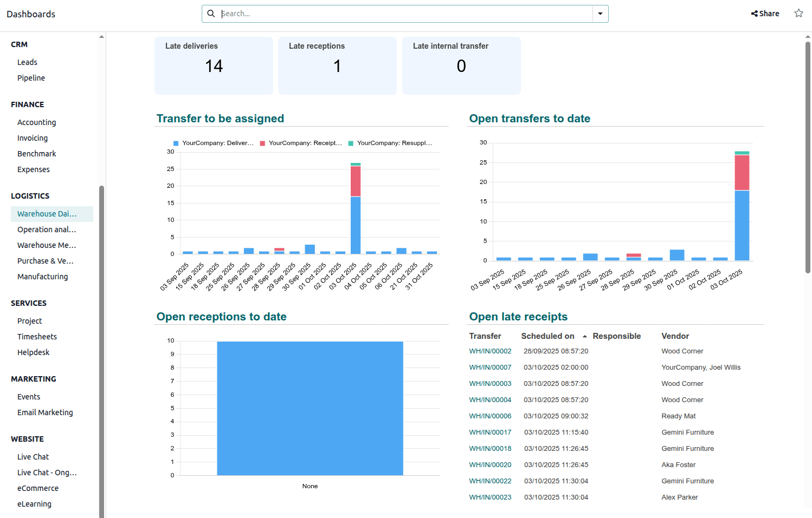
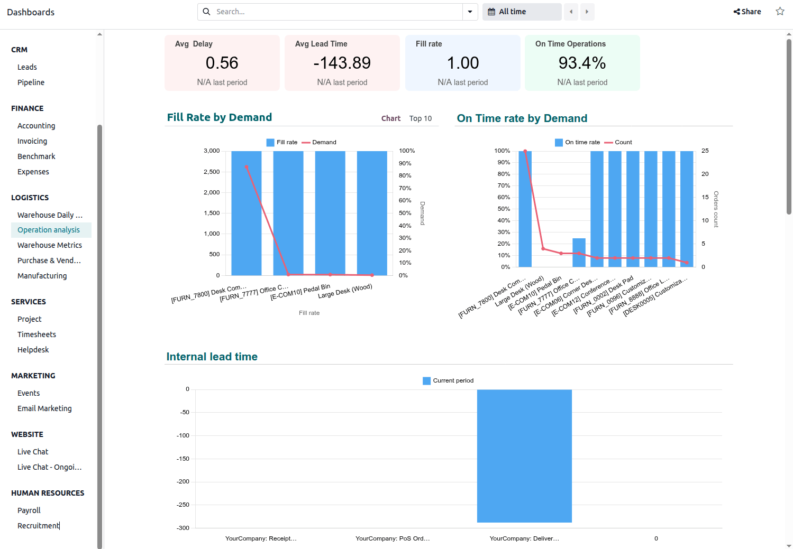
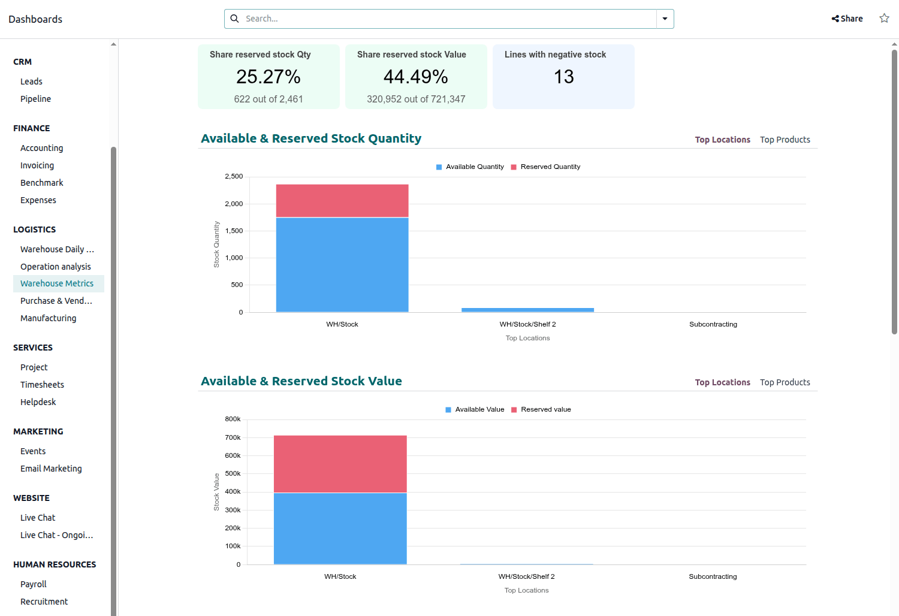
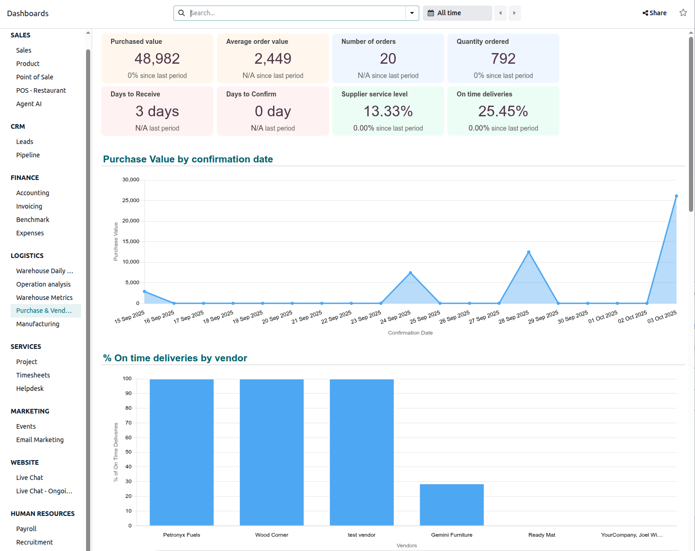

==========
Dashboards
==========

The :doc:`Odoo Dashboards app <../../../../productivity/dashboards>` offers a series of
pre-configured dashboards that centralize and present KPIs and data related to warehouse management,
operations analysis and supplier management in a user-friendly way.

- :ref:`Warehouse Daily Operations dashboard
  <inventory/dashboards/warehouse-daily-operations-dashboard>` which monitors task
  completion and scheduled activity
- :ref:`Operation analysis dashboard
  <inventory/dashboards/operation-analysis-dashboard>` which measures efficiency KPIs
- :ref:`Warehouse Metrics dashboard <inventory/dashboards/warehouse-metrics-dashboard>`
  which assesses stock value and quantity
- :ref:`Purchase & Vendor analysis dashboard
  <inventory/dashboards/purchase-vendor-dashboard>` which evaluates supplier performance

To access these dashboards, go to the Dashboards app, then, in the left panel, navigate to the
:guilabel:`Logistics` section and click the name of the relevant dashboard. The dashboard opens in
the main part of the page.

Filters available via the search bar allow these and other standard Odoo dashboards to be filtered
on selected values for a more tailored view.

.. note::
   - The :ref:`rights to access <dashboards/access-and-sharing>` Odoo dashboards are based on user
     groups, and are managed within the Dashboards app. By default, the :guilabel:`Operation
     analysis`, :guilabel:`Warehouse Metrics`, and :guilabel:`Purchase & Vendor analysis` dashboards
     can only be accessed by users with admin access to the **Inventory** app.
   - Odoo dashboards :ref:`can be customized <build_and_customize_dashboards/customize>` by a user
     with the appropriate :ref:`access rights <dashboards/access-and-sharing>` to the Dashboards
     app.

.. seealso::
   :ref:`Using Odoo dashboards <dashboards/consult-dashboards>`

.. _inventory/dashboards/warehouse-daily-operations-dashboard:

Warehouse Daily Operations dashboard
====================================

The :guilabel:`Warehouse Daily Operations dashboard` provides a real-time view of critical
outstanding tasks across receipts, deliveries, and internal transfers, allowing warehouse managers
to prioritize work and prevent bottlenecks. It immediately identifies overdue operations, as well as
transfers that have not yet been assigned to an employee. It also forecasts scheduled activity for
the next 7 days.

Navigate the dashboard
----------------------

Three cards at the top of the dashboard show the following information:

- :guilabel:`Late deliveries`: indicates the number of open deliveries with a past scheduled date
  and/or past deadline date.

  .. note::
     If delivery is configured using a multi-step route and a push logic, the delivery is not
     generated until the previous operation is confirmed.

- :guilabel:`Late receptions`: indicates the number of open receipts with a past scheduled date
  and/or past deadline date.
- :guilabel:`Late internal transfers`: indicates the number of open internal transfers with a past
  scheduled date and/or past deadline date.

The following charts and tables are available:

- :guilabel:`Transfers to be assigned`: shows open transfers that have no responsible user assigned.

  .. tip::
     For a more precise analysis, filter the dashboard by operation type via the search bar.

- :guilabel:`Open transfers to date`: shows open transfers by operation, by date.
- :guilabel:`Open receptions to date`: shows the number of open receipts per responsible user.
- :guilabel:`Open late receipts`: shows the ten oldest open receipts with a past scheduled date
  and/or deadline date, in descending order.
- :guilabel:`Open internal transfers to date`: shows the number of open internal transfers per
  responsible user.
- :guilabel:`Open late internal transfers`: shows the ten oldest open internal transfers with a past
  scheduled date and/or deadline date, in descending order.
- :guilabel:`Open deliveries to date`: shows the number of open deliveries per responsible user.
- :guilabel:`Open late deliveries`: shows the ten oldest open deliveries with a past scheduled date
  and/or deadline date, in descending order.
- :guilabel:`Receptions next 7 days`: shows the number of open scheduled receipts for the next seven
  days.
- :guilabel:`Deliveries next 7 days`: shows the number of open scheduled deliveries for the next
  seven days.

.. _inventory/dashboards/operation-analysis-dashboard:

Operation analysis dashboard
============================

The :guilabel:`Operation analysis` dashboard focuses on KPIs related to the efficiency and accuracy
of stock movements. It helps identify areas for process improvement by showing metrics like the
average time transfers are overdue, the average time between creation and validation of transfers,
and the percentage of on-time transfers. It also provides insights into delivery accuracy by
showing the percentage of products actually delivered versus ordered.

.. tip::
   - By default, this dashboard shows data for :guilabel:`All time`. To show data for a specific
     period, click :icon:`fa-calendar` :guilabel:`All time` above the dashboard and select or define
     the appropriate period.
   - For a more precise analysis, filter the dashboard by operation type via the search bar.

Navigate the dashboard
----------------------

Four cards at the top of the dashboard show the following information:

- :guilabel:`Avg Delay`: indicates the average number of days that completed deliveries were overdue
  (i.e., the date the delivery status changed to :guilabel:`Done` minus the scheduled date for the
  delivery) in the selected period.

  .. tip::
     This KPI is negatively impacted when an order is delivered early.

- :guilabel:`Avg Lead Time`: indicates the average time between the creation and the validation of
  transfers.

- :guilabel:`Fill rate`: indicates the percentage of products delivered in relation to the total
  number of products ordered.

  .. tip::
     When no backorder is created for an ordered product that is not in stock, this KPI decreases.

- :guilabel:`On Time Operations`: indicates the percentage of transfers made on time for the
  selected operation (i.e., the transfer date is less than or equal to scheduled date for the
  transfer).

The following charts are available:

- :guilabel:`Fill Rate by Demand`: shows the percentage of products delivered in relation to the
  total number of products ordered.

  .. tip::
     When no backorder is created, this KPI decreases.

- :guilabel:`On Time rate by Demand`: shows the percentage of transfers made on time by product.

- :guilabel:`Internal lead time`: shows the average time between the creation and the validation of
  transfers by operation.

- :guilabel:`Moves lines count by operation`: shows the total number of completed stock move lines
  by operation type over the selected period.

- :guilabel:`Weekly Stock Moves Lines by operation`: shows the total number of completed stock move
  lines weekly, by operation type.

- :guilabel:`Transfer count by responsible and operation`: shows the number of transfers by
  employee, detailing the type of operation.

- :guilabel:`Quantity of stock adjustments by category`: shows adjusted stock quantity, by product
  category.

- :guilabel:`Qty scrapped product by category`: shows the quantity of product scrapped, by product
  category.

.. _inventory/dashboards/warehouse-metrics-dashboard:

Warehouse Metrics dashboard
===========================

The :guilabel:`Warehouse Metrics` dashboard provides a high-level view of the value and availability
of stock. It enables monitoring of stock reservation levels both in quantity and value,
identification of products with negative stock, and analysis of stock distribution and value across
the most used locations and top products. It also tracks important details like the creation date of
stock and the quantity of product scrapped.

.. note::
   The value of stock depends on the :doc:`valuation method
   <../../product_management/inventory_valuation/inventory_valuation_config>` used.

.. tip::
   For a more precise analysis, filter the dashboard by product via the search bar.

Navigate the dashboard
----------------------

Three cards at the top of the dashboard show the following information:

- :guilabel:`Share reserved stock Qty`: indicates the quantity of stock reserved in relation to the
  total quantity of stock on hand, both as a percentage and number.
- :guilabel:`Share reserved stock value`: indicates the value of reserved stock in relation to the
  total value of stock on hand, both as a percentage and number.
- :guilabel:`Lines with negative stock`: indicates the number of inventory lines with a negative
  stock quantity.

The following charts are available:

- :guilabel:`Available & Reserved Stock Quantity`: shows the quantity of stock on hand and
  the quantity of stock reserved, per most-used location. At the top right of the chart,
  click :guilabel:`Top Products` to see this information for the top products, i.e., the products
  with the highest quantities.
- :guilabel:`Available & Reserved Stock Value`: shows the value of stock on hand and the value
  of stock reserved, per most-used location. At the top right of the chart, click :guilabel:`Top
  Products` to see this information for the top products, i.e., the products with the most total
  value.
- :guilabel:`Ageing stock qty by product and creation date`: shows, by product, the quantity of
  stock that has been held since its creation. To change the creation date period, hover over the
  chart then select the desired period from the dropdown.

  .. note::
     For products not tracked by lot/serial number, this chart only displays the date of first
     receipt except if the stock went down to 0.

- :guilabel:`Ageing stock value by product and creation date`: shows, by product, the value of
  stock that has been held since its creation. To change the creation date period, hover over the
  chart then select the desired period from the dropdown.

- :guilabel:`Top 10 products with negative stock`: shows the ten products with the most negative
  stock. Depending on the situation, manual stock corrections may be needed for products shown here.
  By default, this is shown as a donut chart; click :guilabel:`Top 10` at the top right of
  the chart to see this in list form.

.. _inventory/dashboards/purchase-vendor-dashboard:

Purchase & Vendor analysis dashboard
====================================

The :guilabel:`Purchase & Vendor analysis` dashboard offers a broad set of metrics to evaluate
purchasing performance and vendor reliability. The dashboard tracks financial data like total and
average purchase amounts and the number of purchase orders. It also provides KPIs for supplier
performance, such as the average time to receive products and the percentage of quantities received
on time. This make it possible to rank vendors and optimize procurement strategy accordingly.

.. tip::
   - By default, this dashboard shows data for :guilabel:`All time`. To show data for a specific
     period, click :icon:`fa-calendar` :guilabel:`All time` above the dashboard and select or define
     the appropriate period.

   - For a more precise analysis, filter the dashboard by vendor via the search bar.

Navigate the dashboard
----------------------

Eight cards at the top of the dashboard show the following information:

- :guilabel:`Purchased value`: indicates the total value of purchases during the selected period.
- :guilabel:`Average order value`: indicates the average purchase amount per order during the
  selected period.
- :guilabel:`Number or orders`: indicates the number of purchase orders during the selected period.
- :guilabel:`Quantity ordered`: indicates the quantity of products ordered during the selected
  period.
- :guilabel:`Days to receive`: indicates the average number of days between the order and receipt of
  purchased products (i.e., between the order deadline of purchase order and the expected arrival of
  the purchase order line).

  .. note::
     The expected arrival date is not impacted by a change to the scheduled date on the receipt.

- :guilabel:`Days to Confirm`: indicates the average number of days before a purchase order is
  confirmed (i.e., between the creation date of the RFQ and the confirmation data of the purchase
  order).
- :guilabel:`Supplier service level`: indicates the quantity received versus the quantity purchased,
  as a percentage.

  .. note::
     This KPI is impacted by purchases with future expected receipts.

- :guilabel:`On time deliveries`: indicates the percentage of products received on time (based on
  the expected arrival date on purchase order lines)

The following charts are available:

- :guilabel:`Purchase Value by confirmation date`: shows the total value of confirmed purchases by
  date.
- :guilabel:`% On time deliveries by vendor`: shows the percentage of products received on time, by
  vendor (based on expected arrival on purchase order lines.)
- :guilabel:`Top vendors by amount`: shows the ranking of vendors by total value of purchase orders
  and number of purchase orders.
- :guilabel:`Top vendors by lead time in days`: shows the average number of days required to receive
  purchased products, by vendor (:guilabel:`Order deadline purchase order` - :guilabel:`Expected
  arrival purchase order line`).

  .. note::
     The expected arrival date is not impacted by a change to the scheduled date on the receipt.

- :guilabel:`Average product purchased cost by confirmation week`: shows the average unit cost of
  products purchased, by week in which the purchase order is confirmed.
- :guilabel:`Top purchase orders by value`: lists the ten purchase orders with the highest total
  value, in descending order.
- :guilabel:`Top 10 late receipts`: lists the ten receipts with the longest delay after the expected
  receipt date.
- :guilabel:`Top purchased products`: lists the ten products with the highest total purchase amount,
  in descending order.
- :guilabel:`Supplier Dependency Chart`: shows the percentage of purchases by buyer.
