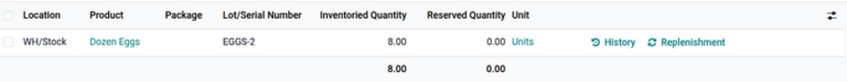

=====================
Detailed Stock report
=====================

The *Detailed Stock* report in the **Inventory** application provides an overview of detailed stock
information for company products. Use this report to see where stock is stored, identify
:ref:`misplaced items <inventory/warehouse_storage/stranded>`, or view past inventory to see product
locations on specific dates.

To access the *Detailed Stock* report, the *Storage Locations* feature must be enabled. To do that,
go to :menuselection:`Inventory app --> Configuration --> Settings`. In the *Warehouse* section,
select the checkbox for :guilabel:`Storage Locations`, and click :guilabel:`Save`. Then, access the
main *Detailed Stock* report by navigating to :menuselection:`Inventory app --> Reporting -->
Detailed Stock`.

.. note::
   The *Reporting* menu in **Inventory** is only accessible to users with :doc:`admin access
   <../../../../general/users/access_rights>`.

.. _inventory/warehouses_storage/detailed-stock-report:

Navigate the report
===================

By default, the *Detailed Stock* report lists all on-hand products in stock (in the
:guilabel:`Product` column), along with the following information:

- :guilabel:`Location`: Current storage location. If a product is stored at `Shelf 1` and `Shelf 2`,
  the product is listed twice, showing quantities at each location.
- :guilabel:`Lot/Serial Number`: If the product has a lot or serial number, it is specified here.
- :guilabel:`Inventoried Quantity`: Current quantity of products. Click in the field to :doc:`modify
  the on-hand quantity <../inventory_management/count_products>`.
- :guilabel:`Reserved Quantity`: On-hand quantity reserved for operations, such as pickings,
  delivery orders, or manufacturings.
- :guilabel:`Unit`: The unit of measure of the product.

Click the buttons to the right of each row item to access additional information:

- :icon:`fa-history` :guilabel:`History`: Access the stock move history of the product, displaying
  information about the quantity and description of why the product was moved from one location to
  another.

  .. tip::
     View what the product is reserved for by clicking :icon:`fa-history` :guilabel:`History` on the
     far-right of the product line.

     On the *Moves History* page, remove the :icon:`fa-filter` :guilabel:`Done` filter from the
     search bar to reveal filter options, and select the :guilabel:`To Do` filter.

     .. image:: detailed_stock/reserved-products.png
        :alt: Display Moves History page of to-do deliveries that reserved the product.

- :icon:`fa-refresh` :guilabel:`Replenishment`: Access the :doc:`reordering rules
  <../replenishment/reordering_rules>` page to replenish products at the specific location.

In the upper-left corner of the page, click the :guilabel:`New` button to make an :doc:`inventory
adjustment <../inventory_management/count_products>` to record quantities of a certain product at a
specific :guilabel:`Location`.

To view products, quantities, and their locations for a specified month or quarter, click in the
:guilabel:`Search` bar. In the :icon:`fa-filter` :guilabel:`Filters` list, expand the
:guilabel:`Incoming Date` section and select at least one month or quarter and at least one year.

Generate reports
================

After learning how to :ref:`navigate the Detailed Stock report
<inventory/warehouses_storage/detailed-stock-report>`, it can be used to create and share different
reports.

A few common reports that can be created using the *Detailed Stock* report are detailed below.

Dead stock report
-----------------

To a get list of expired items, also referred to as *dead stock*, follow these steps:

#. Go to :menuselection:`Inventory app --> Reporting --> Detailed Stock`.
#. Then, click into the search bar to reveal a drop-down list of :guilabel:`Filters`,
   :guilabel:`Group By`, and :guilabel:`Favorite` options.
#. Enable the :guilabel:`Internal Locations` and :guilabel:`Expired Lots` option under the
   :guilabel:`Filters` section.

The report now displays a list of expired products.

.. note::
   This report can also be generated from the :ref:`Lot and Serial Numbers
   <inventory/product_management/expiration-alerts>` page, accessed by going to
   :menuselection:`Inventory app --> Products --> Lots/Serial Numbers`.

.. _inventory/warehouse_storage/stranded:

Stranded inventory report
-------------------------

Businesses using multi-step flows in the **Inventory** or **Manufacturing** apps may have *stranded*
items, which are products not in their proper storage locations due to human error. Use this report
to periodically check transfer locations (e.g., *WH/Input*, *WH/Pre-Processing*) to ensure items are
moved to their intended storage locations and accurately recorded in the database.

To get a list of items that might be sitting idly in storage, follow these steps:

#. Go to :menuselection:`Inventory app --> Reporting --> Detailed Stock`.
#. In the search bar, begin typing the name of the location where products are intended to be moved
   to, such as `WH/Input`  or `WH/Packing`.
#. Select the :guilabel:`Search Location for:` [location name] option from the resulting drop-down
   menu that appears beneath the search bar.

   .. image:: detailed_stock/search-input-location.png
      :alt: Show search result for the location.

The report now displays a list of products at the transit location.

.. example::
   Searching `Input` in :guilabel:`Location` shows a list of products at a *WH/Input* location.

   The list shows `4` quantities of `Dozen Eggs`, which is alarming if not refrigerated soon after
   reception. The stranded inventory report helps identify items that have been idling in
   non-storage locations.

   .. image:: detailed_stock/stranded-inventory.png
      :alt: Show items stored at a specific location.

Inventory discrepancy report
----------------------------

To generate a report of items that have been moved since the last :doc:`inventory audit
<../inventory_management/cycle_counts>`, follow these steps:

#. Go to :menuselection:`Inventory app --> Reporting --> Detailed Stock`.
#. Then, click into the search bar to reveal a drop-down list of :guilabel:`Filters`,
   :guilabel:`Group By`, and :guilabel:`Favorite` options.
#. Enable the :guilabel:`Internal Locations` and :guilabel:`Conflicts` option from the
   :guilabel:`Filters` section.
#. The report now displays items whose locations have changed since the last cycle count.

   .. image:: detailed_stock/discrepancy.png
      :alt: Show items from the Conflicts filter in the report.

#. Click the :icon:`fa-history` :guilabel:`History` button to view inventory transfers, including
   receipts and deliveries, that have occurred since the inventory adjustment.

   .. image:: detailed_stock/history.png
      :alt: Show Moves History, showing a delivery that occurred after an inventory adjustment.
