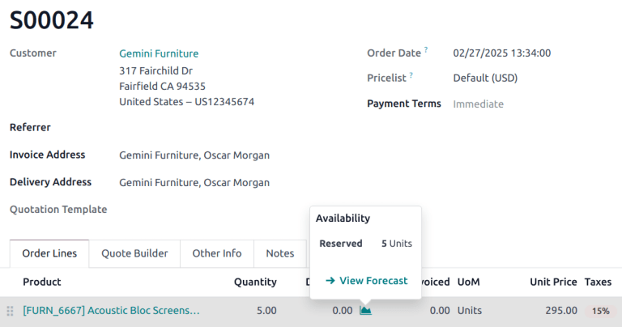
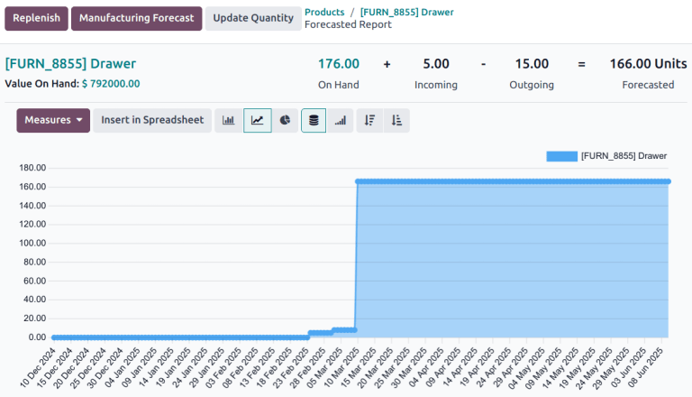
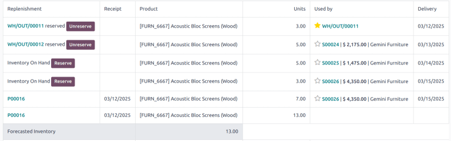
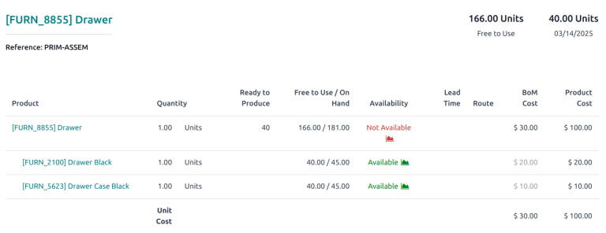
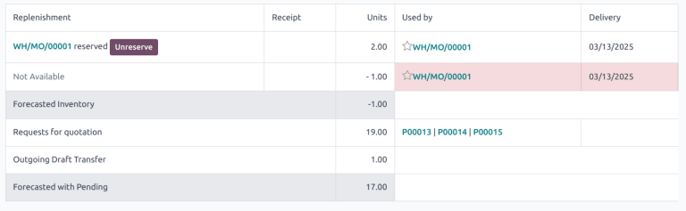
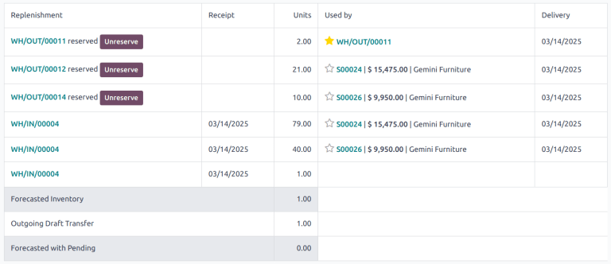

=================
Forecasted report
=================

.. |SO| replace:: :abbr:`SO (sales order)`
.. |SOs| replace:: :abbr:`SOs (sales orders)`
.. |RFQs| replace:: :abbr:`RFQs (Requests for Quotation)`
.. |POs| replace:: :abbr:`POs (purchase orders)`
.. |PO| replace:: :abbr:`PO (purchase order)`
.. |MO| replace:: :abbr:`MO (manufacturing order)`
.. |MOs| replace:: :abbr:`MOs (manufacturing orders)`

The **Inventory** *forecasted report* provides a real-time view of projected stock levels, helping
businesses manage their inventory efficiently. This report is beneficial for planning and decision
making, ensuring stock availability for upcoming sales, manufacturing, and replenishment activities.

.. important::
   The forecast report is **only** available on products where inventory is being tracked, commonly
   referred to as a *storable product*.

Navigating the forecast report
==============================

The forecast report can be accessed via the **Inventory**, **Purchase**,  **Manufacturing**, and
**Sales** apps.

To access the report, click the :icon:`fa-area-chart` :guilabel:`Forecasted` smart button on a
product form. Alternatively, the report can be accessed from a sales order (SO) or purchase order
(PO) by clicking on the :icon:`fa-area-chart` :guilabel:`(Graph)` icon next to the product, then
selecting :icon:`oi-arrow-right` :guilabel:`View Forecast`.

The forecasted report consists of a graph and a table. The graph visually represents stock movements
over time. The following information is displayed:

- :guilabel:`On Hand`: current stock physically available in the warehouse.
- :guilabel:`Incoming`: quantities expected from confirmed purchase orders or manufacturing orders.
- :guilabel:`Outgoing`: quantities reserved for sales orders or other outgoing operations.
- :guilabel:`Forecasted`: projected stock levels based on confirmed and planned operations.

The table provides detailed metrics regarding operations, including:

- :guilabel:`Replenishment`: Shows reserved quantities, especially useful for multi-step operations.
- :guilabel:`Receipt`: The date of receipt for the items.
- :guilabel:`Units`: The number of units involved in each operation.
- :guilabel:`Used by`: The operation the stock is allocated for.
- :guilabel:`Delivery`: The scheduled or expected date of stock movement.
- :guilabel:`Forecasted Inventory`: The forecasted stock levels.
- :guilabel:`Forecasted with Pending`: The updated stock levels with the pending stock movements
  considered.

Reserve and unreserve products
------------------------------

Users can reserve or unreserve products directly from the forecasted report, ensuring stock
allocation aligns with operational needs.

.. seealso::
   :doc:`../../shipping_receiving/reservation_methods`

Replenish products
------------------

Click the :guilabel:`Replenish` button at the top of the report to open the :guilabel:`Product
Replenish` pop-up. From here, products can be replenished through purchase orders from vendors, or
manufactured. Select the :guilabel:`Quantity`, :guilabel:`Preferred Route` and :guilabel:`Vendor`,
before clicking :guilabel:`Confirm`.

Manufacturing forecast
----------------------

To view the availability of manufactured products, click the :guilabel:`Manufacturing Forecast`
button. This displays the forecasted stock levels for raw materials, showing how much are expected
to be consumed for upcoming manufacturing orders.

The manufacturing forecast identifies component shortages before they can impact manufacturing
timelines, and helps to align manufacturing activities with sales demands.

Update quantity
---------------

To manually update the quantity of a product, click :guilabel:`Update Quantity`. This opens the
:guilabel:`Change Product Quantity` pop-up. Confirm the correct product variant is selected in the
:guilabel:`Product` field, then enter the appropriate value in the :guilabel:`New Quantity on Hand`
field. Click :guilabel:`Apply` when finished. The report then updates to reflect the new product
quantity.

Multi-step reservation
======================

Reserved quantities for multi-step incoming and outgoing shipments are indicated on in the
:guilabel:`Replenishment` column on the table of the report.

:guilabel:`Stock in Transit` refers to products that have been received, but are in transit to their
input or quality control locations. :guilabel:`Free Stock in Transit` refers to available products
received in the input location, but not yet placed in stock.

Operations affecting the forecast report
========================================

The forecast report is influenced by various operations, each impacting stock levels differently.
Scheduled delivery dates, planned manufacturing dates, and expected arrival dates all affect the
forecast of inventory.

Requests for Quotation (RFQs) do not immediately impact the forecast report, as the products are not
confirmed for replenishment. |POs|, however, do affect the report as the products are expected to
arrive after the |PO| has been confirmed.

Confirmed |SOs| decrease the forecasted stock, adjusting the report based on the scheduled delivery
date. Confirmed manufacturing orders (MOs) affect the forecasted stock for both raw materials and
finished goods.

Use cases
=========

Negative quantity
-----------------

A negative forecasted quantity indicates that the projected demand exceeds the available and
incoming stock at a given point in time. This could occur because the |SOs| or |MOs| require more
stock than is currently available or expected, or because of delays in the shipping or manufacturing
process.

Whatever the cause, when negative numbers are displayed on the forecast report, it serves as an
early warning, allowing business to take preventative action. This can include:

- Prioritizing specific sales or production orders.
- Adjusting procurement strategies to expedite purchase orders.
- Manage customer expectations by proactively communicating the possibility for delays.

Split orders
------------

In the example below, there is not currently enough stock of a product, `Cabinet with Doors` to
fulfill the multiple sales orders. The current stock has been reserved for a shipment,
`WH/OUT/00011`, and the remainder has been split between the two orders. The remaining stock is
expected with `WH/IN/00004`. Once received, they are the separated out to cover the remaining
orders.

Late receipt
------------

The replenishment table can be used to determine whether an incoming shipment arrives in time to
fulfill an order. For example, a |SO| is displayed with a :guilabel:`Delivery Date` for today for
five `Cable Management Boxes`. The current on hand quantity is zero. A |PO| has been confirmed, with
the expected arrival three days from today.

The forecasted quantity for today shows `-5`, because the confirmed demand is five, but the current
stock on hand is zero. Since the :guilabel:`Receipt` date is *after* the :guilabel:`Delivery Date`,
the shipment is late.

This can be an indication to either expedite the current shipment, if possible, or reschedule the
delivery date for the |SO|.
