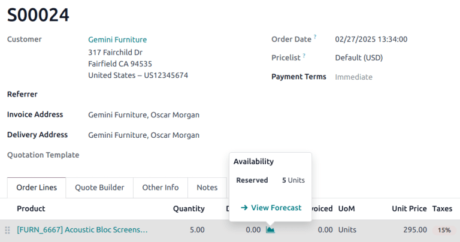

===============
Forecast report
===============

.. |SO| replace:: :abbr:`sales order (SO)`
.. |RFQs| replace:: :abbr:`Requets for Quotation (RFQs)`
.. |POs| replace:: :abbr:`Purchase Orders (POs)`
.. |PO| replace:: :abbr:`Purchase Order (PO)`

The **Inventory** *forecast report* provides a real-time view of projected stock levels, helping
businesses manage their inventory efficiently. This report is beneficial for planning and decision
making, ensuring stock availability for upcoming sales, manufacturing, and replenishment activities.

.. important::
   The forecast report is **only** available on products where inventory is being tracked.

Navigating the forecast report
==============================

To access the report, click the :icon:`fa-area-chart` :guilabel:`Forecasted` smart button on a
product form. Alternatively, the report can be access from a sales order (SO), by clicking on the
:icon:`fa-area-chart` :guilabel:`(Graph)` icon next to the product, then selecting :guilabel:`View
Forecast`.

Operations affecting the forecast report
========================================

The forecast report is influenced by various operations, each impacting stock levels differently.

Requests for Quotation (RFQs) do not immediately impact the forecast report,as the products are not
confirmed for replenishment.

Purchase orders (POs), however, do affect the report as the products are expected to arrive after
the |PO| has been confirmed.
