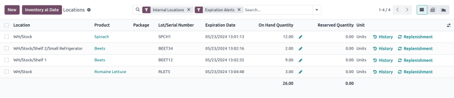

===================
Locations dashboard
===================

.. |down| replace:: :icon:`fa-caret-down` :guilabel:`(caret down)`

The *Locations* dashboard in the *Inventory* application provides an overview of on-hand storage
locations for company products. Use this report to see where stock is stored, identify
:ref:`misplaced items <inventory/warehouse_storage/stranded>`, or view past inventory to see product
locations on specific dates.

.. note::
   The *Reporting* menu in *Inventory* is only accessible to users with :doc:`admin access
   <../../../../general/users/access_rights>`.

To access the locations report, the *Storage Locations* feature must be enabled. To do that, go to
:menuselection:`Inventory app --> Configuration --> Settings`. In the :guilabel:`Warehouse` section,
tick the checkbox for :guilabel:`Storage Locations`, and click :guilabel:`Save`. Then, access the
locations dashboard by navigating to :menuselection:`Inventory app --> Reporting --> Locations`.

.. _inventory/warehouses_storage/locations-report:

Navigate the locations dashboard
================================

By default, the :guilabel:`Locations` dashboard lists all on-hand products in stock (in the
:guilabel:`Product` column), along with the following information:

- :guilabel:`Location`: current storage location. If a product is stored at `Shelf 1` and `Shelf 2`,
  the product is listed twice, showing quantities at each location.
- :guilabel:`Package`: the package that the product is stored in, if any.
- :guilabel:`Lot/Serial Number`: if the product has a lot or serial number, it is specified here.
- :guilabel:`On Hand Quantity`: current quantity of products. Click the :icon:`fa-pencil`
  :guilabel:`(pencil)` icon to :doc:`modify the on-hand quantity
  <../inventory_management/count_products>`.
- :guilabel:`Reserved Quantity`: on-hand quantity reserved for operations, such as pickings,
  delivery orders, or manufacturings.
- :guilabel:`Unit`: the unit of measure of the product.

Click the buttons to the right of each row item to access additional information:

- :icon:`fa-history` :guilabel:`History`: access the stock move history of the product, displaying
  information about the quantity and description of why the product was moved from one location to
  another.

  .. tip::
     View what the product is reserved for, by clicking the :icon:`fa-history` :guilabel:`History`
     button on the far-right of the product line.

     On the :guilabel:`Moves History` page, remove the :icon:`fa-filter` :guilabel:`Done` filter.
     Then, click the |down| icon to the right of the :guilabel:`Search...` bar to reveal filter
     options, and select the :guilabel:`To Do` filter.

     .. image:: locations/reserved-products.png
        :align: center
        :alt: Display *Moves History* page of to-do deliveries that reserved the product.

- :icon:`fa-refresh` :guilabel:`Replenishment`: access the :doc:`reordering rules
  <../replenishment/reordering_rules>` page to replenish products at the specific location.

In the upper-left corner of the page, click the the :guilabel:`New` button to make an
:doc:`inventory adjustment <../inventory_management/count_products>` to record quantities of a
certain product at a specific :guilabel:`Location`.

To view products, quantities, and their locations for a specified date, click the
:guilabel:`Inventory At Date` button (also located in the upper-left corner of the page). Select a
date and time in the :guilabel:`Inventory at Date` field, then click :guilabel:`Confirm`.

Generate reports
================

After learning how to :ref:`navigate the locations dashboard
<inventory/warehouses_storage/locations-report>`, it can be used to create and share different
reports.

A few common reports that can be created using the :guilabel:`Locations` dashboard are detailed
below.

Dead stock report
-----------------

To get list of expired items, also referred to as *dead stock*, follow these steps:

#. Go to :menuselection:`Inventory app --> Reporting --> Locations`.
#. Then, click the |down| icon to the right of the :guilabel:`Search...` bar to reveal a drop-down
   list of :guilabel:`Filters`, :guilabel:`Group By`, and :guilabel:`Favorite` options.
#. Enable the :guilabel:`Internal Locations` and :guilabel:`Expiration Alerts` option under the
   :guilabel:`Filters` section.

The report now displays a list of expired products.

.. note::
   This report can also be generated from the :ref:`Lot and Serials Numbers
   <inventory/product_management/expiration-alerts>` page, accessed by going to
   :menuselection:`Inventory app --> Products --> Lots/Serial Numbers`.

.. _inventory/warehouse_storage/stranded:

Stranded inventory report
-------------------------

Businesses using multi-step flows in the *Inventory* or *Manufacturing* apps, may have *stranded*
items, which are products not in their proper storage locations, due to human error. Use this report
to periodically check transfer locations (e.g. *WH/Input*, *WH/Pre-Processing*) to ensure items are
moved to their intended storage locations, and accurately recorded in the database.

To get a list of items that might be sitting idly in storage, follow these steps:

#. Go to :menuselection:`Inventory app --> Reporting --> Locations`.
#. In the :guilabel:`Search...` bar, begin typing the name of the location where products are
   intended to be moved to, such as `WH/Input`,  or `WH/Packing`.
#. Select the :guilabel:`Search Location for:` [location name] option from the resulting drop-down
   menu that appears beneath the :guilabel:`Search...` bar.

   .. image:: locations/search-input-location.png
      :align: center
      :alt: Show search result for the location.

The report now displays a list of products at the transit location.

.. example::
   Searching `Input` in :guilabel:`Location` shows a list of products at a *WH/Input* location.

   The list shows `500` quantities of `Chicken`, which is alarming if not refrigerated soon after
   reception. The stranded inventory report helps identify items that have been idling in
   non-storage locations.

   .. image:: locations/stranded-inventory.png
      :align: center
      :alt: Show items stored at a specific location.

Inventory discrepancy report
----------------------------

To generate a report of items that have been moved since the last :doc:`inventory audit
<../inventory_management/cycle_counts>`, follow these steps:

#. Go to :menuselection:`Inventory app --> Reporting --> Locations`.
#. Then, click the |down| icon to the right of the :guilabel:`Search...` bar to reveal a drop-down
   list of :guilabel:`Filters`, :guilabel:`Group By`, and :guilabel:`Favorite` options.
#. Enable the :guilabel:`Internal Locations` and :guilabel:`Conflicts` option from the
   :guilabel:`Filters` section.
#. The report now displays items whose quantities have changed since the last cycle count.

   .. image:: locations/discrepancy.png
      :align: center
      :alt: Show items from the *Conflicts* filter in the report.

#. Click the :icon:`fa-history` :guilabel:`History` button to view inventory transfers, including
   receipts and deliveries, that have occurred since the inventory adjustment.

   .. image:: locations/history.png
      :align: center
      :alt: Show *Moves History*, showing a delivery that occurred after an inventory adjustment.

