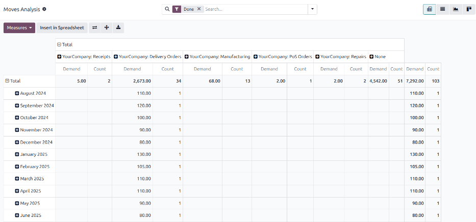
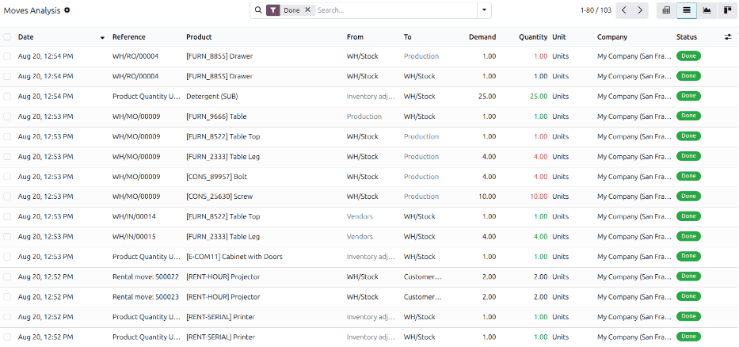
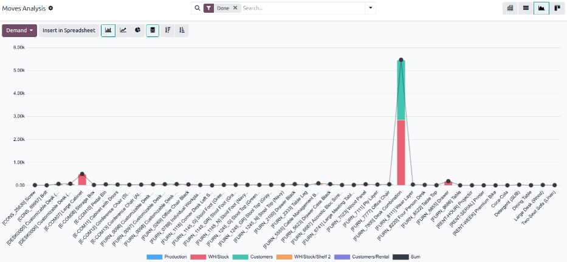
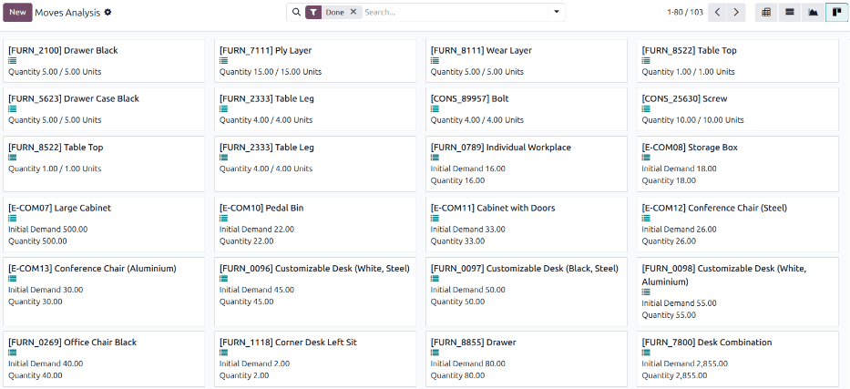
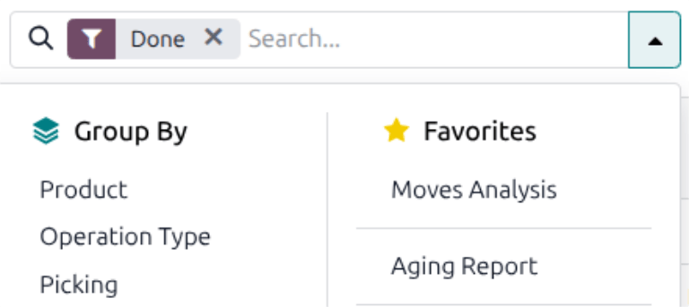
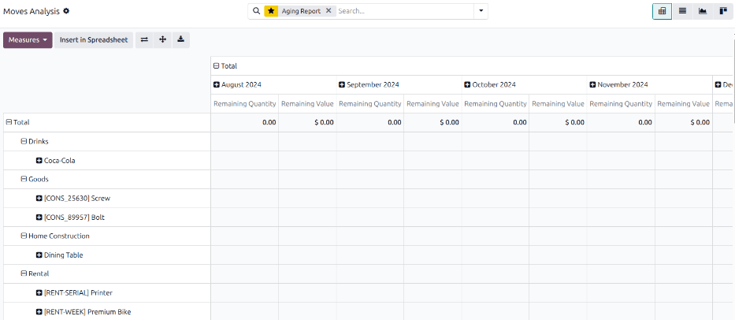

.. meta::
   :description: The Moves Analysis report provides a planned-versus-actual comparison of stock
                 movements, available in Pivot, List, Graph, and Kanban views. A pre-configured
                 Aging Report favorite tracks remaining quantity and value by product, month over
                 month, to identify slow-moving stock.

=====================
Moves analysis report
=====================

The *Moves Analysis* report provides a planned-versus-actual comparison of stock movements, which
enables the analysis of movement-related inventory operations. Unlike the :doc:`moves_history`,
:doc:`stock`, and :doc:`detailed_stock`, which only show quantities that were actually moved or are
currently on hand, *Moves Analysis* displays both the :guilabel:`Demand` and :guilabel:`Quantity` of
each stock movement.

This serves as a tool to check for under- or over-deliveries, partial fulfillments, or manufacturing
orders that consumed more or less than expected. The value of an individual move can also be
corrected through this report, as described in
:ref:`inventory/operations_valuation/adjust-valuation`.

To access the moves analysis report, go to :menuselection:`Inventory app --> Reporting --> Moves
Analysis`.

.. note::
   The reporting feature is only accessible to users with :doc:`admin access
   <../../../../general/users/access_rights>`.

.. _inventory/warehouses_storage/moves-analysis-search-options:

Search options
==============

Use the following search options to customize the :guilabel:`Moves Analysis` report to display
relevant information.

.. tabs::

   .. tab:: :icon:`fa-filter` Filters

      The :guilabel:`Filters` section allows users to search among pre-made and custom filters to
      find specific stock movement records.

      - :guilabel:`Ready`: Moves that are ready to be processed.
      - :guilabel:`To Do`: Moves that are still in progress.
      - :guilabel:`Done`: Completed stock moves.

      ..

      - :guilabel:`Incoming`: Inbound moves entering inventory.
      - :guilabel:`Outgoing`: Outbound moves leaving inventory.
      - :guilabel:`Inventory`: Internal move records, such as inventory adjustments.

      ..

      - :guilabel:`Remaining`: Moves that still have a remaining quantity in stock.

      ..

      - :guilabel:`Scrapped`: Moves where products have been scrapped.

      ..

      - :guilabel:`Date`: Access various date filter options and view stock moves from a specific
        month, quarter, or year.

      ..

      - :guilabel:`Custom Filter...`: Create a :ref:`custom filter <search/custom-filters>` to
        search for specific stock moves.

   .. tab:: :icon:`oi-group` Group By

      The :guilabel:`Group By` section allows users to add pre-made and custom groupings to the
      search.

      - :guilabel:`Product`: Group records by product.
      - :guilabel:`Operation Type`: Group records by operation type, e.g. :guilabel:`Receipts` or
        :guilabel:`Delivery Orders`.
      - :guilabel:`Picking`: Group records by the operation they belong to.
      - :guilabel:`Source Location`: Group records by the source location of the stock move.
      - :guilabel:`Destination Location`: Group records by the destination location of the stock
        move.
      - :guilabel:`Status`: Group records by status.
      - :guilabel:`Date`: Group records by :guilabel:`Year`, :guilabel:`Quarter`, :guilabel:`Month`,
        :guilabel:`Week`, or :guilabel:`Day`.

      ..

      - :guilabel:`Custom Group`: Group records by a specific field on the model. See
        :ref:`search/group`.

   .. tab:: :icon:`fa-star` Favorites

      - :guilabel:`Moves Analysis`: The default view of the report.

      ..

      - :guilabel:`Aging Report`: A pre-configured pivot view to track how :guilabel:`Remaining
        Quantity` and :guilabel:`Remaining Value` evolve month over month for each product. See
        :ref:`Aging Report <inventory/warehouses_storage/moves-analysis-aging-report>`.

      ..

      - :guilabel:`Save current search`: Saves the current applied filters and groups for easy
        access. Tick the :guilabel:`Default filter` checkbox to make this current view the default
        filter when opening the :guilabel:`Moves Analysis` report.

   .. tab:: :guilabel:`Measures` :icon:`fa-caret-down`

      The following :ref:`measures <reporting/choosing-measures>` can be selected to quantify the
      data in the :ref:`pivot <inventory/warehouses_storage/moves-analysis-pivot-view>` and
      :ref:`graph <inventory/warehouses_storage/moves-analysis-graph-view>` views:

      - :guilabel:`Cost Share (%)`
      - :guilabel:`Demand`
      - :guilabel:`Number of SN/Lots`
      - :guilabel:`Packaging Quantity`
      - :guilabel:`Price Unit`
      - :guilabel:`Quantity`
      - :guilabel:`Remaining Quantity`
      - :guilabel:`Remaining Value`
      - :guilabel:`Unit Factor`
      - :guilabel:`Value`
      - :guilabel:`Weight`

      ..

      - :guilabel:`Count`

.. seealso::
   :doc:`../../../../essentials/search`

.. _inventory/warehouses_storage/moves-analysis-views:

Report views
============

The report is available in four views, each suited to a different kind of analysis: :ref:`Pivot
<inventory/warehouses_storage/moves-analysis-pivot-view>`, :ref:`List
<inventory/warehouses_storage/moves-analysis-list-view>`, :ref:`Graph
<inventory/warehouses_storage/moves-analysis-graph-view>`, and :ref:`Kanban
<inventory/warehouses_storage/moves-analysis-kanban-view>`.

.. _inventory/warehouses_storage/moves-analysis-pivot-view:

:icon:`oi-view-pivot` Pivot
---------------------------

The :ref:`pivot view <reporting/using-pivot>` displays the selected :ref:`Measures
<inventory/warehouses_storage/moves-analysis-search-options>` in a table with two axes, which makes
it most suitable for comparing quantities and values by time period, product, category, or location.
This is the view used by the :ref:`Aging report
<inventory/warehouses_storage/moves-analysis-aging-report>` in :guilabel:`Favorites`.

By default, rows are grouped by month and columns are grouped by operation type. Click the
:icon:`fa-plus-square` :guilabel:`Total` icon on a row or column header to select a different
:ref:`grouping <inventory/warehouses_storage/moves-analysis-search-options>`.

.. _inventory/warehouses_storage/moves-analysis-list-view:

:icon:`oi-view-list` List
-------------------------

The list view shows one row per move, and is best suited to searching for the details of individual
operations. The :guilabel:`Moves Analysis` list view displays the following columns:

- :guilabel:`Date`: date and time of the stock move.
- :guilabel:`Reference`: description of the reason for the stock move, such as an operation
  reference (e.g. `WH/OUT/00012`) or an inventory adjustment reason.
- :guilabel:`Product`: name of the product involved in the move.
- :guilabel:`From`: source location of the moved product.
- :guilabel:`To`: destination location of the moved product.
- :guilabel:`Demand`: quantity initially planned for the move.
- :guilabel:`Quantity`: quantity of products actually moved.
- :guilabel:`Unit`: unit of measure of the products moved.
- :guilabel:`Company`: company the move belongs to.
- :guilabel:`Status`: indicates the move status, which can be :guilabel:`Done`,
  :guilabel:`Available` (ready for action), or :guilabel:`Partially Available` (insufficient
  quantities to complete the operation).

Additional columns for :guilabel:`Contact`, :guilabel:`Owner`, :guilabel:`Value`,
:guilabel:`Remaining Quantity`, and :guilabel:`Remaining Value` can be displayed by clicking the
:icon:`oi-settings-adjust` :guilabel:`(Settings)` button at the end of the column headers.

.. note::
   The :guilabel:`Quantity` and :guilabel:`Value` of inbound moves are displayed in green, while the
   :guilabel:`Quantity` and :guilabel:`Value` of outbound moves are displayed in red.

.. _inventory/warehouses_storage/moves-analysis-graph-view:

:icon:`fa-area-chart` Graph
---------------------------

The :ref:`graph view <reporting/using-graph>` plots a single measure at a time, making it most
suitable for visualizing a trend or comparing values across one dimension at a glance. Select the
measure to plot from the :guilabel:`Measures` drop-down in the top-left corner, then choose one of
the chart types next to it.

.. _inventory/warehouses_storage/moves-analysis-kanban-view:

:icon:`oi-view-kanban` Kanban
-----------------------------

The Kanban view displays one card per move, with the associated product, :guilabel:`Quantity`, and
:guilabel:`Demand`. It offers the least analytical depth of the four views, but is useful for
browsing recent moves without configuring a list, pivot, or graph.

.. _inventory/warehouses_storage/moves-analysis-aging-report:

Aging report
============

The :guilabel:`Aging Report` is a :ref:`Favorites
<inventory/warehouses_storage/moves-analysis-search-options>` filter that pre-configures the
:guilabel:`Moves Analysis` pivot view to track :guilabel:`Remaining Quantity` and
:guilabel:`Remaining Value` month over month for each product. This can help identify slow-moving or
aging stock, such as perishable goods approaching the end of their shelf life.

Applying this filter configures the pivot view as follows:

- Rows are grouped by :guilabel:`Product Category`, then by :guilabel:`Product`.
- Columns are grouped by :guilabel:`Month`.
- Measures are set to :guilabel:`Remaining Quantity` and :guilabel:`Remaining Value`.

         columns.

.. important::
   Because :doc:`consignment <../../shipping_receiving/daily_operations/owned_stock>` and
   :doc:`dropshipping <../../shipping_receiving/daily_operations/dropshipping>` products are not
   included in inventory valuation, their stock movements do not appear in the :guilabel:`Aging
   Report` filter.
