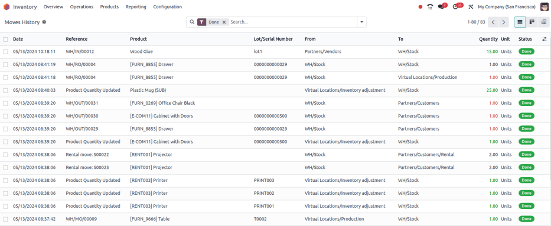

=======================
Moves history dashboard
=======================

The *Moves History* report in Odoo *Inventory* provides a detailed record of product movements
(containing past and current locations), lot numbers, and reasons for movement. Reports can be
generated for any time frame, making this report essential for analyzing stock levels, monitoring
inventory turnover, and identifying any discrepancies in inventory.

.. note::
   The reporting feature is only accessible to users with :doc:`admin access
   <../../../../general/users/access_rights>`.

To access the stock report, go to :menuselection:`Inventory app --> Reporting --> Moves History`.

.. _inventory/warehouses_storage/moves-history-report:

Navigate the moves history report
=================================

In the report, the columns represent:

- :guilabel:`Date`: calendar date and time of the stock move.
- :guilabel:`Reference`: description of the reason for the stock move or quantity change, such as a
  receipt number (e.g. `WH/IN/00012`).
- :guilabel:`Product`: name of the product involved in the move.
- :guilabel:`Lot/Serial Number`: specifies the lot or serial number of the tracked product being
  moved.
- :guilabel:`From`: source location of the moved product.
- :guilabel:`To`: destination location of the moved product.
- :guilabel:`Quantity`: number of products moved.
- :guilabel:`Unit`: unit of measure of the products moved.
- :guilabel:`Status`: indicates the move status, which can be :guilabel:`Done`,
  :guilabel:`Available` (ready for action), or :guilabel:`Partially Available` (insufficient
  quantities to complete the operation).

Search options
--------------

Use the following search options to customize the :guilabel:`Moves History` report to display
relevant information

.. tabs::

   .. tab:: Filters

      The :guilabel:`Filters` section allows users to search among pre-made and custom filters to
      find specific stock records.

      - :guilabel:`To Do`: show stock move records that are in progress. This includes lines with a
        :guilabel:`Status` column value of :guilabel:`Available` or :guilabel:`Partially Available`.
      - :guilabel:`Done`: completed stock moves, with a :guilabel:`Status` of :guilabel:`Done`.
      - :guilabel:`Incoming`: displays move records from vendor locations.
      - :guilabel:`Outgoing`: displays move records to customer locations, including customer
        returns.
      - :guilabel:`Internal`: displays move records from one internal location to another.
      - :guilabel:`Manufacturing`: shows records where products were produced from the virtual,
        production :doc:`location <../inventory_management/use_locations>`.
      - :guilabel:`Date`: select this drop-down menu to access various date filter options and view
        stock moves from a specific month, quarter, or year.
      - :guilabel:`Last 30 Days`: show records that occurred in the last thirty days.
      - :guilabel:`Last 3 Months`: show records from the last three months.

   .. tab:: Group By

      The :guilabel:`Group By` section allows users to add pre-made and custom groupings to the
      search.

      - :guilabel:`Product`: group records by product.
      - :guilabel:`Status`: group records by the three status types: :guilabel:`Done`,
        :guilabel:`Available`, and :guilabel:`Partially Available`.
      - :guilabel:`Date`: group records by :guilabel:`Year`, :guilabel:`Quarter`, :guilabel:`Month`,
        :guilabel:`Week`, or :guilabel:`Day`.
      - :guilabel:`Transfers`: group records by operation number, e.g. `WH/OUT/00012`,
        `WH/MO/00211`.
      - :guilabel:`Location`: group records by source location (the :guilabel:`From` column in this
        report).
      - :guilabel:`Category`: group records by product category. To configure these, go to
        :menuselection:`Inventory app --> Configuration --> Products: Product Categories`.
      - :guilabel:`Batch Transfer`: group records by :doc:`batch
        <../../shipping_receiving/picking_methods/batch>`.

   .. tab:: Favorites

      To save the current applied filters and groups, so the same information can be easily accessed
      after closing this page, click :guilabel:`Save current search`.

      Optionally, tick the :guilabel:`Default filter` checkbox to make this current view the default
      filter when opening the :guilabel:`Moves History` report. Or tick the :guilabel:`Shared`
      checkbox to make the search option available to other users.

      Lastly, click the :guilabel:`Save` button.

.. seealso::
   :doc:`../../../../essentials/search`

