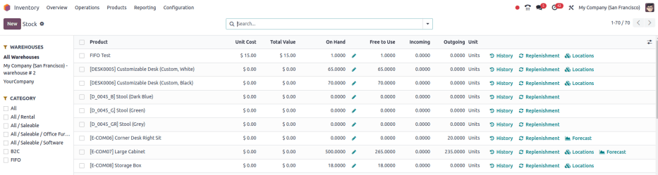

============
Stock report
============

Use the stock report in Odoo *Inventory* for a detailed list of all stored products, including those
reserved, purchased and in transit, as well as those delivered to customers.

.. note::
   The reporting feature is only accessible to users with :doc:`admin access
   <../../../../general/users/access_rights>`.

To access the stock report, go to :menuselection:`Inventory app --> Reporting --> Stock`.

Navigate the stock report
=========================

On the stock report, the left sidebar includes several groupings to narrow down what is being shown.
The default groupings are :guilabel:`Warehouses`,  which filters products by specific warehouses,
and :guilabel:`Category`, which shows products within a selected product category.

.. note::
   The :guilabel:`Warehouse` grouping is only available when there are multiple warehouses in the
   database. Refer to the :doc:`../inventory_management/warehouses` documentation for more details.

In the report itself, the columns represent:

- :guilabel:`Product`: name of the product.
- :guilabel:`Unit Cost`: average inventory valuation per unit, adjusted based on the cost to
  purchase and/or manufacture the product.
- :guilabel:`Total Value`: Total inventory valuation of the product, calculated by multiplying unit
  cost by on-hand quantity.

  .. seealso::
     - :ref:`Compute average cost inventory valuation per unit <inventory/avg_cost/formula>`
     - :doc:`Inventory valuation methods <../inventory_valuation/inventory_valuation_config>`

- :guilabel:`On Hand`: current quantity of products. Click the :icon:`fa-pencil`
  :guilabel:`(pencil)` icon to :doc:`modify the on-hand quantity
  <../inventory_management/count_products>`.
- :guilabel:`Free to Use`: on-hand quantity that are **not** reserved for delivery or manufacturing
  orders, and are available to sell or use.
- :guilabel:`Incoming`: items expected to arrive at the warehouse. Number of products is based on
  quantities in confirmed purchase orders.
- :guilabel:`Outgoing`: items expected to leave the warehouse or be consumed in manufacturing
  orders. Number of products is based on quantities in confirmed sales or manufacturing orders.

Click the buttons to the right of each row item to access additional information:

- :guilabel:`History`: access the stock move history of the product, displaying information about
  the quantity and description of why the product was moved from one location to another.
- :guilabel:`Replenishment`: access the :doc:`reordering rules
  <../../product_management/product_replenishment/reordering_rules>` page for the product to create
  or manage methods of procuring the product.
- :guilabel:`Locations`: break down of on-hand quantity at multiple storage locations. Only
  available when the product is stored in multiple locations.
- :guilabel:`Forecast`: access the forecasted report to view on-hand, incoming, and outgoing
  quantities. Report also contains links to confirmed purchase, sales, or manufacturing orders. Only
  available when there are confirmed sales, purchase, or manufacturing orders for the product.

Search options
--------------

.. tabs::

   .. tab:: Filters

      The :guilabel:`Filters` section allows users to search among pre-made and custom filters to
      find specific stock records.

      - :guilabel:`Published`: display products published on the website. Only available with the
        *Website* app installed.
      - :guilabel:`Available in POS`: display products available through the *Point of Sale* app.
      - :guilabel:`Available in Self`: display products available in self order through the *Point
        of Sale* app. Appears in the search because the :guilabel:`Available in Self Order` checkbox
        was ticked in the :guilabel:`Point of Sale` section of a product form's :guilabel:`Sales`
        tab. The option is only available when the :guilabel:`Available in POS` checkbox is ticked.

        .. image:: stock/available-in-self-order.png
           :align: center
           :alt: In the Sales tab of a product form, showing *Available in Self Order* setting.

      - :guilabel:`Not available in Self`: display products available in *PoS*, but not available in
        self order.

      .. seealso::
         `Configure PoS products <https://youtu.be/REbA3TBhFa4>`_

      - :guilabel:`Can be Sold`: display products that can be sold to customers. Appears in the
        search because the :guilabel:`Can be Sold` checkbox is ticked on the product form.
      - :guilabel:`Can be Purchased`: display products that can be bought from vendors. Appears in
        the search because the :guilabel:`Can be Purchased` checkbox is ticked on the product form.
      - :guilabel:`Can be Recurring`: show subscription products, indicated by ticking the
        :guilabel:`Recurring` checkbox on the product form. Only available with the *Subscription*
        app activated.
      - :guilabel:`Can be Rented`: show products that can be loaned to customers for a certain time.
        Appears in the search because the :guilabel:`Can be Rented` checkbox was ticked on the
        product form. Only available with the *Rental* app installed.
      - :guilabel:`Can be Subcontracted`: display products that can be produced by a
        third-party manufacturer. Available only with the *Manufacturing* app installed.
      - :guilabel:`Can be Expensed`: show items that can be expensed. Only available with the
        *Expenses* app installed.

      .. seealso::
         :doc:`../../product_management/product_tracking/type`

   .. tab:: Group By

      The :guilabel:`Group By` section allows users to add pre-made and custom groupings to the
      search results.

      - :guilabel:`Product Type`: group items by :doc:`product type
        <../../product_management/product_tracking/type>`.
      - :guilabel:`Product Category`: group items by product category. To configure these, go to
        :menuselection:`Inventory app --> Configuration --> Products: Product Categories`.
      - :guilabel:`POS Product Category`: group items by :doc:`point of sale product categories
        <../../../../sales/point_of_sale/configuration>`.

   .. tab:: Favorites

      To save the current applied filters and groupbys, so the same information can be easily
      accessed after closing this page, click :guilabel:`Save current search`.

      Optionally, tick the :guilabel:`Default filter` checkbox to make this current view the default
      filter when opening the stock report. Or tick the :guilabel:`Shared` checkbox to make the
      search option available to other users.

      Lastly, click the :guilabel:`Save` button.

.. seealso::
   :doc:`../../../../essentials/search`
