====================
Maintenance calendar
====================

.. |MO| replace:: :abbr:`MO (Manufacturing Order)`

Avoiding equipment breakdowns, and blocks in warehouse work centers, requires constant equipment
maintenance. Timely corrective maintenance for machines and tools that break unexpectedly, as well
as preventive maintenance to ensure that such issues are avoided, are key to keeping warehouse
operations running smoothly.

In Odoo *Maintenance*, users can access the *Maintenance Calendar* to create, schedule, and edit
both corrective and preventive maintenance requests, to stay on top of equipment and work centers.

Create maintenance request
==========================

Maintenance requests can be created directly from the *Maintenance Calendar*. To access the
calendar, navigate to :menuselection:`Maintenance app --> Maintenance --> Maintenance Calendar`.

To create a new request, click anywhere on the calendar. Doing so opens a :guilabel:`New Event`
pop-up window. In the :guilabel:`Name:` field, assign a title to the new request.

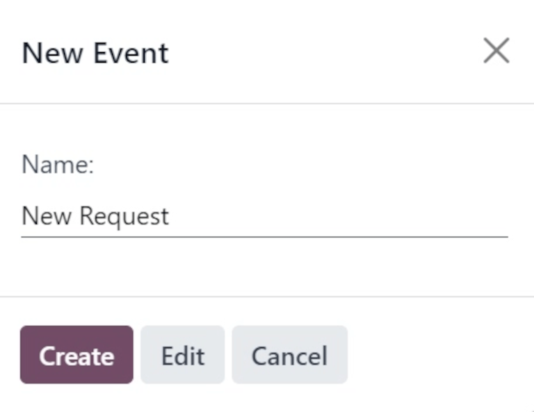

Clicking :guilabel:`Create` on the pop-up window saves the new request with no additional details.
If the request's creation should be canceled, click :guilabel:`Cancel`.

To add more details and schedule the request for a specific date and time, click :guilabel:`Edit`.

Clicking :guilabel:`Edit` opens a blank maintenance request form, where various details about the
request can be filled out.

Edit maintenance request
------------------------

In the :guilabel:`Request` field, assign a title to the new request. In the :guilabel:`Created By`
field, from the drop-down menu, select which user the request was created by. By default, this field
populates with the user actually creating the request.

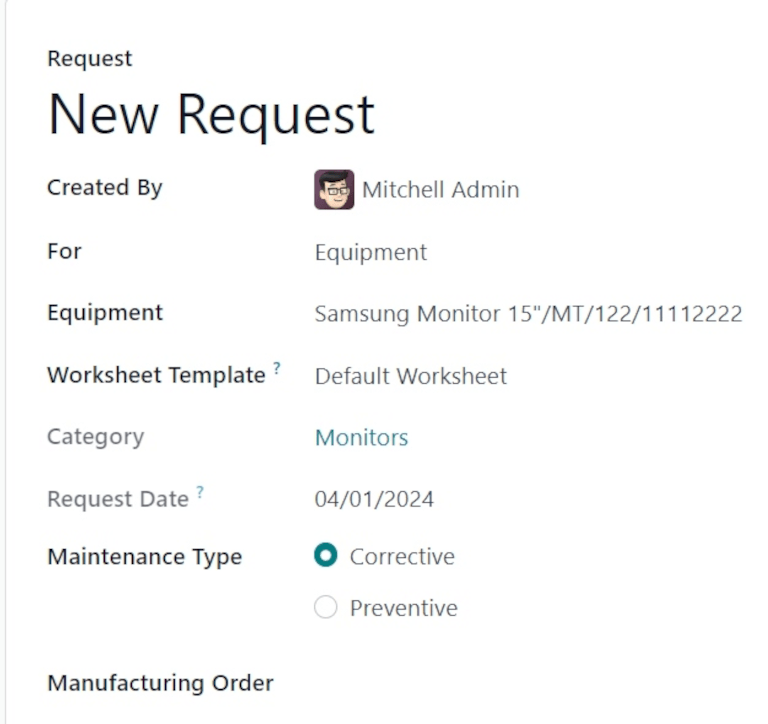

In the :guilabel:`For` field, from the drop-down menu, select if this request is being created for a
piece of :guilabel:`Equipment`, or a :guilabel:`Work Center`.

.. note::
   If :guilabel:`Work Center` is selected in the :guilabel:`For` field's drop-down menu, two
   additional fields appear on the form: :guilabel:`Work Center` and :guilabel:`Block Workcenter`.

   In the :guilabel:`Work Center` field, select which work center in the warehouse this maintenance
   request applies to.

   If the :guilabel:`Block Workcenter` option's checkbox is ticked, it is not possible to plan work
   orders, or other maintenance requests, in this work center during the time that this request is
   being performed.

If :guilabel:`Equipment` is selected in the :guilabel:`For` field, which it is by default, select
which machine or tool requires maintenance from the :guilabel:`Equipment` field. Once a specific
piece of equipment is selected, a greyed-out :guilabel:`Category` field appears, listing the
*Equipment Category* to which the equipment belongs.

In the :guilabel:`Worksheet Template` field, if necessary, click the drop-down menu to select a
worksheet template. These templates are custom templates that can be filled out by the employee
performing the maintenance.

Under the :guilabel:`Category` field, the :guilabel:`Request Date` field displays the date requested
for the maintenance to happen.

The :guilabel:`Maintenance Type` field provides two selectable radio button options:
:guilabel:`Corrective` and :guilabel:`Preventive`.

:guilabel:`Corrective` maintenance is for requests that arise for immediate needs, such as broken
equipment, while :guilabel:`Preventive` maintenance is for planned requests, to avoid breakdowns in
the future.

If this request is tied to a specific |MO|, select that |MO| from the :guilabel:`Manufacturing
Order` field.

From the drop-down menu for the :guilabel:`Team` field, select the desired maintenance team who will
perform the maintenance. In the :guilabel:`Responsible` field, select the technician responsible for
the request.

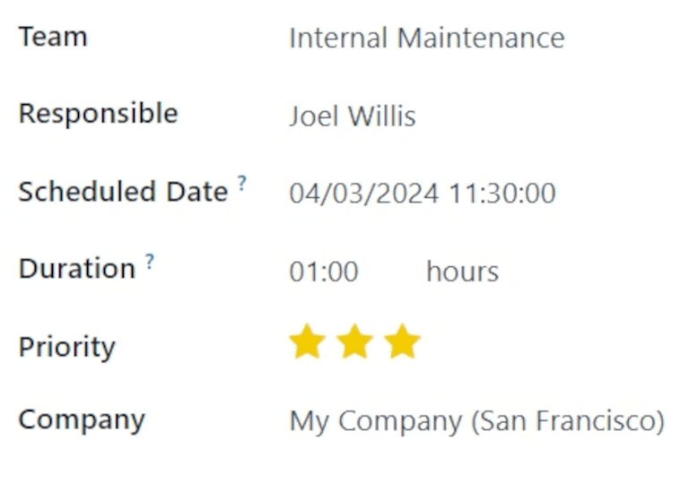

In the :guilabel:`Scheduled Date` field, click the date to open a calendar popover. From this
popover, select the planned date of the maintenance, and click :guilabel:`Apply` to save the date.

In the :guilabel:`Duration` field, enter the the amount of hours (in a `00:00` format) that the
maintenance is planned to take.

In the :guilabel:`Priority` field, choose a priority between one and three :guilabel:`⭐⭐⭐ (stars)`.
This indicates the importance of the maintenance request.

If working in a multi-company environment, from the drop-down menu in the :guilabel:`Company` field,
select the company to which this maintenance request belongs.

At the bottom of the form, there are two tabs: :guilabel:`Notes` and :guilabel:`Instructions`.

In the :guilabel:`Notes` tab, type out any internal notes for the team or technician assigned to the
request, if necessary.

In the :guilabel:`Instructions` tab, if necessary, select one of the three radio button options to
provide maintenance instructions to the assigned team or technician. The available methods for
providing instructions are via :guilabel:`PDF`, :guilabel:`Google Slide`, or :guilabel:`Text`.

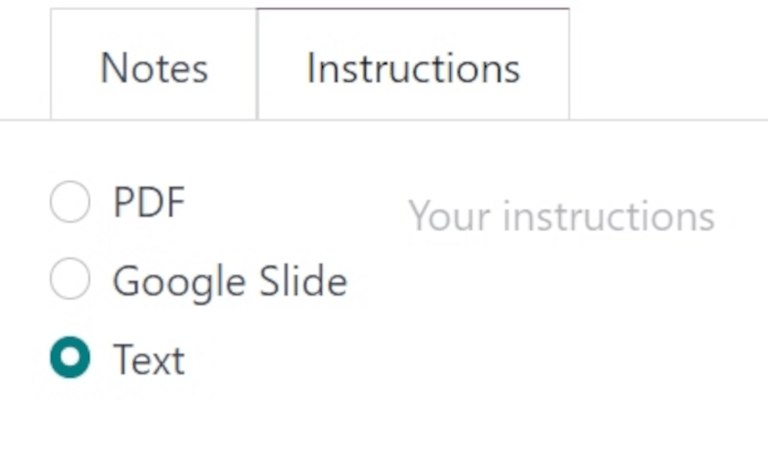

Calendar elements
=================

The *Maintenance Calendar* provides various views, search functions, and filters to help keep track
of the progress of ongoing and planned maintenance requests.

The following sections describe elements found across various views of the calendar.

Filters and Favorites
---------------------

To access the maintenance calendar, navigate to :menuselection:`Maintenance app --> Maintenance -->
Maintenance Calendar`.

To add and remove filters for sorting data on the *Maintenance Calendar*, click the :guilabel:`🔻
(triangle pointed down)` icon, to the right of the search bar at the top of the page.

The left-hand side of the resulting drop-down menu lists all the different :guilabel:`Filters` users
can select. By default, :guilabel:`To Do` and :guilabel:`Active` are selected, so all open requests
are displayed.

.. tip::
   To add a custom filter to the :guilabel:`Maintenance Calendar`, click :guilabel:`Add Custom
   Filter`, under the :guilabel:`Filters` section of the drop-down menu. This opens an
   :guilabel:`Add Custom Filter` pop-up window.

   From this pop-up window, configure the properties of the new rule for the filter. Once ready,
   click :guilabel:`Add`.

The right-hand side of the drop-down menu lists the :guilabel:`Favorites`, or any searches that have
been saved as a favorite to be revisited at a later date.

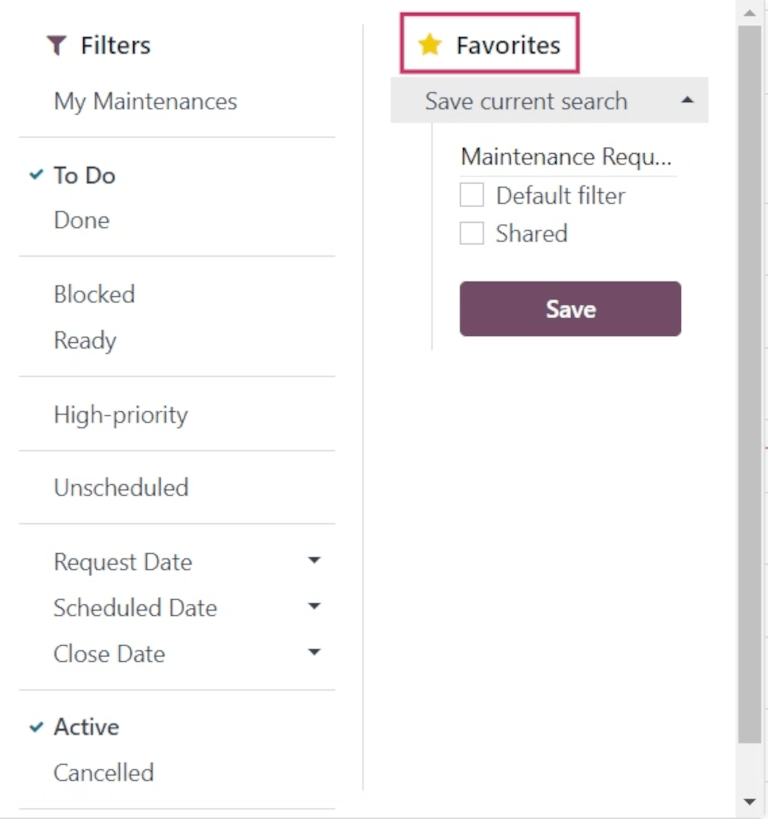

To save a new :guilabel:`Favorite` search, select the desired :guilabel:`Filters`. Then, click
:guilabel:`Save current search`. In the field directly below :guilabel:`Save current search`, assign
a name to the search.

Under the assigned name, there are two options, to save the current search either as the
:guilabel:`Default filter`, or as a :guilabel:`Shared` filter.

Selecting :guilabel:`Default filter` sets this filter as the default when opening this calendar
view.

Selecting the :guilabel:`Shared` filter makes this filter available to other users.

Once ready, click :guilabel:`Save`. When clicked, the new :guilabel:`Favorite` filter appears in the
:guilabel:`Favorites` column, and a :guilabel:`⭐ (gold star)` icon appears with the filter's name in
the search bar.

Views
-----

The :guilabel:`Maintenance Calendar` is available in six different views: :guilabel:`Calendar`
(default), :guilabel:`Kanban`, :guilabel:`List`, :guilabel:`Pivot`, :guilabel:`Graph`, and
:guilabel:`Activity`.

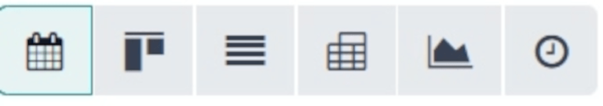

Calendar view
~~~~~~~~~~~~~

:guilabel:`Calendar` is the default view displayed when the :guilabel:`Maintenance Calendar` is
opened. There are a number of options in this view type for sorting and grouping information about
maintenance requests.

In the top-left corner of the page, there is a drop-down menu set to :guilabel:`Week`, by default.
Clicking that drop-down menu reveals the different periods of time, in which the calendar can be
viewed: :guilabel:`Day`, :guilabel:`Month`, and :guilabel:`Year`. There is also an option to
:guilabel:`Show weekends`, selected by default. If unselected, weekends are not shown on the
calendar.

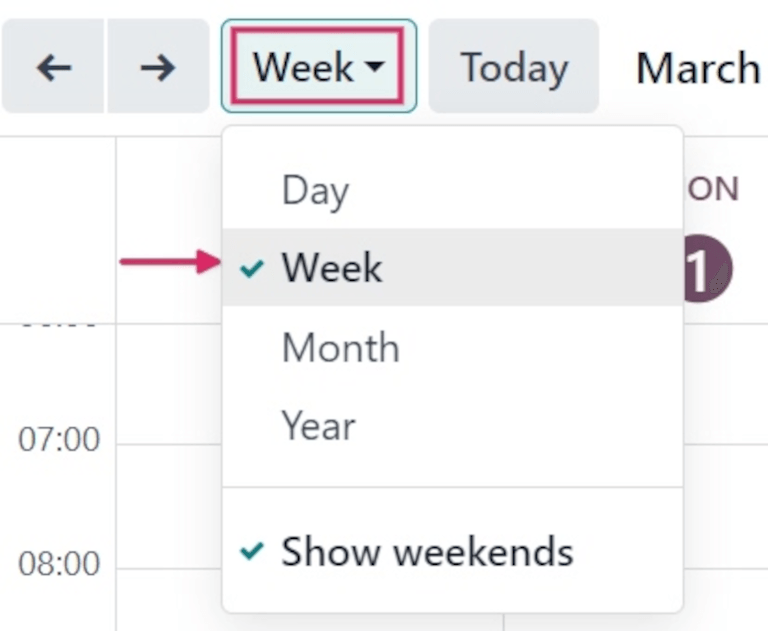

To the left of this menu, there is a :guilabel:`⬅️ (left arrow)` icon and a :guilabel:`➡️ (right
arrow)` icon. Clicking these arrows moves the calendar backward or forward in time, respectively.

To the right of the drop-down menu set to :guilabel:`Week`, by default, is a :guilabel:`Today`
button. Clicking this button resets the calendar to view today's date, no matter which point in time
is being viewed before clicking it.

At the far-right side of the page is a sidebar column, containing a minimized calendar set to
today's date, and a :guilabel:`Technician` list, displaying all the *Technicians* with requests
currently open. Click the :guilabel:`(panel)` icon at the top of this sidebar to open or close the
sidebar.

.. note::
   The :guilabel:`Technician` list only displays if technicians are assigned to open requests, and
   individual technicians are only listed, if they are listed as :guilabel:`Responsible` on at least
   **one** maintenance request form.

Kanban view
~~~~~~~~~~~

With the :guilabel:`Kanban` view, all open maintenance requests are displayed in Kanban-style
columns, in their respective stages of the maintenance process.

Each maintenance request appears on its own task card, and each task card can be dragged-and-dropped
to a different stage of the Kanban pipeline.

Each column has a name (i.e. :guilabel:`In Progress`). Hovering at the top of a column reveals a
:guilabel:`⚙️ (gear)` icon. Clicking the :guilabel:`⚙️ (gear)` icon reveals a list of options for
that column: :guilabel:`Fold`, :guilabel:`Edit`, :guilabel:`Automations`, and :guilabel:`Delete`.

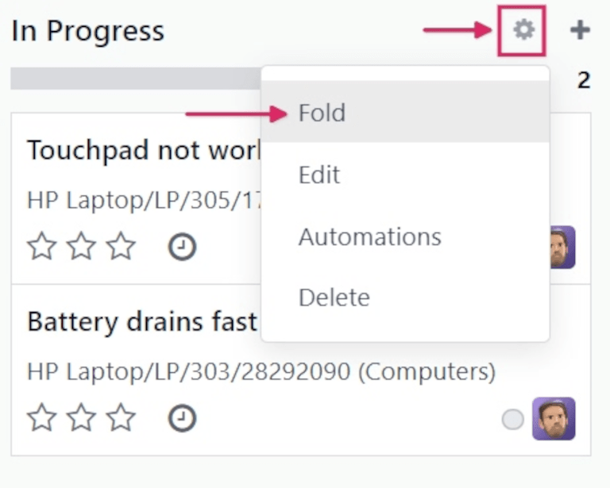

Clicking :guilabel:`Fold` folds the column to hide its contents.

Clicking :guilabel:`Edit` opens an :guilabel:`Edit: (stage name)` pop-up window, with the
corresponding stage name, wherein the column's details can be edited. The following are the column
options that can be edited:

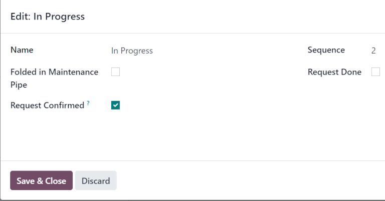

- :guilabel:`Name`: the name of the stage in the Kanban pipeline.
- :guilabel:`Folded in Maintenance Pipe`: when checked, this stage's column is folded by default in
  the :guilabel:`Kanban` view type.
- :guilabel:`Request Confirmed`: when this box is not ticked, and the maintenance request type is
  set to *Work Center*, no leave is created for the respective work center when a maintenance
  request is created. If the box *is* ticked, the work center is automatically blocked for the
  listed duration, either at the specified date, or as soon as possible, if the work center is
  unavailable.
- :guilabel:`Sequence`: the order in the maintenance process, in which this stage appears.
- :guilabel:`Request Done`: if ticked, this box indicates this stage is the final step of the
  maintenance process. Requests moved to this stage are closed.

Once ready, click :guilabel:`Save & Close`. If no changes have been made, click :guilabel:`Discard`,
or click the :guilabel:`X` icon to close the pop-up window.

List view
~~~~~~~~~

With the :guilabel:`List` view selected, all open maintenance requests are displayed in a list, with
information about each request listed in its respective row.

The columns of information displayed in this view type are the following:

- :guilabel:`Subjects`: the name assigned to the maintenance request.
- :guilabel:`Employee`: the employee who originally created the maintenance request.
- :guilabel:`Technician`: the technician responsible for the maintenance request.
- :guilabel:`Category`: the category the equipment being repaired belongs to.
- :guilabel:`Stage`: the stage of the maintenance process the request is currently in.
- :guilabel:`Company`: if in a multi-company environment, the company in the database the request is
  assigned to.

Pivot view
~~~~~~~~~~

With the :guilabel:`Pivot` view selected, maintenance requests are displayed in a pivot table, and
can be customized to show different data metrics.

To add more data to the pivot table, click the :guilabel:`Measures` button to reveal a drop-down
menu. By default, :guilabel:`Count` is selected. Additional options to add to the table are
:guilabel:`Additional Leaves to Plan Ahead`, :guilabel:`Duration`, and :guilabel:`Repeat Every`.

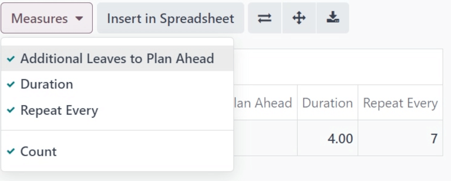

To the right of the :guilabel:`Measures` button is the :guilabel:`Insert in Spreadsheet` button.
Clicking this button opens a pop-up window titled :guilabel:`Select a spreadsheet to insert your
pivot.`.

There are two tabs in this pop-up window: :guilabel:`Spreadsheets` and :guilabel:`Dashboards`. Click
into one of these tabs, and select a spreadsheet or dashboard in the database to add this pivot
table to. Once ready, click :guilabel:`Confirm`. If this table shouldn't be added to a spreadsheet
or dashboard, click :guilabel:`Cancel`, or click the :guilabel:`X` icon to close the pop-up window.

To the right of the :guilabel:`Insert in Spreadsheet` button are three buttons:

- :guilabel:`Flip axis`: the x and y axis of the pivot data table flip.
- :guilabel:`Expand all`: all the available rows and columns of the pivot data table expand fully.
- :guilabel:`Download xlsx`: the pivot data table is downloaded as an .xlsx file.

Graph view
~~~~~~~~~~

With the graph view selected, the following options appear between the search bar and visual
representation of the data. These graph-specific options are located to the right of the
:guilabel:`Measures` and :guilabel:`Insert in Spreadsheet` buttons.

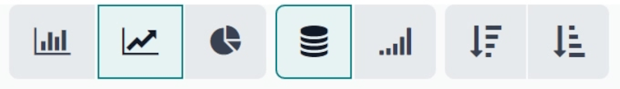

There are three different types of graphs available to users to view the data:

- :guilabel:`Bar Chart`: the data is displayed in a bar chart.
- :guilabel:`Line Chart`: the data is displayed in a line chart.
- :guilabel:`Pie Chart`: the data is displayed in a pie chart.

When viewing the data as a :guilabel:`Bar Chart` graph, the data can be formatted in the following
ways:

- :guilabel:`Stacked`: the data is stacked on the graph.
- :guilabel:`Descending`: the data is displayed in descending order.
- :guilabel:`Ascending`: the data is displayed in ascending order.

When viewing the data as a :guilabel:`Line Chart` graph, the data can be formatted in the following
ways:

- :guilabel:`Stacked`: the data is stacked on the graph.
- :guilabel:`Cumulative`: the data is increasingly accumulated.
- :guilabel:`Descending`: the data is displayed in descending order.
- :guilabel:`Ascending`: the data is displayed in ascending order.

When viewing the data as a :guilabel:`Pie Chart` graph, all relevant data is displayed by default,
and no additional formatting options are available.

Activity view
~~~~~~~~~~~~~

With the :guilabel:`Activity` view selected, all open maintenance requests are listed in their own
row, with the ability to schedule activities related to those requests.

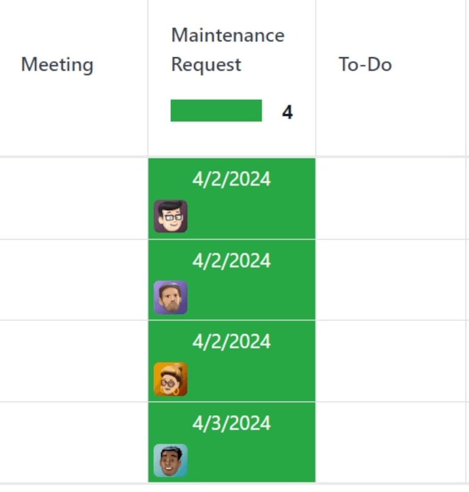

Maintenance requests are listed in the :guilabel:`Maintenance Request` column as activities.
Clicking a request opens a :guilabel:`Maintenance Request` popover that indicates the status of the
request, and the responsible technician. To schedule an activity directly from the popover, click
:guilabel:`➕ Schedule an activity`. This opens a :guilabel:`Schedule Activity` pop-up window.

From the pop-up window, choose the :guilabel:`Activity Type`, provide a :guilabel:`Summary`,
schedule a :guilabel:`Due Date`, and choose the responsible user in the :guilabel:`Assigned to`
field.

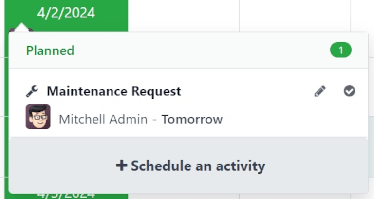

Type any additional notes for the new activity in the blank space under the greyed-out
:guilabel:`Log a note...` field. When clicked, this changes to :guilabel:`Type "/" for commands`.

Once ready, click :guilabel:`Schedule` to schedule the activity. Alternatively, click
:guilabel:`Schedule & Mark as Done` to close the activity, click :guilabel:`Done & Schedule Next` to
close the activity and open a new one, or click :guilabel:`Cancel` to cancel the activity.

With the :guilabel:`Activity` view selected, each activity type available when scheduling an
activity is listed as its own column. These columns are :guilabel:`Email`, :guilabel:`Call`,
:guilabel:`Meeting`, :guilabel:`Maintenance Request`, :guilabel:`To-Do`, :guilabel:`Upload
Document`, :guilabel:`Request Signature`, and :guilabel:`Grant Approval`.

To schedule an activity with that specific activity type, click into any blank box on the
corresponding row for the desired maintenance request, and click the :guilabel:`➕ (plus)` icon. This
opens an :guilabel:`Odoo` pop-up window, wherein the activity can be scheduled.

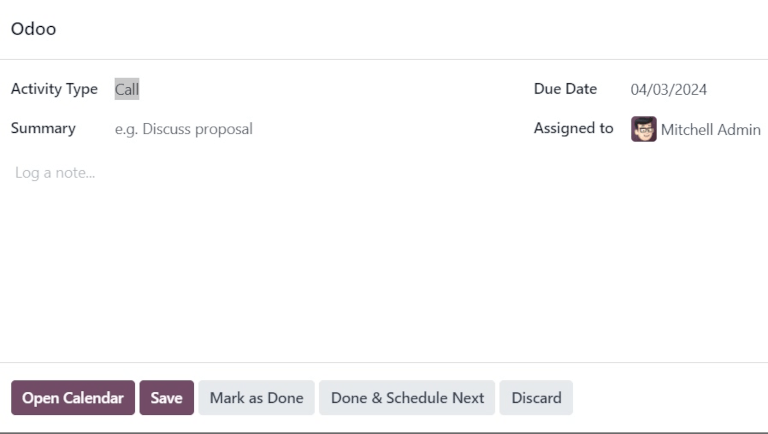

.. seealso::
   - :doc:`maintenance_requests`
   - :doc:`add_new_equipment`
