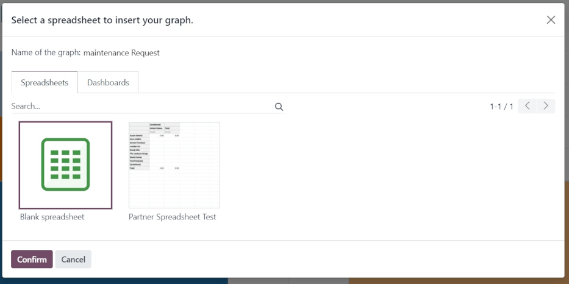
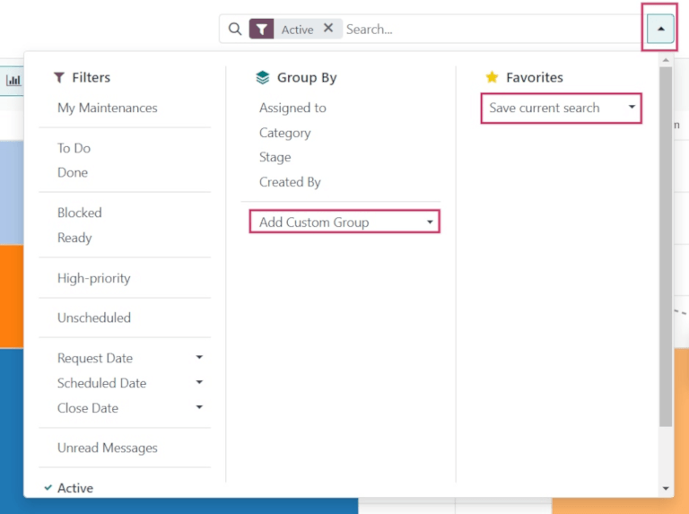
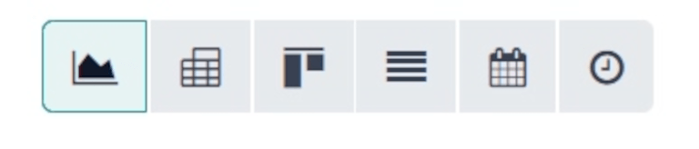
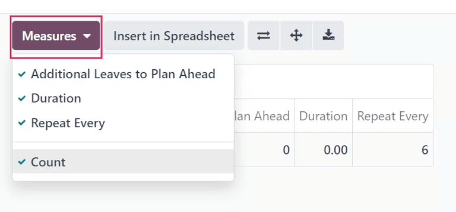
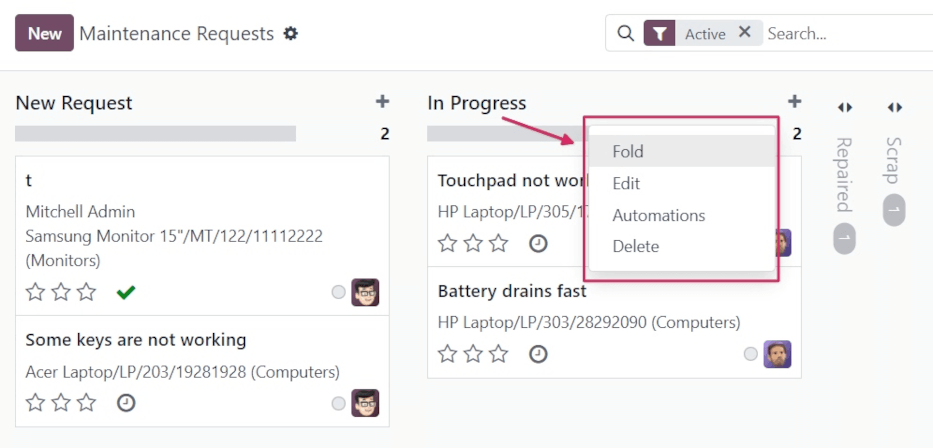
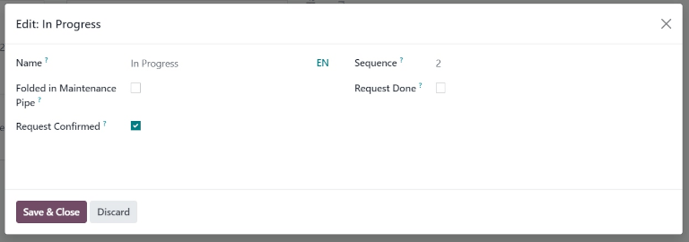
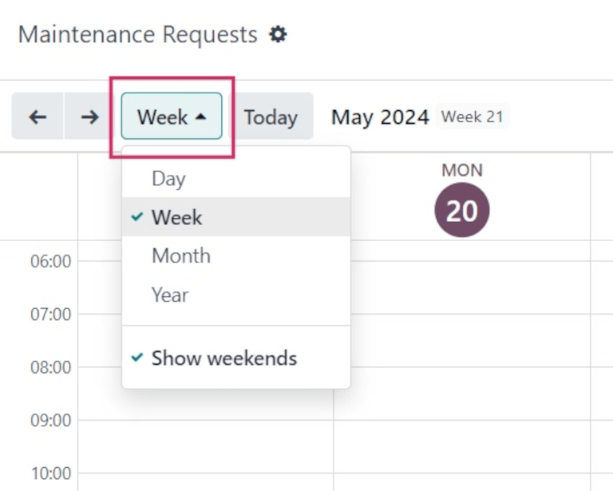
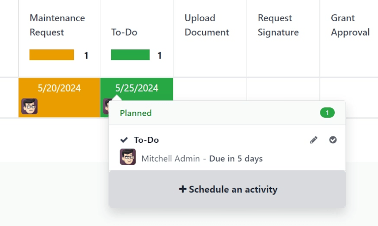
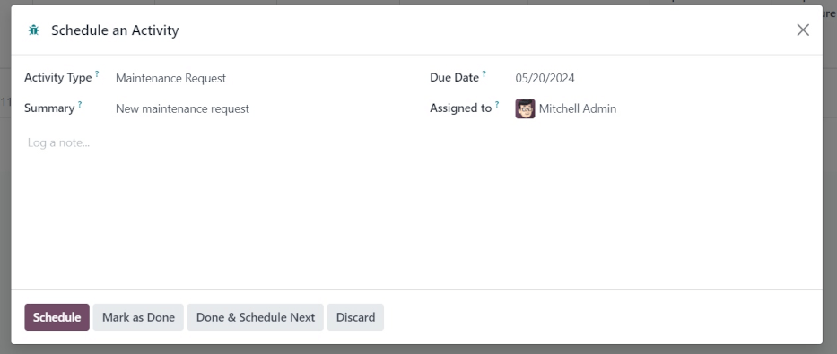

=====================
Maintenance reporting
=====================

Odoo *Maintenance* tracks both current and past maintenance requests in a reporting dashboard. Users
can access the *Maintenance Requests* report to measure information in different reporting views to
help make informed decisions about equipment, and plan corrective and preventive maintenance.

.. _maintenance/reporting/dashboard:

Reporting dashboard
===================

To view the *Maintenance* reporting dashboard, navigate to :menuselection:`Maintenance app -->
Reporting --> Maintenance Requests`. Doing so displays the :guilabel:`Maintenance Requests` report
overview.

By default, the report is displayed in the :icon:`fa-area-chart` :guilabel:`(Graph)` view, in
:icon:`fa-bar-chart` :guilabel:`(bar chart)` form, with the :icon:`fa-database`
:guilabel:`(Stacked)` data display.

To read about view types, refer to the :ref:`Reporting views <maintenance/reporting/view-types>`
section.

From the :guilabel:`Maintenance Requests` report overview, click the :guilabel:`Measures` button,
and select how to measure the information. By default, the :guilabel:`Count` measure is displayed,
so the count for requests per user is listed.

Next to :guilabel:`Measures`, click :guilabel:`Insert in Spreadsheet` to open a pop-up window
reading :guilabel:`Select a spreadsheet to insert your graph.`. This data could be inserted in an
internal spreadsheet to better understand equipment performance, and to keep track of past
maintenance requests for equipment.

Select a spreadsheet from the :guilabel:`Spreadsheets` tab, or click the :guilabel:`Dashboards` tab,
and select a dashboard to insert the graph. Once ready, click :guilabel:`Confirm` to close the
pop-up window.

Filters, Group By, and Favorites
--------------------------------

To add and remove filters for sorting data on the :guilabel:`Maintenance Requests` report, click the
:icon:`fa-caret-down` :guilabel:`(caret down)` icon, to the right of the search bar at the top of
the page.

To group the requests in the report by specific groupings, click the :icon:`oi-group`
:guilabel:`(Group By)` icon, and select the desired grouping. To add a custom grouping, click
:guilabel:`Add Custom Group`, and select an option from the resulting drop-down menu.

The left-hand column of the resulting drop-down menu lists all the different :guilabel:`Filters`
users can select. By default, :guilabel:`Active` is selected, so all open requests are displayed. To
change the filters, click the desired options in the :icon:`fa-filter` :guilabel:`(Filters)` column.

.. tip::
   To add a custom filter to the :guilabel:`Maintenance Requests` report, click :guilabel:`Add
   Custom Filter`, under the :guilabel:`Filters` section of the drop-down menu. This opens an
   :guilabel:`Add Custom Filter` pop-up window.

   From this pop-up window, configure the properties of the new rule for the filter. Once ready,
   click :guilabel:`Add`.

The right-hand column of the drop-down menu lists the :guilabel:`Favorites`, or any searches that
have been saved as a favorite to be revisited at a later date.

To save a new :guilabel:`Favorite` search, select the desired :guilabel:`Filters` and
:guilabel:`Group By` options. Then, click :guilabel:`Save current search`. In the field directly
below :guilabel:`Save current search`, assign a name to the search.

Under the assigned name, there are two options, to save the current search either as the
:guilabel:`Default filter`, or as a :guilabel:`Shared` filter.

Selecting :guilabel:`Default filter` sets this filter as the default when opening this view.

Selecting the :guilabel:`Shared` filter makes this filter available to other users.

Once ready, click :guilabel:`Save`. When clicked, the new :guilabel:`Favorite` filter appears in the
:guilabel:`Favorites` column, and a :icon:`fa-star` :guilabel:`(gold star)` icon appears with the
filter's name in the search bar.

.. seealso::
   :doc:`../../essentials/search`

.. _maintenance/reporting/view-types:

Reporting views
===============

The :guilabel:`Maintenance Requests` report is available in six different views, appearing in order
from left to right: :guilabel:`Graph` (default), :guilabel:`Pivot`, :guilabel:`Kanban`,
:guilabel:`List`, :guilabel:`Calendar`, and :guilabel:`Activity`.

Graph view
----------

Click the :icon:`fa-area-chart` :guilabel:`(Graph)` icon to change to graph view.

With the graph view selected, the following options appear between the search bar and visual
representation of the data. These graph-specific options are located to the right of the
:guilabel:`Insert in Spreadsheet` button.

.. image:: maintenance_reporting/maintenance-reporting-graph-view-types.png
   :align: center
   :alt: Graph type icons on Graph view page.

There are three different types of graphs available to users to view the data:

- :guilabel:`Bar Chart`: the data is displayed in a bar chart.
- :guilabel:`Line Chart`: the data is displayed in a line chart.
- :guilabel:`Pie Chart`: the data is displayed in a pie chart.

Click the :icon:`fa-bar-chart` :guilabel:`(bar chart)` icon to switch to a bar chart. When viewing
the data as a :guilabel:`Bar Chart` graph, the data can be formatted in the following ways:

- :guilabel:`Stacked`: the data is stacked on the graph.
- :guilabel:`Descending`: the data is displayed in descending order.
- :guilabel:`Ascending`: the data is displayed in ascending order.

Click the :icon:`fa-line-chart` :guilabel:`(line chart)` icon to switch to a line chart. When
viewing the data as a :guilabel:`Line Chart` graph, the data can be formatted in the following ways:

- :guilabel:`Stacked`: the data is stacked on the graph.
- :guilabel:`Cumulative`: the data is increasingly accumulated.
- :guilabel:`Descending`: the data is displayed in descending order.
- :guilabel:`Ascending`: the data is displayed in ascending order.

Click the :icon:`fa-pie-chart` :guilabel:`(pie chart)` icon to switch to a pie chart. When viewing
the data as a :guilabel:`Pie Chart` graph, all relevant data is displayed by default, and no
additional formatting options are available.

Pivot view
----------

Click the :icon:`oi-view-pivot` :guilabel:`(pivot view)` icon to change to pivot view.

With the :guilabel:`Pivot` view selected, maintenance requests are displayed in a pivot table, and
can be customized to show different data metrics.

To add more data to the pivot table, click the :guilabel:`Measures` button to reveal a drop-down
menu. By default, :guilabel:`Count` is selected. Additional options to add to the table are
:guilabel:`Additional Leaves to Plan Ahead`, :guilabel:`Duration`, and :guilabel:`Repeat Every`.

:guilabel:`Additional Leaves to Plan Ahead` displays all employee leaves for users assigned to
maintenance requests. :guilabel:`Duration` reveals the duration spent on each maintenance request.
:guilabel:`Repeat Every` displays all maintenance requests, past and present.

To the right of the :guilabel:`Insert in Spreadsheet` button are three buttons:

- :guilabel:`Flip axis`: the x and y axis of the pivot data table flip.
- :guilabel:`Expand all`: all the available rows and columns of the pivot data table expand fully.
- :guilabel:`Download xlsx`: the pivot data table is downloaded as an .xlsx file.

Kanban view
-----------

Click the :icon:`oi-view-kanban` :guilabel:`(Kanban view)` icon to change to Kanban view.

With the :guilabel:`Kanban` view, all open maintenance requests are displayed in Kanban-style
columns, in their respective stages of the maintenance process. By default, the :guilabel:`Repaired`
and :guilabel:`Scrap` columns are folded in the Kanban view.

Each maintenance request appears on its own task card, and each task card can be dragged-and-dropped
to a different stage of the Kanban pipeline.

Each column has a name (i.e. :guilabel:`In Progress`). Hovering at the top of a column reveals a
:icon:`fa-cog` :guilabel:`(cog)` icon. Clicking the :icon:`fa-cog` :guilabel:`(cog)` icon reveals a
list of options for that column: :guilabel:`Fold`, :guilabel:`Edit`, :guilabel:`Automations`, and
:guilabel:`Delete`.

Clicking :guilabel:`Fold` folds the column to hide its contents.

Clicking :guilabel:`Edit` opens an :guilabel:`Edit: (stage name)` pop-up window, with the
corresponding stage name, wherein the column's details can be edited. The following are the column
options that can be edited:

- :guilabel:`Name`: the name of the stage in the Kanban pipeline.
- :guilabel:`Folded in Maintenance Pipe`: when checked, this stage's column is folded by default in
  the :guilabel:`Kanban` view type.
- :guilabel:`Request Confirmed`: when this box is not ticked, and the maintenance request type is
  set to *Work Center*, no leave is created for the respective work center when a maintenance
  request is created. If the box *is* ticked, the work center is automatically blocked for the
  listed duration, either at the specified date, or as soon as possible, if the work center is
  unavailable.
- :guilabel:`Sequence`: the order in the maintenance process, in which this stage appears.
- :guilabel:`Request Done`: if ticked, this box indicates this stage is the final step of the
  maintenance process. Requests moved to this stage are closed.

Once ready, click :guilabel:`Save & Close`.

List view
---------

Click the :icon:`oi-view-list` :guilabel:`(list view)` icon to change to list view.

With the :guilabel:`List` view selected, all open maintenance requests are displayed in a list, with
information about each request listed in its respective row.

The columns of information displayed in this view type are the following:

- :guilabel:`Subjects`: the name assigned to the maintenance request.
- :guilabel:`Employee`: the employee who originally created the maintenance request.
- :guilabel:`Technician`: the technician responsible for the maintenance request.
- :guilabel:`Category`: the category the equipment being repaired belongs to.
- :guilabel:`Stage`: the stage of the maintenance process the request is currently in.
- :guilabel:`Company`: if in a multi-company environment, the company in the database the request is
  assigned to.

Calendar view
-------------

Click the :icon:`fa-calendar` :guilabel:`(calendar)` icon to change to calendar view.

There are a number of options in this view type for sorting and grouping information about
maintenance requests.

In the top-left corner of the page, there is a drop-down menu set to :guilabel:`Week`, by default.
Clicking that drop-down menu reveals the different periods of time, in which the calendar can be
viewed: :guilabel:`Day`, :guilabel:`Month`, and :guilabel:`Year`. There is also an option to
:guilabel:`Show weekends`, selected by default. If unselected, weekends are not shown on the
calendar.

To the left of this menu, there is a :icon:`fa-arrow-left` :guilabel:`(left arrow)` icon and a
:icon:`fa-arrow-right` :guilabel:`(right arrow)` icon. Clicking these arrows moves the calendar
backward or forward in time, respectively.

To the right of the drop-down menu set to :guilabel:`Week`, by default, is a :guilabel:`Today`
button. Clicking this button resets the calendar to view today's date, no matter which point in time
is being viewed before clicking it.

At the far-right side of the page is a sidebar column, containing a minimized calendar set to
today's date, and a :guilabel:`Technician` list, displaying all the *Technicians* with requests
currently open. Click the :icon:`oi-panel-right` :guilabel:`(panel)` icon at the top of this sidebar
to open or close the sidebar.

.. note::
   The :guilabel:`Technician` list only displays if technicians are assigned to open requests, and
   individual technicians are only listed, if they are listed as :guilabel:`Responsible` on at least
   **one** maintenance request form.

Activity view
-------------

With the :guilabel:`Activity` view selected, all open maintenance requests are listed in their own
row, with the ability to schedule activities related to those requests.

Maintenance requests are listed in the :guilabel:`Maintenance Request` column as activities.
Clicking a request opens a :guilabel:`Maintenance Request` popover that indicates the status of the
request, and the responsible technician. To schedule an activity directly from the popover, click
:icon:`fa-plus` :guilabel:`(Schedule an activity)`. This opens a :guilabel:`Schedule Activity`
pop-up window.

.. note::
   If there are *no* active maintenance requests listed, click :icon:`fa-plus` :guilabel:`(Schedule
   activity)`, on the footer row of the page. Doing so opens a :guilabel:`Search: Maintenance
   Request` pop-up window, where an existing request can be selected, or a new request can be
   created by clicking :guilabel:`New`.

From the pop-up window, choose the :guilabel:`Activity Type`, provide a :guilabel:`Summary`,
schedule a :guilabel:`Due Date`, and choose the responsible user in the :guilabel:`Assigned to`
field.

Type any additional notes for the new activity in the blank space under the greyed-out
:guilabel:`Log a note...` field. When clicked, this changes to :guilabel:`Type "/" for commands`.

Once ready, click :guilabel:`Schedule` to schedule the activity. Alternatively, click
:guilabel:`Schedule & Mark as Done` to close the activity, click :guilabel:`Done & Schedule Next` to
close the activity and open a new one, or click :guilabel:`Cancel` to cancel the activity.

With the :guilabel:`Activity` view selected, each activity type available when scheduling an
activity is listed as its own column. These columns are :guilabel:`Email`, :guilabel:`Call`,
:guilabel:`Meeting`, :guilabel:`Maintenance Request`, :guilabel:`To-Do`, :guilabel:`Upload
Document`, :guilabel:`Request Signature`, and :guilabel:`Grant Approval`.

To schedule an activity with that specific activity type, click into any blank box on the
corresponding row for the desired maintenance request, and click the :icon:`fa-plus`
:guilabel:`(plus)` icon. This opens an :guilabel:`Odoo` pop-up window, wherein the activity can be
scheduled.

.. seealso::
   :doc:`maintenance_setup`
