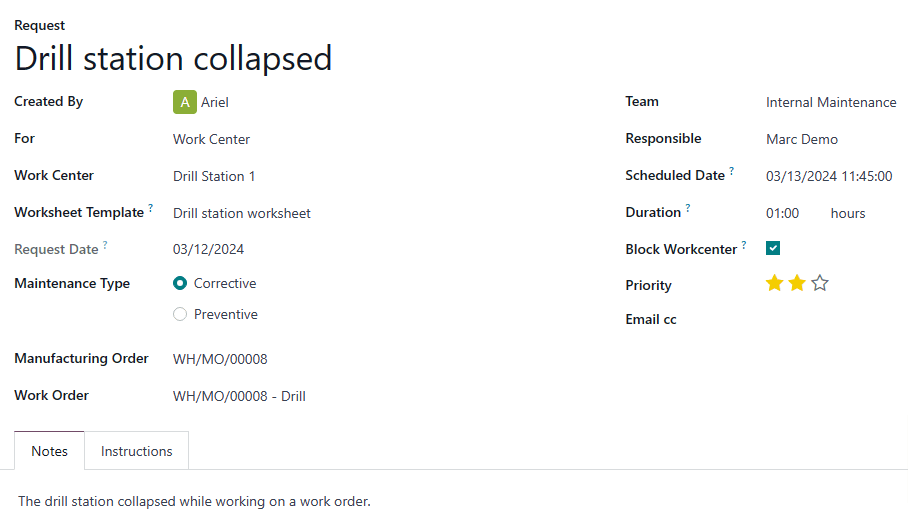

====================
Maintenance requests
====================

.. |MO| replace:: :abbr:`MO (Manufacturing Order)`

In order to keep equipment and work centers functioning properly, it is often necessary to perform
maintenance on them. This can include preventive maintenance, intended to prevent equipment from
breaking down, or corrective maintenance, which is used to fix equipment that is broken or otherwise
unusable.

In Odoo *Maintenance*, users can create *maintenance requests* to schedule and track the progress of
equipment and work center maintenance.

Create maintenance request
==========================

To create a new maintenance request, navigate to :menuselection:`Maintenance app --> Maintenance -->
Maintenance Requests`, and click :guilabel:`New`.

Begin filling out the form by entering a descriptive title in the :guilabel:`Request` field (e.g.,
`Drill not working`).

The :guilabel:`Created By` field auto-populates with the user creating the request, but a different
user can be selected by clicking on the drop-down menu.

In the :guilabel:`For` drop-down menu, select :guilabel:`Equipment` if the maintenance request is
being created for a piece of equipment, or :guilabel:`Work Center` if it is being created for a work
center.

Depending on the option selected in the :guilabel:`For` field, the next field is titled either
:guilabel:`Equipment` or :guilabel:`Work Center`. Using the drop-down menu for either field, select
a piece of equipment or a work center.

If the *Custom Maintenance Worksheets* setting is enabled in the *Maintenance* app's settings, a
:guilabel:`Worksheet Template` field appears below the :guilabel:`Equipment` or :guilabel:`Work
Center` field. If necessary, use this field to select a worksheet to be filled out by the employee
performing the maintenance.

The next field is titled :guilabel:`Request Date`, and is set by default to the date on which the
maintenance request is created. This date cannot be changed by the user.

In the :guilabel:`Maintenance Type` field, select the :guilabel:`Corrective` option if the request
is intended to fix an existing issue, or the :guilabel:`Preventive` option if the request is
intended to prevent issues from occurring in the future.

If the request is being created to address an issue that arose during a specific manufacturing order
(MO), select it in the :guilabel:`Manufacturing Order` field.

If an |MO| was selected in the :guilabel:`Manufacturing Order` field, a :guilabel:`Work Order` field
appears below it. If the issue arose during a specific work order, specify it in this field.

In the :guilabel:`Team` field, select the maintenance team that is responsible for managing the
request. If a specific team member is responsible, select them in the :guilabel:`Responsible` field.

The :guilabel:`Scheduled Date` field is used to specify the date on which maintenance should take
place, and the time it should begin. Choose a date by clicking on the field to open a calendar in a
pop-up window, and then select a day on the calendar. Enter an hour and minute in the two fields
below the calendar, and click :guilabel:`Apply` to save the date and time.

The :guilabel:`Duration` field is used to specify the time it takes to complete the maintenance
request. Use the text-entry field to enter the time in a `00:00` format.

If :guilabel:`Work Center` was selected in the :guilabel:`For` field, a :guilabel:`Block Workcenter`
checkbox appears below the :guilabel:`Duration` field. Enable the checkbox to prevent work orders or
other maintenance from being scheduled at the specified work center while the maintenance request is
being processed.

The :guilabel:`Priority` field is used to communicate the importance (or urgency) of the maintenance
request. Assign the request a priority between zero and three :guilabel:`⭐⭐⭐ (stars)`, by clicking
on the desired star number. Requests assigned a higher priority appear above those with a lower
priority, on the Kanban board used to track the progression of maintenance requests.

In the :guilabel:`Notes` tab at the bottom of the form, enter any relevant details about the
maintenance request (why the maintenance issue arose, when it occurred, etc.).

The :guilabel:`Instructions` tab is used to include instructions for how maintenance should be
performed. Select one of the three options, and then include the instructions as detailed below:

- :guilabel:`PDF`: click the :guilabel:`Upload your file` button to open the device's file manager,
  and then select a file to upload.
- :guilabel:`Google Slide`: enter a :guilabel:`Google Slide link` in the text-entry field that
  appears after the option is selected.
- :guilabel:`Text`: enter the instructions in the text-entry field that appears after the option is
  selected.

Process maintenance request
===========================

Once a maintenance request has been created, it appears in the *New Request* stage of the
*Maintenance Requests* page, which can be accessed by navigating to :menuselection:`Maintenance app
--> Maintenance --> Maintenance Requests`.

Maintenance requests can be moved to different stages by dragging and dropping them. They can also
be moved by clicking on a request to open it in a new page, and then selecting the desired stage
from the stage indicator bar, located above the top-right corner of the request's form.

Successful maintenance requests should be moved to the :guilabel:`Repaired` stage, indicating that
the specified piece of equipment or work center is repaired.

Failed maintenance requests should be moved to the :guilabel:`Scrap` stage, indicating the specified
piece of equipment, or work center, could not be repaired, and must instead be scrapped.
