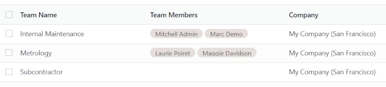
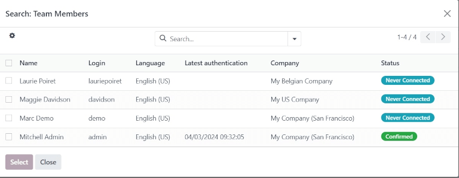
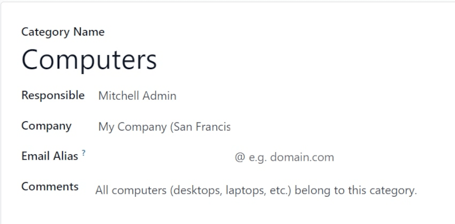
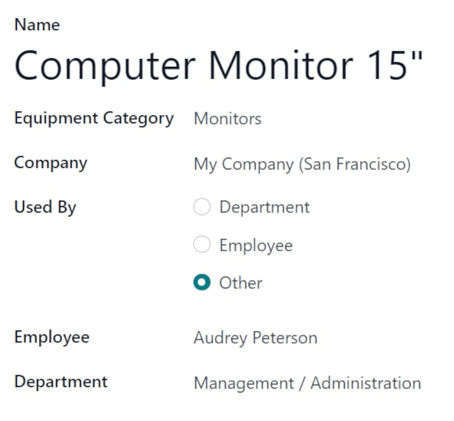
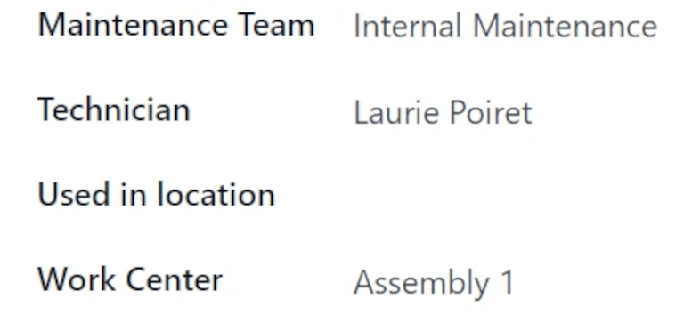
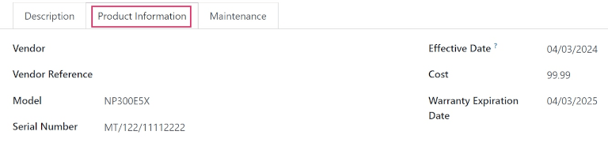
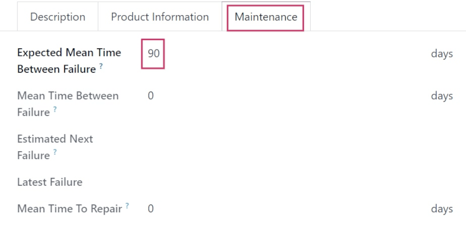
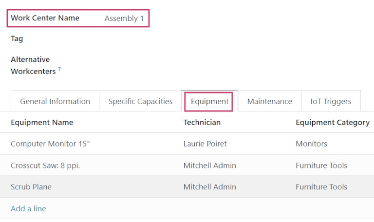

=================
Maintenance setup
=================

.. |MTBF| replace:: :abbr:`MTBF (Mean Time Between Failure)`
.. |MTTR| replace:: :abbr:`MTTR (Mean Time To Repair)`

Odoo *Maintenance* helps companies schedule corrective and preventive maintenance on equipment used
in their warehouse. This helps companies avoid equipment breakdowns, blocks in warehouse work
centers, and emergency repair costs.

Maintenance teams
=================

When creating maintenance requests, a *maintenance team* can be assigned to the request as the team
responsible for handling the request.

To view existing maintenance teams, navigate to :menuselection:`Maintenance app --> Configuration
--> Maintenance Teams`.

From the resulting :guilabel:`Teams` page, a list of all existing teams (if any) is displayed, with
the :guilabel:`Team Name`, :guilabel:`Team Members`, and :guilabel:`Company` listed in the columns,
by default.

To add a new team, click :guilabel:`New`. This adds a blank line at the bottom of the list of teams.
In the blank field that appears below the :guilabel:`Team Name` column, assign a name to the new
maintenance team.

In the :guilabel:`Team Members` column, click the field to reveal a drop-down menu with existing
users in the database. Choose which users should be members of the new maintenance team.

Click :guilabel:`Search More...` to open a :guilabel:`Search: Team Members` pop-up window to search
for users **not** shown on the initial drop-down menu.

In the :guilabel:`Company` column, if in a multi-company environment, click the drop-down menu to
select the company in the database to which this new maintenance team belongs.

Once ready, click :guilabel:`Save` to save changes.

.. tip::
   The team members assigned to maintenance teams are also referred to as *Technicians*, when
   viewing the *Maintenance Calendar*.

   Navigate to :menuselection:`Maintenance app --> Maintenance --> Maintenance Calendar`, and click
   on an existing maintenance request. From the resulting popover, locate the :guilabel:`Technician`
   field. The name listed in the field is the team member, and is the user responsible for that
   particular request.

   .. image:: maintenance_setup/maintenance-setup-popover-technician.png
      :align: center
      :alt: Maintenance request popover with Technician field shown.

   At the far-right side of the page is a sidebar column, containing a minimized calendar set to
   today's date, and a :guilabel:`Technician` list, displaying all the technicians (or team members)
   with requests currently open.

Equipment
=========

In Odoo *Maintenance*, *equipment* refers to machines and tools used internally in warehouse work
centers. Equipment can include technology such as computers or tablets, power tools, machines used
for manufacturing, and more.

Equipment categories
--------------------

Each piece of equipment belongs to an *equipment category*. Before adding new equipment, make sure
that a fitting equipment category is created.

To create a new equipment category, navigate to :menuselection:`Maintenance app --> Configuration
--> Equipment Categories`, and click :guilabel:`New`. Doing so opens a blank equipment category
form.

On the blank form, assign a name in the :guilabel:`Category Name` field.

In the :guilabel:`Responsible` field, assign a user to be responsible for the equipment in this
category, if necessary. By default, the user who creates the category is selected as
:guilabel:`Responsible`, by default.

If in a multi-company environment, click the drop-down menu in the :guilabel:`Company` field, and
select the company in the database to whom the equipment in this category belongs.

In the :guilabel:`Email Alias` field, assign an email alias to this category, if necessary.

In the :guilabel:`Comments` field, type any comments or notes for internal users to reference in
relation to this category, if necessary.

.. note::
   Once a new equipment category is created, all equipment belonging to that category, as well as
   any past or currently open maintenance requests, are available from the equipment category form.

   Navigate to :menuselection:`Maintenance app --> Configuration --> Equipment Categories`, and
   select a category to view. Locate the :guilabel:`Equipment` and :guilabel:`Maintenance` smart
   buttons at the top of the form.

   .. image:: maintenance_setup/maintenance-setup-smart-buttons.png
      :align: center
      :alt: Equipment and Maintenance smart buttons on equipment category form.

   Click the :guilabel:`Equipment` smart button to view all equipment belonging to this category.
   Click the :guilabel:`Maintenance` smart button to view any past, or currently open, maintenance
   requests.

Machines & tools
----------------

To add new equipment, navigate to :menuselection:`Maintenance app --> Equipment --> Machines &
Tools`, and click :guilabel:`New`. This opens a blank equipment form.

In the :guilabel:`Name` field, assign a name for the new equipment. In the :guilabel:`Equipment
Category` field, click the drop-down menu and select which category this new equipment should belong
to.

If in a multi-company environment, click the drop-down menu in the :guilabel:`Company` field, and
select the company in the database to whom the new equipment belongs.

In the :guilabel:`Used By` field, select from one of three radio button options:
:guilabel:`Department`, :guilabel:`Employee`, or :guilabel:`Other`.

If :guilabel:`Department` is selected, a :guilabel:`Department` field appears below the
:guilabel:`Used By` field. Click the drop-down menu and select the department that uses this
equipment.

If :guilabel:`Employee` is selected, an :guilabel:`Employee` field appears below the :guilabel:`Used
By` field. Click the drop-down menu, and select the employee who uses this equipment.

If the :guilabel:`Other` option is selected, both the :guilabel:`Department` and
:guilabel:`Employee` fields appear below the :guilabel:`Used By` field. Click the drop-down menus
for the respective fields, and choose which department and employee uses this equipment.

In the :guilabel:`Maintenance Team` field, select the team responsible for this equipment. In the
:guilabel:`Technician` field, select the team member/user responsible for this equipment.

In the :guilabel:`Used in location` field, enter the location wherein this equipment will be used,
if not in an internal work center (e.g. in an office).

In the :guilabel:`Work Center` field, click the drop-down menu, and select which work center this
equipment will be used in.

In the blank space under the :guilabel:`Description` tab at the bottom of the form, add any relevant
information describing the equipment for users to reference.

Product Information tab
~~~~~~~~~~~~~~~~~~~~~~~

To add any relevant information while creating a new piece of equipment, from the equipment form,
click the :guilabel:`Product Information` tab.

In the :guilabel:`Vendor` field, add the vendor from which the equipment was purchased. In the
:guilabel:`Vendor Reference` field, add the product reference number obtained from the vendor, if
applicable.

In the :guilabel:`Model` field, specify which model this equipment is, if applicable. If the
equipment is serialized, add a serial number in the :guilabel:`Serial Number` field.

In the :guilabel:`Effective Date` field, click the date to reveal a calendar popover, and select a
date. This date indicates when this equipment was first put in use, and will be used to compute the
Mean Time Between Failure (MTBF) in the equipment's :guilabel:`Maintenance` tab.

In the :guilabel:`Cost` field, specify how much the equipment cost to acquire, if applicable.

If the equipment is covered under a warranty, specify the :guilabel:`Warranty Expiration Date` by
selecting a date from the calendar popover in that field.

Maintenance tab
~~~~~~~~~~~~~~~

Various maintenance metrics are available for each piece of equipment, and are automatically
computed, based on corrective maintenance, and planned preventive maintenance.

To view the maintenance metrics for a specific piece of equipment, from the equipment form, click
the :guilabel:`Maintenance` tab.

Doing so reveals the following fields:

- :guilabel:`Expected Mean Time Between Failure`: the amount of time (in days) before the next
  failure is expected. This is the **only** field not greyed-out, and the **only** field users can
  edit.
- :guilabel:`Mean Time Between Failure`: the amount of time (in days) between reported failures.
  This value is computed based on completed corrective maintenances.
- :guilabel:`Estimated Next Failure`: the date on which the next failure is expected. This date is
  computed as the Latest Failure Date + |MTBF|.
- :guilabel:`Latest Failure`: The date of the latest failure. The value in this field updates once a
  failure is reported for this equipment.
- :guilabel:`Mean Time To Repair`: the amount of time (in days) it takes to repair this equipment
  upon failure. This value updates once a maintenance request is completed for this equipment.

Work centers
============

To view the work centers where equipment is being used, and how the equipment is being used in them,
navigate to :menuselection:`Maintenance app --> Equipment --> Work Centers`, and click into a work
center.

From the resulting work center form, click the :guilabel:`Equipment` tab to view all machines and
tools being used in that specific work center.

Each piece of equipment is listed with certain relevant information: the :guilabel:`Equipment Name`,
the responsible :guilabel:`Technician`, the :guilabel:`Equipment Category` it belongs to, and a few
important maintenance metrics: its |MTBF|, |MTTR|, and :guilabel:`Est. Next Failure` date.

.. tip::
   To add new equipment to a work center directly from the work center form, click :guilabel:`Add a
   line` under the :guilabel:`Equipment` tab. This opens an :guilabel:`Add: Maintenance Equipment`
   pop-up window.

   From the pop-up window, select the equipment that should be added to the work center, and click
   :guilabel:`Select`.

.. seealso::
   :doc:`add_new_equipment`
