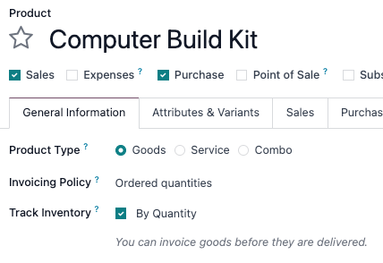
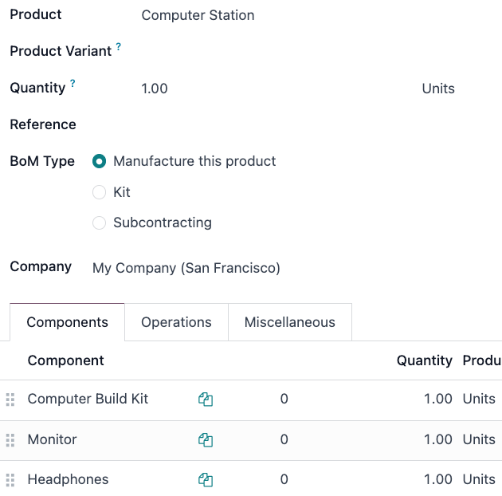

====
Kits
====

.. |BOM| replace:: :abbr:`BoM (Bill of Materials)`
.. |BOMs| replace:: :abbr:`BoMs (Bills of Materials)`

In Odoo, a *kit* is a type of bill of materials (BoM) that can be manufactured and sold. Kits are
sets of unassembled components sold to customers. They may be sold as standalone products, but are
also useful tools for managing more complex bills of materials (BoMs).

.. note::
   To use, manufacture, and sell kits, both the :guilabel:`Manufacturing` and :guilabel:`Inventory`
   apps need to be installed.

Create the kit as a product
===========================

To create a kit product, go to :menuselection:`Manufacturing app --> Products --> Products`, then
select :guilabel:`New`.

Start by entering a name in the :guilabel:`Product` field, and then, under the :guilabel:`General
Information` tab, set the :guilabel:`Product Type` to :guilabel:`Goods`. Next, select the checkbox
next to :guilabel:`Track Inventory` and choose :guilabel:`By Quantity` within the corresponding
drop-down menu.

Create the component products for the kit (via the **Manufacturing**, **Inventory**, or **Sales**
:menuselection:`Products --> Products` menus) in order to populate the |BOM| in the next steps.
These components require no specific configuration in order for them to be included in the kit (for
example, it does not matter if the component's inventory volume is tracked).

Set up the kit BoM
==================

Once the kit product and its components are set up as products in Odoo, create a new |BOM| and
assign it to the kit.

Do so by navigating to :menuselection:`Manufacturing app --> Products --> Bills of Materials`, and
then clicking :guilabel:`New`. Next to the :guilabel:`Product` field, select the drop-down menu to
reveal a list of products, then select the previously configured kit product.

.. tip::
   The kit's |BoM| can also be accessed from the product form using the |BOM| smart button at the
   top of the screen. Creating the |BOM| this way automatically links the kit to its |BOM|.

Then, for the :guilabel:`BoM Type` field, select the :guilabel:`Kit` option. Finally, under the
:guilabel:`Components` tab, select :guilabel:`Add a line`, then add each desired component and
specify their quantities under the :guilabel:`Quantity` column.

.. seealso::
   :doc:`Bills of materials <../basic_setup/bill_configuration>`

If the kit is solely being used as a sellable product, then only components need to be added under
the :guilabel:`Components` tab, and configuring manufacturing operations is not necessary. Kits can
be added as components to other kits, which is described in the next section.

.. note::
   When a kit is sold as a product, it appears as a single line item on the quotation and sales
   order. However, on delivery orders, each component of the kit is listed.

.. image:: kit_shipping/bom-kit-selection.png
   :alt: Kit selection on the bill of materials.

Use kits to manage complex BoMs
===============================

Kits are also used to manage multi-level |BOMs|. These are products that contain **other** |BOM|
products as components, and therefore require *nested* |BOMs|. Incorporating preconfigured kits into
multi-level |BOMs| allows for cleaner organization of bundled products.

To configure this type of |BOM| with a kit as a component, go to :menuselection:`Manufacturing app
--> Products --> Bills of Materials`, then select :guilabel:`New`.

Next to the :guilabel:`Product` field, select the drop-down menu to reveal a list of products, and
select the desired |BOM| product. Then, for the :guilabel:`BoM Type` field, select the
:guilabel:`Manufacture this product` option.

Under the :guilabel:`Components` tab, select :guilabel:`Add a line`, then select a kit as the
component. Adding the kit as a component eliminates the need to add the kit's components
individually. Any :guilabel:`BoM Type` can be used for the higher-level product's |BOM|.

Once ready, select :guilabel:`Save` to save changes.

Preview multi-level BoMs
------------------------

To access a comprehensive overview of all the components in the multi-level |BOM| go to the intended
|BOM| and select the :guilabel:`BoM Overview` smart button. Sublevel |BOMs| can be expanded and
viewed from this report.

When creating a manufacturing order for a product with a multi-level |BOM|, the kit product
automatically expands to show all components. Any operations in the kit's |BOM| are also added to
the list of work orders on the manufacturing order.

.. tip::
   Kits are primarily used to bundle components together for organization or sale. However,
   :doc:`sub-assemblies <sub_assemblies>` can be used to manage multi-level products that require
   manufactured sub-components.
