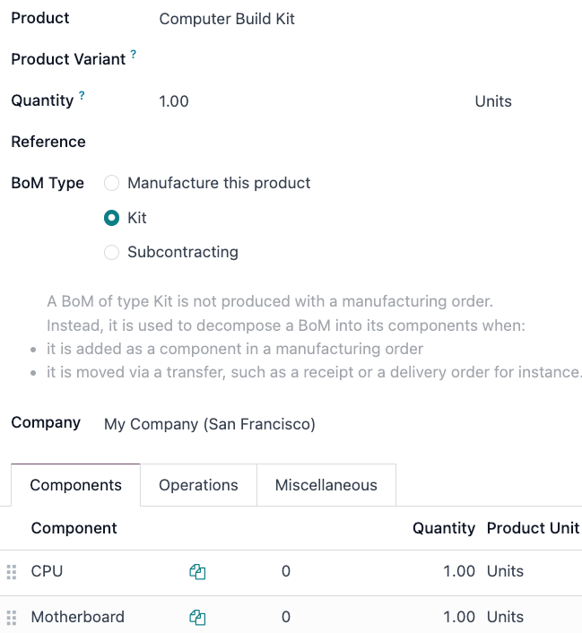

====
Kits
====

In Odoo, a *kit* is a type of bill of materials (BoM) that can be manufactured and sold. Kits are
sets of unassembled components sold to customers. They may be sold as standalone products, and are
also useful tools for managing more complex bills of materials (BoMs).

.. note::
   To use, manufacture, and sell kits, both the :guilabel:`Manufacturing` and :guilabel:`Inventory`
   apps need to be installed.

Create the kit as a product
===========================

To use a kit as a sellable product, or as a component organization tool, the kit should first be
created as a product.

To create a kit product, go to :menuselection:`Inventory app --> Products --> Products`, and then
click :guilabel:`New`.

Then, assign a name to the new kit product. Next, set the kit's product type depending on inventory
tracking needs and accounting requirements. To do this, under the :guilabel:`General Information`
tab, set the :guilabel:`Product Type` to either :guilabel:`Consumable` or :guilabel:`Storable`.

The kit's components must also be configured as products via :menuselection:`Inventory app -->
Products --> Products`. These components require no specific configuration.

Consumable kit setup details
----------------------------

Consumable products do not have inventory tracking. Consider setting the kit as a consumable product
when the kit is used in other manufacturing processes or when tracking inventory for the kit itself
is not needed.

* **Recommended for Continental Accounting**: If costs are expensed immediately upon purchase, then
  setting the kit's type to *consumable* is recommended.
* **Replenishment via Components**: Inventory count is managed at the component level, so reordering
  rules must be set to individual components.
* **Selling & Stock Constraints**: Kits cannot be sold if any required component is out of stock.
  Since availability depends on individual components, a sales order may appear valid, but delivery
  can be delayed if components are unavailable.

Storable kit setup details
--------------------------

Storable products have detailed tracking and inventory management since they are expected to be
*stored* once they are created. Consider setting the kit as a storable product when the kit is a
tangible product or warehouse and inventory tracking is essential.

* **Recommended for Angle-Saxon Accounting**: If the Cost of Goods Sold (COGS) needs to be recorded
  in journals, then setting the kit's type to *storable* is recommended.
* **Component Purchase Constraints**: Only the kit's minimum required components can be added to an
  **eCommerce** cart unless the option to :doc:`continue
  selling<../../../websites/ecommerce/products>` is disabled.
* **No Kit Serial Numbers**: Serial number tracking does not track the kit, only its shipped
  components.
* **Reordering Rule Recommendation**: Reordering rules should be set at the component-level.
* **Stock Replenishment Recommendation**: Stock replenishment should also be done at the
  component-level.

Kit setup similarities
----------------------

Regardless of which setup is used, there are some similarities between the two options.

* **No Kit-Level Stock Adjustments**: Stock adjustments cannot be handled at the kit-level.
* **Kit Value Does Not Change**: The stock's value is the same whether the kit is consumable or
  storable.
* **Kit Internal Transfers**: An internal transfer for the kit breaks it into components.

Set up the kit BoM
==================

After fully configuring the kit product and its components, a new :abbr:`BoM (bill of materials)`
can be created for the kit product.

To do so, go to :menuselection:`Manufacturing app --> Products --> Bills of Materials`, and then
click :guilabel:`New`. Next to the :guilabel:`Product` field, click the drop-down menu to reveal a
list of products, and then select the previously configured kit product.

Then, for the :guilabel:`BoM Type` field, click the :guilabel:`Kit` option. Finally, under the
:guilabel:`Components` tab, click :guilabel:`Add a line`, and add each desired component, and
specify their quantities under the :guilabel:`Quantity` column.

Once ready, click :guilabel:`Save` to save the newly created :abbr:`BoM (bill of materials)`.

If the kit is solely being used as a sellable product, then only components need to be added under
the :guilabel:`Components` tab, and configuring manufacturing operations is not necessary.

.. note::
   When a kit is sold as a product, it appears as a single line item on the quotation and sales
   order. However, on delivery orders, each component of the kit is listed.

Use kits to manage complex BoMs
===============================

Kits can also be used for complex :abbr:`BoMs (Bills of Materials)`. This method nests BoMs within
other BoMs, organizing complex products while simplifying manufacturing by defining each procurement
and production step separately.

Sublevel BoMs (subassemblies or semi-finished products) streamline these workflows, helping with
traceability efforts.

.. seealso::
   :doc:`sub_assemblies`
